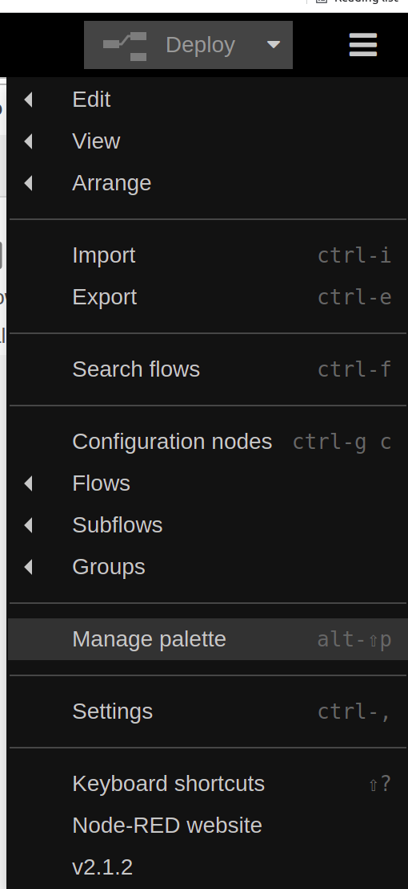
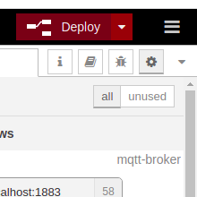

.. doc_sil

How To: Simulate EVerest in software
####################################

A successful `build <https://github.com/EVerest/everest-dev-environment/blob/main/dependency_manager/README.md#building-everest>`_ of everest is required.
First we need to run the docker container for **mqtt**, **ocpp**, **nodered** and **steve**.
In the workspace folder: *everest-utils/docker/* run the following command::

	sudo docker-compose up -d

To create the nodered dashboard, open a webbrowser of your choice and open the url::

	http://localhost:1880/

This will open the nodered flowchart editor. 

First we install the neccesary nodes.
Click on *Manage Palette* in the upper right corner menu:

Make sure you have installed the following nodes by typing their names in the *Search modules* bar in the *Install section*:

.. image:: img/install-dashboard.png

- node-red
- node-red-contrib-ui-actions
- node-red-contrib-ui-level
- node-red-dashboard
- node-red-node-ui-table

Now we import the flow:
In the upper right corner menu select *IMPORT*:

.. image:: img/importflow.png

Copy the following flow into the empty field::

	[{"id":"43986390b62b982b","type":"tab","label":"Flow 1","disabled":false,"info":""},{"id":"a34b8469eac2a923","type":"mqtt in","z":"43986390b62b982b","name":"","topic":"/external/state/max_current","qos":"2","datatype":"auto","broker":"fc8686af.48d178","nl":false,"rap":true,"rh":0,"inputs":0,"x":230,"y":220,"wires":[["da2f43075762ddaf"]]},{"id":"b1d555b0e533b31d","type":"ui_gauge","z":"43986390b62b982b","name":"","group":"8e8b6e2a.214f3","order":4,"width":0,"height":0,"gtype":"gage","title":"{{msg.label}}","label":"Kilowatt","format":"{{value}} kW","min":"0","max":"11","colors":["#00b500","#e6e600","#ca3838"],"seg1":"","seg2":"","className":"","x":630,"y":380,"wires":[]},{"id":"da2f43075762ddaf","type":"ui_text","z":"43986390b62b982b","group":"8e8b6e2a.214f3","order":1,"width":0,"height":0,"name":"","label":"Maximum Current","format":"{{msg.payload}}","layout":"row-spread","x":610,"y":220,"wires":[]},{"id":"6a9d55afe54ee8ac","type":"mqtt in","z":"43986390b62b982b","name":"","topic":"/external/state/state_string","qos":"2","datatype":"auto","broker":"fc8686af.48d178","nl":false,"rap":true,"rh":0,"inputs":0,"x":230,"y":340,"wires":[["a1588e04ad139636"]]},{"id":"cd6cab8f2a64b2dd","type":"ui_slider","z":"43986390b62b982b","name":"","label":"MaxCurrent","tooltip":"","group":"f4bce688.4729c8","order":1,"width":0,"height":0,"passthru":true,"outs":"end","topic":"topic","topicType":"msg","min":"6","max":"17","step":"0.1","x":1030,"y":1040,"wires":[["982f20e8facec8ce"]]},{"id":"982f20e8facec8ce","type":"mqtt out","z":"43986390b62b982b","name":"","topic":"/external/cmd/set_max_current","qos":"1","retain":"false","respTopic":"","contentType":"","userProps":"","correl":"","expiry":"","broker":"fc8686af.48d178","x":1250,"y":1040,"wires":[]},{"id":"a4578360927474b2","type":"mqtt in","z":"43986390b62b982b","name":"","topic":"/external/powermeter/totalKWattHr","qos":"2","datatype":"auto","broker":"fc8686af.48d178","nl":false,"rap":true,"rh":0,"inputs":0,"x":260,"y":260,"wires":[["f4863b58a09b6857"]]},{"id":"f4863b58a09b6857","type":"ui_text","z":"43986390b62b982b","group":"8e8b6e2a.214f3","order":2,"width":0,"height":0,"name":"","label":"Energy Charged","format":"{{msg.payload}}","layout":"row-spread","className":"","x":600,"y":260,"wires":[]},{"id":"3f0ba92f75944803","type":"mqtt in","z":"43986390b62b982b","name":"","topic":"/external/powermeter/vrmsL1","qos":"2","datatype":"auto","broker":"fc8686af.48d178","nl":false,"rap":true,"rh":0,"inputs":0,"x":1120,"y":1140,"wires":[["c43737560c5a117a"]]},{"id":"c43737560c5a117a","type":"ui_chart","z":"43986390b62b982b","name":"","group":"5e36140d.127f1c","order":11,"width":0,"height":0,"label":"vrmsL1","chartType":"line","legend":"false","xformat":"HH:mm:ss","interpolate":"linear","nodata":"","dot":false,"ymin":"","ymax":"","removeOlder":"60","removeOlderPoints":"","removeOlderUnit":"1","cutout":0,"useOneColor":false,"useUTC":false,"colors":["#1f77b4","#aec7e8","#ff7f0e","#2ca02c","#98df8a","#d62728","#ff9896","#9467bd","#c5b0d5"],"outputs":1,"useDifferentColor":false,"x":1480,"y":1140,"wires":[[]]},{"id":"e3903216ef75682c","type":"ui_ui-button","z":"43986390b62b982b","action":"click","actionType":"str","name":"PauseButton","group":"f4bce688.4729c8","order":3,"width":0,"height":0,"passthru":false,"label":"Pause Charging","tooltip":"","color":"","bgcolor":"","icon":"","x":510,"y":560,"wires":[["58b368ba99d5adf4"]]},{"id":"308005039943b35c","type":"hidden-ui-action","z":"43986390b62b982b","action":"Hide","actionType":"str","write":"payload","writeType":"msg","group":"8e8b6e2a.214f3","order":2,"target":"37cf09d8.d1f336","passthru":false,"name":"Hide Pause","x":310,"y":540,"wires":[["e3903216ef75682c"]]},{"id":"58b368ba99d5adf4","type":"mqtt out","z":"43986390b62b982b","name":"","topic":"/external/cmd/pause_charging","qos":"1","retain":"false","respTopic":"","contentType":"","userProps":"","correl":"","expiry":"","broker":"fc8686af.48d178","x":770,"y":560,"wires":[]},{"id":"2556b080e7a35607","type":"hidden-ui-action","z":"43986390b62b982b","action":"Show","actionType":"str","write":"payload","writeType":"msg","group":"8e8b6e2a.214f3","order":2,"target":"37cf09d8.d1f336","passthru":false,"name":"Show Pause","x":310,"y":580,"wires":[["e3903216ef75682c"]]},{"id":"c4e412ae7a0ec4ef","type":"mqtt in","z":"43986390b62b982b","name":"","topic":"/external/state/state","qos":"2","datatype":"auto","broker":"fc8686af.48d178","nl":false,"rap":true,"rh":0,"inputs":0,"x":150,"y":460,"wires":[["20d13c5c1f292f6f"]]},{"id":"20d13c5c1f292f6f","type":"switch","z":"43986390b62b982b","name":"","property":"payload","propertyType":"msg","rules":[{"t":"eq","v":"3","vt":"str"},{"t":"eq","v":"5","vt":"str"},{"t":"else"}],"checkall":"true","repair":false,"outputs":3,"x":110,"y":600,"wires":[["2556b080e7a35607","0f65468f7c6117a0"],["308005039943b35c","1f98884c92b44161"],["0f65468f7c6117a0","308005039943b35c"]]},{"id":"1b3bd2a39c4b3faf","type":"ui_ui-button","z":"43986390b62b982b","action":"click","actionType":"str","name":"ResumeButton","group":"f4bce688.4729c8","order":4,"width":0,"height":0,"passthru":false,"label":"Resume Charging","tooltip":"","color":"","bgcolor":"","icon":"","x":520,"y":640,"wires":[["852d2d4f2be5387b"]]},{"id":"852d2d4f2be5387b","type":"mqtt out","z":"43986390b62b982b","name":"","topic":"/external/cmd/resume_charging","qos":"1","retain":"false","respTopic":"","contentType":"","userProps":"","correl":"","expiry":"","broker":"fc8686af.48d178","x":770,"y":640,"wires":[]},{"id":"0f65468f7c6117a0","type":"hidden-ui-action","z":"43986390b62b982b","action":"Hide","actionType":"str","write":"payload","writeType":"msg","group":"8e8b6e2a.214f3","order":2,"target":"925317d2.295fd8","passthru":false,"name":"Hide Resume","x":320,"y":620,"wires":[["1b3bd2a39c4b3faf"]]},{"id":"1f98884c92b44161","type":"hidden-ui-action","z":"43986390b62b982b","action":"Show","actionType":"str","write":"payload","writeType":"msg","group":"8e8b6e2a.214f3","order":2,"target":"925317d2.295fd8","passthru":false,"name":"Show Resume","x":320,"y":660,"wires":[["1b3bd2a39c4b3faf"]]},{"id":"b43f5cc5d71f6786","type":"mqtt out","z":"43986390b62b982b","name":"","topic":"/external/cmd/restart","qos":"1","retain":"false","respTopic":"","contentType":"","userProps":"","correl":"","expiry":"","broker":"fc8686af.48d178","x":1460,"y":340,"wires":[]},{"id":"8271a3275afc71d8","type":"ui_button","z":"43986390b62b982b","name":"","group":"ebbb0e3f.53fbf","order":1,"width":0,"height":0,"passthru":false,"label":"Restart","tooltip":"","color":"","bgcolor":"","icon":"","payload":"","payloadType":"str","topic":"topic","topicType":"msg","x":1260,"y":340,"wires":[["b43f5cc5d71f6786"]]},{"id":"4ebfd45bf00c9e3b","type":"ui_switch","z":"43986390b62b982b","name":"","label":"setStandalone","tooltip":"","group":"ebbb0e3f.53fbf","order":5,"width":0,"height":0,"passthru":true,"decouple":"false","topic":"topic","topicType":"msg","style":"","onvalue":"true","onvalueType":"bool","onicon":"","oncolor":"","offvalue":"false","offvalueType":"bool","officon":"","offcolor":"","animate":false,"x":1280,"y":420,"wires":[["2f6784c59a2ffe87"]]},{"id":"2f6784c59a2ffe87","type":"mqtt out","z":"43986390b62b982b","name":"","topic":"/external/cmd/set_standalone","qos":"1","retain":"false","respTopic":"","contentType":"","userProps":"","correl":"","expiry":"","broker":"fc8686af.48d178","x":1500,"y":420,"wires":[]},{"id":"1b1a24ad4baa1128","type":"mqtt out","z":"43986390b62b982b","name":"","topic":"/external/cmd/enable","qos":"1","retain":"false","respTopic":"","contentType":"","userProps":"","correl":"","expiry":"","broker":"fc8686af.48d178","x":1640,"y":500,"wires":[]},{"id":"72c5897fcb9a4d41","type":"mqtt out","z":"43986390b62b982b","name":"","topic":"/external/cmd/disable","qos":"1","retain":"false","respTopic":"","contentType":"","userProps":"","correl":"","expiry":"","broker":"fc8686af.48d178","x":1640,"y":540,"wires":[]},{"id":"cc24203e44362d87","type":"ui_switch","z":"43986390b62b982b","name":"","label":"Enabled","tooltip":"","group":"ebbb0e3f.53fbf","order":5,"width":0,"height":0,"passthru":true,"decouple":"false","topic":"topic","topicType":"msg","style":"","onvalue":"true","onvalueType":"bool","onicon":"","oncolor":"","offvalue":"false","offvalueType":"bool","officon":"","offcolor":"","animate":false,"x":1260,"y":520,"wires":[["c6b8dc8404fd2c61"]]},{"id":"c6b8dc8404fd2c61","type":"switch","z":"43986390b62b982b","name":"","property":"payload","propertyType":"msg","rules":[{"t":"true"},{"t":"false"}],"checkall":"true","repair":false,"outputs":2,"x":1420,"y":520,"wires":[["1b1a24ad4baa1128"],["72c5897fcb9a4d41"]]},{"id":"4982dd3c60f04629","type":"ui_switch","z":"43986390b62b982b","name":"","label":"setThreePhases","tooltip":"","group":"ebbb0e3f.53fbf","order":5,"width":0,"height":0,"passthru":true,"decouple":"false","topic":"topic","topicType":"msg","style":"","onvalue":"true","onvalueType":"bool","onicon":"","oncolor":"","offvalue":"false","offvalueType":"bool","officon":"","offcolor":"","animate":false,"x":1280,"y":600,"wires":[["9703b70c19e75dd3"]]},{"id":"9703b70c19e75dd3","type":"mqtt out","z":"43986390b62b982b","name":"","topic":"/external/cmd/set_three_phases","qos":"1","retain":"false","respTopic":"","contentType":"","userProps":"","correl":"","expiry":"","broker":"fc8686af.48d178","x":1510,"y":600,"wires":[]},{"id":"ca981d0cb7fe57e0","type":"ui_switch","z":"43986390b62b982b","name":"","label":"enableRCD","tooltip":"","group":"ebbb0e3f.53fbf","order":5,"width":0,"height":0,"passthru":true,"decouple":"false","topic":"topic","topicType":"msg","style":"","onvalue":"true","onvalueType":"bool","onicon":"","oncolor":"","offvalue":"false","offvalueType":"bool","officon":"","offcolor":"","animate":false,"x":1270,"y":680,"wires":[["121dc0cbcfef6ce0"]]},{"id":"121dc0cbcfef6ce0","type":"mqtt out","z":"43986390b62b982b","name":"","topic":"/external/cmd/enable_rcd","qos":"1","retain":"false","respTopic":"","contentType":"","userProps":"","correl":"","expiry":"","broker":"fc8686af.48d178","x":1490,"y":680,"wires":[]},{"id":"bcdcdc9a5c898624","type":"ui_switch","z":"43986390b62b982b","name":"","label":"setHasVentilation","tooltip":"","group":"ebbb0e3f.53fbf","order":5,"width":0,"height":0,"passthru":true,"decouple":"false","topic":"topic","topicType":"msg","style":"","onvalue":"true","onvalueType":"bool","onicon":"","oncolor":"","offvalue":"false","offvalueType":"bool","officon":"","offcolor":"","animate":false,"x":1290,"y":740,"wires":[["e30d6305b2e099ee"]]},{"id":"e30d6305b2e099ee","type":"mqtt out","z":"43986390b62b982b","name":"","topic":"/external/cmd/set_has_ventilation","qos":"1","retain":"false","respTopic":"","contentType":"","userProps":"","correl":"","expiry":"","broker":"fc8686af.48d178","x":1560,"y":740,"wires":[]},{"id":"d1e27f4ea711f229","type":"mqtt out","z":"43986390b62b982b","name":"","topic":"/external/cmd/set_auth","qos":"1","retain":"false","respTopic":"","contentType":"","userProps":"","correl":"","expiry":"","broker":"fc8686af.48d178","x":1520,"y":800,"wires":[]},{"id":"82537d52c255747d","type":"ui_button","z":"43986390b62b982b","name":"","group":"ebbb0e3f.53fbf","order":1,"width":0,"height":0,"passthru":false,"label":"setAuth(USERID)","tooltip":"","color":"","bgcolor":"","icon":"","payload":"USERID","payloadType":"str","topic":"topic","topicType":"msg","x":1290,"y":800,"wires":[["d1e27f4ea711f229"]]},{"id":"9ebd3f2171b4acb6","type":"ui_switch","z":"43986390b62b982b","name":"","label":"switch3phWhileCharging","tooltip":"","group":"ebbb0e3f.53fbf","order":5,"width":0,"height":0,"passthru":true,"decouple":"false","topic":"topic","topicType":"msg","style":"","onvalue":"true","onvalueType":"bool","onicon":"","oncolor":"","offvalue":"false","offvalueType":"bool","officon":"","offcolor":"","animate":false,"x":1310,"y":860,"wires":[["9e5409672a0dfdb0"]]},{"id":"9e5409672a0dfdb0","type":"mqtt out","z":"43986390b62b982b","name":"","topic":"/external/cmd/switch_three_phases_while_charging","qos":"1","retain":"false","respTopic":"","contentType":"","userProps":"","correl":"","expiry":"","broker":"fc8686af.48d178","x":1670,"y":860,"wires":[]},{"id":"e866443708b60cfd","type":"mqtt in","z":"43986390b62b982b","name":"","topic":"/external/debug_json","qos":"2","datatype":"auto","broker":"fc8686af.48d178","nl":false,"rap":true,"rh":0,"inputs":0,"x":1090,"y":1360,"wires":[["987bf8a7c3112dec"]]},{"id":"987bf8a7c3112dec","type":"json","z":"43986390b62b982b","name":"","property":"payload","action":"","pretty":false,"x":1280,"y":1360,"wires":[["e99e271223683e95"]]},{"id":"e99e271223683e95","type":"function","z":"43986390b62b982b","name":"","func":"var json = msg.payload;\n\n\n//tab[top] = {'Variable' : top, 'Value' : pay};\n\n\nnewpayload = [];\nfor(var index in json) {\n    newpayload.push({'Variable' : index, 'Value' : json[index]});\n}\n\nmsg.payload = newpayload;\nreturn msg;","outputs":1,"noerr":0,"initialize":"","finalize":"","libs":[],"x":1440,"y":1360,"wires":[["b0bcd9447bb1930a"]]},{"id":"b0bcd9447bb1930a","type":"ui_table","z":"43986390b62b982b","group":"1709edaf.162962","name":"Debug","order":12,"width":"6","height":"11","columns":[],"outputs":0,"cts":false,"x":1610,"y":1360,"wires":[]},{"id":"d28b988765865f6c","type":"mqtt in","z":"43986390b62b982b","name":"","topic":"/external/keepalive_json","qos":"2","datatype":"auto","broker":"fc8686af.48d178","nl":false,"rap":true,"rh":0,"inputs":0,"x":1100,"y":1420,"wires":[["62ce5a366fc817b2"]]},{"id":"62ce5a366fc817b2","type":"json","z":"43986390b62b982b","name":"","property":"payload","action":"","pretty":false,"x":1280,"y":1420,"wires":[["f0af1866d98ee61a"]]},{"id":"f0af1866d98ee61a","type":"function","z":"43986390b62b982b","name":"","func":"var json = msg.payload;\n\n\n//tab[top] = {'Variable' : top, 'Value' : pay};\n\n\nnewpayload = [];\nfor(var index in json) {\n    newpayload.push({'Variable' : index, 'Value' : json[index]});\n}\n\nmsg.payload = newpayload;\nreturn msg;","outputs":1,"noerr":0,"initialize":"","finalize":"","libs":[],"x":1440,"y":1420,"wires":[["68adee9cc8920573"]]},{"id":"68adee9cc8920573","type":"ui_table","z":"43986390b62b982b","group":"8d6f402b.8f007","name":"KeepAlive","order":12,"width":"6","height":"4","columns":[],"outputs":0,"cts":false,"x":1620,"y":1420,"wires":[]},{"id":"bca8854c2e780387","type":"mqtt in","z":"43986390b62b982b","name":"","topic":"/external/powermeter_json","qos":"2","datatype":"auto","broker":"fc8686af.48d178","nl":false,"rap":true,"rh":0,"inputs":0,"x":1090,"y":1480,"wires":[["afe71da654148c63"]]},{"id":"afe71da654148c63","type":"json","z":"43986390b62b982b","name":"","property":"payload","action":"","pretty":false,"x":1280,"y":1480,"wires":[["040719bde9cf362c"]]},{"id":"040719bde9cf362c","type":"function","z":"43986390b62b982b","name":"","func":"var json = msg.payload;\n\n\n//tab[top] = {'Variable' : top, 'Value' : pay};\n\n\nnewpayload = [];\nfor(var index in json) {\n    newpayload.push({'Variable' : index, 'Value' : json[index]});\n}\n\nmsg.payload = newpayload;\nreturn msg;","outputs":1,"noerr":0,"initialize":"","finalize":"","libs":[],"x":1440,"y":1480,"wires":[["8cf9bae959323f3d"]]},{"id":"8cf9bae959323f3d","type":"ui_table","z":"43986390b62b982b","group":"1ebee360.265b5d","name":"PowerMeter","order":12,"width":"6","height":"11","columns":[],"outputs":0,"cts":false,"x":1630,"y":1480,"wires":[]},{"id":"1fb1641944f35a6b","type":"mqtt in","z":"43986390b62b982b","name":"","topic":"/external/state_json","qos":"2","datatype":"auto","broker":"fc8686af.48d178","nl":false,"rap":true,"rh":0,"inputs":0,"x":1070,"y":1540,"wires":[["6dbe76da482cbc63"]]},{"id":"6dbe76da482cbc63","type":"json","z":"43986390b62b982b","name":"","property":"payload","action":"","pretty":false,"x":1280,"y":1540,"wires":[["efb4b3c8772e498d"]]},{"id":"efb4b3c8772e498d","type":"function","z":"43986390b62b982b","name":"","func":"var json = msg.payload;\n\n\n//tab[top] = {'Variable' : top, 'Value' : pay};\n\n\nnewpayload = [];\nfor(var index in json) {\n    newpayload.push({'Variable' : index, 'Value' : json[index]});\n}\n\nmsg.payload = newpayload;\nreturn msg;","outputs":1,"noerr":0,"initialize":"","finalize":"","libs":[],"x":1440,"y":1540,"wires":[["76158cff2e657d3b"]]},{"id":"76158cff2e657d3b","type":"ui_table","z":"43986390b62b982b","group":"d3f19d5c.593e5","name":"State","order":12,"width":"6","height":"4","columns":[],"outputs":0,"cts":false,"x":1610,"y":1540,"wires":[]},{"id":"8b276014d997b44d","type":"mqtt in","z":"43986390b62b982b","name":"","topic":"/external/powermeter/totalKw","qos":"2","datatype":"auto","broker":"fc8686af.48d178","nl":false,"rap":true,"rh":0,"inputs":0,"x":240,"y":400,"wires":[["a1588e04ad139636"]]},{"id":"ae9153d7617d99e0","type":"ui_level","z":"43986390b62b982b","group":"8e8b6e2a.214f3","order":5,"width":0,"height":0,"name":"","label":"Temperature:","colorHi":"#e60000","colorWarn":"#ff9900","colorNormal":"#00b33c","colorOff":"#595959","min":"-20","max":"85","segWarn":"65","segHigh":"75","unit":"","layout":"sh","channelA":"","channelB":"","decimals":0,"animations":"soft","shape":"3","colorschema":"valuedriven","textoptions":"default","colorText":"#eeeeee","fontLabel":"","fontValue":"","fontSmall":"","colorFromTheme":true,"textAnimations":false,"hideValue":false,"tickmode":"segments","peakmode":false,"property":"payload","peaktime":3000,"x":530,"y":760,"wires":[]},{"id":"573edd39b5331f05","type":"mqtt in","z":"43986390b62b982b","name":"","topic":"/external/powermeter/tempL1","qos":"0","datatype":"auto","broker":"fc8686af.48d178","nl":false,"rap":true,"rh":0,"inputs":0,"x":320,"y":760,"wires":[["ae9153d7617d99e0"]]},{"id":"a1588e04ad139636","type":"function","z":"43986390b62b982b","name":"","func":"context.data = context.data || {}\n\nswitch (msg.topic) {\n    case \"/external/powermeter/totalKw\":\n        context.data.totalKw = msg.payload;\n        break;\n    case \"/external/state/state_string\":\n        context.data.state_string = msg.payload;\n        break;\n}\nmsg.payload = context.data.totalKw;\nmsg.label = context.data.state_string;\nreturn msg;","outputs":1,"noerr":0,"initialize":"","finalize":"","libs":[],"x":480,"y":380,"wires":[["b1d555b0e533b31d"]]},{"id":"a0a48c7bdfc18719","type":"mqtt in","z":"43986390b62b982b","name":"","topic":"/external/rfid/uid","qos":"2","datatype":"auto","broker":"fc8686af.48d178","nl":false,"rap":true,"rh":0,"inputs":0,"x":1280,"y":920,"wires":[["e4e93dce133f945d","0698bbd1cb0f2f7a"]]},{"id":"e4e93dce133f945d","type":"ui_text","z":"43986390b62b982b","group":"ebbb0e3f.53fbf","order":1,"width":0,"height":0,"name":"","label":"RFID UID","format":"{{msg.payload}}","layout":"row-spread","x":1500,"y":920,"wires":[]},{"id":"0698bbd1cb0f2f7a","type":"mqtt out","z":"43986390b62b982b","name":"","topic":"/external/cmd/set_auth","qos":"1","retain":"false","respTopic":"","contentType":"","userProps":"","correl":"","expiry":"","broker":"fc8686af.48d178","x":1540,"y":960,"wires":[]},{"id":"b3ad20b98c138162","type":"ui_switch","z":"43986390b62b982b","name":"","label":"enableHLC","tooltip":"","group":"ebbb0e3f.53fbf","order":5,"width":0,"height":0,"passthru":true,"decouple":"false","topic":"topic","topicType":"msg","style":"","onvalue":"true","onvalueType":"bool","onicon":"","oncolor":"","offvalue":"false","offvalueType":"bool","officon":"","offcolor":"","animate":false,"x":1710,"y":680,"wires":[["1633e027fe6a3049"]]},{"id":"1633e027fe6a3049","type":"mqtt out","z":"43986390b62b982b","name":"","topic":"/external/cmd/enable_hlc","qos":"1","retain":"false","respTopic":"","contentType":"","userProps":"","correl":"","expiry":"","broker":"fc8686af.48d178","x":1930,"y":680,"wires":[]},{"id":"6bc278cb4ecb9154","type":"ui_switch","z":"43986390b62b982b","name":"","label":"Simulation","tooltip":"","group":"ebbb0e3f.53fbf","order":5,"width":0,"height":0,"passthru":true,"decouple":"false","topic":"topic","topicType":"msg","style":"","onvalue":"true","onvalueType":"bool","onicon":"","oncolor":"","offvalue":"false","offvalueType":"bool","officon":"","offcolor":"","animate":false,"x":1270,"y":280,"wires":[["ad07e9c76357edc0"]]},{"id":"ad07e9c76357edc0","type":"mqtt out","z":"43986390b62b982b","name":"","topic":"/external/cmd/enable_rcd","qos":"1","retain":"false","respTopic":"","contentType":"","userProps":"","correl":"","expiry":"","broker":"fc8686af.48d178","x":1490,"y":280,"wires":[]},{"id":"61c5f86f605f15b9","type":"ui_switch","z":"43986390b62b982b","name":"","label":"Enable","tooltip":"","group":"2c0692f0e731d1f7","order":5,"width":0,"height":0,"passthru":true,"decouple":"false","topic":"topic","topicType":"msg","style":"","onvalue":"true","onvalueType":"bool","onicon":"","oncolor":"","offvalue":"false","offvalueType":"bool","officon":"","offcolor":"","animate":false,"x":260,"y":1060,"wires":[["83521012a2e794ff"]]},{"id":"83521012a2e794ff","type":"mqtt out","z":"43986390b62b982b","name":"","topic":"/carsim/cmd/enable","qos":"1","retain":"false","respTopic":"","contentType":"","userProps":"","correl":"","expiry":"","broker":"fc8686af.48d178","x":470,"y":1060,"wires":[]},{"id":"25139b2018a50d32","type":"mqtt out","z":"43986390b62b982b","name":"","topic":"/carsim/cmd/execute_charging_session","qos":"1","retain":"false","respTopic":"","contentType":"","userProps":"","correl":"","expiry":"","broker":"fc8686af.48d178","x":560,"y":1000,"wires":[]},{"id":"fc6f6c2c28a444ea","type":"ui_text","z":"43986390b62b982b","group":"2c0692f0e731d1f7","order":2,"width":"6","height":"4","name":"","label":"Commands","format":"{{msg.payload}}","layout":"row-spread","className":"","x":480,"y":960,"wires":[]},{"id":"5bf9469a1e472ae7","type":"ui_button","z":"43986390b62b982b","name":"","group":"2c0692f0e731d1f7","order":2,"width":0,"height":0,"passthru":false,"label":"Charge with Error_E","tooltip":"","color":"","bgcolor":"","icon":"","payload":"sleep 1;iec_wait_pwr_ready;sleep 1;draw_power_regulated 16,3;sleep 3;error_e;sleep 30;unplug","payloadType":"str","topic":"topic","topicType":"msg","x":220,"y":980,"wires":[["25139b2018a50d32","fc6f6c2c28a444ea"]]},{"id":"ca89f64624652381","type":"ui_button","z":"43986390b62b982b","name":"","group":"2c0692f0e731d1f7","order":2,"width":0,"height":0,"passthru":false,"label":"Charge 3ph 16 amps 30s","tooltip":"","color":"","bgcolor":"","icon":"","payload":"sleep 1;iec_wait_pwr_ready;sleep 1;draw_power_regulated 16,3;sleep 30;unplug","payloadType":"str","topic":"topic","topicType":"msg","x":230,"y":860,"wires":[["25139b2018a50d32","fc6f6c2c28a444ea"]]},{"id":"b480679cc55638b9","type":"ui_button","z":"43986390b62b982b","name":"","group":"2c0692f0e731d1f7","order":2,"width":0,"height":0,"passthru":false,"label":"Charge 1ph 32 amps 30s","tooltip":"","color":"","bgcolor":"","className":"","icon":"","payload":"sleep 1;iec_wait_pwr_ready;sleep 1;draw_power_regulated 32,1;sleep 30;unplug","payloadType":"str","topic":"topic","topicType":"msg","x":230,"y":900,"wires":[["fc6f6c2c28a444ea","25139b2018a50d32"]]},{"id":"a520ac56bfad3fd9","type":"ui_button","z":"43986390b62b982b","name":"","group":"2c0692f0e731d1f7","order":2,"width":0,"height":0,"passthru":false,"label":"Charge with diode fail","tooltip":"","color":"","bgcolor":"","icon":"","payload":"sleep 1;iec_wait_pwr_ready;sleep 1;draw_power_regulated 32,3;sleep 5;diode_fail;sleep 30;unplug","payloadType":"str","topic":"topic","topicType":"msg","x":220,"y":940,"wires":[["fc6f6c2c28a444ea","25139b2018a50d32"]]},{"id":"f58956e362039d0f","type":"ui_button","z":"43986390b62b982b","name":"","group":"2c0692f0e731d1f7","order":2,"width":0,"height":0,"passthru":false,"label":"Charge with RCD error","tooltip":"","color":"","bgcolor":"","className":"","icon":"","payload":"sleep 1;iec_wait_pwr_ready;sleep 1;draw_power_regulated 16,3;sleep 3;rcd_current 10.3;sleep 30;unplug","payloadType":"str","topic":"topic","topicType":"msg","x":220,"y":1020,"wires":[["fc6f6c2c28a444ea","25139b2018a50d32"]]},{"id":"8465070ae4e1ba4a","type":"ui_button","z":"43986390b62b982b","name":"","group":"2c0692f0e731d1f7","order":2,"width":0,"height":0,"passthru":false,"label":"Charge 3ph 32 amps 60s","tooltip":"","color":"","bgcolor":"","className":"","icon":"","payload":"sleep 1;iec_wait_pwr_ready;sleep 1;draw_power_regulated 32,1;sleep 60;unplug","payloadType":"str","topic":"topic","topicType":"msg","x":230,"y":820,"wires":[["fc6f6c2c28a444ea","25139b2018a50d32"]]},{"id":"fc8686af.48d178","type":"mqtt-broker","name":"","broker":"localhost","port":"1883","clientid":"","autoConnect":true,"usetls":false,"protocolVersion":"4","keepalive":"60","cleansession":true,"birthTopic":"","birthQos":"0","birthPayload":"","birthMsg":{},"closeTopic":"","closeQos":"0","closePayload":"","closeMsg":{},"willTopic":"","willQos":"0","willPayload":"","willMsg":{},"sessionExpiry":""},{"id":"8e8b6e2a.214f3","type":"ui_group","name":"Charger","tab":"84ddb762.5129f8","order":1,"disp":true,"width":"6","collapse":false},{"id":"f4bce688.4729c8","type":"ui_group","name":"Control","tab":"84ddb762.5129f8","order":2,"disp":true,"width":"6","collapse":false},{"id":"5e36140d.127f1c","type":"ui_group","name":"PowerMeter","tab":"50c487c1.27e508","order":2,"disp":true,"width":"6","collapse":false},{"id":"ebbb0e3f.53fbf","type":"ui_group","name":"Actions","tab":"50c487c1.27e508","order":2,"disp":true,"width":"6","collapse":false},{"id":"1709edaf.162962","type":"ui_group","name":"Debug","tab":"50c487c1.27e508","order":3,"disp":true,"width":"6","collapse":false},{"id":"8d6f402b.8f007","type":"ui_group","name":"KeepAlive","tab":"50c487c1.27e508","order":5,"disp":true,"width":"6","collapse":false},{"id":"1ebee360.265b5d","type":"ui_group","name":"PowerMeter","tab":"50c487c1.27e508","order":6,"disp":true,"width":"6","collapse":false},{"id":"d3f19d5c.593e5","type":"ui_group","name":"State","tab":"50c487c1.27e508","order":4,"disp":true,"width":"6","collapse":false},{"id":"2c0692f0e731d1f7","type":"ui_group","name":"Actions","tab":"f220d451ee11be34","order":1,"disp":true,"width":"6","collapse":false},{"id":"84ddb762.5129f8","type":"ui_tab","name":"Home","icon":"dashboard","disabled":false,"hidden":false},{"id":"50c487c1.27e508","type":"ui_tab","name":"Debug","icon":"fa-fire","disabled":false,"hidden":false},{"id":"f220d451ee11be34","type":"ui_tab","name":"Simulation","icon":"dashboard","disabled":false,"hidden":false}]

Now deploy the flow:

Change directory to  *everest-core/build/* and run the simulation with the following command::

	.././run_sil.sh

To view the running dashboard, open a webbrowser of your choice and open::

	http://localhost:1880/ui

There you can enable different simulations and watch the dashboard simulating charging funktions and failures.

.. image:: img/dashboard.png

