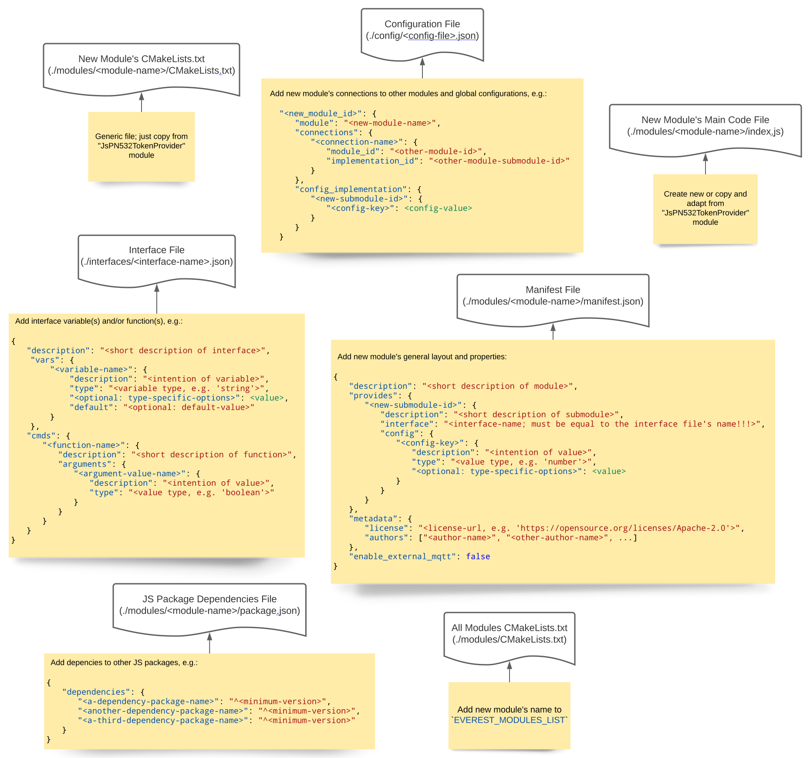
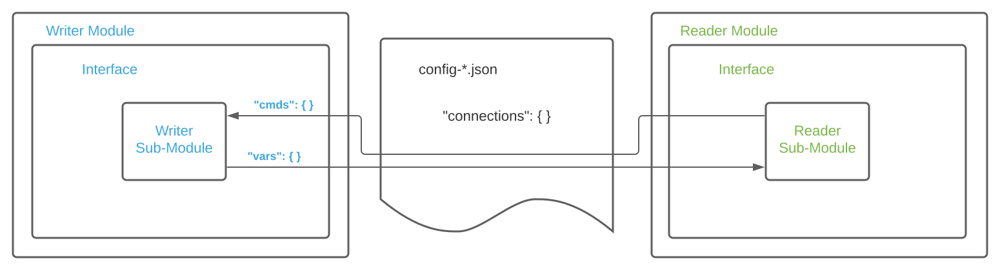
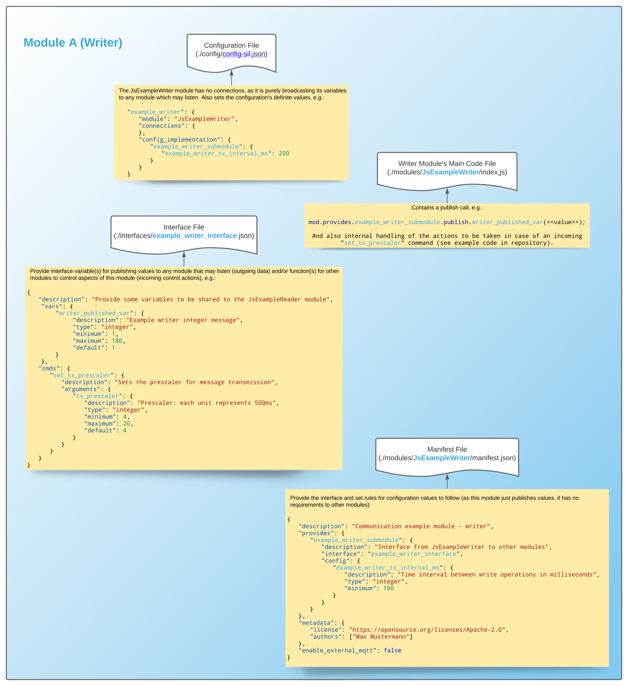
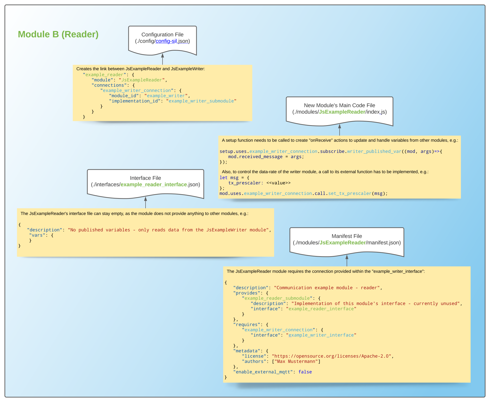
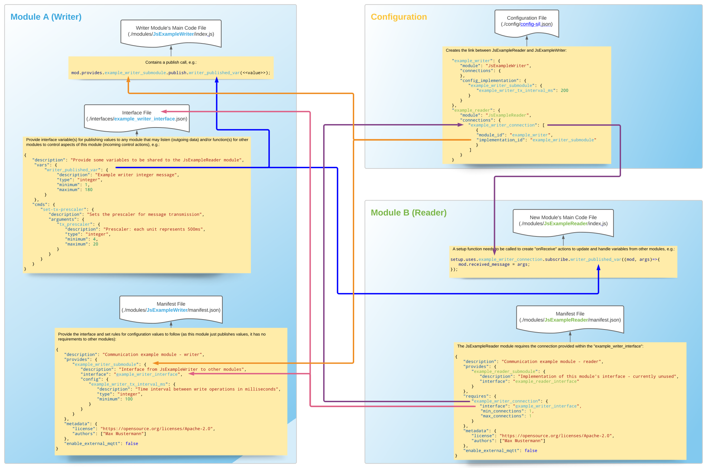

How To: Develop New Modules
***************************

0. Introduction
^^^^^^^^^^^^^^^
You need to set up your workspace according to https://github.com/EVerest/everest-dev-environment/blob/main/dependency_manager/README.md
Make sure you can build the everest-core project before you start to develop modules.
After this, install the ev-cli tool by going into the directory everest-utils/ev-dev-tools/ inside your workspace and call:: 

	pip install .

1. New directory
^^^^^^^^^^^^^^^^
Create a new directory inside the modules directory of the everest-core directory inside your workspace.
The name of your directory is the name of your new module.
Please use the prefix "Js" for JavaScript modules to make them distinguishable from C++ modules without looking into the directory.

2. Creating your module's manifest
^^^^^^^^^^^^^^^^^^^^^^^^^^^^^^^^^^^
Every module needs a manifest file that describes the module and its dependencies.
Make sure to familiarize yourself with json and json-schema. You will need it to define the config for your module as well as new interface definitions.
Good documentation can be found here: https://json-schema.org/understanding-json-schema/reference/

Commented example manifest (all descriptions are mandatory and used to autogenerate your module's documentation):

.. code-block:: javascript
    :linenos:

    {
        "description": "Some oneliner describing your module and it's functions",
        "config": {
            // Config set for the whole module (including possible default values) declared as json schema
            "some_config_key": {
                "description": "This is a module-global config key",
                "type": "string",
                // if you don't specify a default, the config key must be specified in the everest config,
                // if a default is present, the config key can be omitted in your everest config.
                "default": "some default value if this key is not provided in everest config"
            }
        },
        "provides": {
            // List all provided interface implementations of this module alongside their interface implementation specific config.
            // You can use an arbitrary name, but this name has to be specified in the everest config file when this module is loaded.
            // For a module containing only one implementation you should use "main".
            "main": {
                "description": "This is the implementation of the interface 'interface_definition_used'.",
                // The interface definition is a json file found in everest-framework/interfaces/interface_definition_used.json
                "interface": "interface_definition_used",
                // Config set for the implementation "main" (including possible default values) declared as json schema
                "config": {
                    "some_implementation_local_config_key": {
                        "description": "This is a config key only visible to the part of your module implementing 'main'.",
                        "type": "integer",
                        "min": 4,
                        "max": 64,
                        // if you don't specify a default, the config key must be specified in the everest config,
                        // if a default is present, the config key can be omitted in your everest config.
                        "default": 42
                    },
                    "some_other_config_key": {
		        "description": "This is some other config key",
                        "type": "string",
                        "minLength": 10,
                        "maxLength": 100
		    }
                }
            }
        },
        // this part lists all requirements on other modules, which your module may have
        "requires": {
            "requirement_name_used_in_config_file_later_on": {
                "description": "Some optional text describing this dependency",
                "interface": "the_interface_definition_the_required_module_has_to_implement"
            },
            "some_other_requirement_id": {
	        "description": "Some other optional text describing this dependency",
                "interface": "other_interface"
            }
        },
        "metadata": {
            "base_license": "URI pointing to the base license of your module if you use code from another poject under a different license",
            // license and authors is required
            "license": "URI pointing to the license of your module, like: https://opensource.org/licenses/Apache-2.0",
            "authors": ["Your name", "Some more name", "Third author name", "etc."]
        },
        "enable_external_mqtt": false       // default value if not specified
    }

3.1. Writing a Jsmodule: Creating some more essential files
^^^^^^^^^^^^^^^^^^^^^^^^^^^^^^^^^^^^^^^^^^^^^^^^^^^^^^^^^^^

If you want to write a JavaScript module, you can copy over the ``CMakeLists.txt`` file found in the module directory ``JsPN532TokenProvider``.
The ``CMakeLists.txt`` file is dynamic and will infer your module's name from the directory name it resides in.
You need to create a ``package.json`` file, too.
This file lists all dependencies on external nodejs packages your module has, like it's done in any other nodejs project.
You can specify an empty object ``{}`` if you do not have any dependencies on external packages.
The EVerest build system will automatically install all needed dependencies using ``npm``.

[Image 1: Files to create/modify when adding a new module]

3.2. Writing a C++ module: Creating some more essential files
^^^^^^^^^^^^^^^^^^^^^^^^^^^^^^^^^^^^^^^^^^^^^^^^^^^^^^^^^^^^^
To create the needed (template) files for your C++ module you have to use the ``ev-cli`` tool installed in :ref:`step 0 <0. Introduction>`.
Call:: 

	ev-cli mod create <your_module_name>

inside the ``everest-core`` directory in your workspace.
It will create a directory for each ``provides`` key in the manifest and a top-level C++ file named ``<module_name>.cpp``.
The top-level C++ file contains an ``init()`` method and a ``ready()`` method called on module load and framework ``ready()`` events (see step 4 :ref:`Module lifecycle <4. Module lifecycle>`).
The C++ files in the generated subdirs contain all ``CMDs`` and ``VARs`` you have to implement to implement the interface you specified in your manifest.
The methods ``init()`` and ``ready()`` can be implemented on the interface implementation level, too.

4. Module lifecycle
^^^^^^^^^^^^^^^^^^^
Every module resides in it's own process invoked by the manager.
Upon loading a module the ``init()`` method will be invoked by the framework.
Once all modules are loaded and initialized, the framework will call the ``ready()`` method.
Only in the ``ready()`` method or after the method was called, the module is allowed to call ``CMDs`` of other modules.
``VARs`` can only be published inside the ``ready()`` method or after the ``ready()`` method was called.
Correspondingly other modules will only receive new published ``VARs`` or get ``CMDs`` after their ``ready()`` method was called.
Modules cannot be stopped or unloaded. The creator of a new module is responsible to provide internal functionality to disable the module's inner workings, should that be a desired state.

5. Interface files
^^^^^^^^^^^^^^^^^^
Make sure to familiarize yourself with json and json-schema. You will need it to define new interface definitions.
Good documentation can be found here: https://json-schema.org/understanding-json-schema/reference/

The interface definitions that modules can implement or require are located in the ``/everest-framework/interfaces`` directory inside your workspace.
An interface definition can contain two different kinds of declarations: ``VARs`` and ``CMDs``.
A ``CMD`` is an RPC command, the module implementing the interface provides for other modules. It can take zero or more named arguments and optionally return a result.
A ``VAR`` is a value that is published by the module implementing the interface and can be consumed by other modules having a requirement for this interface
(e.g. require a module implementing this interface).
Thus ``VARs`` exhibit push semantics where the publishing module drives the data exchange (e.g. decides when to publish something) whereas ``CMDs`` exhibit pull semantics
(e.g. the module *calling* the ``CMD`` drives the data exchange).
Furthermore exchanging data via ``VARs`` means the *consuming* module has to define a requirement for the publishing module in it's manifest
whereas exchanging data via ``CMDs`` means the *calling* module (not the module consuming the cmd call) has to require the module it wants to call the ``CMD`` from.
Using ``CMDs`` is bidirectional (arguments and return values) whereas using ``VARs`` is unidirectional (e.g. you need module A and module B to define a requirement for each other and let each of them publish a ``VAR`` if you want to do a bidirectional data exchange via ``VARs``).

Arguments and return values of ``CMDs`` as well as the values published in ``CMDs`` have to be described using json-schema (like the config entries in the ``manifest.json``).

With all of this theroretical background in mind, let's look at an actual real world example (all description fields are mandatory):

.. code-block:: javascript
    :linenos:

    {
        "description": "Interface of authentication framework",
        "cmds": {
            "validate_token": {
                "description": "Validate auth token and return result (with optional reason string)",
                "arguments": {
                    "token": {
                        "description": "Arbitrary token string with min length 1 and max length 20",
                        "type": "string",
                        "minLength": 1,
                        "maxLength":  20
                    }
                },
                "result": {
                    "description": "Result object containing validation result enum value (key: result) and optional reason string (key: reason)",
                    "type": "object",
                    "required": ["result"],
                    "properties": {
                        "result": {
                            "type": "string",
                            "enum": ["Accepted", "Blocked", "Expired", "Invalid"]
                        },
                        "reason": {
                            "type": "string",
                            "minLength": 5
                        }
                    },
                    "additionalProperties": false
                }
            }
        },
        "vars": {
            "authorized": {
                "description": "New validated auth token provided",
                "type": "string",
                "minLength": 1,
                "maxLength":  20
            }
        }
    }

Interface definitions can inherit from other interface definitions. This means you can extend a definition by inheriting from it and adding
new ``VARs``/``CMDs``. You *can not* overwrite the definition of a ``VAR``/``CMD`` from the parent interface in the child, nor can you remove a ``VAR``/``CMD`` defined in the parent.

If one module requires another to implement a base interface, other modules derived from this one will need to match this requirement.
The module defining the requirement will not be able to use ``VARs``/``CMDs`` defined in the derived interface, only the ones defined in the interface it defined its requirement
for (and the ``VARs``/``CMDs`` defined in the parent interfaces of this interface, of course).
For three interface definitions A, B and C defined like this: 

**A** ===derived from===> **B** ===derived from===> **C**

If module X requires a module implementing interface **B**, it can use ``VARs``/``CMDs`` defined in **C** or **B**, but not those defined in **A**.

6. Example Js Modules
^^^^^^^^^^^^^^^^^^^^^

As an example of inter-module communication we will create two new modules:
	* a "writer" module (JsExampleWriter), which will send data to other modules and provide a function to control its own data-rate
	* and a "reader" module which will receive data from the "writer" module and control its data-rate

The new modules will be interconnected like this:

[Image 2: Connections between two modules]

The JsExampleWriter module will provide two different interface objects: 
	* an external variable ("writer-published-var") which provides data to other modules
	* an external function ("set-tx-prescaler") with which other modules can control the writer module's data-rate

[Image 3: Relevant file contents for writer module (JsExampleWriter)]

The JsExampleReader module will: 
	* subsribe to the variable "writer-published-var" (of connection "example-writer-connection") and
	* control the data-rate of the JsExampleWriter module via function "set_tx_prescaler"

[Image 4: Relevant file contents for reader module (JsExampleReader)]

The linking of both modules will be defined in the configuration (``/config/config-sil.json``), where the JsExampleReader module receives a connection ("example-writer-connection") to the "example_writer" submodule ("example_writer_submodule").

[Image 5: Interconnection of key-value-elements between two modules' json files (and the configuration file)]

6.1 Further steps to make the project buildable
^^^^^^^^^^^^^^^^^^^^^^^^^^^^^^^^^^^^^^^^^^^^^^^

So far, the modules have been written (each in their corresponding folder in "/modules/"), each module has defined an own interface (in the ``/interfaces/`` folder; note that the JsExampleReader's interface is currently empty, as it provides no interface for other modules to use) and both modules have been linked (and possibly received configuration values) in the project's config file (``/config/config-sil.json``). The last thing missing is to add the modules' names ("JsExampleWriter" and "JsExampleReader") to the project's module list (``EVEREST_MODULES_LIST`` in ``/modules/CmakeLists.txt``).

If the modules' code is correct, the project can now be successfully built from the ``/everest-core/build/`` folder (e.g. run ``cmake .. && make -j$(nproc) install``) and executed (run from same folder ``../run-sil.sh``).
