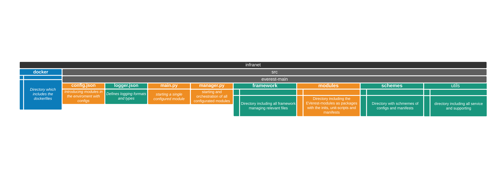
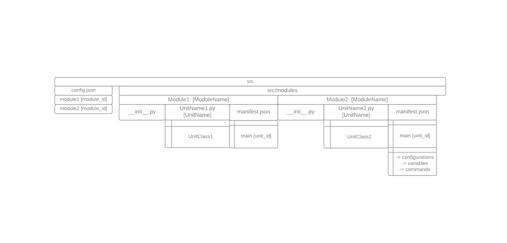

.. doc_workspace:

Workspace Architecture
########################
*Current status of Q1 2021*

General
**********
For a safer development the project is capsuled in docker container.More specific, there is one docker container for the publish- and subscriber handler MQTT,
that enables an asynchronous communication through topics generated by the broker (topic-handler).The second docker-container includes the OCPP communication as 
a standard interface between the electric vehicle supply equipment (EVSE) and the software-grid of the infrastructure-management, called CSMS-Cloud.
In summary the MQTT-Docker takes over the functions in the inner ecosystem of the supply equipment and the OCPP-Docker allows function between the outside world.

The workspace is structured in directories with the main elements of the framework, utlity-directories and the location of all modules.

Devlopment in the Workspace
*****************************
The basic structure inside the framework is defined by the JavaScript Object Notation (JSON) as a communication interface for configurations, variables and commands 
between the modules of the EVerest enviroment. The main part to define the communication transport ways and the requirements of the modules among themselves are 
declared in the config.json.Each module as a package in the 'src / module' directory requires a minimal content of scripts in order to be properly managed by the 
framework. A Module defines an application of the charging station architecture and  contains one or more units.The minimum of a module includes -the 'manifest.json' 
for the decalartion of the module for the specific module, -the unit-script itself like the 'LogicalCore.py' - the __init_.py that imports the unit-script.

conifg.json
****************

This script contains the declaration of all modules and their configurations for the integration inside the whole enviroment. On the first indentation-level 
there are all the modules introduced as module_id's with each of its individual specific contents. 
The example shows a declaration of three modules with each an main unit and how a module can be connected with other units.

The 'Key Value Store'-module shows the minimum requirement for a declaration which contents the first indentation with the module_id 'kvs' and contains in the 
second indentation the modulename which has to match with the directory-name.

Shown in example of the hardware module the connection from itself to the 'main'-unit of the 'kvs'-module and to 'main'-unit of the 'ocpp'-module.
Inside the manifest.json of the hardware-module the requirements of the necessary classes are introduced with its own namespacing, 
like 'req1' or 'kvs'. In the config.json these requirements have to be contained inside a a "connections"-element of the module. 
Where the manifest explains which classes are necessary, the config indicates which unit from the environment can provide the required class. 
For this, the specific requirement includes the specific module_id, like "ocpp" or "kvs" declared in the first indentation of the config.json and the unit_id, 
which is declared in the manifest.json of the required units module-directory.
Each connection can be declared as optional, which still allows running the manager, which starts all existing modules, 
even if the optional unit is not introduced or implemented.

.. code-block:: JavaScript

    {
        "kvs": {                                        //first module_id: kvs
            "module": "KeyValueStore"                   //module_name matching the directory name in the modules dir)
        },
        "hardware": {                                   //second module id: hardware
            "module": "HardwareDriver",                 //module name (matching the directory name in the modules dir)
            "connections": {                            //first connection for package hardware to unit main of ocpp
                "optional:req1": {                      //connectionname which is defined in the manifest.json of the hardware-module and declared as optional
                    "module_id": "ocpp",                //declare module-connection with module_id and unit_id
                    "unit_id": "main"                   
                },
                "optional:kvs": {                       //second connection for package hardware to unit main of kvs
                    "module_id": "kvs",
                    "unit_id": "main"
                }
            }
        },
        "ocpp": {                                       //third module_id: ocpp
            "module": "OCPP",                           //module_name: OCPP (matching the directory name in the modules dir)
        }
    }

logger.json
****************
Defines the basic configurations of the logging format, like the font and color style of the differend categories of informations
The logger.json allows task focused logging as handlers for example standard-datastreaming or files. Each handler includes properties, like their class, formatter and priority-level.General logging is defined for each module categorized in the "DEBUG"-level 

main.py
**********
The main.py is needed to start single modules by the commandline and manages at the beginning, execution and exiting of the running process.

Starting a module is possible by execution of this specific commandline:
**./main.py -m module_id**

*It is visible that the shortcut -m points on the module_id, which was decalered in the config.json*

**Inside the code**
The format of the inputs in the commandline which are relevant to start modules or are needed for an interaction withhin runtime are realised through the Argument-Parser.
Typically each argument represented as string-word or a string-shortcut describe an option in the command. 
These options can activate a procedure and can also hand over values for the inital configurations.
The main application core starts by calling the Everest class with the initialazing the modules and their configurations, 
which are specified by the arguments from the command line. Initializing means importing the classes and their attributes. 
By failing to import the elements, the system will cleanup, give a short feedback through the logger which part of the import failed and exits with an error.
By success a logger is giving a string-information and is followed by starting the mqtt client connection to launch the mqtt-client with its continuous loop. 
If the mqqt-client is disconnected the system will automatically shutdown.
Early as possible for a detailed error detection. the logger-subroutines and follows directly with trying to load the configurations.
If the routine failed to load the configurations it directly exits the system or when an internal error arises.Also if the configuration is corrupted,
at example by missing essential properties like the module_id the system will exits with an error to prevent loading an flawed module.
With an successfully loaded configuration of the modules, follows an extraction of property values for the further process.
By exit functioncaller insures to disconnect the client/s. and during the cleanup triggered by an keyboardexception the system exits with an error.

manager.py
************

The manager is similar to to the main.py with main differences for that it starts all introduced modules and checks if all connected signals are provided 
for a dependent module. This secures that the operational sequence of a higher module is not broken through an interaction before all requirements are not avaiable. 

**NEEDS MORE INFORAMTIONS**