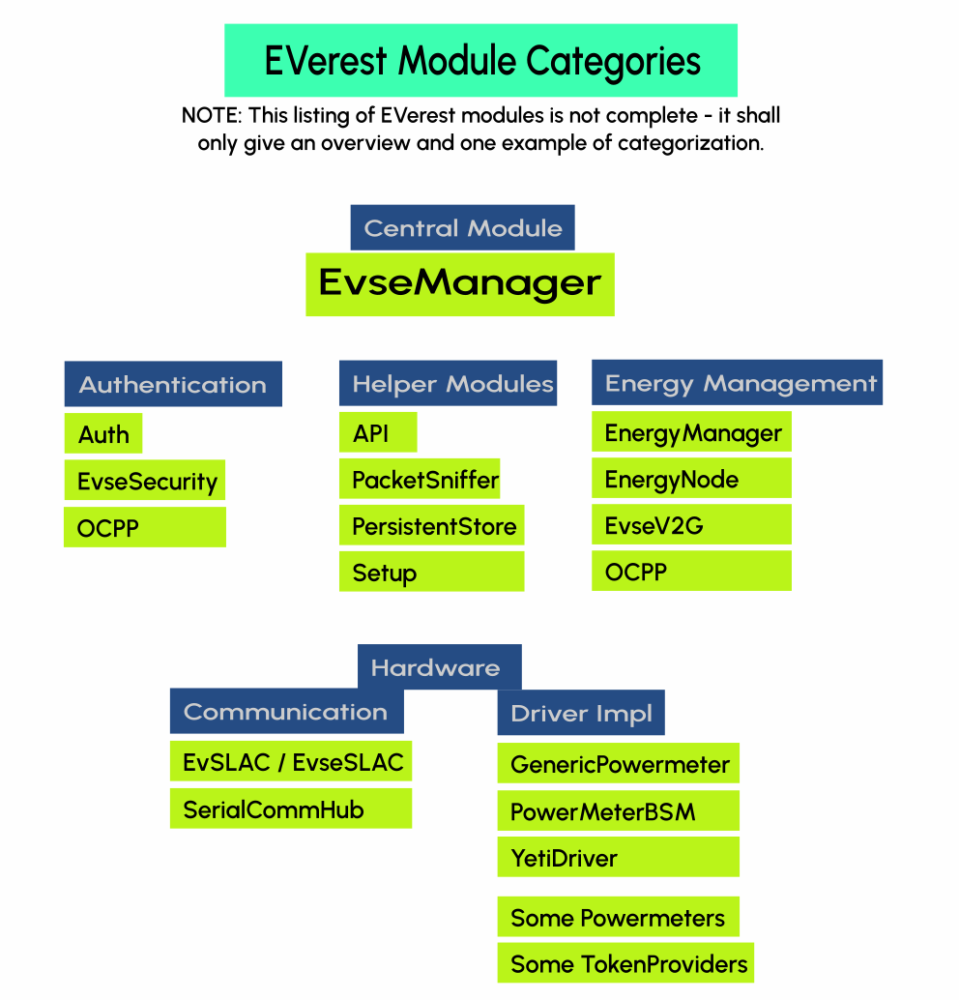

.. doc_framework:

EVerest framework
#################
You can think of EVerest as an operating system for EV chargers with
implementations of communication protocols, software modules for
representations of hardware devices (chargers, cars, …) and tools
for simulating the charging process.

It's a full stack environment for EV charging.

*********************
A Visual Introduction
*********************

The EVerest framework helps with building your dedicated development scenario
with all needed modules for your specific developer's use case.
The modules are connected by using the principle of loose coupling.

Modules in EVerest can be everything like hardware drivers, protocols,
authentication logic and more.
Build up your development scenario as needed and enhance it by adding your own
additional modules.

Having this in mind, you can take a look at the following high level overview
of the framework:

.. image:: img/0-0-everest-top-level-diagram.png
  :width: 760px

The upper part (light grey background) of this picture is part of EVerest. The
lower part of the picture shows two technologies that are used by EVerest but
are not part of the EVerest repositories.

.. note::

  Modules can be implemented in C++, Javascript, Python or Rust.

  As especially Python and Rust were not part in the very early version of
  EVerest, we appreciate feedback about your experience in using those
  languages.

  Write us via
  :ref:`Zulip <index_zulip>` or drop us a line on the
  :ref:`Mailing list <index_mailinglist>`.

The EVerest framework launches all modules that are configured for your
workspace.
You will see later how configuration of modules and dependencies is done.

The modules communicate via an MQTT broker.
MQTT is currently the default messaging technology coming with EVerest.
You could change that to other solutions (with some smaller development
efforts).
Same with NodeRED.

At the right side of the picture, you see the main tools in EVerest, which
will be explained later in this documentation in more detail.
Up to now, some sneak preview:

- **Admin Panel**: Tool to show all modules connections and dependencies
  including the parameters set for the modules.
- **EVerest Dependency Manager** (edm): Tool that helps you getting all
  needed repositories from Git for your specific setup.
- **ev-cli**: Generates module and interface scaffolds based on templates.
  This way you can start implementing new modules very fast.

***************************
Examples of EVerest Modules
***************************

This picture shows some of the main modules in EVerest:

The central module in EV charging scenarios will be the EvseManager.
It consists of some central controlling logic for charging configurations.

All other modules shown can be organized in workspaces depending on your
individual setup.
Later in this documentation, you will learn how to create configurations
to set the dependencies and config values of those modules to suit your
needs.

*************************
High Level Module Concept
*************************

To get an idea, what an EVerest module consists of, see the following
illustration:

.. image:: img/0-1-everest-top-level-diagram-module-details.png
  :width: 520px

The top box within the dashed line shows the definition of a module in EVerest.
The heart of it is the manifest file.
The manifest holds the definition of configuration keys.

.. note::
    The manifest file is not the place to put the values of the config options.
    The manifest just defines what can be configured later, e.g. the "max
    voltage" of a device.
    The values of those config parameters are put in the configuration files
    that build up your workspace, which will be explained later.

The manifest also declares which interfaces are provided or required by a
module.
"Provided" means that a module has implemented an interface.
"Required" means that a module needs a connection to another module which has
implemented the dedicated interface.

For a more detailed explanation of that concept and what "type" definitions
mean in EVerest, see the
:ref:`EVerest Module Concept page <moduleconcept_main>`

Alternatively, you can also see the concept in action in a
 :ref:`tutorial that shows how to create modules <tutorial_create_modules_main>`.

Having defined EVerest modules, they need to have a way to communicate.
This illustration shows what is happening there:

.. image:: img/0-2-everest-top-level-diagram-module-communication.png
  :width: 450px

Module A and Module B are communicating via an MQTT broker.

Modules can publish variables (VARs) which other modules can subscribe to.

Modules can also call commands (CMDs) of other modules.
This is also triggered via MQTT messages.

********************
Module Communication
********************

*************************************
System Requirements and Prerequisites
*************************************

What is needed to run EVerest?

Hardware
========
It is recommended to have at least 4GB of RAM available to build EVerest. More CPU cores will optionally boost the build process, while requiring more RAM accordingly.

We have setup EVerest successfully on Raspberry Pi 4.

Operating System
================
EVerest has been tested with Ubuntu, OpenSUSE and Fedora 36. In general, it can
be expected to run on most Linux-based systems.

Libraries And Tools
===================

To create your development environment with all needed tools, libraries and
compilers, the section
:ref:`Prepare Your Environment <preparedevenv_main>` will walk you through the
setup phase.
