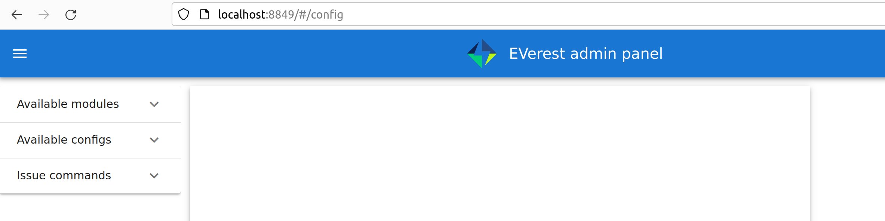

.. quick_start:

.. _quickstartguide_main:

################################
A Kind Of Quick Guide To EVerest
################################

************************************
Prepare Your Development Environment
************************************

Needed Packages
===============
You will need Python, Jinja2, PyYAML, a compiler and some more system libraries
set up. If not already done, see the detailed page for
:ref:`setting up your development environment <preparedevenv_main>`.

After having created your environment, we can go on downloading and installing
EVerest.

.. _quickstartguide_download_install:

********************
Download And Install
********************

Get The Needed EVerest Repositories
===================================

EVerest Dependency Manager - edm
--------------------------------

As EVerest is highly modular, you will need multiple repos, which can be found
on GitHub.

To get the right repos as needed, the EVerest Dependency Manager - short edm -
will help you.

To start with that, let's get edm ready to work.

You will first of all need to pull *everest-dev-environment* to your
development environment.

Python and its tools pip, setuptools and wheel have already been installed in
the Prerequisites section above. So, you can pull the said repository and
install the dependency manager, which will reside inside of .local/bin/ in your
HOME directory:

.. code-block:: bash

  git clone git@github.com:EVerest/everest-dev-environment.git
  cd everest-dev-environment/dependency_manager
  python3 -m pip install .

To let edm prepare the most common repos for a simple start with EVerest,
let us use a default config file and set a workspace directory for the repos.
Set your preferred directory instead of `{EVerest Workspace Directory}`, e.g.
use `~/checkout/everest-workspace`.

.. code-block:: bash

  edm --config ../everest-complete.yaml --workspace {EVerest Workspace Directory}

(In future, as your system has edm properly setup, you can always initialise a
new workspace by calling *edm init*.)

edm will now prepare the most common repos to start with. It will also create a
YAML file which describes your newly created workspace. You can change that
YAML file later if you want to adopt the workspace to another scenario.

The YAML file can be found in the directory which you have chosen as workspace
directory. In the above example, it is located at

`{EVerest Workspace Directory}`.

More details about edm, see the dedicated
:ref:`edm page in this documentation <edm_main>`.

EVerest Command Line Interface: ev-cli
--------------------------------------

In its current version, ev-cli supports you by generating module templates. It
is also necessary to build EVerest.

To install ev-cli, change into the everest-utils/ev-dev-tools/ directory and
install ev-cli:

.. code-block:: bash

  python3 -m pip install .

That is all to install ev-cli. You can find the binary file of ev-cli in your
HOME directory in .local/bin/

In a later step, we will use ev-cli to create module stubs.

Packages for ISO 15118 communication
------------------------------------

To be able to build EVerest with ISO 15118 capability, you will have to
install the requirements for Josev:

.. code-block:: bash

  cd {EVerest Workspace Directory}/Josev
  python3 -m pip install -r requirements.txt

For ISO 15118 communication including Plug&Charge, install Josev and some CA certificates:

.. code-block:: bash

  cd ~/checkout/everest-workspace/Josev
  python3 -m pip install -r requirements.txt
  cd ~/checkout/everest-workspace/Josev/iso15118/shared/pki
  ./create_certs.sh -v iso-2 -i ~/checkout/everest-workspace/everest-core

This will enable ISO 15118 communication including Plug&Charge and install The
required CA certificates inside *config/certs/ca* and the client certificates,
private keys and password files inside *config/certs/client*.

.. attention::

  This will generate an example PKI setup that can only be used for testing
  and simulation. It will not work and is not recommended for production.

The script for setting up PKI can also be used with the EvseV2G module.

Build EVerest
=============

Now it is time to build EVerest:

.. code-block:: bash

  cd {EVerest Workspace Directory}/everest-core
  mkdir build
  cd build
  cmake ..
  make install

.. hint::

  In case you have more than one CPU core and more RAM availble you can use the
  following command to significantly speed up the build process:

  *cmake  -j$(nproc) ..*

  *make -j$(nproc) install*

  *$(nproc)* puts out the core count of your machine, so it is using all
  available CPU cores. You can also specify any number of CPU cores you like.

edm helped you to keep it that simple. Let's now dive into simulating our
current workspace.

If you get an error during the build process stating that ev-cli is installed
in an old version, go to your everest workspace directory and call *edm
--git-pull*. This will update the EVerest repositories. After that, repeat
building ev-cli and you should be good to go again.

******************
Simulating EVerest
******************

.. _quickstartguide_helpers:

Prepare The Helpers
===================
EVerest comes with prepared Docker containers. The one that starts Mosquitto
(an MQTT broker) is required to run EVerest. This documentation section shows
the necessary steps to start the simulation and get the user interface running.

Further tools are not required to run EVerest (e.g. SteVe for OCPP). Further
information about EVerest Docker containers can be found on the
`EVerest Docker Setup page <../tutorials/docker_setup.html>`_.

.. hint::
  To get all this working, make sure you have docker and docker-compose installed during the previous install phase. (If not, see install instructions for `docker <https://docs.docker.com/engine/install/#server>`_ and `docker-compose <https://docs.docker.com/compose/install/#install-compose)>`_!)

In order for custom or local containers being able to talk to the services,
provided by the docker-compose containers, we need to create a common docker
network. It is called `infranet_network` and needs to be created by the
following command (IPv6 is enabled for containers which might need it):

.. code-block:: bash

  docker network create --driver bridge --ipv6  --subnet fd00::/80 infranet_network --attachable

Now, change into your workspace directory and enter the directory with the
prepared docker containers. Start the the mosquitto broker which will be
used by EVerest for the communication between the EVerest modules:

.. code-block:: bash

  cd {EVerest Workspace Directory}/everest-utils/docker
  sudo docker-compose up -d mqtt-server

That makes us ready for entering the simulation phase described in the next
chapter.

Software in a loop
==================

In the following, we will start EVerest as a simple AC charging station with
software-in-the-loop configuration. This means that all hardware related
parts like Powermeter, RFID-Reader or even actual Electric Vehicles are
loaded as simulated modules.

.. hint::

  Make sure you have prepared the helpers necessary for simulating EVerest as
  shown in the :ref:`previous section <quickstartguide_helpers>`.

Change to the directory `everest-core/build`, which has been created during
EVerest install.

Start EVerest with a software-in-the-loop configuration via script:

.. code-block:: bash

  {EVerest Workspace Directory}/everest-core/build/run-scripts/run-sil.sh

In a new terminal window, run the Node-RED script:

.. code-block:: bash

  {EVerest Workspace Directory}/everest-core/build/run-scripts/nodered-sil.sh

For a user interface, just direct your browser to `http://localhost:1880/ui` -
the required web-server has already been started via the shell scripts.

This will let us control the simulation in a very simple GUI.

You can analyse the output of the two shell scripts in the terminal windows to
get a little bit of insights about what is going on and which ports are used
etc.

In the GUI, you can simulate car charging sessions using the available buttons,
e.g. `CAR PLUGIN`, `PAUSE`, `RESUME` and so on:

.. image:: img/quick-start-sil-gui.png
  :width: 200px

Having a very first basic feeling for that will be enough for now. We are
preparing a module tutorial, in which we will dig deeper into things.

Admin panel and simulations
===========================

You can glue together the modules of EVerest (and also your custom ones) with
the help of EVerest's framework mechanisms. This way, you define simulation
flows with which you can test and analyze complicated systems.

As EVerest is a modular framework, you can define connections and data flows
in a nice network of modules. As it would be a little bit exhausting to
configure everything via code or config files, there is a nice helper: The
admin panel.

It gives you a nice overview of modules and connections between them. In a nice
diagram, you can see and understand the simulation with all interfaces,
configs, data flows and so on.

Back to practice:

Having run through the *Software-in-the-loop* section, you will already have
prepared access to the admin panel. Just open your browser and direct it to
port 8849 - the height of Mount EVerest in meters.

.. code-block:: bash

  http://localhost:8849

You should see a rather empty page like that:

Click on the menu symbol on the upper left corner of the page, then click on
config. A left side column with further menu items opens. Choose *Available
configs":

If you are here for the first time, you will see all pre-configured Node-RED
flows here. For a first intro, you may want to take a look at *config-sil*.

After opening it, you can see a diagram representation of some modules with
connections between them.

The role of each module in this system will be explained on page
:ref:`Module Concept <moduleconcept_main>`.

To see how to create your own custom flows for simulations, visit the
:ref:`Tutorial for simulating EVerest <tutorial_sil_main>`.

Next, let's see how fast we can create a new module in EVerest.

.. _quickstartguide_modulesetup:

*****************************
Understanding EVerest Modules
*****************************

You reached the phase of writing a new EVerest module. Congrats!

For this Quick Start Guide, we will give you a rocket start of understanding
the basic elements of the EVerest module concept.

So, let's dig into the overview:

EVerest is a modular framework. So, there are lots of modules for different
entities in an EVerest workspace:

- EvseManager (a charging port as part of a charging station)
- Hardware driver modules
- Protocol implementations
- Car simulation modules
- Authentication modules
- Energy management modules

and so on.

Of course, you can change the functionality of those modules or add your
custom ones to the whole module stack.

In very short terms, a new module will be created by describing its structure
via manifest and interface files. After that, an EVerest helper tool will
create the necessary files as stub files, so that you can implement the
details. The EVerest framework will also know how the modules can be connected
by the restrictions you set in the manifest.

How does all that look like? Read the next section!

Basic elements of a module
==========================

Module manifest
---------------

Let's look at the first step: Describing the structure of a new module.
Starting with the manifest file, which could look like this:

.. code-block:: yaml
  :linenos:

  description: Describing what this module does.
  config:
    some_key:
      description: Describe the effect of this config key.
      type: boolean
      default: false
  provides:
    main:
      interface: myinterface
      description: Describe what the implementation of this interface does.
  requires:
    some_implementation:
      interface: externalinterface
      description: What do I expect from the required external implementation?
  enable_external_mqtt: true
  metadata:
    license: https://spdx.org/licenses/Apache-2.0.html
    authors:
      - Your name, your company

Most of this should be self-explanatory. Just a few words:

The config section gives you the possbility to define some config keys for the
module to re-use it for different scenarios in your workspace.

In line 7, the *provides* section let's you tell other modules what your
module is able to do. You tell the EVerest module framework which interfaces
have been implemented - for example, a power meter. Of course, you can
implement more than only one interface and list all of that in the *provides*
section.

Line 11 starts with the requirements of your own module. This is the other
side: Your module tells the EVerest module framework which implementations it
will require to work in the EVerest workspace.

In EVerest, you find a manifest file for each module. See the module
directories in *{EVerest Workspace Directory}/everest-core/modules*.

Interfaces
----------

An interface describes - like a kind of construction manual - which information
it delivers and which functionality it provides for other modules to use.

A module, that implements an interface, publishes information via VARs (short
for variables). VARs can be consumed by connected modules. Functionality is
provided by CMDs (commands, that can be called from other modules).

VARs and CMDs are defined in the interface files. Remember the manifest file?
The previous section showd that the manifest file defines which interfaces your
module implements. Those interfaces could already exist. If not, you would have
to create a new one.

You can find all interfaces in the directory
*{EVerest Workspace Directory}/everest-core/interfaces* as yaml files.

An easy one as an example:

.. code-block:: yaml
  :linenos:

  description: Describe why we need this interface.
  cmds:
    get_id:
      description: Describe what this command does when called.
      arguments:
        verbose:
          description: An example for a method argument.
          type: boolean
      result:
        description: Explain the return value.
        type: integer
  vars:
    temperature:
      description: Describe this value that gets published.
      type: integer
    limits:
      description: Describe this struct that gets published.
      type: object
      $ref: /typedef#/Limits

A short interface file, but lots to learn here:

You can see one CMD defined, which has the name *get_id*. If you want to
implement this interface (and *provide* the functionality of the interface
to other modules), this is the method you will have to fill with code in your
implementation later.

There is one argument defined for the method called *verbose*. A return value
of type *integer* rounds things up for the one CMD of this interface.

VARs are pieces of information which get published for the network of
listening modules regularly. We have two VARs in this example. The first one
is of type *integer*, the second one has type *object* and a reference to a
type. This way, you can create structs or classes (however you would call a
bunch of simple data-types grouped inside of one logical unit) for publishing.

Let's have a look at a type definition in the next section.

Types
-----

As you have seen in the example interface yaml, you can use *types* instead
of simple data entities (like boolean, string, integer and so on).

In the interface, you saw a reference to an EVerest type definition.

You can find the type definitions as yaml files in the following directory:

*{EVerest Workspace Directory}/everest-core/types*

An easy definition of a type could look like this:

.. code-block:: yaml
  :linenos:

  description: Describe which group of types will follow.
  types:
    SomeType:
      description: Describe this type.
      type: object
      additionalProperties: false
      properties:
        property_1:
          description: Describe the first property.
          type: boolean
        property_2:
          description: Describe the second property.
          type: number 

You can see one defined type here. It has two properties. A property could
again be another type reference.

Now, as we have defined everything, it is time to let the EVerest command line
interface - the ev-cli tool - generate the implementation stubs.

Generate the stub files
=======================

.. hint::

  We will change the directory structure soon to make it more intuitive.
  Please be aware of some changes here.

To create a new module in EVerest, create a new directory inside of the
*everest-core/modules* directory. Create a manifest file (or copy an existing
one) like described above.

After that prepare a interface yaml which will reside in the
*everest-core/interfaces* directory.

Eventually, you have also used types, which will go into the
*everest-core/types* directory.

Now, it is time for the EVerest tool *ev-cli* to create the stub files:

.. code-block:: bash

  cd {EVerest Workspace Directory}/everest-core
  ev-cli mod create MyModuleName

The name of the module is the one given as directory name.

You will see that you get cpp and hpp files for your main module class and also
for the interfaces to be implemented.

.. hint:: It is also possible to work with Javascript or Python. At this point
  we will focus on C++.

Your main cpp file will have two special functions:

.. code-block:: c++

  void MyModuleName::init() {}
  void MyModuleName::ready() {}

When initialising, the EVerest framework will call all init() functions of all
modules one after the other. After having initialised all modules in that way,
the framework calls the ready() functions.

This allows you to do setup things that relate only to your current module in
the init() function and all stuff requiring other modules being initialised in
your ready() function.

Furthermore, you will get generated files for all interfaces that you
declared to be implemented in your module. Those interface files will contain
handler methods for the CMDs you have declared in the interface files.

You can walk through the generated files in your new module directory and
have a look at the prepared classes.

***************
One Deep Breath
***************

You made it. Great!

Probably, now is a good time to take a deep breath and review what you have
learnt about EVerest.

You might have generated stub files now but still are not sure how to procede
with implementing your specific scenarios?

Good news is: We are working on a tutorial currently to show a short practical
example of implementing an EVerest module.

During waiting time, join us anytime in our weekly tech meeting. There are great people who are glad to give you a hint and push you in the right
direction.

Thanks for being a part of the EVerest community.
