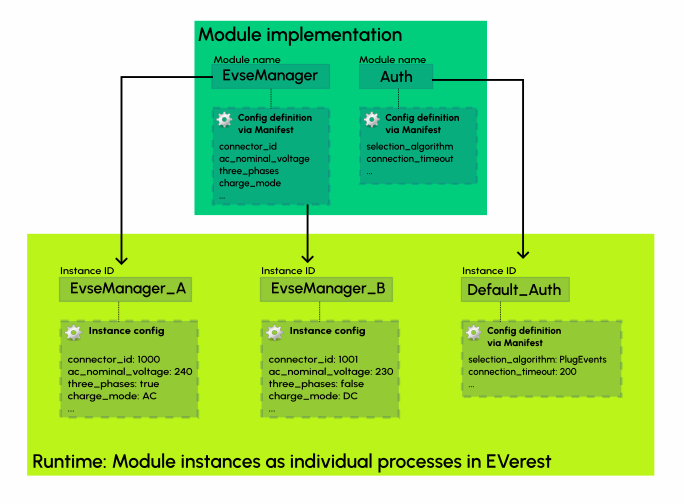
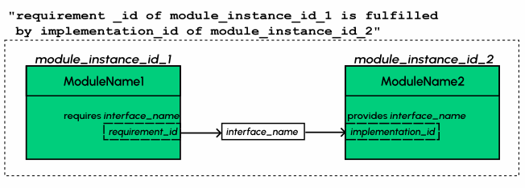
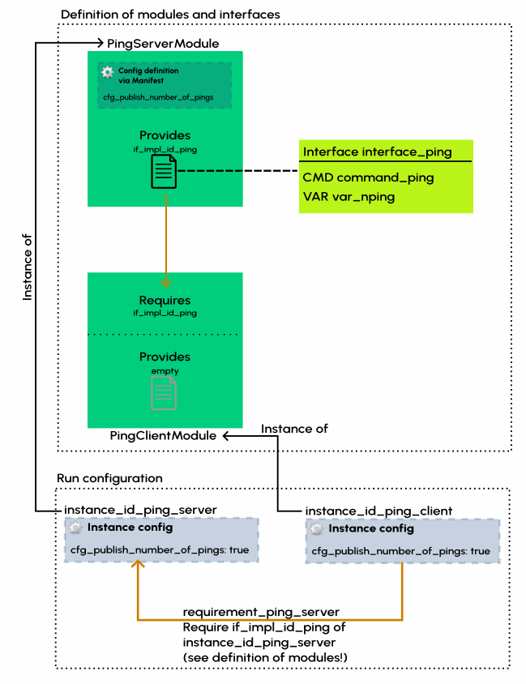

.. detail_module_concept:

.. _moduleconcept_main:

#########################
EVerest Modules in Detail
#########################

This section gives you a bunch of theoretical input about the EVerest module
concept.

Other ways to approach the concepts of EVerest module development are:

1. For a very first glance and understanding of EVerest modules, try to check
   the :ref:`Module Setup section <quickstartguide_modulesetup>` in the Quick
   Start Guide.
2. A more hands-on intro to EVerest module development is the
   :ref:`Tutorial About Developing EVerest Modules
   <tutorial_create_modules_main>`.


********
Overview
********
EVerest follows a microservice-like architecture.
A typical EVerest deployment consists of the following components:

* Several **module instances**, which are separate processes offering some
  type of functionality;
* An **MQTT broker** (mosquitto), which provides the backbone of communication
  between module instances;
* A **manager process**, which orchestrates the execution of module instances.

.. image:: img/everest-manager-modules-mqtt.png
  :width: 360px
  :align: center

********
Concepts
********

Modules and module instances
============================

A **module** is a program providing a specific functionality within EVerest,
e.g. driving a particular type of hardware.

Each module has a unique **name**, assigned at development time.
Modules can accept **config** values, which can be set when executing the
module.

In an EVerest deployment, you launch **instances** of these modules, each
instance is a separate process.

There can be multiple instances of the same module, e.g. for driving multiple
devices of the same type.

Each module instance has a unique **instance ID**, independent of the module
name, which is assigned when configuring the deployment.

Different instances of the same module can also have different config values
set when configuring the deployment.



Interfaces: Communication between modules
=========================================

Think of interfaces as specific protocols (or languages) that modules can use
to communicate with each other.

An interface is a set of:

* **Commands**: Synchronous (remote) procedure calls with defined arguments
  and return values - in short **CMDs**;
* **Variables**: Useful for asynchronous communication, a variable is a topic
  (typically some particular value that changes over time) which users of the
  interface can subscribe to, and which the module publishes updates on.
  In short **VARs**.

For example, imagine a simple interface offered by a power supply module.

Turning power on or off could be implemented as CMDs, callable by other
modules.

The voltage and current values at the power supply could be implemented as a VAR - 
the power supply module publishes this VAR regularly, 
and other modules could subscribe to the VAR and observe its value over time.

Providing and requiring interfaces
==================================

Each module defines a set of interface implementations it **provides** to
other modules, and a set of interface implementations it **requires** from
other modules.

Providing interface implementations
-----------------------------------

A module is not simply declared as an implementor of an interface.
Instead, modules have a set of **interface implementations**,
each implementing one interface and having a unique **implementation ID**.
This is done because a module can implement the same interface multiple times.
This is reflected by providing multiple implementations with different IDs for
the same interface.

As an analogy, think of an internet router.
It does not just implement the IP protocol, it has multiple implementations
of it (several Ethernet ports, WLAN antennas, etc.), which can be connected to
different devices, and may even have different purposes, e.g. LAN and WAN
ports.

Requiring interface implementations
-----------------------------------

Just like a module can provide the same interface multiple times, it can also
require multiple implementations of the same interface.
For example, there could be one energy manager component, which communicates
with multiple power supply or EVSE manager modules.```

Therefore, modules have a set of **interface requirements** with unique
IDs, each of which is for a particular interface and must be satisfied by
an interface implementation of another module.

Continuing with the router analogy from before, a PC can have
multiple network interfaces - e.g. one WLAN and one Ethernet -
which could easily be connected to different ports on different routers.

The following diagram shows how providing and requiring interface
implementation create relations between modules:



Interface communication on the MQTT layer
=========================================

On the MQTT level, interfaces are implemented as follows:

* To listen for incoming CMDs or subscribe to a VAR, a module
  subscribes to the corresponding MQTT topic;
* To send a CMD or update to a VAR, a module publishes a message on the
  corresponding topic.

The MQTT topic for commands is:
``everest/{module instance ID}/{interface implementation ID}/cmd``
Similarly, the MQTT topic for variables is:
``everest/{module instance ID}/{interface implementation ID}/var``
Note that the path prefix ``everest`` may differ in some end-to-end tests.

Wiring it all together: The run configuration
=============================================

The **run configuration** is a YAML file which specifies the structure of your
deployment.
The run configuration defines the module instances to start:

* Their instance IDs;
* Which modules they are an instance of;
* What to set their configuration values to;
* For each interface requirement of the module instance:
    * The instance ID of the module instance which provides the interface;
    * The interface implementation ID within the providing module which will be used.

*************************
Explaining the YAML files
*************************

Now, we will show how the concepts above map to the YAML files
defining modules and interfaces.

Consider the following example: We want two modules, a "ping server" and a
"ping client", to communicate over a "ping interface".

Let us define the ``interfaces/interface_ping.yaml`` first:

..  code-block:: yaml

    description: Interface for a ping-pong interaction
    cmds: # list of commands in the interface
      command_ping: # name of the command
        description: Send a ping with a payload to the ping server.
        arguments: # list of arguments
          payload:
            description: An arbitrary string that the server will pong back.
            type: string
        result: # return value of the command
          description: The same payload as the ping
          type: string
    vars: # list of variables in the interface
      var_nping: # name of the variable
        description: The number of pings the server has received so far
        type: integer


Now, let us define a "ping server" module, which has an implementation of this
interface.

Here is the ``modules/PingServerModule/manifest.yaml`` file:

..  code-block:: yaml

    description: Example ping-pong module
    config: # list of config values
      cfg_publish_number_of_pings: # name of the config value
        description: Publish the number_of_pings variable every 5 seconds.
        type: boolean
        default: false
    provides: # list of interface implementations
      if_impl_id_ping: # implementation ID
        interface: interface_ping # interface name
        description: Responds to a ping with a pong
    enable_external_mqtt: true # enable this if you want to use the MQTT layer directly in your code
    metadata:
      license: link-to-your-license.here
      authors:
        - Max Mustermann, Company Name Here


We can have a "ping client" module, which requires the ``ping_interface``.

Here is the ``modules/PingClientModule/manifest.yaml`` file:

..  code-block:: yaml

    description: Example ping-pong client module
    provides: # list of interface implementations
      if_impl_id_empty: # there must be at least one, so we add a dummy interface
        interface: empty # the definition of this interface is in everest-core
        description: Dummy interface
    requires: # list of interface requirements
      requirement_ping_server: # requirement ID
        interface: interface_ping # interface name
    enable_external_mqtt: true # enable this if you want to use the MQTT layer directly in your code
    metadata:
      license: link-to-your-license.here
      authors:
        - Max Mustermann, Company Name Here


And finally, we define a run configuration, where instances of the two modules
connect to each other:

..  code-block:: yaml

    settings:
      telemetry_enabled: true
    active_modules: # list of module instances
      instance_id_ping_server: # instance ID
        config_module: # list of config parameters
          cfg_publish_number_of_pings: true
        module: PingServerModule # module which this is an instance of
      instance_id_ping_client: # next instance ID
        connections: # list of providers for interface requirements
          requirement_ping_server: # requirement ID
            - implementation_id: if_impl_id_ping # implementation ID
              module_id: instance_id_ping_server # module instance ID of the provider
        module: PingClientModule # module which this is an instance of

Graphically, this would look as follows:



For a tutorial where you implement and experiment a similar example,
refer to
:ref:`this EVerest module development tutorial <tutorial_create_modules_main>`.

********************************
Explaining the generated sources
********************************

When starting a project, you will typically use ``ev-cli`` to generate a
source code skeleton.

Here, we will explain the purpose and structure of the files
created by this code generation step.

Interface headers
=================

Using ``ev-cli generate-headers`` for the ``interface_ping`` from above,
three header files are generated::

    .
    └── build
        └── generated
            └── include
                └── generated
                    └── interfaces
                        └── interface_ping
                            ├── Implementation.hpp
                            ├── Interface.hpp
                            └── Types.hpp

We will not list the contents of these files completely,
but we will explain the contents of the files generally.

``Interface.hpp`` contains a class called ``interface_pingIntf``
(in general, ``${INTERFACE_NAME}Intf``),
which is used when *requiring* the interface.
It contains the following functions:

* ``call_command_ping`` (in general ``call_${COMMAND_NAME}``), to call the
  respective command;
* ``subscribe_var_nping`` (in general ``subscribe_${VAR_NAME}``) to register a
  callback each time an update to the variable is published.

``${INTERFACE_NAME}Intf`` is essentially a proxy which routes command calls
and variable subscriptions to the EVerest framework.

``Implementation.hpp`` contains an abstract class called
``interface_pingImplBase``
(in general, ``${INTERFACE_NAME}ImplBase``), which is used
when *providing* the interface.

It contains the following functions:

* ``publish_var_nping`` (in general ``publish_${VAR_NAME}``), to publish an
  update to the variable;
* ``handle_command_ping`` (in general ``handle_${COMMAND_NAME}``), which is
  virtual - this function is called to handle the respective command.

Interface implementations extend ``${INTERFACE_NAME}ImplBase``, and must
implement all command handlers (``handle_${COMMAND_NAME}``).

The EVerest framework takes care of publishing variable updates,
listening for commands, calling the appropriate handler, and sending back its
return value to the caller.

The ``Types.hpp`` file contains custom type definitions.

Module files
============

Using ``ev-cli module create`` for the two modules from above generates
the following new files (we omit the ``manifest.yaml here``)::

    .
    └── modules
        ├── PingServerModule
        │   ├── CMakeLists.txt
        │   ├── PingServerModule.cpp
        │   ├── PingServerModule.hpp
        │   ├── doc.rst
        │   ├── docs
        │   │   └── index.rst
        │   └── if_impl_id_ping
        │       ├── interface_pingImpl.cpp
        │       └── interface_pingImpl.hpp
        │
        └── PingClientModule
            ├── CMakeLists.txt
            ├── PingClientModule.cpp
            ├── PingClientModule.hpp
            ├── doc.rst
            ├── docs
            │   └── index.rst
            └── if_impl_id_empty
                ├── emptyImpl.cpp
                └── emptyImpl.hpp

Focusing on the source and header files, generally, the tool generates:

* One source-header pair describing a class for the whole module:
  ``${MODULE_NAME}.{cpp, hpp}``;
* One source-header pair describing a class for each interface implementation
  in the module: ``${IMPLEMENTATION_ID}/${INTERFACE_NAME}Impl.{cpp, hpp}``

The module class
----------------

The module class, which carries the same name as the module itself, is defined
in ``${MODULE_NAME}.hpp``.

Apart from a constructor (called by the EVerest framework on startup), it has
a few notable members:

* ``config`` of type ``Conf`` (defined in the same file): Config values for
  the module;
* ``mqtt``: handle for MQTT communication, if ``enable_external_mqtt`` was
  enabled in the manifest;
* ``init()``: Function called by the framework after initializing this module
  - you may add code to it to add more initialization steps;
* ``ready()``: Function called by the framework when the deployment is ready
  - you may initiate application logic in it;
* For each interface implementation:
  ``std::unique_ptr<${INTERFACE_ID}ImplBase> p_${IMPLEMENTATION_ID}``
  - reference to the interface implementation;
* For each interface requirement:
  ``std::unique_ptr<${INTERFACE_ID}Intf> r_${REQUIREMENT_ID}`` - use this to
  trigger commands or subscribe to variables on the provider.

The header file contains designated areas where further members or other
definitions can be added.

Code added to these areas will be preserved if the headers are
overwritten by the ``ev-cli module update`` command (e.g. if you updated
the module manifest).

``${MODULE_NAME}.cpp`` initially only contains stub implementations of the
``init()`` and ``ready()`` functions, which just call the ``init()`` and
``ready()`` functions in each interface implementation:

..  code-block:: c++

    void PingServerModule::init() {
        invoke_init(*p_if_impl_id_ping);
    }

    void PingServerModule::ready() {
        invoke_ready(*p_if_impl_id_ping);
    }

Further logic can be freely added to this file - ``${MODULE_NAME}.cpp`` is
not overwritten by ``ev-cli module update``, unless the ``--force`` option
is specified.

Definitions related to the module class are placed in the ``module`` namespace.

Interface implementations
-------------------------

For each interface implementation, a class is defined in
``${IMPLEMENTATION_ID}/${INTERFACE_NAME}Impl.hpp``.

This class extends ``${INTERFACE_NAME}ImplBase``, declaring overriding methods
for all command handlers, as well as a few additional notable members:

* ``config`` of type ``Conf`` (defined in the same file): Config values
  (TODO: Is this unused?);
* ``mod``: reference to the module instance (e.g. to call methods of the
  module class);
* ``init()`` and ``ready()``, which have the same semantics as the module
  class's ``init()`` and ``ready()``.

Like the module class, interface implementation classes are also
constructed by the framework at startup.

``${IMPLEMENTATION_ID}/${INTERFACE_NAME}Impl.cpp`` initially contains stub
implementations of the
``init()`` and ``ready()`` functions - recall from the previous subsection
that these are called by the module class's ``init()`` and ``ready()``
functions, therefore they are called at (roughly) the same point.
It also contains stubs for the command handlers, which return dummy values -
this way, the code generated by ``ev-cli`` can be built and ran
even if you have not yet written any code.

As was the case for the module class's files, you may freely extend the
``${IMPLEMENTATION_ID}/${INTERFACE_NAME}Impl.cpp`` file as it will not be
overwritten by subsequent ``ev-cli module update`` commands - however,
``${IMPLEMENTATION_ID}/${INTERFACE_NAME}Impl.hpp`` does get overwritten, so
you should only add your changes to the designated areas in that file.

Definitions related to the interface implementation are in the
``module.${IMPLEMENTATION_ID}`` namespace.

Note on concurrency
-------------------

Parts of the module logic may run in parallel. By itself, the EVerest
framework starts:

* One thread to execute the ``ready()`` function of the module class, which
  you can freely use to start logic of your own (e.g. an endless loop, or
  spawning worker threads);
* A thread pool to handle commands (these will call the command handlers in
  interface implementations);
* A thread pool to watch for variable updates the module has subscribed to
  (these will call the callbacks you provide to ``subscribe_${VAR_NAME}``)

In general, assume functions called by the framework may be running in
parallel. If data structures need to be shared between such functions
(especially for writing), you should probably use some form of locking.
