.. existing_modules:

.. _existing_modules_main:

#############################
EVerest Module Configurations
#############################

In the following, we will dive into some exemplatory scenarios to show how
modules can interact with each other.

To understand the tool side, we will look at the mechanisms of the Admin Panel.

Additionally, there will be a section which explains module features in more
detail soon.

******************************************
Module connections for dedicated use cases
******************************************

EVerest is a modular framework.

For devices like powermeters or hardware boards, you will have implementations
of a corresponding driver module. Fields like energy management,
authentication or protocol implementations - everything is delivered (or can
be implemented by you) via an EVerest module.

All those modules required for a dedicated system environment will have to be
connected so that they an communicate with each other. Such a configuration
could look like this:

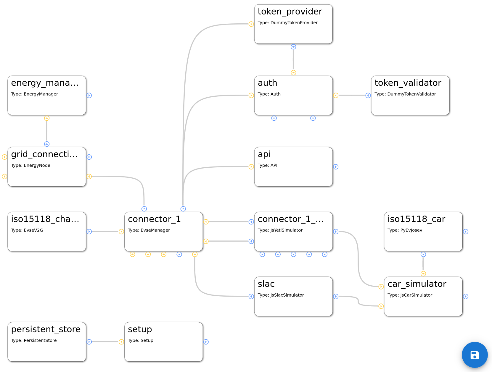

The functional mechanisms behind this will be explained later.

The real magic of EVerest will be unleashed by wiring the modules together.
Based on the connections of modules, the core modules of EVerest will provide
fancy stuff like automatic power-sharing between multiple EvseManagers or the
correct representation of the charging environment inside the backend instances
via OCPP.

To understand connections for different use cases and how to map hardware
scenarios to EVerest configurations, let's have a look at some simple
connection scenarios and step by step walk on to some more complex ones.

If you want to have a very quick overview without the details, see
:ref:`Quick Overview <existing_modules_quick_overview>` on this page.

More detailed scenarios and special relations between modules are shown
afterwards.

But first, let's have one look at the Admin Panel and how you can build your
own configuration.

Module configuration with the Admin Panel
=========================================

Having started MQTT, the EVerest manager process and Node-RED as shown in the
:ref:`dedicated Quick Start Guide sections <quickstartguide_helpers>`, you can
access the Admin Panel on your machine with the following URL::

    http://localhost:8849/

Right in the beginning, the Admin Panel will just show a blank page.

As soon as we will start working with module configurations, you will see
something like the following picture, in which each box represents a module in
EVerest:

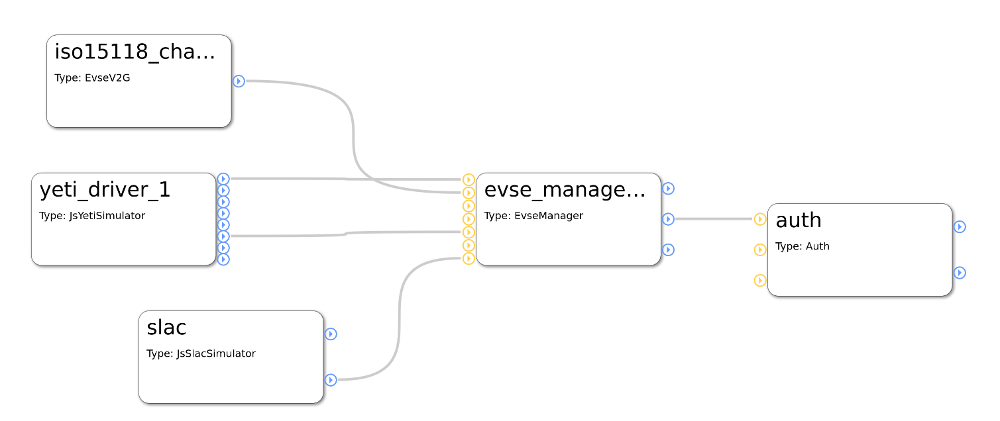

You can see five modules with their connections.

The Admin Panel helps you with all needed steps to setup your dedicated
configuration scenario:

* Setup all modules that you need for a use case,
* connect those modules,
* set the configuration of the modules
* analyze which implementations the modules require or provide.

Add modules to the configuration
--------------------------------

Click on the menu symbol at the upper left corner to open the main menu and
click on `Config`. A new left side-menu will appear.

There, you can see three menu items. Choose `Available modules` to access the
list of existing modules. After left-clicking on the plus sign right to the
module name, it will be shown in the main canvas.

.. hint::
    Click on the name to get a short description of the module.

This way, you can add all modules that you will need.

To start with an existing configuration, that you can then adjust to your
needs, click on the `Available configs` menu item in the left side-menu and
choose an existing configuration.

.. warning::
    Be aware that by loading an existing configuration, all your
    modules or changes will be discarded. So, be sure to save your
    setup by clicking on the `save` symbol in the lower right corner of the
    canvas.

Next, let's see how modules can be connected to each other.

Module connections and module parameters
----------------------------------------

Each module has blue and/or yellow circles.

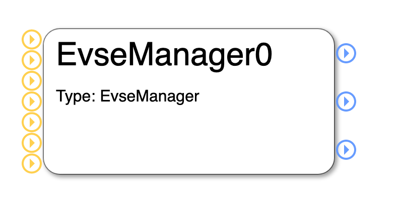

They represent the interface implementations that the modules require (yellow)
from respectively provide (blue) for other modules.

If you click on one of those circles, you will get more information about the
exact interface implementation that is provided or required:

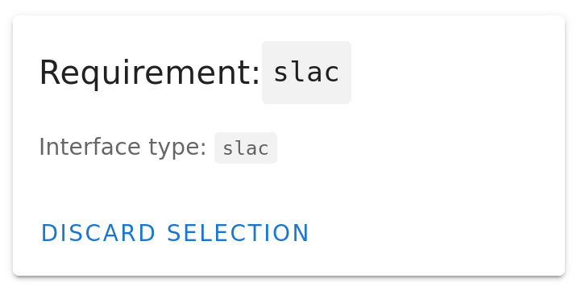

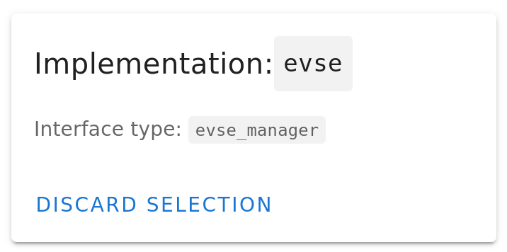

The first picture shows the information that you get after clicking on the
EvseManager's lower yellow circle. You see that the EvseManager requires an
implementation of SLAC which is described in the interface called `slac` in
EVerest.

The second picture is the information you get after clicking on the middle
blue circle of the EvseManager module. It tells that the EvseManager module
provides an implementation of the interface `evse_manager`.

To close the information box again, click on `Discard Selection`.

The other blue circles of EvseManager will tell you that it also provides
implementations of the interfaces `energy` and `auth_token_provider` - which
could be a little bit surprising, but we will learn about that in later
sections when talking about the configurable use cases in EVerest.

A module has also parameters that determine the behaviour of the module in
a dedicated environment. You can see the parameters of a module by clicking
on the module's title. In a right side-bar, all config parameters will be
listed:

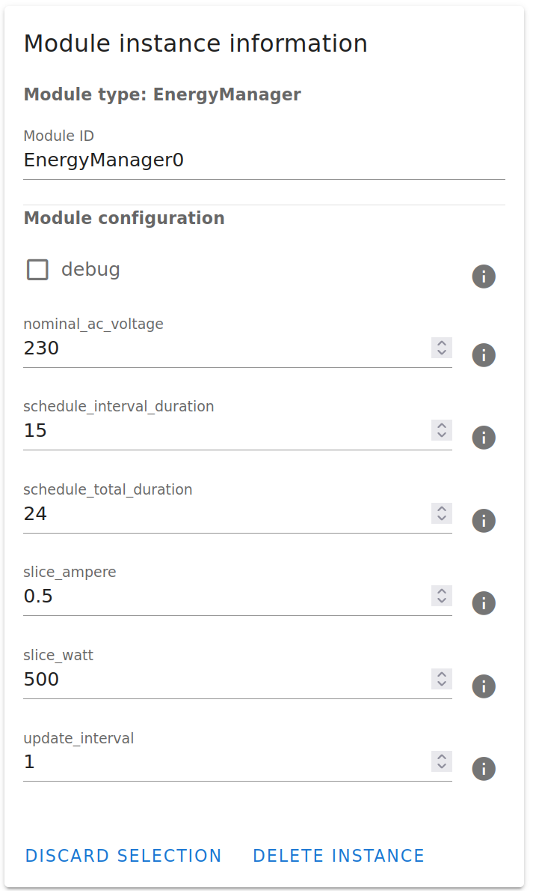

For getting some information on the meaning of those parameters, click on the
i-symbol to the right of each parameter.

Now, it is time to connect one module to another one.

Assuming, you have the EvseManager and a GenericPowermeter added to your
canvas, click on the blue circle at the right of the GenericPowermeter (it
provides a powermeter implementation) and after that click on the middle
yellow circle to the left of the EvseManager (which represents the requirement
for a powermeter implementation).

You have created a connection between those two modules, which is indicated by
a grey line between the modules:

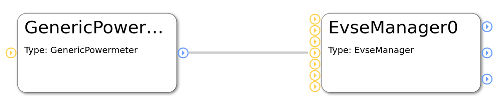

In a next step, let's look at an example module configuration.

.. _existing_modules_quick_overview:

Very quick overview
===================

Start analyzing the following picture at module `evse_manager`.

To the right, you will see two **protocol implementations** for ISO 15118 and
SLAC. (This picture will be updated soon as the JsRiseV2G module is
deprecated.)

At the bottom of the EvseManager, the `yeti_driver` module is the
implementation of the **board support** but also provides an implementation of
a **powermeter**.

The connection from the Yeti driver to the 'car_simulator' module is only
needed in **simulation scenarios** and will not be used in production
scenarios.

The EvseManager has a connection to the **authentication** functionality on
top of it. A `token_provider` (e.g. a driver for an RFID device), a
`token_validator` (checking if tokens are valid) and an `auth` module decide
if energy is allowed to be delivered via one of the connected EvseManagers.

The connection from EvseManager to the left is the **source of power** that is
needed for the charging process to work - eventually with **energy management**
logic.

All this will now be explained in much more detail including the modules in
the picture that we haven't talked about yet.

Charging station and charging points
====================================

The EvseManager module is the central module for an EV charging scenario. It
represents one charging point.

An EvseManager will need protocol implementations, hardware drivers and a grid
connection to work in a meaningful way.

See this simple part of a module network:

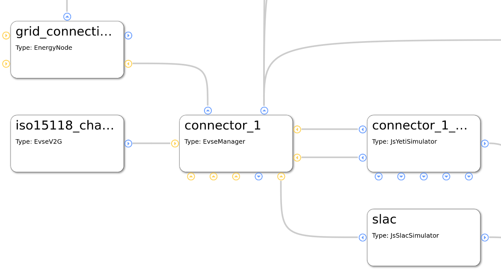

The picture above shows a part of a module configuration from the EVerest
Admin Panel. Yellow connection points show requirements for interface
implementations, blue ones show interface implementations that the module
provides. For more information on that, see the Module Concept page.

The **EvseManager** has basic charging logic implemented (IEC 61851, PWM State
Machine). It knows the status of the current charging session regarding time of
charging start, point of times to pause the session or the amount of energy
already delivered to the output.

For measuring the energy, a powermeter is necessary. The **Yeti Driver**
module in the example above is a board support implementation, but also
delivers an implementation of a powermeter. This is why you see two
connections between the EvseManager and the YetiDriver: Each connection
stands for one interface implementation that is provided from one module to
another one that requires it.

This way, you could connect another powermeter module but keep the Yeti Driver
module for board support. That makes things nicely flexible.

Another two connections go from the EvseManager to two protocol
implementations: **ISO 15118** and **SLAC**. Such connections to protocol
implementations allow the EvseManager to “talk” to other devices using that
protocol. E.g. if you connect the EvseManager via the board module to a car,
the car also needs to “know” about ISO 15118 so that communication can work.

The connection to the left is needed for the EvseManager to get power from
somewhere. In the example above, the **grid connection** module will deliver
energy. This is the part where in more complex scenarios an energy management
logic can be set up or loadbalancing between more than one EvseManagers will
take place.

Authentication for charging
===========================

For a power consumer to be allowed to take energy out of a charging point, we
will need some kind of authentication mechanism. Let's take a look at the
following part of an EVerest configuration:

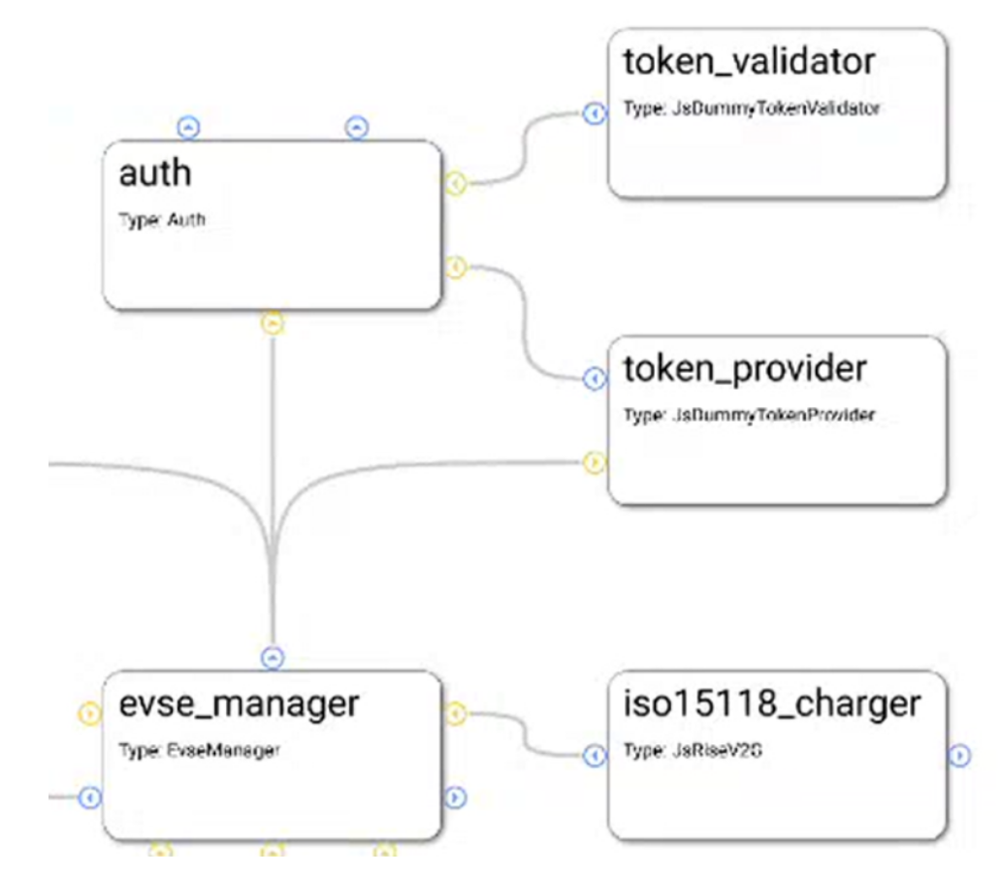

We already know the module in the lower left corner of the picture. You can
see the auth module, which obviously plays a big role for authentication. This
module provides an implementation for managing authentication but also
reservation of charging points.

Easily put, the auth module takes an authentication token, gives the token to
some instances which can validate tokens and as soon as a validation arrives,
the auth module chooses an EvseManager to be activated for charging.

This has now already explained the roles of the token provider and validator
modules. A token provider could be a driver implementation of an RFID device
which delivers an identification number. The token validator checks if it can
identify a token as an allowed consumer for energy.

The auth module can have multiple token validators which will be called one
after the other. If one of them can validate the token, power can flow.

Car simulation
==============

One big strength of EVerest is the integrated possibility to allow for
simulating real world scenarios with a charging car connected to an EVSE.

Simply connect a `car_simulator` module to the board support module of an
EvseManager like shown here:

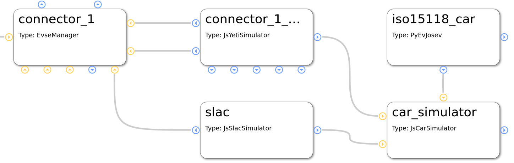

The modules in the left part of this picture have been described earlier.
The car_simulator takes the role of a car to enable proper communication
between car and EVSE.

In fact, this simulates the voltages and the PWM duty cycle. (Hint: If you
start a Node-RED simulation with EVerest, the car simulator module is the
instance that controls the simulation regarding charging power and charging
status).

See the `iso15118_car` module connected to the car simulator module. This
enables ISO 15118 compliant communication for the car simulator. If we
assume that the EvseManager also has a connection to a ISO 15118 protocol
implementation (as seen in configuration before), this should work out well.

One interesting detail is the connection of the SLAC module not only to the
EvseManager but also to the car simulation module. This is due to the fact
that SLAC sets up the physical communication between the EVSE and car
(simulation).

Energy management
=================

One simple scenario for energy management can be realized by connecting two
EvseManagers with a grid connection module:

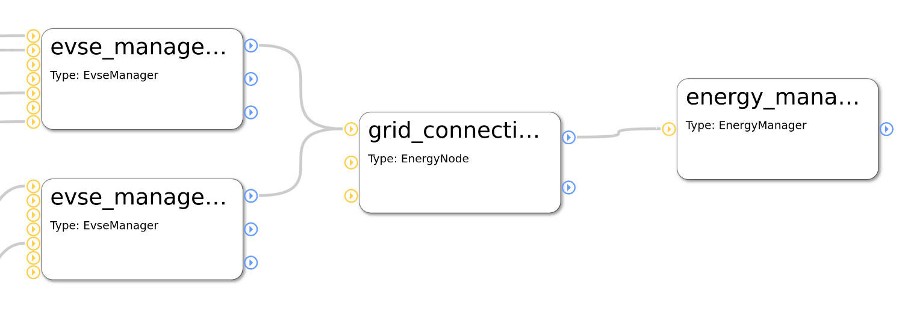

In this case, as long as no other energy management logic is provided (e.g.
via OCPP or other energy management implementations), there will be automatic
power sharing between the two EvseManagers.

More sophisticated energy management which is done for more than only one
physical charging device will be possible soon as we are implementing a
solution for remote communication between multiple EVerest instances.

DC charging
===========

A short hint for realizing DC charging:

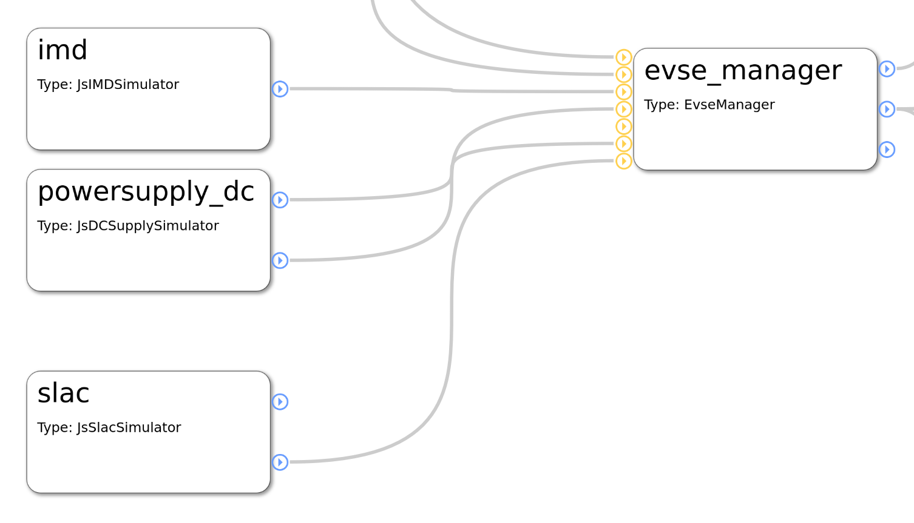

A more detailed use case will follow.

******************************
Module functionality in detail
******************************

`TODO: This section is yet to be created. Existing module documentation listed
here are eventually to be updated.`

.. toctree::
    :maxdepth: 1
    :glob:

    /_included/modules_doc/*
    /_included/modules_doc/*/index.rst
