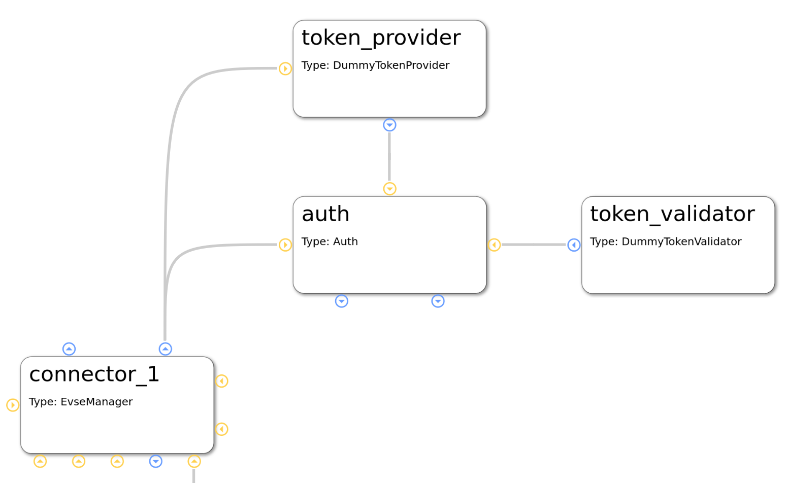

###############
EVerest Modules
###############

In the following, we will dive into some exemplatory scenarios to show how
modules can interact with each other.

Additionally, also a place for explaining module features in more detail will
grow here.

******************************************
Module connections for dedicated use cases
******************************************

EVerest is a modular framework.

For devices like powermeters or hardware boards, you will have implementations
as a driver module. Energy management logic, authentication or protocol
implementations - everything is delivered (or can be implemented by you) via
a module.

The real magic of EVerest will be unleashed by wiring those modules together.
Based on the connections of modules, the core modules of EVerest will provide
fancy stuff like automatic power-sharing between multiple EvseManagers or the
correct representation of the charging environment inside the backend instances
via OCPP.

To understand connections for different use cases and how to map hardware
scenarios to EVerest configurations, let's have a look at some simple
connection scenarios and step by step walk on to some more complex ones.

If you want to have a very quick overview without the details, see the
upcoming section. We will go more into detail in the other sections.

Quick overview
==============

.. image:: img/module-config-overview.png

Start analyzing this picture at module `evse_manager`.

To the right, you will see two **protocol implementations** for ISO 15118 and
SLAC. (This picture will be updated soon as the JsRiseV2G module is
deprecated.)

At the bottom of the EvseManager, the `yeti_driver` module is the
implementation of the **board support** but also provides an implementation of
a **powermeter**.

The connection from the Yeti driver to the 'car_simulator' module is only
needed in **simulation scenarios** and will not be used in production
scenarios.

The EvseManager has a connection to the **authentication** functionality on
top of it. A `token_provider` (e.g. a driver for an RFID device), a
`token_validator` (checking if tokens are valid) and an `auth` module decide
if energy is allowed to be delivered via one of the connected EvseManagers.

The connection from EvseManager to the left is the **source of power** that is
needed for the charging process to work - eventually with **energy management**
logic.

All this will now be explained in much more detail including the modules in
the picture that we haven't talked about yet.

Charging station and charging points
====================================

The EvseManager module is the central module for an EV charging scenario. It
represents one charging point.

An EvseManager will need protocol implementations, hardware drivers and a grid
connection to work in a meaningful way.

See this simple part of a module network:

`TODO: Clean deprecated ISO15118-Rise-Module! Make pictures in EVerest CI.`

The picture above shows a part of a module configuration from the EVerest
Admin Panel. Yellow connection points show requirements for interface
implementations, blue ones show interface implementations that the module
provides. For more information on that, see the Module Concept page.

The EvseManager has basic charging logic implemented (IEC 61851, PWM State
Machine). It knows the status of the current charging session regarding time of
charging start, point of times to pause the session or the amount of energy
already delivered to the output.

For measuring the energy, a powermeter is necessary. The Yeti Driver module in
the example above is a board support implementation, but also delivers an
implementation of a powermeter. This is why you see two connections between the
EvseManager and the YetiDriver: Each connection stands for one interface
implementation that is provided from one module to another one that requires
it.

This way, you could connect another powermeter module but keep the Yeti Driver
module for board support. That makes things nicely flexible.

Another two connections go from the EvseManager to two protocol
implementations: ISO 15118 and SLAC. Such connections to protocol
implementations allow the EvseManager to “talk” to other devices using that
protocol. E.g. if you connect the EvseManager via the board module to a car,
the car also needs to “know” about ISO 15118 so that communication can work.

The connection to the left is needed for the EvseManager to get power from
somewhere. In the example above, the grid connection module will deliver
energy. This is the part where in more complex scenarios an energy management
logic can be set up or loadbalancing between more than one EvseManagers will
take place.

Authentication for charging
===========================

For a power consumer to be allowed to take energy out of a charging point, we
will need some kind of authentication mechanism. Let's take a look at the
following part of an EVerest configuration:

We already know the two modules at the bottom of the picture. You can see the
auth module, which obviously plays a big role for authentication. This module
provides an implementation for managing authentication but also reservation of
charging points.

Easily put, the auth module takes an authentication token, gives the token to
some instances which can validate tokens and as soon as a validation arrives,
the auth module chooses an EvseManager to be activated for charging.

This has now already explained the roles of the token provider and validator
modules. A token provider could be a driver implementation of an RFID device
which delivers an identification number. The token validator checks if it can
identify a token as an allowed consumer for energy.

The auth module can have multiple token validators which will be called one
after the other. If one of them can validate the token, power can flow.

Car simulation
==============

One big strength of EVerest is the integrated possibility to allow for
simulating real world scenarios with a charging car connected to an EVSE.

Simply connect a `car_simulator` module to the board support module of an
EvseManager like shown here:

The modules in the upper part of this picture have been described earlier.
The car_simulator takes the role of a car to enable proper communication
between car and EVSE.

In fact, this simulates the voltages and the PWM duty cycle. (Hint: If you
start a Node-RED simulation with EVerest, the car simulator module is the
instance that controls the simulation regarding charging power and charging
status).

As the EvseManager "talks" ISO 15118 in this example (see the connection of
the `iso15118_charger` module), it makes sense to also enable ISO 15118
for the car simulation. The `iso15118_car` module does exactly that.

One interesting detail is the connection of the SLAC module not only to the
EvseManager but also to the car simulation module. This is due to the fact
that SLAC sets up the physical communication between the EVSE and car
(simulation).

Energy management
=================

`TODO
Show energy management scenario. Show
multiple EvseManager configurations.`

******************************
Module functionality in detail
******************************

`TODO: This section is yet to be created. Existing module documentation listed
here are eventually to be updated.`

.. toctree::
    :maxdepth: 1
    :glob:

    /_included/modules_doc/*
    /_included/modules_doc/*/index.rst
