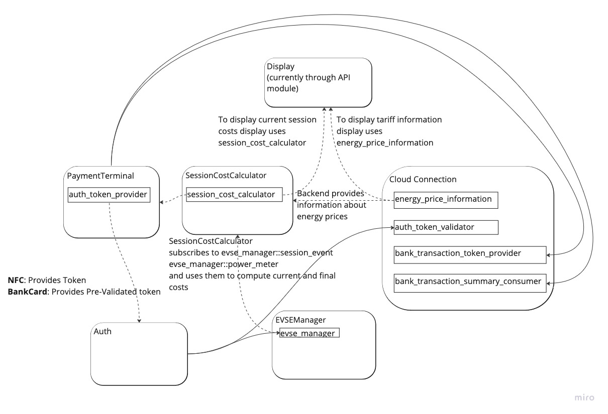
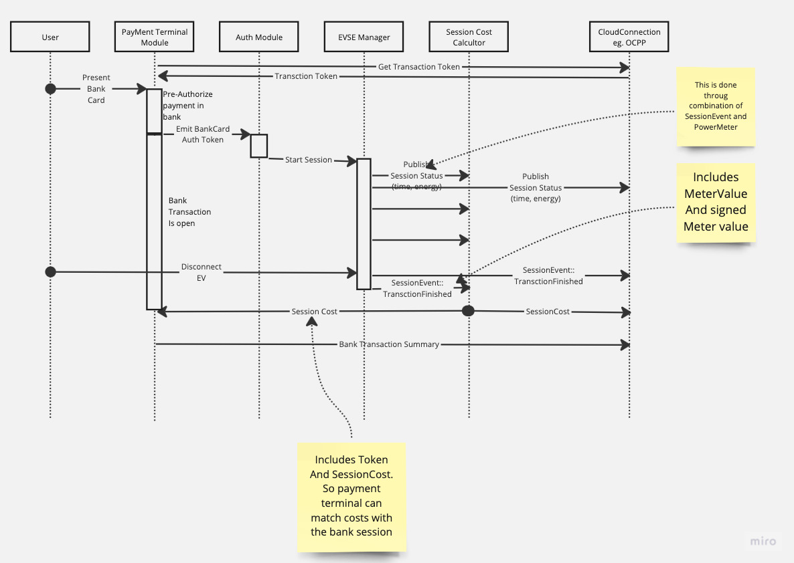

.. bank_transaction:

.. _bank_transaction_main:

#################
Bank Card Payment
#################

**********
Objectives
**********

Provide types and interfaces for payment terminals

Supported use cases
===================

Normal flow
-----------

- Payment made with credit card.
- Normal (few hours) charging session happens.
- Once session is finished, the payment terminal commits bank transaction
- Backend communication module receives the information about the bank
  transaction and sends it to the backend

Interrupted charging
--------------------

.. note::

  This is not yet represented in the interfaces.

- Customer pays with the card
- The charging never starts
- After timeout, bank transaction is cancelled (maybe it should be communicated
  to the backend as well?)

Too expensive session
---------------------

Depending on the bank/terminal, there could be a limit on maximum transaction
amount. (E.g. if the flow is: reserve some amount, once transaction finished,
do a partial return).

- Customer pays with a card
- Customer charges a lot of electricity over some reasonably long time
- Once current session costs are at the limit, session is stopped
- Transaction is committed to bank

This has no representation on the interface level. It should be implemented as
a module. Module subscribes to the session cost, and once it reaches the limit,
it tells the EvseManager to stop the session. The session is finished and
committed as usual after that.

Too long session
----------------

Depending on the bank, the reservation shouldn't be held for more than a few
days. And similar to the previous case, the session should be interrupted if
transaction time is at the maximum limit.

Solution
========

Introduce new interfaces
------------------------

- ``session_cost_calculator``: This interface publishes a variable with the
  session cost for the corresponding EVSE manager. The module that implements
  the interface is supposed to subscribe to the EVSE manager to get the
  consumed electricity and time. Depending on the system, the tariff source
  might be stored locally or loaded from the energy_price_information.yaml,
  or from another interface. This is not covered in this proposal.
- ``bank_session_token_provider``: This interface allows to generate or
  requests from the backend a token to be used in a bank transaction (as
  sort of “Verwendungszweck”).
- ``bank_transaction_summary``: This interface is supposed to be implemented
  by the payment terminal module. It provides accounting information.

How does it work
----------------
Modules are connected as shown in the diagram below.

Typical communication will look like:

Payment terminal module implements ``auth_token_provider`` interface.
If user pays with a bank card, then payment terminal pre-authorizes
transaction in the bank (potentially reserves money).

And if pre-authorization was successful, payment terminal generates
the AuthToken and publishes it. To distinguish from other tokens, a
new ``AuthorizationType::BankCard`` is used.

The token is processed by Auth module as usually. This includes passing to
validators. Validators typically always approve the token. 

A module that implements ``session_cost_calculator`` publishes the session
cost. And the payment terminal subscribes to it. Once the session is
finished (can be detected by status filed in the session cost), payment
terminal commits it.

Payment terminal stores all the issued bank-card tokens to match bank
transactions with charging sessions.

Payment terminal can issue a pre-validated token and then start the session
without validators involved. This should be sufficient for most cases.
But if the system requires to limit usage of certain cards or outlets,
validators can be used for that.
