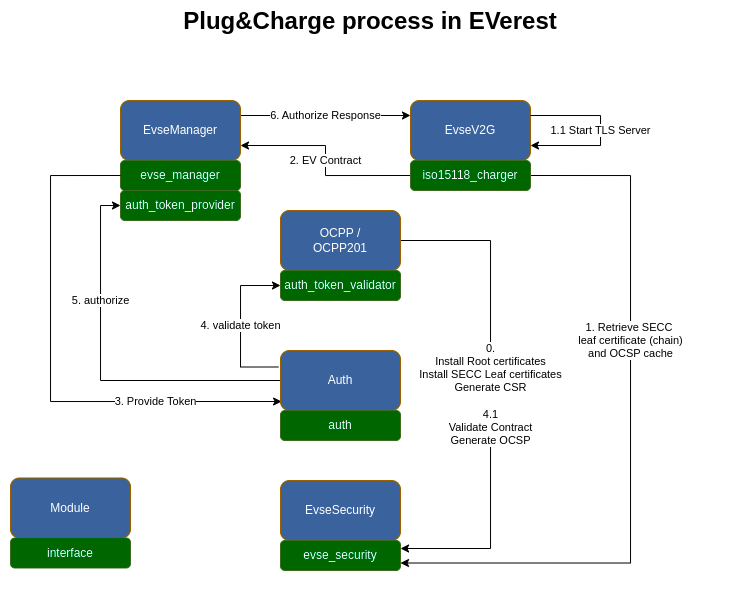

.. configure_plug_and_charge_main:

.. _configure_plug_and_charge_main:

#####################
Configure Plug&Charge
#####################

This is a guide for how to configure EVerest to enable its Plug&Charge functionalities. 
For a tutorial on how to do Plug&Charge in the EVerest SIL, please refer to :ref:`How To: Plug&Charge with EVerest Software in the loop <how_to_pnc>`.

*************************
Plug&Charge Authorization
*************************

There are a lot of resources available on Plug&Charge and ISO15118 PKI involved in this process,
so this guide is not going to repeat how Plug&Charge actually works.

It rather explains what EVerest provides with respect to Plug&Charge and how EVerest needs to 
be configured in order to suit your Plug&Charge use case.

************************************
The Authorization process in EVerest
************************************

In essence, the Plug&Charge Authorization runs like any other authorization in EVerest,
like local RFID authorization or remote authorization.  Have a look at how the authorization
process in EVerest in designed within the `Documentation of the Auth module <https://everest.github.io/nightly/_included/modules_doc/EvseSecurity.html#everest-modules-handwritten-auth>`_.

************************
Involved EVerest modules
************************

The E2E Plug&Charge process involves communication from the EV to systems in the cloud. The
main protocols involved are ISO15118 and OCPP. In EVerest, several modules and interfaces 
are involved in the Plug&Charge process. Here is an overview of how everything comes together
in EVerest:

.. note::
    
    This visualization only presents the interfaces and connections between them that are
    relevant for Plug&Charge.

Let's have a look step by step:

Step 0
======

Before a Plug&Charge session can start, the following certificates and keys should be installed on 
the charger:

* V2G Root certificate
* SECC Leaf certificate
* SECC Leaf private key
* MO Root certificate (optional)

These certificates and keys can be installed during provisioning of the charger, or they can be 
installed using OCPP1.6 or OCPP2.x. The paths to store these files can be configured in the 
EvseSecurity module. Please see `Documentation of the EvseSecurity <https://github.com/EVerest/everest-core/blob/main/modules/EvseSecurity/doc.rst>`_
for further information on how to do the configuration for this module.

In the visualization, step (0) shows the process that represents the previously described process of
provisioning the charger with the correct certificates, before there is a physical
connection to the EV. The OCPP/OCPP201 and EvseV2G module require a module that implements
the `evse_security interface <https://everest.github.io/nightly/_generated/interfaces/evse_security.html>`_,
in order to execute the following commands:

* install_ca_certificate (Used by OCPP to install root certificates. This process is initiated by the OCPP CSMS)
* update_leaf_certificate (Used to install or update SECC leaf certificates)
* generate_certificate_signing_request (Used to generate a CSR that is used in the SignCertificate.req of OCPP)
* verify_certificate (Used by EvseV2G to verify the contract certificate and by OCPP to verify new leaf certificates)
* get_mo_ocsp_request_data (Used by EvseV2G and OCPP to get the OCSP request data of the contract certificate (chain))

There are more commands provided by the `evse_security interface <https://everest.github.io/nightly/_generated/interfaces/evse_security.html>`_,
which are not included in the Plug&Charge process.

For a successful Plug&Charge authorization process, the following certificates need to be installed on the charger:

* SECC leaf certificate (including sub cas)
* V2G Root Certificate(s)
* MO Root Certificates(s) (only if the EV contract shall be verified locally).
  This can be controlled by the OCPP configuration keys described in the section
  :ref:`ocpp-configuration` for more information.

As mentioned above, these certificates can be installed manually or by the CSMS. In case Plug&Charge is enabled 
and no (valid) SECC leaf certificate is installed or it expires within the next 30 days, the charging station
will attempt to retrieve a SECC leaf certificate from the CSMS automatically. This process can also be triggered
manually by the CSMS by using a *TriggerMessage(SignCertificate).req* message.

Step 1
======

This step is triggered by a physical connection between the EV and the charger. A TLS connection is required 
between the EV and the charger to allow Plug&Charge, so the EvseV2G module retrieves the SECC leaf certificate 
chain and private key from via the evse_security.yaml interface and sets up a TLS server, to which the EV
can connect as a TLS client.

Step 2
======

When charger and EV have agreed on Contract being the selected payment option, we have something going on
that we can call a Plug&Charge process. The EV sends its contract certificate chain and requests authorization
from the charger. The EvseV2G module generates a
`ProvidedIdToken <https://everest.github.io/nightly/_generated/types/authorization.html#authorization-providedidtoken>`_,
which is the EVerest type that contains data about the authorization request, including the contract
certificate and OCSP request data. 

The *ProvidedIdToken* is transmitted via the *evse_manager* interface to the EvseManager module.

Step 3
======

The EvseManager module implements the *token_provider* interface and can therefore publish the 
`ProvidedIdToken <https://everest.github.io/nightly/_generated/types/authorization.html#authorization-providedidtoken>`_
containing the contract certificate and OCSP data within EVerest to the central authorization module
in EVerest: Auth.

Step 4
======

The Auth module sends commands containing the *ProvidedIdToken* to its registered
`token_validator(s) <https://everest.github.io/nightly/_generated/interfaces/auth_token_validator.html>`_,
which are OCPP/OCPP201 in the case of Plug&Charge. The OCPP module(s) validate the token based on the requirements
specified in the OCPP protocol (either validating locally or by the CSMS).

Step 5
======

In case the validation was successful, the Auth module notifies the EvseManager using the authorize command,
that authorization is present and the charging session can be started.

Step 6
======

The EvseManager forwards the authorization response to the EvseV2G module, which can then send the 
awaited ISO15118 response to the EV.

.. note::
    
    We have taken some shortcuts and ignored some further communication going on during the full process,
    but these steps cover what's important for Plug&Charge in EVerest.

*********************
EVerest configuration
*********************

Now that we know everything comes together for Plug&Charge in EVerest, we can have a look at how this is 
actually configured.

The following two configuration files are relevant and require a correct setup and activation for Plug&Charge:

* EVerest configuration file (yaml)
* OCPP configuration file (json) for OCPP 1.6 or OCPP 2.x

Let's start with the EVerest configuration file. If you haven't read
`Explaining the YAML files <https://everest.github.io/nightly/general/04_detail_module_concept.html#explaining-the-yaml-files>`_,
now it's the right time to do it before you go on!

It's a good idea to start with a base of a configuration file and talk about the changes required to enable
Plug&Charge. The base config we use is the "config-sil-ocpp201.yaml", which already contains the configuration
for OCPP2.x.

We need to take a closer look at the configuration of the EvseManager, EvseV2G, Auth and EvseSecurity.

EvseManager
===========

* In case of AC, make sure that `ac_hlc_enabled` is set to `true` in order to allow ISO15118 communication
* Make sure `payment_enable_contract` is set to `true`

EvseV2G
=======

* Make sure `tls_security` is set to `allow` or `force`.
* If `verify_contract_cert_chain` is `true` the EvseV2G module attempts to verify the contract certificate chain
locally. It is recommended to set this to `false`, because this validation is also executed and handled in OCPP.

Auth
====

* Make sure the EvseManager module is listed as a connection of `token_provider`. This is important, because only
in this case the ProvidedIdToken including the contract certificate is actually received by the Auth module.
* Make sure the OCPP module is configured as the single `token_validator`.

EvseSecurity
============

Please refer to `Documentation of the EvseSecurity module <https://github.com/EVerest/everest-core/blob/main/modules/EvseSecurity/doc.rst>`_ 
for information on the ISO15118 configuration. 

.. _ocpp-configuration:

*************************************
OCPP 1.6 and OCPP 2.x configuration
*************************************

Since Plug&Charge has been backported from OCPP 2.x to OCPP 1.6, the
configuration options to control the process are mostly identical.
These options are described in the following section, where differences
between OCPP 1.6 and OCPP 2.x are marked.

These OCPP configuration options are relevant for the Plug&Charge process:

* ISO15118CertificateManagementEnabled (bool): Global feature flag to enable
  certificate management using ISO15118. This enables the ISO15118 message handling
  via the DataTransfer mechanism according the the OCPP1.6 Plug&Charge Whitepaper.
  (only required for OCPP1.6, OCPP2.x does not require this option).
* ISO15118PnCEnabled (bool): Global feature flag to enable authorization using 
  contract certificates.
* CentralContractValidationAllowed (bool): If enabled and charging station can
  not validate the contract locally (e.g. because no MO root certificate is
  installed), the charging station provides the contract certificate as part
  of the Authorize.req so that the CSMS can verfiy the contract instead.
* ContractValidationOffline (bool): If enabled, the charging station will try
  to validate a contract certificate when it is offline using the authorization
  cache or the local authorization list. If this is set to `false`, Plug&Charge
  will fail if the charging station is offline.
* ISO15118Ctrlr::V2GCertificateInstallationEnabled (bool, only OCPP2.x):
  Allows the CSMS to install an SECC leaf certificate on the charging station.
  This must be enabled in case the charging station shall receive the SECC leaf
  certificate from the CSMS. 
* ISO15118Ctrlr::ContractCertificateInstallationEnabled (bool, only OCPP2.x):
  Allows contract certificate installation installtion/update in the EV
  via ISO15118.

The following configuration options control parameters of the certificate
signing request that is initiated by the charging station automatically in case
Plug&Charge is enabled and no (valid) SECC Leaf Certificate is currently installed.

* SeccLeafSubjectCommonName (string, ISO15118Ctrlr::SeccId in OCPP 2.x)
* SeccLeafSubjectCountry (string, ISO15118Ctrlr::CountryName in OCPP 2.x)
* SeccLeafSubjectOrganization (string, ISO15118Ctrlr::OrganizationName in OCPP 2.x)

These configuration keys can be configured manually or controlled by the CSMS according to its needs. If the CSMS rejects the CSR
from the charging station or does not return a certificate after the specified timeouts and retries, it is likely that the values
of these configuration keys do not match the expectations of the CSMS. Contact your CSMS partner in this case.

