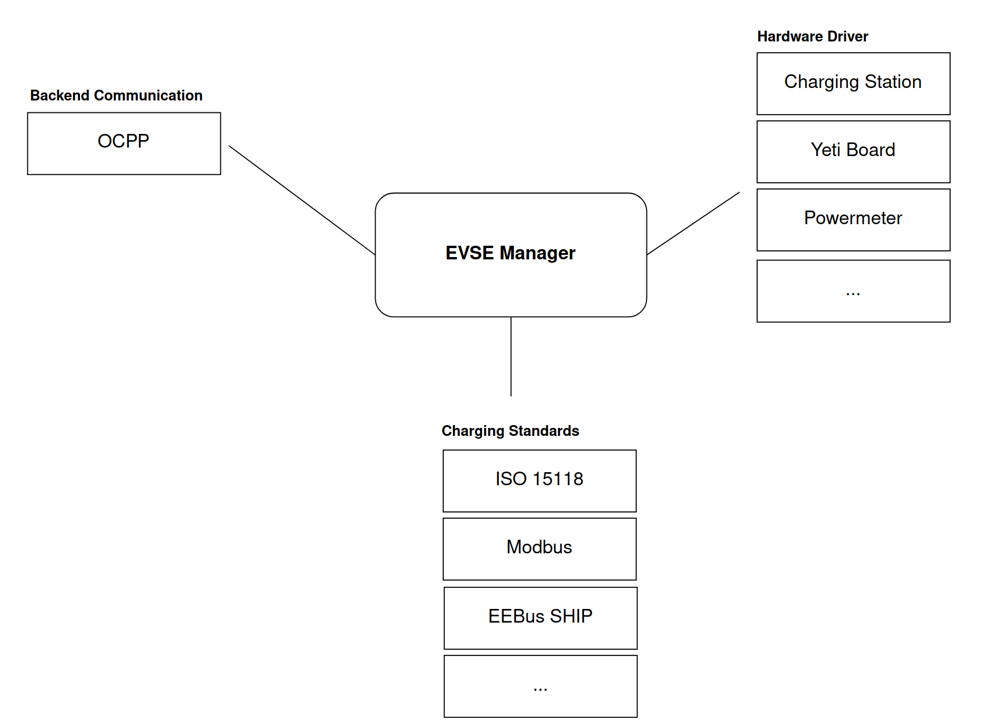
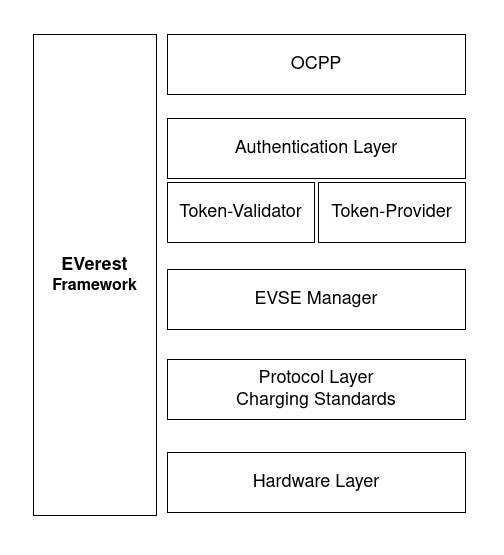
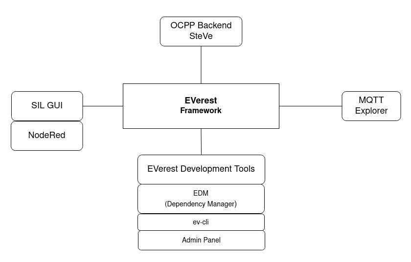

.. quick_start:

################################################
A Real Quick Guide To EVerest
################################################

****************************
EVerest - Framework Overview
****************************
EVerest is a modular framework for setting up a full stack environment for EV charging.

You can think of it as an operating system for EV chargers with implementations of communication protocols, software modules for representations of hardware devices (chargers, cars, …) and tools for simulating the charging process.

Some very high level overviews of the framework can be seen here:

The EVerest framework helps with building your dedicated development scenario with all needed modules for your specific developer's use case.

Modules in EVerest can be everything like hardware drivers, protocols, authentication logic and more. Build up your development scenario as needed and enhance it by adding your own additional modules.

Another way to look at EVerest is the layer architecture:

Depending on your project use case, you can define the suitable module stack and set module connections and module parameters.

Additionally, you have some tools and helpers that work with the framework which makes your EVerest developer's life easier:

Lets have a short look at those tools right away:

- **Admin Panel**: See all modules connections and dependencies including the parameters set for the modules.
- **EVerest Dependency Manager** (edm): A tool that helps you getting all needed repositories from Git for your specific setup.
- **ev-cli**: Generates module and interface scaffolds based on templates. This way you can start implementing new modules very fast.
- **MQTT Explorer**: Great for debugging the messages sent between your modules during development phase.
- **NodeRed** for simulating your EVerest setup
- **SteVe**: Just in case you want to test your EVerest instance with some OCPP backend functionality: SteVe is an external tool that lets you do exactly that.

How to setup and use those tools will be shown later.

*************
Prerequisites
*************

To get EVerest running and develop new modules, you will need some things prepared:

Hardware
========
It is recommended to have at least 4GB of RAM available to build EVerest. More CPU cores will optionally boost the build process, while requiring more RAM accordingly.

Operating System
================
EVerest has been tested with Ubuntu, OpenSUSE and Fedora 36. In general, it can be expected to run on Linux-based systems.

Needed Packages
===============
Needed packages to get EVerest properly running:

- Python (greater than 3.6)
- Jinja2
- PyYAML

See the section about prerequisites here: `Prerequisites for EVerest <https://github.com/EVerest/everest-core#prerequisites>`_ to get all needed packages setup for your dedicated system.

After having finished the Prerequisites paragraph, join here again as we will continue for setting up all needed EVerest Git repositories.

********************
Download And Install
********************

Get The Needed EVerest Repositories
===================================

EVerest Dependency Manager - edm
--------------------------------

As EVerest is highly modular, you will need multiple repos, which can be found on GitHub.

To get the right repos as needed, the EVerest Dependency Manager - short edm - will help you.

To start with that, let's get edm ready to work.

You will first of all need to pull *everest-dev-environment* to your development environment.

Python and its tools pip, setuptools and wheel have already been installed in the Prerequisites section above. So, you can pull the said repository and install the dependency manager, which will reside inside of .local/bin/ in your HOME directory:

.. code-block:: bash

  git clone git@github.com:EVerest/everest-dev-environment.git
  cd everest-dev-environment/dependency_manager
  python3 -m pip install .
  edm --config ../everest-complete.yaml --workspace ~/checkout/everest-workspace

(In future, as your system has edm properly setup, you can always initialise a new workspace by calling *edm init*.)

edm will now prepare the most common repos to start with. It will also create a YAML file which describes your newly created workspace. You can change that YAML file later if you want to adopt the workspace to another scenario.

The YAML file can be found in the directory which you have chosen as workspace directory. In the above example, it is located at ~/checkout/everest-workspace.

EVerest Command Line Interface: ev-cli
--------------------------------------

In its current version, ev-cli supports you by generating module templates. It is also necessary to build EVerest.

To install ev-cli, change into the everest-utils/ev-dev-tools/ directory and install ev-cli:

.. code-block:: bash

  python3 -m pip install .

That is all to install ev-cli. You can find the binary file of ev-cli in your HOME directory in .local/bin/

In a later step, we will use ev-cli to create module stubs.

Build EVerest
=============

Now it is time to build EVerest:

.. code-block:: bash

  cd ~/checkout/everest-workspace/everest-core
  mkdir build
  cd build
  cmake ..
  make install

edm helped you to keep it that simple. Let's now dive into simulating our current workspace.

If you get an error during the build process stating that ev-cli is installed in an old version, go to your everest-workspace directory and call *edm --git-pull*. This will update the EVerest repositories. After that, repeat building ev-cli and you should be good to go again.

******************
Simulating EVerest
******************

Software in a loop
==================

You will have to setup and run an MQTT Broker first. Please check this documentation here to set it up with the help of a docker container: `How to simulate EVerest <https://everest.github.io/tutorials/run_sil/index.html#how-to-simulate-everest-in-software>`_

After having done that, change to the directory /everest-core/build/, which has been created during EVerest install.

We will startup EVerest now with a software-in-a-loop (SIL) config.

Start the software-in-a-loop simulation via script:

.. code-block:: bash

  ./run-scripts/run-sil.sh

In a new terminal window, run the NodeRed script:

.. code-block:: bash

  ./run-scripts/nodered-sil.sh

This will let us control the simulation with the help of NodeRed.

You can analyse the output of the two scripts in the terminal windows to get a little bit of insights about what is going on and which ports are used etc.

If everything worked well, you will be able to reach a charging web GUI at *localhost:1880/ui*.

With that GUI, you can simulate charging states of a charging process in an electric vehicle.

You can play around with that a little bit to see some output in your two terminal windows. Try to get a first idea!

Admin Panel
===========

The Admin Panel gives you a nice overview of the modules and the connections between them.

As it resides in an own repository, which is not delivered automatically by edm in default, you will have to get the repo manually here: `EVerest Admin Panel <https://github.com/EVerest/everest-admin-panel>`_

You will have to install and run it via npm. After that, you can reach the Admin Panel locally via your standard web port 80.

A detailed walk-through to assist you with that is in preparation.

***************
Module Overview
***************

What parts does a module in EVerest consist of?

- Interface definition
- Types definition
- Module implementation

Let's have a quick look to those parts in the following sections.

.. important:: 

  This documentation has been written during a work in progress which would change interface and types definitions from JSON to YAML. This will be reflected in short here.

Interfaces
==========

An interface generally describes a specific object in the EVerest world. Those objects can be device types, protocol standards, authentication instances and so on.

Everything that you will want to integrate into EVerest as a module will need to have an interface definition.

A short view on an interface describing a powermeter:

.. code-block:: json

  {
    "description": "This interface defines a generic powermeter for 5 wire TN networks.",
    "cmds": {
        "get_signed_meter_value": {
            "description": "Returns a signed meter value with the given auth token",
            "arguments": {
                "auth_token": {
                    "description": "Auth token",
                    "type": "string",
                    "minLength": 1,
                    "maxLength": 20
                }
            },
            "result": {
                "description": "Signed meter value",
                "type": "string"
            }
        }
    },
    "vars": {
        "powermeter": {
            "description": "Measured dataset",
            "type": "object",
            "$ref": "/powermeter#/Powermeter"
        }
    }
  }

The description simply tells you in short, which type of object the interface describes.

Interfaces have commands (cmds) which can be called on the implementing modules based on that interface.

Besides that, the vars can by consumed by other modules in an asynchronous way.

Both cmds and vars can be defined as simple data types (string, bool etc) or as object type - in case you want to have a more sophisticated structure than a simple type.

Those object types have to be defined. In EVerest, we do this as a Type Definition.

Types
=====

A short view on how the powermeter type could look like:

.. code-block:: json

  {
    "description": "Powermeter types",
    "types": {
        "Powermeter": {
            "description": "Measured dataset",
            "type": "object",
            "additionalProperties": false,
            "required": [
                "timestamp",
                "energy_Wh_import"
            ],
            "properties": {
                "timestamp": {
                    "description": "Timestamp of measurement",
                    "type": "number"
                },
                "meter_id": {
                    "description": "A (user defined) meter if (e.g. id printed on the case)",
                    "type": "string"
                }
            }
        }
    }
  }

This type has been used and referenced in the powermeter interface.

You can understand the interface description as the description of a general powermeter device and the powermeter type as a data object that is used by a powermeter device to exchange measurement information.

The type definition tells EVerest which properties this type has. This is the data structure of the type. The JSON key *required* defines what is needed.

With this, we have now interfaces and types set. Let's have a look at the module:

Modules
=======

Each module resides in the modules directory as a subdirectory.

In that directory are several files:

- manifest.json to give information about what the module provides (the interfaces which this module implements including the parameters needed for the interfaces) and which interface implementations are required for connections to this module
- .cpp and .hpp code files for the implementations
- CMakeList.txt file to define needed libraries for the cmake run
- Implementations of interfaces in separate code files

How the code files look like and what is needed for a quick start, we will see in the next section in which we implement a simple module.

*************************
Implementing a New Module
*************************

To create a new module in EVerest, we need to do some small steps shown in the following. No worries: We will go through them in more detail afterwards.

- Create a new subdirectory in the modules directory.
- Create a CMakeLists.txt (or borrow it from another module) with all needed libraries to build the module
- Create a manifest with information about which interface implementations are provided and which interfaces are required from connected modules.

Now, let's make ev-cli do its job of generating a module stub from a template:

.. code-block:: bash

  ev-cli mod create MyModuleName

The name of the module is the one given as directory name.

You will see that you get cpp and hpp files for your main module class and also for the interfaces to be implemented.

You main cpp file will have to special functions:

.. code-block:: c++

  void MyModuleName::init() {}
  void MyModuleName::ready() {}

When initialising, the EVerest framework will call all init() functions of all modules one after the other. After having initialised all modules in that way, the framework calls the ready() functions.

This allows you to do setup things that relate only to your current module in the init() function and all stuff requiring other modules being initialised in your ready() function.

.. attention:: 

  We will add additional documentation here soon to get you an idea about how vars can be published and how to interact with required modules from the outside. We will show callback functions and events and how all this works together in your module.

***************************
Further Sources For EVerest 
***************************

* See our videos on our `EVerest-YouTube-Channel <https://www.youtube.com/@lfe_everest>`_
* Join our conversation at the `EVerest Mailing List <https://lists.lfenergy.org/g/everest>`_. We are also there to help you out with any questions there.