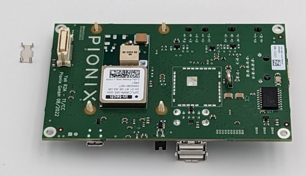

.. doc_pionix_belay-box

Pionix BelayBox
###############

Introduction
************

The BelayBox is a reference platform specifically designed for development and
testing of the open source software EVerest. More details about how EVerest is
embedded on the hardware can be found in the dedicated sections about EVerest
cross-compilation in the section "BelayBox use cases".

The BelayBox is delivered as a development kit, which has to be assembled
following the instructions in this documentation. Part of the kit is a
Raspberry Pi CM4 compute module. PIONIX is officially part of the "Powered by
Raspberry Pi" scheme:

.. image:: img/powered-by-pi.png
  :width: 300
  :alt: Logo Powered by Raspberry Pi for Charging Development Kit BelayBox
  :align: center

BelayBox can be utilized by individuals, research facilities and companies
alike to

* parallelize HW and SW developments for new charger projects,
* explore new charging algorithms without the need do all the groundwork,
* rapid integration of EV charging with other applications

and anything else you want to quickly do without building your own EVerest
compatible charger first.

The BelayBox is not meant to be used for private usage or outdoor charging.

The BelayBox hardware
=====================
The BelayBox consists mainly of the Yeti board - an AC charger for
electric vehicles (EV) supporting IEC-61851-1 and SAE J1772 - and the Yak
board, which is a high-level control board for EV charging stations supporting
ISO 15118-2 (with ISO 15118-20 on its way) and DIN SPEC70121.

As both - Yeti and Yak board - are released as Open Hardware under CERN
Open Hardware Licence Version 2 (Permissive), we are very happy to point you
to the schematics and design files and also the firmware:

* `Yeti and Yak Hardware Reference Design <https://github.com/PionixPublic/reference-hardware>`_
* `Yeti Firmware <https://github.com/PionixPublic/yeti-firmware>`_

The 3D files of the BelayBox case components can be downloaded here:
`BelayBox 3D files <https://a360.co/45erK90>`_.

For more information about vendors working with EVerest,
contact us via
the `EVerest mailing list <https://lists.lfenergy.org/g/everest>`_.

Getting support
===============

See also the `BelayBox manual <https://pionix.com/user-manual-belaybox>`_.

If you already have purchased a BelayBox kit and you have hardware related
questions, you can get support by creating an issue via our
`support page <http://support.pionix.com>`_.

.. important::

  This is only for hardware-related support. For all software-related
  questions, you can find help in the wonderful EVerest community via
  `Zulip <https://lfenergy.zulipchat.com/>`_ or the
  `EVerest mailinglist <https://lists.lfenergy.org/g/everest>`_.

If you need additional parts for your BelayBox, see the
`Pionix Online Shop <https://shop.pionix.com>`_.

Setting up Hardware and Software
********************************

The Yeti board is delivered with a firmware already flashed on it.
The Yak board does not have any software flashed on it.

In the following sections, we will show how to assemble the hardware parts and
also how to do the flashing of the Yak board. The Yocto image for the Yak
board includes binaries and services to run Basecamp - the commercial grade
version of EVerest - as a demo.

BaseCamp is a professional and stable wrapper around the open-source charging
software EVerest. For more information about the product of BaseCamp, see
`this BaseCamp page <https://www.pionix.com/products/basecamp>`_.

.. note::

  In case you need to build a custom Yeti firmware, have a look at this repo:
  `Yeti firmware GitHub repository here <https://github.com/PionixPublic/yeti-firmware>`_
  . Also see the
  :ref:`section about how to flash the Yeti board <belaybox_yeti_flash>`.

Assembling the Yak Board
========================

Starting assembling the Yak Board, you should have the following parts
available:

.. image:: img/yak-assembly-1-overview-w600.png

And you will need the following tools:

* ESD safe environment, e.g. ESD wrist band
* ESD underlay mat
* Linux host system, Ubuntu >18 recommended
* 1x Micro USB cable
* 12 V DC power supply with minimum 30 W to connect to “12 V IN” pins on
  Yak board. A lab power supply is sufficient.

Needed software:

* `Raspberry PI USB Boot <https://github.com/raspberrypi/usbboot/blob/master/Readme.md#building>`_
* bmaptool - `see here <https://docs.yoctoproject.org/dev-manual/bmaptool.html>`_
* Internet access from host system

.. warning::
  Before working with any open PCB make sure to work in an ESD safe
  environment using ESD safe equipment only.

Glue on the heatsinks as shown in the following image using the double
sided tape that comes with the heatsinks. Plug in the small clips into
the mounting holes of the CM4 board as shown.

.. image:: img/yak-assembly-2-w500.png

Turn around the CM4 and put on the gray spacers as shown here:

.. image:: img/yak-assembly-3-w500.png

Plug the CM4 board in both connectors and make sure the clips go all the way
through the Yak board and hold the CM4 securely without any gaps between the
spacers and both boards. Make sure to remove the metal part (if there is one)
out of the board-to-board connector as shown in the upper left corner in the
following image:

This is how it looks from the top side:

.. image:: img/yak-assembly-5-w600.png

Now place the small black jumper onto the "BOOT" pins as shown above. This
is needed to be able to make the emmC flash accessible to the host system.

Flashing the Yak Board
======================

In this section, we will walk you through the process of deploying the
Yocto-based image including EVerest in form of BaseCamp.

.. note::

  You will only have to do this flashing procedure once. After that, you can
  use the RAUC updates, which are hosted on PIONIX update servers.
  In case you need to reflash the whole image, we will inform you in the
  public support channels.

  If you want to create your own custom yocto image with EVerest, you can
  have a look at
  `Yeti-Yak-SDK repository <https://github.com/PionixPublic/yeti-yak-sdk>`_.

Now to the steps to flash the board:

**STEP 1: Downloading**

Download the latest stable image and the matching .bmap file:

* https://pionix-update.de/belaybox-basecamp-demo/stable/belaybox-image-raspberrypi4-20240912100805.rootfs.wic.bz2
* https://pionix-update.de/belaybox-basecamp-demo/stable/belaybox-image-raspberrypi4-20240912100805.rootfs.wic.bmap

**STEP 2: Powering up**

Power up the BelayBox or - if the Yak is used alone - apply 12 V to
the "12 IN" pins.

The red power LED on the Yak should light up constantly now.

**STEP 3: Connect Yak to host system**

Connect the Yak board via Micro-USB to the host system.

**STEP 4: Enabling CM4 storage mode**

Enable the CM4 storage mode so that the eMMC becomes available to
the host system:

.. code-block:: bash

  sudo rpiboot

The green LED on the Yak board should light up constantly now.

**STEP 5: Finding the eMMC device**

To find the eMMC device, do:

.. code-block:: bash

  lsblk

Check the output and look for a approximately 16 GB device called /dev/sdX -
where X can be any letter.

.. warning::

  Make sure to select the correct device as data loss can occure if the wrong
  device is selected!

**STEP 6: Flash the eMMC**

Make sure the .wic.bz2 file and the .bmap file are in the same directory
and flash the eMMC. In the command below, replace <image file>.bz2 with your
downloaded image file and replace "X" according to your eMMC device.

.. code-block:: bash

  sudo bmaptool copy <image file>.bz2 /dev/sdX

After roughly nine minutes the flashing should have finished.

.. caution::
  Make sure to connect the WiFi antenna to the CM4 after flashing. The image
  activates the external antenna support. Running a flashed Yak without the
  WiFi antenna mounted can result in damage of the WiFi chip.

**STEP 7: Finishing**

Disconnect the eMMC device, power off and unplug the "boot" jumper from the
Yak board.

.. image:: img/yak-assembly-9.jpg

With the raspberry CM4, it can be that the overlay filesystem sometimes does
not get mounted in the right order; so you might have to reboot twice if some
files are missing after flashing.

Assembling the Yeti Board
=========================

Here's what you should have:

.. image:: img/yeti-assembly-1-overview-w550.png

Tools needed:

* ESD safe environment, e.g. ESD wrist band
* ESD underlay mat

Clip on the touch protection cage and make sure all clips are correctly seated
as shown here:

.. image:: img/yeti-assembly-2-w500.png

Clip in the smaller part of the touch protection and make sure all clips are
correctly seated as shown here:

Clip in the bigger part of the touch protection and make sure all clips are
correctly seated as shown in the following image:

Your mission can be seen as accomplished if your Yeti looks like that:

.. image:: img/yeti-assembly-5-w500.png

Preparing the cable set
=======================

That's how we start:

The **10-position cable between Yeti and Yak** is mandatory to connect Yak to
Yeti and to power the Yak board from the Yeti power supply.

Plug in one of the crimped cables with one end into the 10-position plug. Make
sure to plug in the crimp in the exact same orientation as shown in the
picture above.

.. warning::
  Be aware that the crimps cannot be unplugged again from the 10 position
  plug. Make sure you plug in the crimps in the correct positions before
  actually plugging them in.

Plug in the other crimped end of the cable into the second plug. It is very
important to plug in the crimps in the shown “1:1” fashion. Doing otherwise
will permanently damage the Yak and/or Yeti board.

.. image:: img/cable-set-3-w500.png

Continue with plugging in all ten cables one after the other as there is less
chance of getting it wrong this way.

This is how the cable looks when assembly is done:

.. image:: img/cable-set-4-w500.png

Let's continue with the **6-position CAN + RS485 cable**.

.. image:: img/cable-set-5-w550.png

Plug in a crimped cable with one end into the 6-position plug.
Make sure to plug in the crimp in the exact same orientation as shown in the
picture above. Continue with plugging in all needed cables.

Be aware that these cables have unisolated, open ends. In case you use the
6-position cable for e.g. using the CAN bus, make sure all other not used
cables are isolated to prevent damage to the Yak board.

This is how the assembled cable looks like:

This is the pin description of the Yak board's 4-, 6- and 10-position sockets:

Final Yak-Yeti-Cable-Setup
==========================

Tools needed:

* ESD safe environment, e.g. ESD wrist band
* ESD underlay mat
* Preassembled Yak, Yeti kits and cable-set as shown in sections above

Plug in the 10-pin cable into the corresponding sockets on both ends.
Plug in the 4-pin RFID/NFC reader cable.
The assembly of Yak, Yet kit and cable set is completed.

When using the assembly in a "desk" environment, it is recommended to apply
power through the 12 V DC barrel connector shown in the upper right corner of
the Yeti board in the image above. Make sure the WiFi antenna does not touch
any other open PCB parts to prevent damage to the boards.

.. _belaybox_furtherinfo:

BelayBox Use Cases
******************

.. _belaybox_rauc:

How to install updates via RAUC bundles
=======================================

Connect via SSH into your Yak board. The credentials are:

* User: root
* Password: basecamp

Check the currently booted slot:

.. code-block:: bash

  rauc status

Remember the slot for comparison afterwards.

Execute the following:

.. code-block:: bash

  rauc install https://pionix-update.de/belaybox-basecamp-demo/stable/belaybox-bundle-raspberrypi4-20240912103122.raucb

.. _belaybox_yeti_flash:

Cross-compile toolchain
=======================

If you want to cross-compile your EVerest version, this is the toolchain to
use:

.. code-block:: bash

  https://pionix-update.de/belaybox-basecamp-demo/stable/poky-glibc-x86_64-belaybox-image-cortexa7t2hf-neon-vfpv4-raspberrypi4-toolchain-4.0.16.sh

First of all you need to install it. It is a shell script, so just do a
"chmod +x name_of_toolchain.sh" and then run it with

.. code-block:: bash

  ./name_of_toolchain.sh

You will be asked where to install it. You can e.g. install it in your home
directory - somewhere like /home/myuser/toolchain-belaybox

Then you need to source the environment variables (it tells you how to do it
at the end of the installation).

Once they are sourced, this terminal will cross compile.

In everest-core, create a folder called "build-cross". Change into it.

There, run cmake as follows:

.. code-block:: bash

  cmake .. -GNinja -DCMAKE_INSTALL_PREFIX=/var/everest -DEVEREST_ENABLE_PY_SUPPORT=OFF -DEVEREST_ENABLE_JS_SUPPORT=OFF -Deverest-core_USE_PYTHON_VENV=OFF

In this case, the PY/JS support flags are set to OFF. You may need to set them
to ON if you are using simulation. The last option
``-Deverest-core_USE_PYTHON_VENV`` is only a temporarily needed directive that
will probably be obsolete in future release candidates.
The ``-GNinja`` can also be left out, then it will use make.

After that you can build with 

.. code-block:: bash

  make -j10 

or 

.. code-block:: bash

  ninja

depending on what you configured.

Once the build is complete, you can rsync directly to belaybox like this:

.. code-block:: bash

  DESTDIR=dist ninja install/strip && rsync -av dist/var/everest root@the.ip.add.ress:/var

Replace the IP address placeholder with the correct one.

Then log into the BelayBox and stop the systemd service:

.. code-block:: bash

  systemctl stop basecamp

Then you can run your self-compiled version like this:

.. code-block:: bash

  /var/everest/bin/manager --conf /path/to/my/configfile

How to flash the Yeti board
===========================

Connect via SSH into the Yak board and run these two commands (the first one
is very important - do not update while EVerest/BaseCamp is running!):

.. code-block:: bash

  systemctl stop basecamp
  yeti_fwupdate /dev/serial0 /usr/share/everest/modules/YetiDriver/firmware/yetiR1_2.1_firmware.bin

.. important::

  In case you use a fullsize Raspberry Pi 4B, use the following command
  instead of the above one:
  
  systemctl stop basecamp-rpi

After that, restart the basecamp or basecamp-rpi service:

.. code-block:: bash

  systemctl restart basecamp
  
or (respectively)

.. code-block:: bash

  systemctl restart basecamp-rpi

How to activate OCPP 2.0.1
==========================

This how-to is based on the software status from 2024-08-27.

As development is currently ongoing, there will be changes. So, it is a good
idea to revisit this page in future.

Some information before setting up OCPP 2.0.1
---------------------------------------------

Consider doing a RAUC update to get the most up-to-date software version
running - see :ref:`section about RAUC updates <belaybox_rauc>`.

If you want to test OCPP with a local backend,

1. please build EVerest on your local machine first in order to create the
  necessary certificates and
2. install https://github.com/EVerest/ocpp-csms on your local machine.

Configuration on the BelayBox
-----------------------------

1. Connect via SSH to the BelayBox (credentials are "root/basecamp").

2. Open the file /etc/everest/ocpp201-pnc-config.json in a text or code editor
  and check the CentralSystemURI. Set your own local IP address of the machine
  which is running ocpp-csms. Default port is 9000 and charger ID is
  MYCHARGER001. SecurityProfile should be set to value 1.

3. There are some further example configuration files, which you can have a
  look at to learn about further setting options and see how things are
  connected. Those files are the yaml files in directory /etc/everest/.

4. Also have a look at /config/v201/profile_schemas. All parameters which are
  not listed as required, can be set optionally.

5. See the component configuration files at
  /usr/share/everest/modules/OCPP201/component_config
  Edit those files for setting your specific charge point scenario.

6. The directory /user-config/v201/component_schemas/custom/ contains the
  EVSE and connector definitions. Remove the ones that are not required ones
  for your dedicated scenario.

Running the scripts and manager processes
-----------------------------------------

Have a look at /usr/bin/ocpp201_init.sh to see if all paramaters are set as
required for your dedicated scenario and run the shell script.

After that, restart the BaseCamp process (make sure to use the correct config
file as parameter):

.. code-block:: bash

  systemctl stop basecamp
  manager –config config-belaybox-pwm-ocpp.yaml

.. note::

  Running the manager process for the first time, you can get a warning that
  no key pair could be found for v2g ocsp request. As after the first startup,
  a key pair is generated, this message should not be shown next time.

.. important::

  The process of updating the values of the database via the script will be
  obsolete in the next major release of the Yak image. Until then, every
  update will reset the config entries in /usr/share/everest/modules/.
  So please create a backup of your config entries before any RAUC update.

Additional information
----------------------

If you want to take a look at the database migration scripts, see here:
/usr/share/everest/modules/OCPP201/core_migrations/

Those are the changes in the database that are performed when upgrading or
downgrading to another database version.

Factory reset
=============

.. note::
  We are preparing a new factory reset howto for the updated Yocto-image.

Further information
===================

RS-485 Modbus config for Yak board
----------------------------------

If you want to use the RS-485 Modbus device on the Yak board and the current
(July 2024 or later) basecamp image, here is how you configure it in the
config.yaml for the SerialCommunicationHub:

.. code-block:: bash

  comm_hub:
    config_implementation:
      main:
    serial_port: /dev/ttyAMA3
        baudrate: 19200
        parity: 2
        rxtx_gpio_chip: gpiochip0
        rxtx_gpio_line: 16
        rxtx_gpio_tx_high: true
    module: SerialCommHub

Troubleshooting
***************

Yeti errors or EVerest not starting
===================================

Should your log output tell you something about "Yeti reset not successful"
or the EVerest modules get terminated right after EVerest started, it could
be due to the Yeti interface not being connected properly.

In this case, check the connections and the cable harness.

Should everything look fine, check if the Yeti firmware is running properly
by looking at the Yeti LED. If you are running firmware version 1, it should
flash one time. If you are running version 2, it should flash two times.

If it is on or off without flashing, the firmware could not be started or is
not installed.

No reboot after RAUC update
===========================

If you have done a RAUC udpate and the Linux system does not reboot after some
seconds, execute:

.. code-block:: bash

  tryboot

After the next boot, connect via SSH again and check the currently booted slot
again. It should have switched to the other slot.

If it did not switch to the other slot and the slot is marked as "bad", you
could try to re-flash the Yeti board with an up-to-date firmware version.

If this does not help, please find support in
`the mailing list or Zulip channels <https://everest.github.io/nightly/#everest-compass>`_
.

Short cheat sheet
=================

The new ssh login credentials for the Yocto image are:

.. code-block:: bash

  user: root
  pw: basecamp

The default config file being used by the basecamp.service is the symlink
in

.. code-block:: bash

  /etc/everest/basecamp.yaml
  
It points to the config to be used. This can be
changed to a config to your liking:

.. code-block:: bash

  rm /etc/everest/basecamp.yaml
  ln -s /etc/everest/<your-custom-config> /etc/everest/basecamp.yaml

After this, restart the basecamp service or reboot.

Should you see any "Unknown config entry" errors when starting the manager
process, delete the corresponding config entries from the yaml file you are
using for startup.
