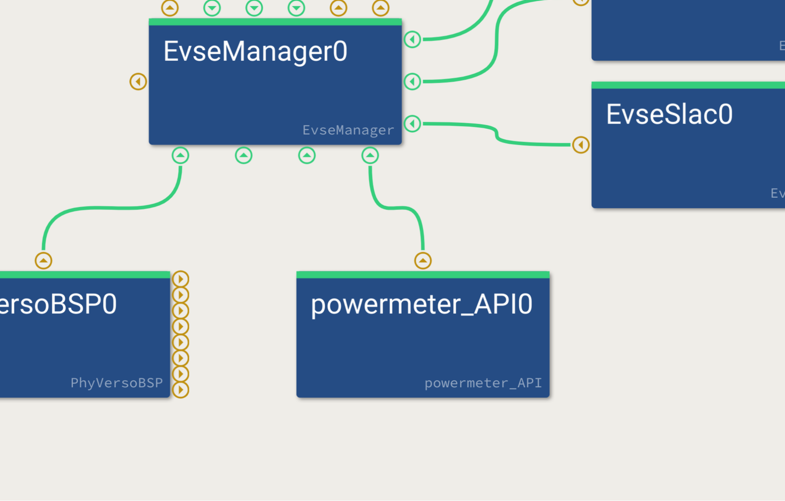

############
EVerest APIs
############

.. tip::

    You can find the API reference documentation here:
    :doc:`EVerest API Reference </reference/api/autogenerated_api_index>` .

EVerest can be extended and adapted to specific needs via two sets of
APIs: The internal interfaces and the EVerest API.

The EVerest API are versioned and guaranteed to not introduce breaking
changes for the same major version of the API, while the internal
interfaces may change between versions. Therefore, the EVerest API
is the preferred way to implement custom integrations, 
extensions and adaptations.

.. tip:: 
  
    If you plan to integrate EVerest on your charging station hardware we
    strongly recommend to use the EVerest APIs for this purpose, since these
    interfaces are the ones that are supposed to be kept stable and maintained.
    over time.

Overview
========

The EVerest API is the interface for hardware integration, 
custom extensions and adaptations.
It is provided via a public MQTT interface, and the format for data
exchange is plain text JSON. The API is defined in AsyncAPI 3.

Custom client software using the EVerest API is therefore only loosely
coupled to the EVerest application and its internal interfaces.
There are no obligatory binary or link time dependencies of any kind.
As a result, the clients can be built individually and without
reference to the EVerest application at all.

This also implies that the programming language used for implementing
the client can be chosen freely. Typically a compiled language is
preferable for an embedded target, but it is not strictly required at
all.

The EVerest API is implemented in terms of EVerest modules, and every
API module implements one or more of EVerest's internal interfaces.
There are two distinct versions of API modules, either to implement
an interface (e.g. a driver for a DC power supply) or to consume it 
(e.g. to check for the validation status of a token).

They can be included in the configuration file just like any other
module. E.g. - in this example -, a EVerest API module was loaded to
fulfill the power meter requirement of the EvseManager. The actual code
that talks to the power meter hardware to fetch the measurements can now
be implemented in a process running outside of EVerest (and is started
e.g. by a separate *systemd* unit). It just needs to feed the measured
values via MQTT into the 
:ref:`Powermeter API module <everest_modules_powermeter_API>`.

For a better understanding of how the EVerest API works, let us have an
exemplary closer look at the
:ref:`Power Supply DC API module <everest_modules_power_supply_DC_API>`.

The manifest can be reduced to this:

.. code-block:: yaml

   config:
     cfg_communication_check_to_s:
       type: integer
       default: 5
     cfg_heartbeat_interval_ms:
       type: integer
       default: 1000

   provides:
     if_power_supply_DC:
       interface: power_supply_DC 

There are two configuration variables which are common for every API
module. Both are related to communication checks between EVerest and
the client module.

Below, there is the *provides* section, which states that this API
module *is* a :doc:`DC power supply </reference/interfaces/power_supply_DC>`.
This implies that it can be used in the configuration file for EVerest
wherever a DC power supply is expected.

In a product, this would be the :ref:`EvseManager <everest_modules_EvseManager>`
requiring a DC power supply. During development or validation it could also be a
BringUp module.

In contrast to an integrated driver for actual hardware, the API module
creates MQTT topics according to its specification and by this provides
hooks for the client to do the implementation work.

The documentation of the APIs can be found in the respective :doc:`reference
pages </reference/api/autogenerated_api_index>`. Each API module has its own
reference page describing the messages, topics and data structures used.

Let's take a look at an example configuration that uses the API module:

.. code-block:: yaml

   active_modules:
     ps_dc_1:
       module: power_supply_DC_API
       config_module:
           cfg_communication_check_to_s: 60
               cfg_heartbeat_interval_ms: 1000
     cli:
       module: BUPowerSupplyDC
       standalone: true
       connections:
       psu:
           - module_id: ps_dc_1
           implementation_id: if_power_supply_DC

It loads two modules: 
The :ref:`power_supply_DC_API <everest_modules_power_supply_DC_API>`
and the 
:ref:`BringUp module for DC power supplies <everest_modules_BUPowerSupplyDC>`.
Starting EVerest with this  configuration enables the API for DC power
supplies and a BringUp module, that can send to and receive messages from the
API. The actual topics on the MQTT will be available under 
*everest_api/1/power_supply_DC/ps_dc_1/*.

It is as simple as this.

As explained previously, the client is only loosely coupled to EVerest.
As a consequence, EVerest cannot know by itself whether the client is
available and in good working conditions. For this reason, a
bidirectional communication check is available.

EVerest APIs sends *heartbeat* messages periodically
(*cfg_heartbeat_interval_ms* - with negative values disabling heartbeat
messages) and on the other hand requires the clients to send
*communication_check* messages within the timeout interval specified
(*cfg_communication_check_to_s* - with negative values disabling the
requirement for these messages).

In situations where a request/reply pattern is implemented, the timeout
for a response can be configured (*cfg_request_reply_to_s* - these timeouts
cannot be disabled since internal EVerest timeouts apply) . In general it
is advisable to respond as quickly as possible in to to prevent EVerest
from blocking internally.

AsyncAPI
========

The EVerest API is defined in terms of AsyncAPI 3.0.0.

For a thorough introduction and reference refer to
https://www.asyncapi.com .

All EVerest API modules are located in *everest-core/modules/API* and each
module contains the API definition in 
*everest-core/docs/source/reference/EVerest_API/<name-of-api>.yaml* file. 
These files are used to generate the
:doc:`HTML-based documentation </reference/api/autogenerated_api_index>`.

In order to build the documentation including the API reference pages,
run the following command in the *everest-core/build* folder:

.. code-block:: bash

   cmake -DEVEREST_BUILD_DOCS=ON .. && make trailbook_everest

Another possible way is to use the AsyncAPI yaml source file in
`AsyncAPI Studio <https://https://studio.asyncapi.com/>`_.

The *<name-of-api>.yaml* is defined for the client implementing the API and
reflects the client's point of view, when using the words *send* and
*receive* in the context of actions and operations.

The MQTT topics of the EVerest API follow a fixed pattern. All topics
are prefixed with *everest_api/1/{api_type}/{module_id}* - with *1*
being the version and *{api_type}* the type of the API.

*{module_id}* is the *module id* of the API module as configured in the
EVerest configuration file.

The prefix is followed by the direction of the message. There are two
options:

-  *m2e* for messages from the module (client) to EVerest and
-  *e2m* for messages from EVerest to the module (client).

This is finally followed by the name of the message. Here is a complete
example:

.. code-block:: text

   everest_api/1/power_supply_DC/ps_dc_1/m2e/voltage_current

In the example, *power_supply_DC* is the API type, *ps_dc_1* is the
*module id* as configured in the EVerest configuration file, the
message (*m2e*) originates from the client and is directed towards
EVerest. The message name is *voltage_current*.

AsyncAPI defines channels which carry messages. A channel can be
addressed via the topic as defined above. Each channel can in principle
carry multiple messages, but concerning EVerest API, there is a
one-to-one mapping between a message and a channel. A message carries
content in the form of payload and possibly headers.

The content type for EVerest API is always JSON. The content is
individual for each message and defined in *components:schemas* within
the same file or sometimes in a referenced file.

AsyncAPI finally specifies operations on channels. The operations define
the action on a specific channel (for EVerest API always from the
client's point of view), which can be *send* or *receive*.

In many situations, the sender of a message is not interested in the
receive status of a message, e.g. in a situation where a meter publishes
its current values. Simple send and receive operations are used in this
case.

There are situations however, where this is not the case, e.g. remote
procedure calls or when a reply is requested. EVerest API handles this
situation with the request/reply pattern offered by AsyncAPI.

The operations are then augmented with a reply property holding the
reply channel and a dynamic reply address.

If the client receives a request, it has to reply to the topic provided
in the header's *replyTo* property within *cfg_communication_check_to_s*
seconds. If it does not, a default response is given by the API to
EVerest and an error is raised.

If the client sends a request, it has to specify the reply topic, where
it expects the answer. This information is communicated via the
*replyTo* property of the headers object. It is the client's
responsibility to ensure that the topic is unique in order to relate
replies to requests.

Using the EVerest API
======================

In order to use the EVerest API, load the required API modules in the
EVerest configuration file and connect its interfaces as presented in
the *Overview* section.

The chosen *module id* becomes part of the MQTT topic. EVerest API
modules can be loaded multiple times, e.g. if two DC power supplies are
connected.

If needed, adjust the heartbeat interval and communication check timeout
via the *cfg_heartbeat_interval_ms* and *cfg_communication_check_to_s*
configuration variables of the module.

Although communication check and heartbeat can be disabled with values
smaller or equal to zero, this is not recommended in a production
environment, since they are the only way to continuously check whether
the client and EVerest are online and responsive.

EVerest API clients are completely independent applications. They have
to be started independently of EVerest, possibly by their own *systemd*
service.

EVerest cannot start them, since it is agnostic of them. On EVerest
startup, the API modules raise an initial communication check error (if
communication check is enabled). This error is cleared with the first
communication check message sent from the client. It is raised again
when a timeout occurs or a request is not answered. Sending a
communication check message clears the error again.

It is the responsibility of the user to ensure that the client is and
remains available. This includes potentially a *watchdog* that restarts
the client in case of crash or deadlock. It is also the client's
responsibility to ensure proper initialization, shutdown and
surveillance of managed hardware, e.g. a DC power supply.
