###########
Sub-systems
###########

The following sections are a functional description of the subsystems of
EVerest. A subsystem is a group of modules that together implement a
specific functionality. This documentation guides you through some of the
most important subsystems step by step, showing how to build them up from
individual modules. The following subsystems will be explained:

- Charging subsystem
- Authentication subsystem
- OCPP subsystem
- Energy management subsystem

Charging subsystem
==================

The charging subsystem contains all modules that are responsible for the
charging logic, car communication and hardware drivers related to a
single charging port. For multiple charging ports the whole subsystem
can simply be duplicated.

It depends on the Authentication subsystem to authorize charging
sessions and on the Energy management subsystem to allocate the energy
budget for the charging process.

The main module of this subsystem is the 
:ref:`EvseManager <everest_modules_EvseManager>`.
It contains all the logic and state machines for one CCS AC or DC charging
port.

.. _ac-charging-port:

AC charging port
------------------

Let's build an AC charging port step by step. Start with the EvseManager
module. For a simple AC charger, the default configuration of the module
is sufficient.

First, we add a board support module. This is the most important
hardware driver.

In this example, we use the :ref:`YetiDriver <everest_modules_YetiDriver>`
module which is the BSP driver for the BelayBox. Check the configuration of
the module; it should be correct for the BelayBox. Click on the (i) button
to learn more about each configuration setting.

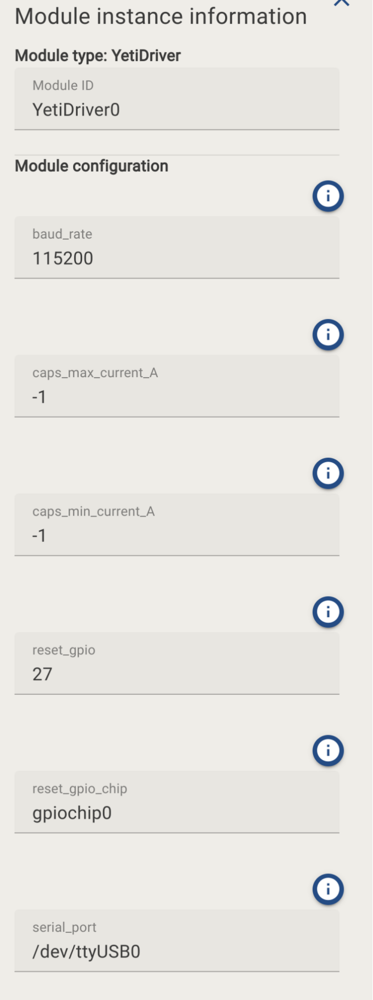

The first connection is for the mandatory
:doc:`evse_board_support interface </reference/interfaces/evse_board_support>`.

It implements the following functionality:

-  Control Pilot Signal (CP): Set PWM duty cycle in X2, State X1/F,
   report states A-F
-  Set allow relays on/off flag
-  Report PP resistor (if used)
-  Report AC input current / phases capabilities of the system
-  Stop charging button input

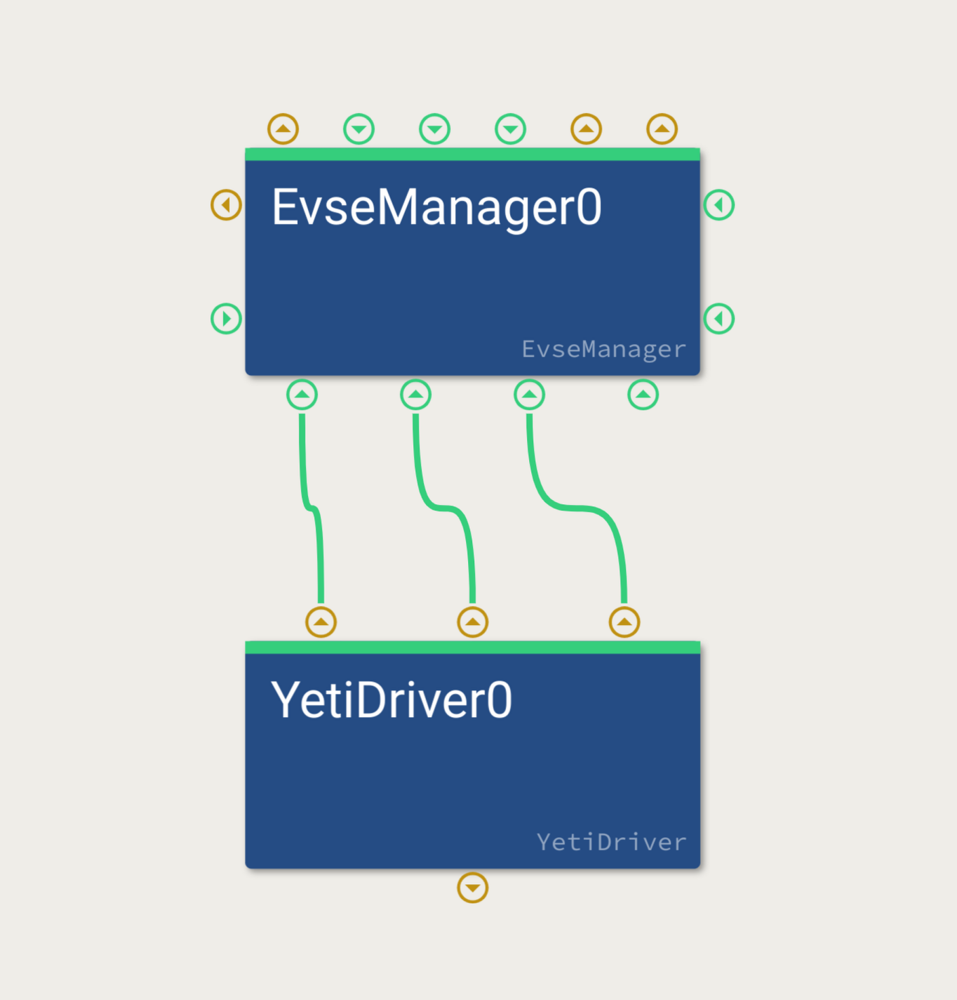

As you can see, there are two more connections between the
YetiDriver and the EvseManager. Those are optional:

-  :doc:`connector_lock </reference/interfaces/connector_lock>`
   (if used in the hardware): EvseManager requests
   locking/unlocking of the connector lock (for AC Type 2 Sockets)

-  :doc:`ac_rcd </reference/interfaces/ac_rcd>` (optional):
   Reports information about the RCD module in an
   AC charger. This is only used for telemetry and error reporting,
   the actual shutdown needs to be handled in hardware.

These two modules already allow basic AC charging functionality. Next
step is to add a power meter to allow for invoicing the charged amount
of energy. It may not be needed e.g. in a private installation.

You can use any hardware driver module that provides a 
:doc:`powermeter interface </reference/interfaces/powermeter>`
implementation. For the BelayBox, we could have used the
*powermeter* implementation of the YetiDriver (which uses the Yeti
onboard metering). In most configurations, an external DIN-rail power
meter is used with an RS485/ModBus connection, so we use the
:ref:`GenericPowermeter <everest_modules_GenericPowermeter>` 
module here:

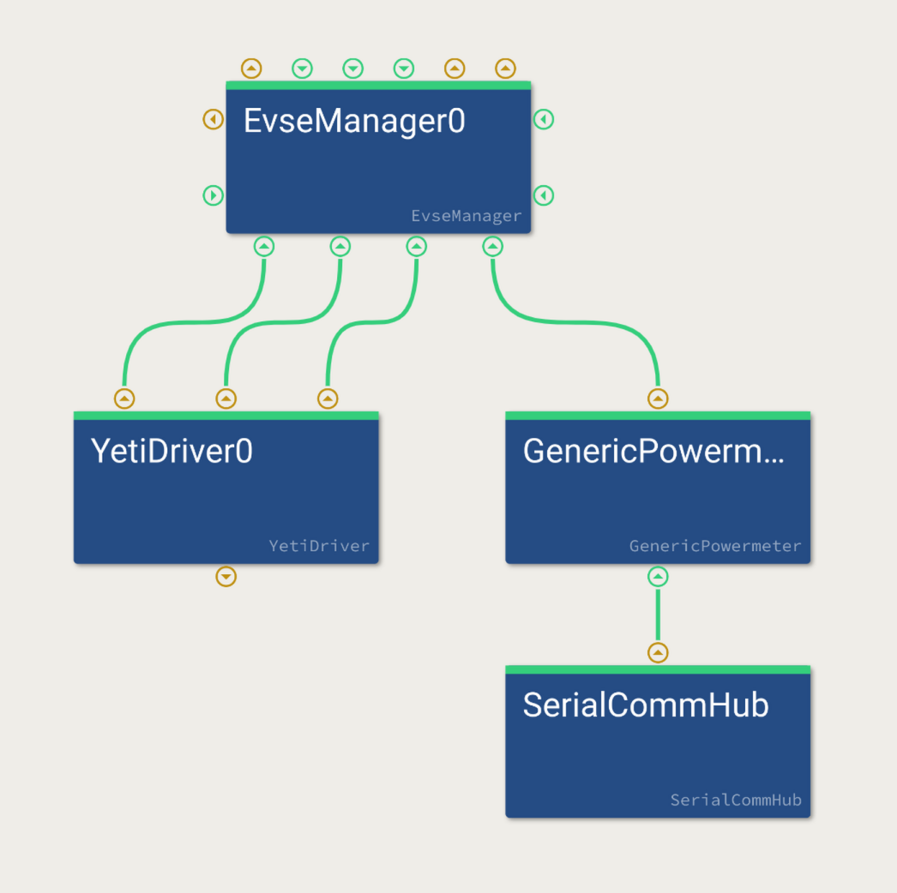

:ref:`GenericPowermeter <everest_modules_GenericPowermeter>` 
is a module that can easily be adapted to most ModBus-based
AC power meters by specifying the register mappings in the
configuration of that module. It requires a
:ref:`SerialCommHub <everest_modules_SerialCommHub>`
module to do the actual read/write to the serial RS485 port of the system.
This is a separate module as multiple device drivers may use the same
serial bus, so they can all be connected to the same 
:ref:`SerialCommHub <everest_modules_SerialCommHub>` module. 
Make sure to configure the correct serial device and baud rate.

Note that there are two optional requirements for power meters in the
EvseManager: *powermeter_grid_side* and *powermeter_car_side*. The first
one should be used if the power meter is measuring on the AC input side,
the second one should be used if it is measuring the output power to the
vehicle. It is ok to connect both if you have two power meters. For AC,
one is generally sufficient. For DC, two meters on AC and DC side may be
useful.

Next step is to add ISO communication, if support for AC ISO15118-2 is
desired:

.. figure:: images/iso-communication-connection.png
   :alt: ISO Communication Connection
   :width: 700px

Three modules have been added:

:ref:`EvseV2G <everest_modules_EvseV2G>`:
Implementation of ISO15118-2(AC/DC) and DIN SPEC70121(DC).
Connects to the *hlc/ISO15118_charger* requirement of EvseV2G. Make sure
to set the “device” config option to the ethernet device of the PLC
modem. Leave the other options on default for now.

:ref:`EvseSecurity <everest_modules_EvseSecurity>`: 
Handles certificates and private keys for TLS/PnC. We
will connect it here even though PnC is not enabled yet.

:ref:`EvseSlac <everest_modules_EvseSlac>`:
Implementation of ISO15118-3 (SLAC) to pair the PLC modems
of the EV and the EVSE at the start of the session. Make sure to
configure the same “device” as used for the EvseV2G. The two must point
to the same PLC modem.

To actually enable ISO 15118, some settings in the EvseManager module
need to be adjusted:

----

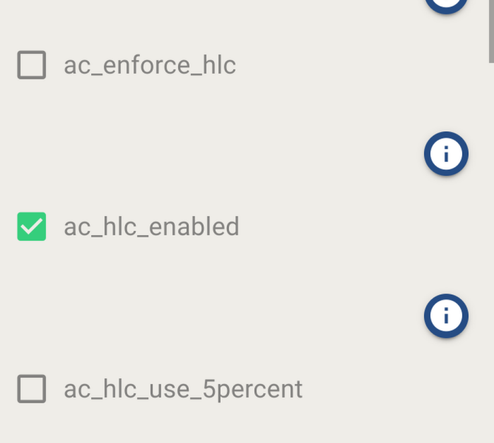

----

The recommended setting is to use *ac_hlc_enable*, which allows ISO
15118-2 sessions on AC. In this configuration, nominal PWM (>10% duty
cycle) will be used the same way as it is used for basic charging
(non-ISO) sessions. This is the most interoperable way that charges all
cars, even if they do not support ISO 15118-2 on AC. All other options
will only charge a subset of EVs out there.

Some cars however may not use ISO at all if they detect nominal PWM -
even if they support ISO 15118-2. You enable set *ac_hlc_use_5percent*
to start with 5% duty cycle PWM on CP similar to DC charging.

Several cars will now use ISO communication for AC. The downside is that
there are cars that cannot be charged at all, because they allow only DC
to be used when 5% signaling is enabled. (They violate the ISO 15118-3,
but many car implementations do it that way.)

With this setting, EVerest may switch back to nominal PWM from 5% in
accordance with the ISO 15118-3 regulations. Some EVs may cancel ISO
communication in this case, even though the standard clearly states
differently.

For those EVs, you can set the *ac_enforce_hlc* option to “true”. Then,
the 5% PWM will be used throughout the complete charging session as it
is done for DC. This is not allowed according to the standard though.

For completeness, we’ll also add a
:ref:`PersistentStore <everest_modules_PersistentStore>` 
module to the *kvs/persistent_store* requirement of the
:ref:`EvseManager <everest_modules_EvseManager>`.
This is needed to persistently store charging session information e.g- 
for German Eichrecht requirements. It may not be needed in simple
configurations.

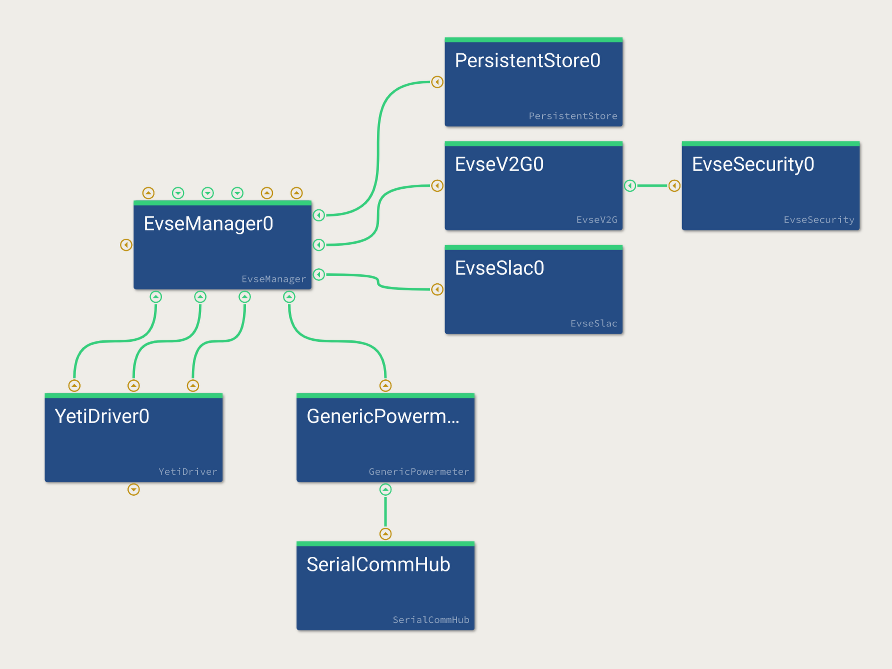

For AC, we are complete now.

.. _dc-charging-port:

DC charging port
------------------

Let's build a DC charging port using the phyVERSO board. Start with the
:ref:`EvseManager <everest_modules_EvseManager>` again and adjust 
one setting to switch it to DC mode:

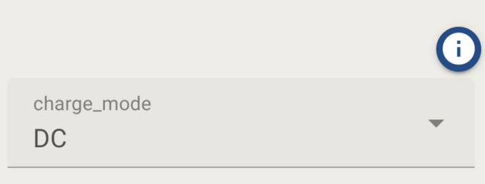

The basic configuration looks similar to the AC one. We just exchanged
the :ref:`YetiDriver <everest_modules_YetiDriver>` with the 
:ref:`PhyVersoBSP <everest_modules_PhyVersoBSP>` driver and connected the
*connector_1* interface for *evse_board_support* to EvseManager. Note
that *connector_lock* and *ac_rcd* are no longer needed on DC.

The second port of the phyVERSO will not be used here but could be
connected to a second EvseManager. Check the configuration options and
especially verify serial port, baud rate, capabilities and reset GPIO.
They should be correct on the default phyVERSO Board.

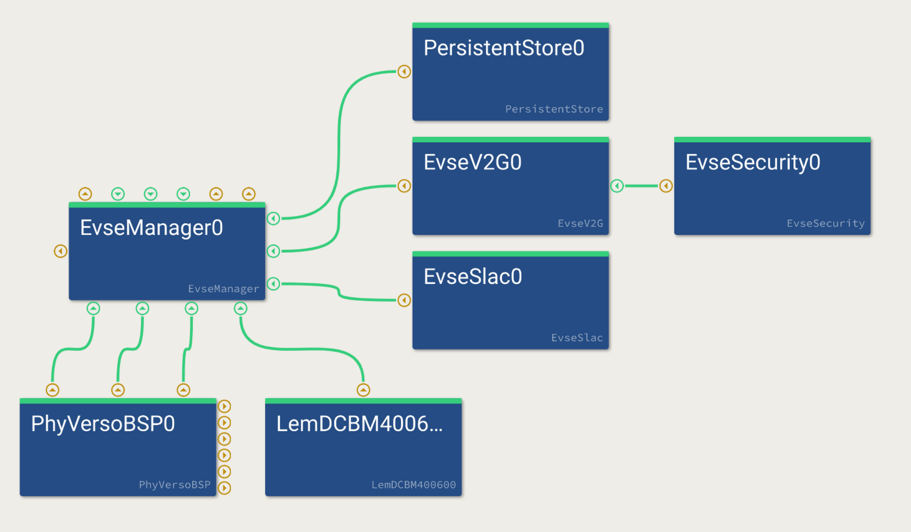

The power meter has been replaced by a
:ref:`LEM driver <everest_modules_LemDCBM400600>` , which is a power
meter often used for public DC charging. It is connected via ethernet,
so no SerialCommHub is needed. Verify the correct target IP is set.

Then, we will need to add the additional hardware drivers required for
DC charging:

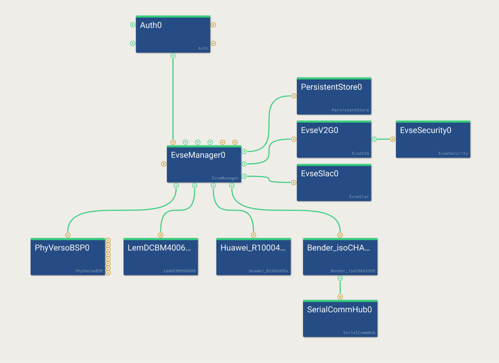

For the DC power supply, a 
:ref:`Huawei driver <everest_modules_Huawei_R100040Gx>` was added here
to the *power_supply_DC* requirement of EvseManager. Set the correct CAN
device. As isolation monitor, the 
:ref:`Bender isoCHA driver <everest_modules_Bender_isoCHA425HV>` was added.
As it is a modbus device, it requires a SerialCommHub again - the same way
as the GenericPowermeter in the AC configuration. Make sure the settings
for the serial port are correct.

Both of the AC and DC example configs will not yet charge a car. They
still need two things from the other subsystems:

-  Energy from the energy management system
-  Authorization from the Auth subsystem. If you don't need any
   Authorization, you can also disable this requirement by setting
   “disable_authentication: true” for EvseManager.

Authentication subsystem
========================

Let's add a simple authentication subsystem to the charging part we just
created. Start by adding the :ref:`Auth module <everest_modules_Auth>` . 
It is the central logic core of this subsystem and manages all incoming
tokens, validations and reservations. Connect it to the *evse/evse_manager*
implementation on EvseManager. Through this interface, it will authorize
the charging sessions. If you have multiple charging ports (multiple EvseManagers)
you can connect all of them to the same Auth module. The Auth module
will then manage multiple ports.

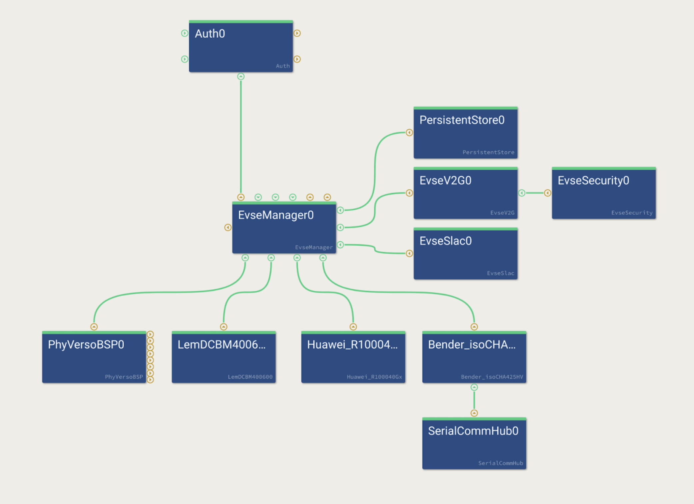

To do anything useful, the Auth module requires two things:

1. :doc:`Auth token providers </reference/interfaces/auth_token_provider>`: 
   They are sources of auth tokens, e.g. RFID readers etc that output tokens
   (but do not know whether they are valid or not).

2. :doc:`Auth token validators </reference/interfaces/auth_token_validator>`:
   They can tell whether a token is valid or not.

Move the *token_provider* requirement to the right. The first auth token
provider that we will connect is the *auth_token_provider*
implementation of the EvseManager. This is needed for features such as
“Plug and Charge” and “Autocharge”, where the EV is used as a token to
authenticate the charging session.

----

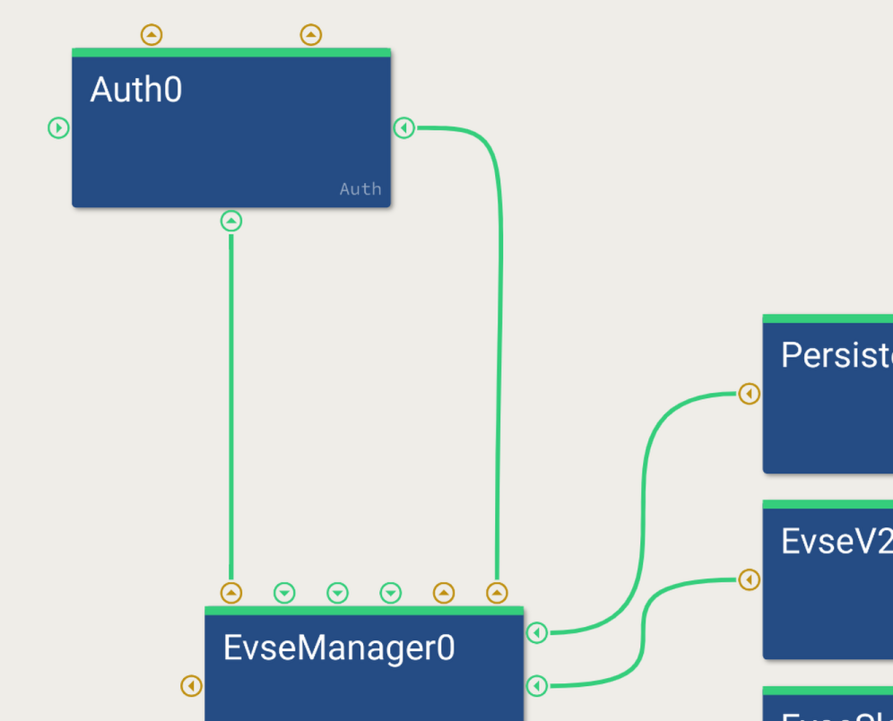

----

Next, we can connect an RFID reader as a second auth token provider:

----

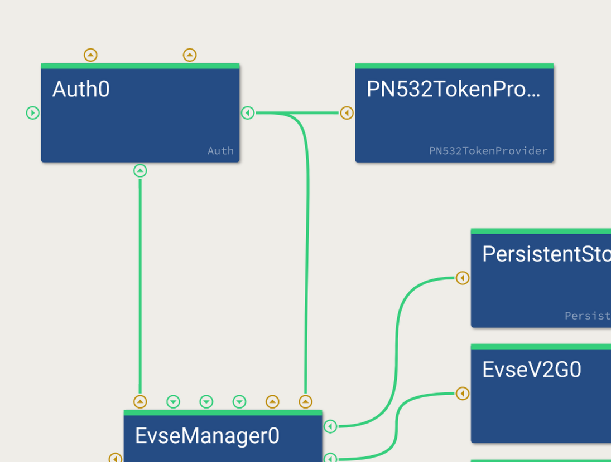

--------------

Now, let's add a very simple token validator:

--------------

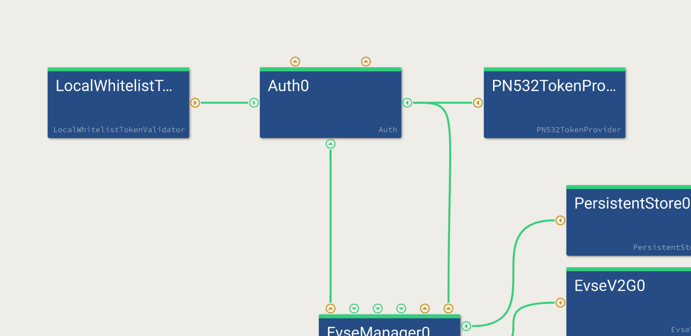

--------------

The  :ref:`LocalAllowlistTokenValidator <everest_modules_LocalAllowlistTokenValidator>` 
module takes a simple ASCII file (see config) with one line per token.
All tokens listed in this file are considered valid, all others are invalid.
With this Auth system, we already have a very simple version that can be
used to authenticate RFID tokens, that have been previously added to the
local whitelist file.

OCPP sub-system
==================

Especially for public charging stations, authentication is done via a
cloud backend instead of a simple local whitelist. For this, we use OCPP
1.6 in this example. OCPP 2.0.1 can be used in a similar way by using
the OCPP201 module instead.

OCPP is both a token provider and a token validator.

It provides tokens when a *RemoteStart* /
*RequestStartTransactionRequest* command is issued, and it is used as a
token validator if e.g. an RFID or Plug&Charge contract should be
validated in the CSMS. So we will connect both of those connections and
remove the LocalWhiteListTokenValidator. OCPP has its own internal local whitelist
and authorization cache implementation, that is according to the standard:

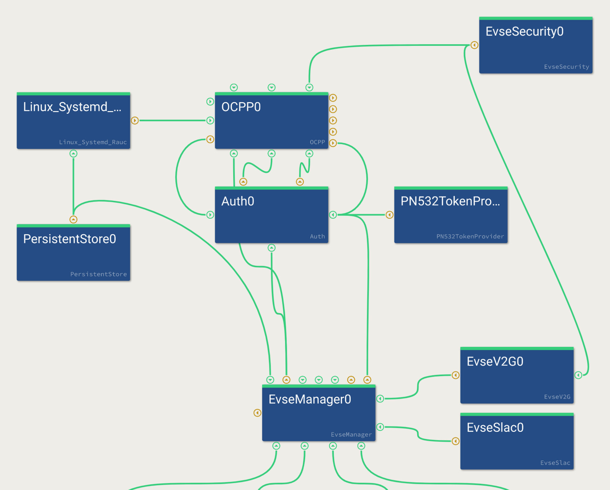

OCPP requires several connections. Let's go through them step by step:

-  :doc:`Auth token providers </reference/interfaces/auth_token_provider>` 
   and :doc:`Auth token validators </reference/interfaces/auth_token_validator>` 
   are the main ones for remote start and token validation functionality.
   Connect them to the Auth module.
-  :doc:`auth interface </reference/interfaces/auth>` needs to be connected to
   the *Auth* module. This connection is mostly used to set the connection
   timeout setting via the OCPP protocol.
-  :doc:`reservation interface </reference/interfaces/reservation>` is used to
   reserve/cancel reservations of connectors via OCPP from the CSMS.
-  OCPP also requires a connection to the
   :ref:`EvseSecurity <everest_modules_EvseSecurity>` module, which
   is now shared between OCPP and EvseV2G. OCPP requires it to load the
   certificate / keys for TLS to the CSMS. OCPP can also update/install
   certificates for both OCPP and ISO 15118 from the CSMS.
-  OCPP requires a helper module for system-specific implementations
   (OTA update, logfile collection and upload). Here, we use
   :ref:`Linux_Systemd_Rauc <everest_modules_Linux_Systemd_Rauc>` 
   from EVerest, which is the default implementation using systemd for
   log collection and RAUC for OTA updates. This in turn requires a
   :ref:`PersistentStore <everest_modules_PersistentStore>` module, 
   which is shared here with the EvseManager.

For more detailed information about the OCPP configuration, check out the 
following resources:

- :ref:`OCPP1.6 module documentation <everest_modules_OCPP>`
- :ref:`OCPP2.0.1 module documentation <everest_modules_OCPP201>`
- :doc:`OCPP1.6 tutorial </tutorials/ocpp16>`
- :doc:`OCPP2.0.1 tutorial </tutorials/ocpp2>`

Now, we have a configuration that can be used in public environments. It
supports authentication via OCPP for RFID tags, and - since the LEM
power supply is used on the DC port - German Eichrecht compliant
metering with OCMF-signed meter values forwarding to the cloud.

Energy management subsystem
====================================

The last subsystem missing is the Energy management. In EVerest, the
energy management distributes energy between charging ports. It is also
needed if only one charging port exists.

Please refer to the
:doc:`Energy Management documentation </explanation/energymanagement/index>`
for a detailed explanation of how to set up the energy management
subsystem.

Multiple connectors
===================

In order to support multiple charging ports, the charging subsystem will
need to be loaded multiple times (also duplicating all direct
dependencies), but Auth and Energy management subsystems are used only
once.

Here is an example for two charging ports (leaving out the dependencies
of each functional block / most connections for clarity):

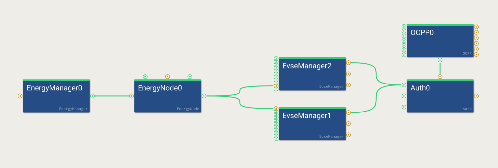

Most drivers implement only a single instance. So e.g. drivers for
isolation monitors, SLAC, ISO protocol etc all need to be duplicated
when EvseManager is duplicated.

A few driver modules also have two implementations of one interface. A
good example is the PhyVersoBSP, which is the driver for a dual port
controller in one module - so it supplies two separate CP pins etc to
two EvseManagers (again removing most other modules for clarity):

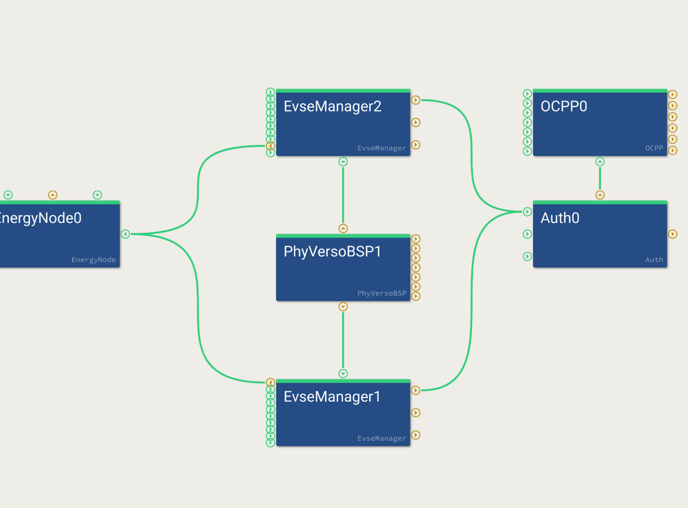

----

**Authors**: Cornelius Claussen, Piet Gömpel
