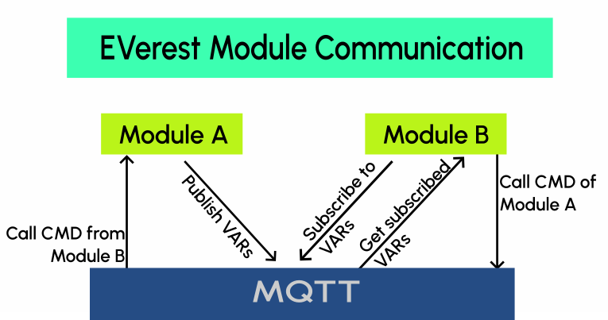

.. exp_high_level_overview:

##############################
High-Level Overview of EVerest
##############################

EVerest is the open source firmware stack for EV charging stations. By digitally abstracting
the complexity of multiple standards and use cases, EVerest runs on any device, from unmanaged
AC home chargers to complex multi-EVSE satellite public DC charging stations with battery and
solar support. EVerest supports all the standards and protocols needed for standards-compliant,
interoperable and secure charging. In other words, EVerest does the hard work of translating
standards into working code to ensure that every car works with every charger with every
charging app and network.

Key features of EVerest
========================

All in all, you can expect the following:

* Modular and extensible architecture
* Support for AC and DC charging
* Support for EV charging protocols
    * OCPP 1.6, OCPP 2.0.1 and OCPP 2.1
    * ISO 15118-2, -3 and -20
    * IEC 61851
    * DIN SPEC 70121
* Ready-to-use hardware drivers for many compatible hardware components 
    * BSPs for charge controllers
    * Powermeters
    * Isolation monitors
    * DC Power supplies
    * RFID/NFC readers
    * Payment terminals
* Energy management implementations and API
* Standardized and stable APIs to allow easy integrations
* Bring-up modules for custom hardware testing and integration
* Ensured standards compliance
* OTA service to keep EV chargers up-to-date
* Security best practices following OpenSSF
* ISO / IEC 5230 open source license compliance
* Secure communication channels through TPM
* Yocto support for custom embedded Linux images

EVerest Architecture
=====================

EVerest contains a rich set of modules that can be combined to build a full EV charging station software stack.
The architecture is modular and based on loosely coupled components that communicate via MQTT.

Each module runs as an independent process and communicates with other modules via well-defined interfaces.
This allows module to subscribe to variables published by other modules and to call commands provided by other modules.

A more detailed explanation of the EVerest architecture and module concept can be found in the
explaination about :doc:`EVerest modules in detail </explanation/detail-module-concept>`.

Hardware Requirements
=============================

EVerest can run on any Linux-based operating system that comes with the required dependencies.
Our (strong) recommendation is Yocto.
Find more information on how to set up your Yocto-based environment in the respective
:doc:`EVerest Linux and Yocto guides </explanation/linux-yocto/index>`.

The hardware requirements to run EVerest very much depend on the use case and the modules
that are used in the specific scenario. As a general guideline, the following minimum
requirements should be met:

* CPU: minimum imx6ULL or comparable, recommended is imx93 or AM62x
* RAM: minimum of 512 MB, recommended is 1 GB or more
* Flash: minimum of 1 GB, recommended is 4 GB or more

Getting Started
=====================

Please refer to the :doc:`Quick Start Guides </how-to-guides/getting-started/get-started-sw>` to get started with EVerest.
