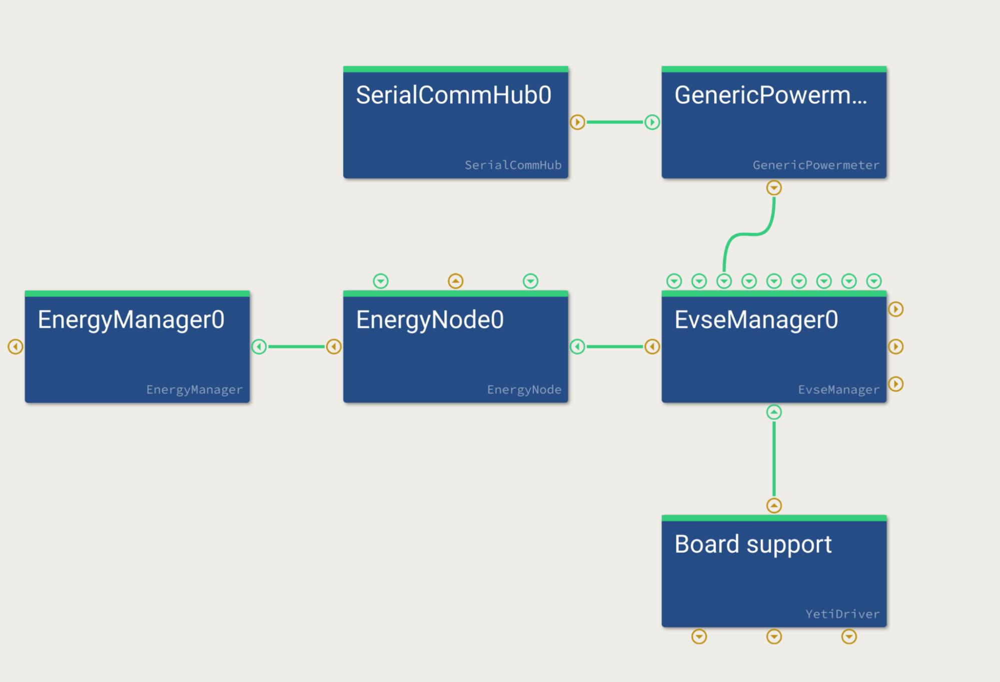
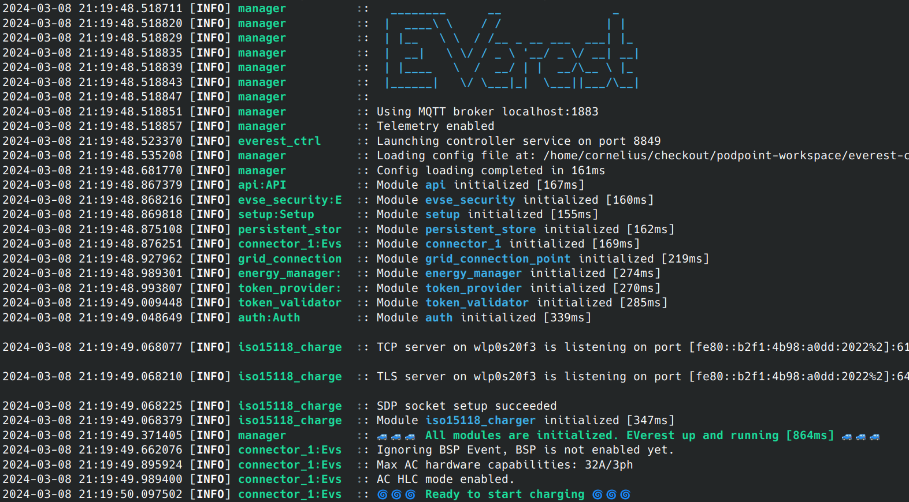
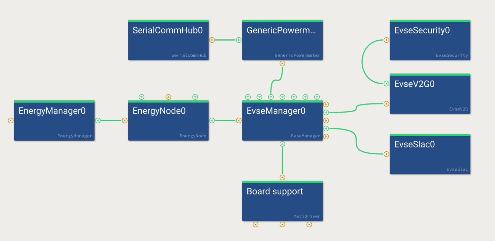

.. _htg_bring_up_ac:

###########
AC BringUp
###########

Make sure to have completed the bring up of the CP signaling as
described in :ref:`htg_basic_bringup`.

It may be a good idea to verify the powermeter functionality now as
well - even though it is not strictly necessary for charging.
Please refer to :ref:`htg_bring_up_powermeter` for the bring-up of
the powermeter.

Once the CP signaling has been verified, most of the work for AC is
done. Let's verify the AC-specific components:

- RCD
- Connector Lock

You can continue to use your bringup config you used for the bring up
of CP, PP and relays, which includes the 
:ref:`BSP BringUp module <everest_modules_BUEvseBoardSupport>`.

RCD
===

Residual current monitoring is mandatory in most countries, but the
exact regulations differ in different regions. Typically, both AC and DC
residual current faults need to be detected. If the RCD is part of your
charger setup (it may also be in the installation instead) it is a good
idea to test it now.

Connect an RCD test device, and verify it triggers both on AC and DC
faults within the correct timings and levels according to your region.

Connector Lock
==============

A connector lock is required for AC charging in case your charging station
has a socket outlet. Verify that the lock is working correctly by
commanding it to lock and unlock via your BSP driver.

Milestone: First Charging of a Real Car
=======================================

Now that all individual components have been verified, it is time to
assemble all pieces and charge a real car.

Start by creating a simple AC basic charging configuration file for
EVerest with a minimum amount of components - e.g. with one ModBus
power meter and your board support driver for CP/PP/Relays. You can set
“disable_authentication: true” in the configuration of EvseManager, then
no Auth manager is needed.

Copy the config file to your charger prototype. Make sure EVerest is
not running as a *systemd* service as we will start it manually in the
beginning. So in case of doubt, try to shutdown the *everest* system
service:

.. code-block:: bash

   systemctl stop everest

Then start EVerest with the following command:

.. code-block:: bash

   manager /path/to/simple_ac_config.yaml

It should look similar to the following:

Watch out for the log line “Ready to start charging”. Once that appears,
you can plug in the EV simulator.

Simulate a simple charging session by going to state B. Wait for PWM to
appear, then switch to state C. The relay should click and charging
should work.

Now, switch back to state B to pause charging. The relay should open and
EVerest will wait in state “ChargingPausedByEV”. Go back to state C to
close relay again.

Now, stop charging by first switching to state B followed by state A
(unplug). PWM should stop and the relay should open.

**Congratulations, you now simulated a full AC charging session on your
prototype!**

Two more things that should be tested before trying a real car:

Stop EVerest with ``Ctrl+C``. Switch the EV simulator to state B and
start EVerest again. Ideally, the plug-in should be detected right
after “Ready for charging” and PWM should be enabled. Switch to state C
after PWM is on and the relay should close.

.. tip::

   If this does not work, your BSP driver needs to publish the current state
   when the “enable” command is called.

This test is important as it simulates the behavior of a power
loss while a charging session is running. Especially in a home
environment, it is expected that the charging continues once the grid is
back.

Now you are ready to connect your first real EV. Here are a few things
you should also try with real EVs:

-  Try pause/resume from EVSE side if you have some sort of human
   interface (you will need to call the pause/resume charging commands
   on EvseManager). If the EV supports it, also triggered by EV side.

-  Unplug power input to the charger while a charging session is active
   and replug it to verify it starts charging again (simulate grid black
   out).

-  Try different amperage limits.

Here is a (non-complete) list of things you should test as well in the
full setup:

-  Try over-current shutdown (draw more amperage than the PWM allows,
   e.g. set PWM to 6 A / 10% but connect a heater to the output of the
   EV tester that draws much more than 6A).

-  Test under-/over-voltage behavior (different countries have different
   requirements).

-  Test over-/under-temperature scenarios.

EVerest BringUp for AC ISO 15118-2
==================================

If basic AC charging is fully working, it is time for the ISO 15118-2
charging bring-up. You can use a simulator for this, but unlike for
basic charging, ISO 15118 simulators are quite complex and expensive.
You could use a real car for this.

.. note::

   At the time of writing, most cars do not support ISO 15118 for AC - they do
   so only on DC. Refer to https://github.com/EVerest/logfiles
   to get a better idea which car brands / models can be used for testing.

As with basic charging, we first create a new configuration file by
extending the one we just used for basic charging.

We add an :ref:`ISO 15118 stack <everest_modules_EvseV2G>` as well as a
:ref:`SLAC module <everest_modules_EvseSlac>`:

Start EVerest the same as we did for the basic charging test.

Now connect a real car and watch the output. Explaining the actual ISO
15118 protocol is beyond the scope of this document.

For more information on how to debug ISO communication, refer to
:doc:`Debugging ISO15118 </how-to-guides/debug-iso15118>`.

Now we have the charging functionality up and running for the most
important paths.

.. tip::

   A lot of error cases should be tested now as well as we mostly covered the
   happy paths - but this goes beyond the scope of this how-to-guide.

----

**Authors**: Cornelius Claussen