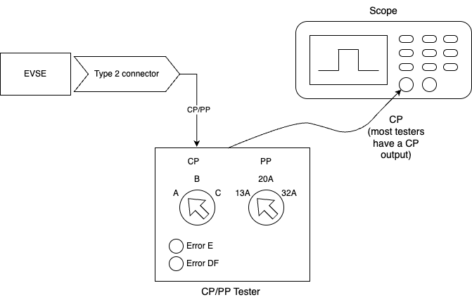
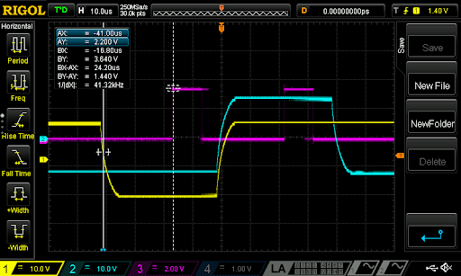

.. _htg_basic_bringup:

################
Basic BringUp
################

This chapter guides you through the basic bring-up of the control pilot (CP),
proximity pilot (PP), and relays for both AC and DC chargers. It is a 
prerequisite to the more specific bring-up guides for AC and DC charging.

Control Pilot
=============

The first step - both for AC and DC - is to verify the control pilot
(CP) signal functionality and stability. A lot of problems we have seen
in the field are related to unstable CP signals. So, this step is key
for a stable product.

The normative requirements are described in IEC 61815-1. This section
will guide you through the most important requirements specified in the
norm to be tested at bring-up. It is not complete, IEC gives more
requirements that should be followed at design time.

.. warning::

   For all parameters: Ensure that the limits are guaranteed over the complete
   temperature and input voltage ranges as well as all other environmental
   factors over the complete lifetime of the product.

Being on the edge of the range during bring-up already, will most likely
result in out-of-spec performance in production due to part tolerance,
component aging etc.

First, verify PWM output with no car / nothing connected to it.

You should have an EVSE board support driver for your hardware already.

In this how-to-guide, we will use the BringUp & Qualification tool from
EVerest to select the different CP states manually. This ensures that
(a) the CP signal is correct and (b) the wiring up to the EVerest HW
driver is also correct.

You can find an example configuration file in EVerest for the BelayBox
that you can modify to use the correct BSP driver for your hardware:

.. code-block:: bash

   config/bringup/config-bringup-yetidriver.yaml

Before you start the bring-up, make sure there is no other EVerest
instance running (e.g. do a ``systemctl stop everest``).

On the target, start it the following way:

.. code-block:: bash

   /etc/everest/run_tmux_helper.sh /etc/everest/bringup/config-bringup-yetidriver.yaml /usr

Now, connect an EV simulator where you can set the states A/B/C/E and
simulate a diode failure / loss of PE connection between EV and EVSE
failure.

State D is not really used anymore nowadays; it dates back to the times
when lead-acid batteries were used that leak hydrogen gas during
charging.

Connect your EVSE, the simulator and a scope similar to this:

Now go through the following checklist step by step:

.. tip::

   Select PWM off / X1, switch EV simulator to state A.
   This should output constant +12 V on the CP line.

- Select AC coupling on the scope and verify the ripple noise. There
  is no hard limit, but we recommend keeping it below 100 mV VPP.
   
  .. image:: images/constant-cp-line.png
     :alt: Constant CP Line
     :width: 560px

- Switch to DC coupling, measure DC voltage range. It must be +12 V
  +/- 5% (11.4 V to 12.6 V). Use a multimeter if your scope does not
  provide sufficient DC accuracy.

Now select PWM State F. This outputs constant -12 V on the CP line.

- Select AC coupling on the scope and verify the ripple noise. There
  is no hard limit, but we recommend keeping it below 100 mV.

- Switch back to DC coupling, measure DC voltage range. It must be
  -12 V +/- 5% (-12.6 V to -11.4 V). Use a multimeter if your scope
  does not provide sufficient DC accuracy.

Select *PWM on* with a duty cycle of 5%, and connect the EV on the
simulator (State B). Note that the images below were done in state A,
but you should use state B.

- PWM frequency: Must be in the range 980 Hz - 1020 Hz. It should be
  1000 Hz.
   
  .. image:: images/pwm-freq-1.png
     :alt: PWM Frequency
     :width: 560px

- Measure the (high) pulse length for the 5% duty cycle. Measure the
  time between the zero crossings. It should be 50 µs.
   
  .. image:: images/pwm-freq-2.png
     :alt: PWM Frequency
     :width: 560px

- Equivalent source resistance: 970 - 1030 Ohm. Using a 1% 1-kOhm
  resistor should be sufficient to fulfill this requirement if the
  output of the PWM generator is low impedance.

- Set state B and verify that the PWM duty cycle can be set to any
  value between 5% (HLC) and the maximum current value your EVSE
  supports (e.g. 53.3% for 32 A for AC). For AC, the maximum PWM for
  your application can be calculated with:
   
  .. math::

     dutycyclePercent = maxAmpere / (0.6 * 100)
   
  For DC, it is always 5%. The range from 5% to
  10% is not used and it is ok to not support PWM in that range.

- Set state B, which will have a PWM voltage range from +9 V to -12
  V. Verify rise time is below 10 µs from 10% (-9.9 V) to 90% (6.9 V)
  of the signal. The example has a rise time of 4.3 µs.
   
  .. image:: images/pwm-freq-3.png
     :alt: PWM Frequency
     :width: 560px

- State B: Verify fall time is less than 13 µs. As you can see in the
  screenshot, the fall time is 10.68 µs, which is longer than the open
  circuit time due to the diode in the EV simulator.
   
  .. image:: images/pwm-freq-4.png
     :alt: PWM Frequency
     :width: 560px

- Set state C. Verify rise time is below 7 µs from 10% (-10.2 V) to
  90% (4.2 V) of the signal. The example has a rise time of 3.08 µs.
   
  .. image:: images/pwm-freq-5.png
     :alt: PWM Frequency
     :width: 560px

- State C: Fall time must be less than 13 µs from 90% (4.2 V) to 10%
  (-10.2 V) of the signal. The example has a fall time of 12 µs which
  is in range.
   
  .. image:: images/pwm-freq-6.png
     :alt: PWM Frequency
     :width: 560px

- Set State E (sometimes called *CP Error* or so). The CP signal
  should be at 0 V constantly according to the norm. Some EV simulators
  only short after the diode as seen in the screenshot. Make sure that
  your CP detection circuitry also treats that as state E.
   
  .. image:: images/pwm-freq-7.png
     :alt: PWM Frequency
     :width: 560px

- Test diode failure detection: Short the diode on the EV side. Many
  off-the-shelf EV simulators can be easily modified with an extra push
  button if it is not included already. Verify that the BSP throws an
  error (DiodeFault)

- Test short state changes: Toggle between states B, C, B quickly to
  produce a short time in state C (about 200 ms or less). The short
  state C should be reliably reported to EVerest. It is a common issue
  that the safety MCU filters out state durations that are too short.
  This will cause issues with the BCB toggle wakeup sequence detection
  of ISO 15118-3.

- Disconnect PE between EV and EVSE. This should be detected as an
  error or state A.

Now that the basic functionality is working, test stability of the state
detection. Most cheap EV simulators only use the nominal resistor values
to test the states, but ideally you have a simulator that can use the
minimum and maximum values for each state.

Ensure that the following states are detected correctly over the
complete range:

+-----------------+-----------------+-----------------+-----------------+
| State           | Minimum R       | Nominal R       | Maximum R       |
|                 | applied by EV   |                 | applied by EV   |
+=================+=================+=================+=================+
| B               | 1870 Ω          | 2740 Ω          | 4610 Ω          |
+-----------------+-----------------+-----------------+-----------------+
| C               | 909 Ω           | 1300 Ω          | 1723 Ω          |
+-----------------+-----------------+-----------------+-----------------+

If possible, use a debug GPIO, that shows the exact timing of the ADC
sampling and connect it to the second channel of your scope like this:

In the screenshot, two PWM signals are shown. The cyan one is 5% duty
cycle and the yellow one is 95% duty cycle. The magenta signal shows the
time the ADC reads the signal. As you can see, the first magenta pulse
is nicely aligned with the end of the low part of the PWM, so it will
read the -12 V reliably even at 95% duty cycle.

The second magenta pulse is nicely aligned with the high part of the PWM
providing stable readings even at just 5% PWM. The 5% case is the more
critical one, as very high duty cycles are not typically used.

The most common problem for unstable CP detection (which results in
charging sessions breaking and potentially leads to relays opening under
full load) is that the ADC sampling time starts too early or ends too
late. In both cases it will capture part of the edge of the high part of
the signal, resulting in a lower measured value. This can lead to e.g. a
state C detection while it is state B in reality.

Make sure to observe the correct timing under real conditions with a car
attached. With an open circuit and the 2 µs rise time, timing may be
perfect, but with a car attached and a 10 µs rise time it may not work
correctly.

This is especially critical at the 5% duty cycle as the high part is
only 50 µs long. Never sample in the first 10 µs. When using the MCU to
synchronize ADC and PWM, make sure that interrupt priorities are set
correctly so that additional (interrupt) load on the MCU does not lead
to delayed ADC triggers *sometimes*.

This needs to be 100% stable over long periods of time (hours/days !).
Some MCU (especially those made for motor control) can trigger the ADC
synchronously with the PWM generation without involving an interrupt
routine.

Apply some filtering and averaging in software (e.g. average over 10
pulses, filter out the highest and the lowest value or similar). It
should not detect a wrong state, not even a single time.

Do not filter too much though. This is another common flaw that should
be tested at this stage: IEC 61851-1 requires switching off power when
the EV transitions from C2 to B2 within 100 ms. As the relays also take
some time to open, do not delay the detection of the state change by
more than 50 ms due to filtering. Report all state changes to EVerest,
also those that are short-lived. Otherwise, some features will not work
correctly, e.g. ISO 15118 resume after pause.

Now test with several different real cars as well, as the implementation
on the EV side differs a bit across vendors and models.

Relays
======

The AC output contactor bring-up is the same as for the DC output relay.

Verify the correct function of the relay. Command the MCU to close the
relay (use the BringUp tool’s *Allow power on* button) and verify it
closes the relay in a timely manner (given that there is no RCD error
etc).

EVerest will issue the *allow_power_on/force_power_off* commands to the
BSP driver just like you can do it in the BringUp module. It is
important to understand the logic:

If the safety MCU receives an *“Allow power on”*, it may switch on the
relay if all other requirements are met (e.g. CP in state C, RCD current
ok, temperature in range etc). The MCU may decide to not switch on the
relay if some other local requirements are not met. It is just important
to always report the actual relay state with the PowerOn/PowerOff
events.

The following checklist tests if the safety MCU behaves correctly in
regard to the CP state C2. It does not test for other requirements such
as over-temperature etc.

If the safety MCU receives a force power off from EVerest, it shall
open the relay immediately.

Complete the following checklist:

- State A, PWM off, force power off. Set State B then enable PWM 5%
  and then C.
  Then allow power on. Relays should switch on within a short period
  of time after sending allow power on. You should see a “Power On”
  event (the time between “Allow power on” and the “Power On”
  feedback event should be short, e.g. less than 300 ms or so, no
  hard limit here). Click on “Force power off”. You should see a
  “Power Off” (same timings as above). These timings should be short
  - see below. You can click “Power On/Off” a couple of times and
  verify the timing of the feedback.

- Toggle the relay on and off a couple of times and observe the
  PowerOn/PowerOff events. There should be exactly one event for each
  on or off switching of the relay. Make sure that there are not
  multiple PowerOn/PowerOff/PowerOn events being generated because the
  relay is bouncing.

- State A, PWM off, state State B. Then enable PWM 5%, allow *power on*.
  Relay should not close. Wait a few seconds, then set state C.
  Relay should close immediately after entering state C. Ignore the
  time shown on the “Power On” event. It measures the time from the
  last “Allow power on” command to feedback.

- State C, PWM 5%, Relay closed. Then set state B. Relay should open
  immediately (max 100 ms). Go back to state C. Relay should close
  again. (IEC 61851-1:2017 Table A.6: Sequence 8.1)

- State C, PWM 5%, Relay closed. Then stop PWM but stay in state C.
  Relay should open after a minimum of 6 seconds. (IEC 61851-1:2017
  Table A.6: Sequence 10.2)

Timing on closing relays is quite relaxed, but ISO 15118 has a limit of
one second from the ISO command to switch on to the ISO feedback that it
was done. As most of the time is spent in the ISO communication stacks,
the MCU should ensure that the time from commanding the relays to close
to receiving the feedback that it was closed correctly should be in the
order of 100 ms in the MCU.

Timing on opening the relays is more critical and a good value is
opening within 50 ms after the command arrives at the latest. IEC
61851-1 requires the relay to be open after a maximum of 100 ms after
state C->B (or A etc) transition.

Verify that the feedback is reported correctly. A typical error during
bring-up with EVerest is missing relay feedback. Make sure they are
always reported to represent the relay state correctly. Send the events
on any change, regardless of the cause of switch on or off in the MCU.

Proximity Pilot
===============

This section is for Type 2 CCS Chargers. PP works a little different for
Type 1 Chargers.

For AC chargers with a type 2 socket, PP needs to be verified as well.
AC Chargers with a permanently attached cable do not use the PP signal.
DC chargers normally do not use PP as they have an attached cable,
however it may be used in some configurations to e.g. detect a cut
cable.

Most of the EV simulators can only switch the nominal resistor values
for 13 A/20 A/32 A. To test the PP functionality, you could e.g. use
small wired resistors and connect them manually between PP and PE or
build yourself a small tester that can do the minimum/nominal and
maximum resistor values.

Verify that the BSP reports the correct cable ampacity for all values in
this table:

================= ========= ========= =========
Cable ampacity    Minimal R Nominal R Maximal R
================= ========= ========= =========
13 A              1100 Ω    1500 Ω    2460 Ω
20 A              400 Ω     680 Ω     936 Ω
32 A              164 Ω     220 Ω     308 Ω
63 A 3ph/70 A 1ph 80 Ω      100 Ω     140 Ω
================= ========= ========= =========

Values below 60 Ω above 4500 Ω should be treated as errors and the BSP
should report “None” as PP ampacity. Resistor values in between the
defined ranges in the table should be treated as the lower ampacity
value.

Ensure that PP is measured quickly after plug-in of the vehicle. The MCU
should also monitor PP throughout the complete charging session and
report an error if PP connection breaks.

With CP/PP and relays, the minimal setup for AC charging has already
been verified.

.. tip::

   In addition, you may want to verify a few more components before charging a
   real car.
   But you can also do this later on.

Once the CP signaling has been verified you can continue with the bring up of 
the powermeter and the bringup for AC or DC, depending on your use case.

- :doc:`AC BringUp </how-to-guides/bringup/ac>`
- :doc:`DC BringUp </how-to-guides/bringup/dc>`
- :doc:`BringUp Powermeter </how-to-guides/bringup/powermeter>`

----

**Authors**: Cornelius Claussen