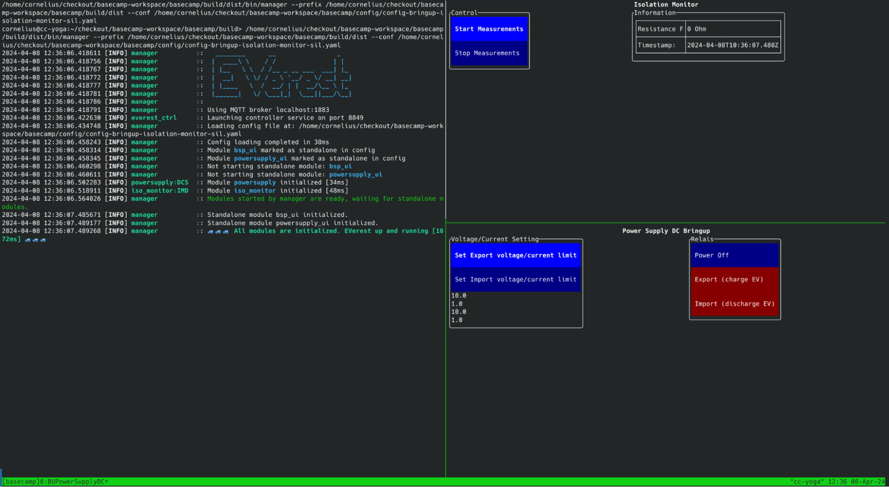

.. _htg_bring_up:

########################
BringUp & Qualification
########################

This chapter introduces the EVerest BringUp & Qualification process.

This process is all about bringing up the individual hardware components
step by step by verifying their functionality and performance in
isolated test cases. In the end, the whole charger will be brought to
life and we'll hit the most important milestone: A first complete
charging session of a real car.

.. tip::

   EVerest HW Drivers should be available for all required hardware
   components and a prototype hardware should be in place.

Many sections are written like a checklist that you can follow step by step.

Before we start, we recommend to set up the following development
environment:

- Working cross compiler on your PC to do fast updates of your code
  (e.g. with *rsync* to the target). On Yocto, use ``bitbake -c
  populate_sdk my-image`` to generate the SDK.
- SSH to the target
- Ensure the hardware interfaces to all components are up and running
- Include “tmux” in your image
- Recommended: Unicode support should work on the target terminal

BringUp modules
================

The following chapters use EVerest's BringUp helper modules.

These modules allow manual control of one or several hardware drivers.
We will use them to verify correct functionality and timing of all
components individually before assembling the complete configuration
file.

The BringUp modules should be included in the system image initially,
but later in production they should not be installed.

To get familiar with this method, you can use a pure SIL version on your
development PC. This step is optional. From the build folder of
everest-core, start the following run script:

.. code-block:: bash

   ./dist/etc/everest/run_tmux_helper.sh ../config/bringup/config-bringup-isolation-monitor-sil.yaml ./dist

The first parameter specifies the config file to load, the second
parameter points to the EVerest installation to use.

Later, on the embedded target, it can be used like this:

.. code-block:: bash

   /etc/everest/run_tmux_helper.sh /etc/everest/bringup/myconf.yaml /usr

The second argument now points to the EVerest version installed in the
base Yocto system. If you use a cross-compiled development version
installed under ``/var/everest``, simply set the second argument to
``/var/everest``.

You should see a split-screen setup (using tmux) similar to this:

In the left pane, EVerest is running all modules except for the two
BringUp modules. They are running in their own shell. Mouse support
should be working and you can click on the buttons.

E.g., click on “Start Measurements” and check that new isolation
measurements are coming in roughly every second.

To exit the tmux session, press ``Ctrl+B`` and then ``d``. Normally with
tmux, this puts the session running into the background but it keeps
running. The ``run_tmux_helper.sh`` script will take care of ending the
session properly here and cleaning up.

Have a look at the config file that it is using
(``config/bringup/config-bringup-isolation-monitor-sil.yaml``):

.. code-block:: yaml

   active_modules:  
    bsp_ui:  
      standalone: true  
      module: BUIsolationMonitor  
      connections:  
        imd:  
          - implementation_id: main  
            module_id: iso_monitor  
    powersupply_ui:  
      connections:  
        psu:  
          - implementation_id: main  
            module_id: powersupply  
      module: BUPowerSupplyDC  
      standalone: true  
    iso_monitor:  
      module: IMDSimulator  
    powersupply:  
      module: DCSupplySimulator

The configuration file loads the two BringUp modules you saw on the
right as well as the two driver modules for isolation monitor and DC
power supply. Since it is a SIL config, both hardware drivers are
simulated only.

.. tip::

   Have a look at the attribute “standalone: true” in both BringUp modules.
   This tells the manager and the tmux script that these two modules should be
   run in a separate tmux window.  

For your hardware, you will need to create configuration files that use
the real hardware instead of the simulated ones. There are example files
for each of the following steps - just adapt them to your needs.

Now, let’s use this on real hardware.

.. warning::

   During the hardware bring-up, you will switch on high voltages that can
   cause severe injury including death.
   It must only be done by trained personnel.
   Make sure to follow all necessary safety procedures.

The following chapters will guide you through the individual steps of
bringing up the hardware components one by one.

.. toctree::
    :maxdepth: 1

    basic
    powermeter
    ac
    dc

----

**Authors**: Cornelius Claussen
