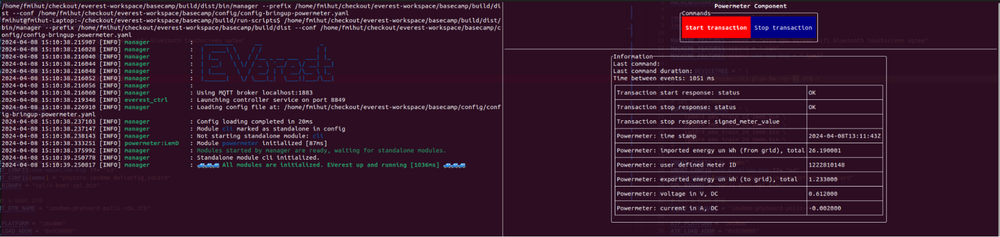

.. _htg_bring_up_powermeter:

##################
BringUp Powermeter
##################

In case your charger prototype has a power meter, it may be a good time
to verify its functionality as well now - even though it is not strictly
necessary for charging.

Write a bring-up config for your power meter and start it the same way
as described in :ref:`htg_bring_up`. There are a few examples you can copy
and modify, e.g. ``config-bringup-DZG.yaml`` or ``config-bringup-LEM.yaml``.

.. code-block:: bash

   /etc/everest/run_tmux_helper.sh /etc/everest/bringup/config-bringup-mypowermeter.yaml /usr

Your setup should look like this:

Complete the following steps:

- Verify that the measurements come in regularly (e.g. every second).
- Imported energy in Wh and timestamp are the only required values.
  Verify they are correct. For bidirectional metering, also verify the
  exported energy values.
- Validate the other reported measurements.
- If supported by the power meter (e.g. for
  :doc:`German Eichrecht </how-to-guides/eichrecht>`), click
  on “Start Transaction”. Verify that it replies correctly, and verify
  the time to reply is less than a few seconds.
- Click on “Stop Transaction” and verify the reply. The reply should
  not take more than a few seconds.
- Apply some test load if possible, and verify that the flow
  direction of energy is correct. A common mistake is to swap input and
  output of the meter. If you don’t have a test load, you can also test
  this when doing the first charging tests with a real car.

----

**Authors**: Cornelius Claussen
