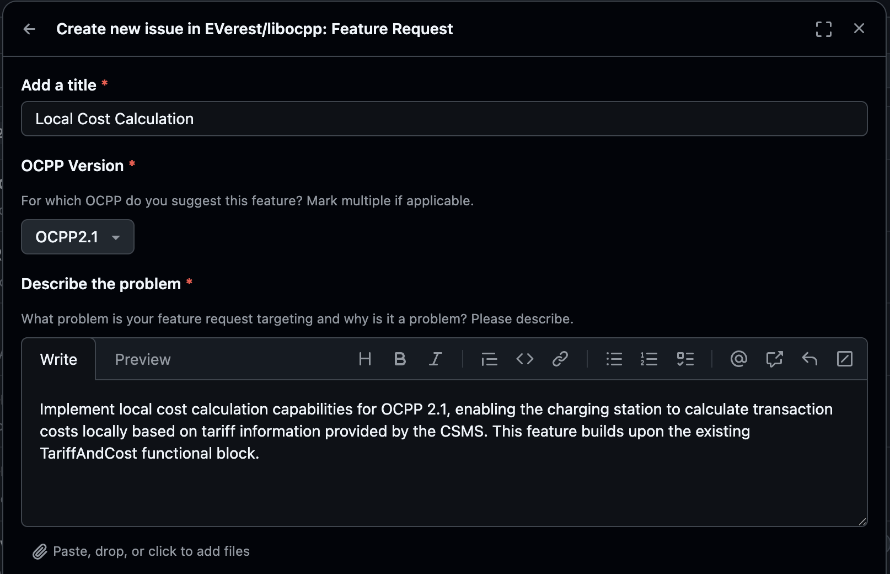
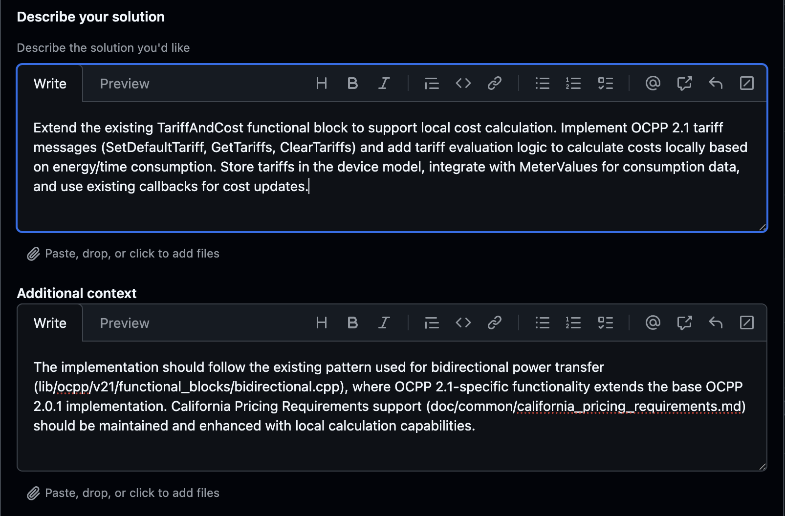

#######################
Contributing to EVerest
#######################

Assuming you want to contribute to the source code of EVerest, this tutorial
will help finding your way through the standard process.

The following steps are involved, which we will walk through in this tutorial
to get the details:

* Have an idea for EVerest and creating an according issue,
* promote a first high-level explanation of your idea and describing a
  possible way to implement a solution,
* discuss with responsible core developers and the community,
* prepare your development environment and start developing,
* give intermediate information in the EVerest live calls and
* present the final work and update all relevant EVerest documents.

Let's get started!

Step 0: Before you start
========================

This tutorial assumes that you already had some experience with EVerest.
For example, you did some simulation tests based on our beginner guides
or you even used EVerest for a real-world hardware project already.

An additional great practice is to already have created an account for the
main EVerest community platform, Zulip.

Also consider to attend some of the live talks like the working groups.

Step 1: A new idea means a new issue
====================================

Let's assume that you have worked with EVerest's OCPP features but you noticed
that the local cost calculation for OCPP 2.1 is still missing.

What a great idea to implement that.

One important rule though:
For every idea / feature, we will have to create a GitHub issue first as the
core developers and the EVerest community could have some additional opinions
or even suggestions for the implementation of your idea.
Let them get the chance to express their views on a dedicated GitHub issue
page.

Step 1.1: Create a new issue
----------------------------

Look for the repository that fits your feature idea.
In our case, the `libocpp <https://github.com/EVerest/libocpp>`_ repository
would be a great idea.

On the GitHub page, click on the "Issues" tab.

Before creating a new one, please look for an existing issue that would fit
your topic.
Also use the search function of GitHub.
Eventually somebody else already had the same idea and there already was some
discussion about it.

.. note:: Also check Zulip
    As most of the discussion about the technical specifics of EVerest is
    happening on the Zulip platform, it is a great idea to also check there
    for information and thought exchange all around your implementation idea.

If there is no existing issue, create a new one.
Choose "New issue" on the issues page, which will show a dialog with some
options.
In our case, "Feature request" will be the right option to choose.

Give your new issue a nice title and fill out the form.
The more information you can give about your feature idea and the possible
solution, the better for core developers to understand and give input to your
contribution.

For this tutorial you could create an issue like this:

Step 1.2: Let the discussion happen
-----------------------------------

With an existing GitHub issue, we have a place where discussion about the
implementation can take place.

After you have created your issue, some core developer might give their opinion
or other contributors could add valuable information.

Additionally, you can bring your topic into an EVerest working group that fits
your topic.

.. note:: Best Practice Tip
    Before starting to implement your idea, there should at least have been
    some thought from the community about your idea.
    If there has not been a reaction in the GitHub issue and also not via
    Zulip, you might at least tell in one of the live calls that you will start
    to implement now.

Step 2: Let there be code!
--------------------------

With the community knowing about your upcoming development activity, it is now
time to shine and spread some code.

Be sure to create your working environment first - see next step.

Step 2.1: Prepare development environment
-----------------------------------------

For development and testing, a Linux environment is required.
For more requirements and the minimum setup for EVerest development, have a
look at the system requirements page.

Also setup the software development packages described on that page.

Step 2.2: Get the sources
-------------------------

For our OCPP implementation, we will require the libocpp repository to add our
new code there.

.. note:: About testing EVerest
    For the mere implementation of our new function, it will be sufficient to
    only checkout the libocpp repository.
    To test the new OCPP functionality within an EVerest instance, you will
    have to setup EVerest.
    That requires more respositories and configuration, which will not be part
    of this tutorial.

Familiarize yourself with the sources and get an idea where your new logic
might fit.

Step 2.3: Implement and test
----------------------------

TODO: How is the testing implemented in EVerest? Any best practices to add in
this tutorial?
