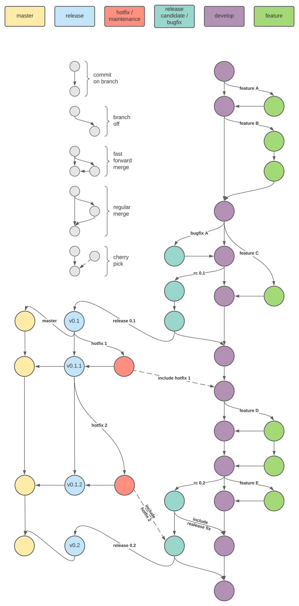

**********
How to git
**********

Main concept
============

We assume, that you know what ``git`` is and how it is basically used.
Otherwise, there are plenty tutorials.  This paragraph is more about the
branching and release / testing strategy.  Concerning the branching, it
is mainly based on the following articles: `A successful branching model
<https://nvie.com/posts/a-successful-git-branching-model/>`__ by Vincent
Driessen and `Gitflow workflow
<https://www.atlassian.com/de/git/tutorials/comparing-workflows/gitflow-workflow>`__
by Atlassian.  Both references might give you a deeper understanding.

There will be the following main branches:

#. **develop**:

   this will be the main development branch, where new features will be
   merged in and new releases are branched off

#. **feature/***:

   these are multiple feature branches like ``feature/count_to_infinity``
   and ``feature/charge_faster``.  So when starting a new feature, branch
   off the develop branch using ``git checkout -b feature/new_stuff
   develop`` and start working.  Depending on the complexity of the
   feature, a feature branch might live for a long time and consist of a
   lot of commits or it might be a small one with only one commit. It is
   advised to keep it as short as possible, so it can be tested inside
   the develop branch.
  
   TOWRITE:

   * single commits should be stable if fast-forward commit should be done
   * public/private
   * when to rebase

#. **release candidate / bugfix**:

   
   * for every release candidate a new branch like ``rc/0.1`` will be
     branched off from development.  No new features should merged in,
     only bugfixes, that might come up during testing.  When testing is
     finished, the release candidate will be branched of to a release
     branch, that gets tagged.
   * simple bugfix branches like ``bugfix/div_by_zero`` will be used for
     fixing bugs
   
   TOWRITE:

   * release strategy
   * how to test release candidates
   * versioning
   * back-merging of bugfixes inside the release candidate branches

#. **release**:

   Once a release candidate has succeeded in all testing, the release
   branch like ``release/0.1`` will be created and should be assumed as
   stable. Furthermore this branch will be used to keep track of shipped
   releases.  So once a bug will be reported in production, that needs
   to be fixed also in the production version.  That bugfix should be
   done on the release branch by branching off a hotfix.

#. **hotfix / maintencance**:

   These branches like ``hotfix/forgot_to_unplug`` will be used as bugfix
   branches which will act directly on the release branch, so they can
   be send back to production immediately.  After finishing the fix, it
   gets merged back to its corresponding release branch and a new minor
   version will be tagged.  Furthermore it will be merged or
   cherry-picked to the current release candidate branch or development
   branch (the decision, which branch to take might be different for
   each scenario).

#. **master**:

   This branch will point always to the latest release.  The idea behind
   this branch is, that it tracks the latest stable version.  In
   contrast, the develop branch should track the latest unstable version
   and the release candidate branch tracks the latest testing version.

A visualization of the branching structure and the corresponding git
commands can be found in the section :ref:`workhorse-example`.  It might
be a good idea to read through the shell script.  You can also execute
it, it should create a folder called ``rnd_git_dir``, and play around.

Best practices
==============

Despite all the best practices you might find online, here are some
more:

* Always try to create branches for seperate work units

  If different units of work are intermixed inside one branch, it is
  harder to seperate commits belonging to different units of works.
  Also tracking down a specific bug to a single commit gets harder.

* If possible, rebase your feature branch against its parent frequently

  Doing that, merging back frequently rebased branch to its parent
  becomes much easier and you also keep track of ongoing and related
  changes that might affect your work.  But keep in mind, that you
  should not rebase public branches, that are used by others - only if
  you set up a conspiracy

* Never rebase public branches

  Rebasing will rewrite the history and therefor will affect all users,
  that already checked our the branch.  Just don't do it!

Tips'n'Tricks for git
=====================

* rebase (interactive), self-rebasing
* stash
* cherry-picking
* merge conflicts

Using private repositories
--------------------------

If you create a local feature branch or some work in progress, and you
don't want to put these things into the main repository, but still want
to have it backup'd somewhere.  You can push this branch to a private
repository.  Let's say for example, the main repository is located at
``https://github.com/SomeProject/SomeRepo`` and you have a private
repository at ``https://github.com/PrivateUser/PrivateRepo``.
Furthermore the main repository is checked out in ``/main_repo``, the
you can do the following:

.. code:: bash

  /main_repo$ git checkout -b wip/new_stuff develop
  /main_repo$ # do some work, add and commit
  /main_repo$ # add private repo as additional remote, called 'private'
  /main_repo$ git remote add private https://github.com/PrivateUser/PrivateRepo
  /main_repo$ git push private

Now, the branch ``wip/new_stuff`` will be pushed to your private
repository. Locally, you can work with that branch like with any other
and some day you might merge or push it to the main repository, whose
remote name is usually origin.

.. _workhorse-example:

Workhorse example
=================

Visualization of the branching structure
----------------------------------------

Corresponding git commands
--------------------------

.. literalinclude:: do_git.sh
  :language: bash
