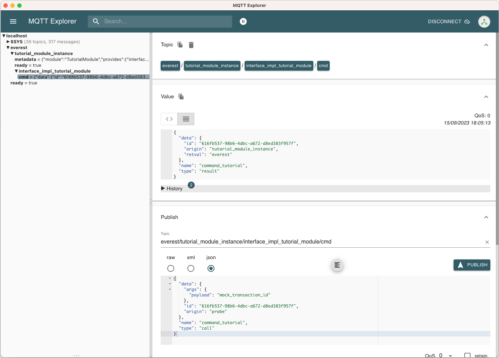

.. _tutorial_create_modules_main:

How To: Develop New Modules
***************************

.. hint::

  The module concept will be improved in the next couple of months with
  new or changed features. We will reflect those changes in the documentation,
  but be aware that there might be some fragments that still show some "old
  style". We would be happy if you drop us a line via the
  `EVerest mailing list <https://lists.lfenergy.org/g/everest>`_ in this case.

This tutorial is meant to show how to develop your own module for the EVerest
framework. This tutorial builds on knowledge that is explained in the
:ref:`Quick Start Guide <quickstartguide_main>`, which is a good starting
point for understanding the central concepts of modules.

Goal Of This Tutorial
=====================

In this tutorial, we will keep everything as simple as possible. You will
learn the following:

1. Define an interface containing a simple command with parameter and return value.
2. Create a module to implements that interface.
3. Define a configuration parameter for the new module.
4. Configure required dependencies of the EVerest framework and modules.
5. Build and run.
6. Connect the module to the system by requiring another module.
7. Implement the new requirement in Python.

Install Prerequisites
=====================

Please follow the :ref:`Quick Start Guide <quickstartguide_main>` to install
all prerequisites into your environment.

After that, you should in particular have:

- The EVerest dependency manager (check via `edm --version`)
- The EVerest cli utility (check via `ev-cli --version`)
- A running MQTT broker (e.g. started as container as described in the setup
  guide; per default expected on localhost on port 1883)

Workspace Setup
===============

This section describes how to setup an EVerest workspace (or at least the
necessary parts of it) to develop EVerest modules.

First, create a directory for your workspace. In the following, we will assume
the environment variable `EVEREST_WORKSPACE` to hold this directory::

    export EVEREST_WORKSPACE=~/ev-workspace
    mkdir -p $EVEREST_WORKSPACE

Now you have two options:

Alternative 1: Setup Workspace via EVerest Dependency Manager
-------------------------------------------------------------

Use the EVerest dependency manager to setup your workspace. This has the
benefit of allowing your to select a specific snapshot (see the corresponding
:ref:`docs<edm_main>` for details), as well as it is a single command::

    edm init --workspace $EVEREST_WORKSPACE

Alternative 2: Clone required repositories
------------------------------------------

If you want to restrict yourself only to the required dependencies, you may also just clone those::

    git clone https:///github.com/EVerest/everest-cmake ${EVEREST_WORKSPACE}/everest-cmake
    git clone https:///github.com/EVerest/everest-framework ${EVEREST_WORKSPACE}/everest-framework
    git clone https:///github.com/EVerest/everest-utils ${EVEREST_WORKSPACE}/everest-utils

Create Module Skeleton
======================

The following describes how to define the fundamental skeleton of a module.
This includes configuration files and the auto-generation of source files.

First, create an empty folder that is to contain your module. In the
following, we assume the environment variable `EVEREST_TUTORIAL_DIR` to hold
this directory, for example::

    export EVEREST_TUTORIAL_DIR=~/everest-tutorial-module
    git clone https://github.com/EVerest/everest-template $EVEREST_TUTORIAL_DIR

This provides you in particular with the `.clang-format` and `.eslintrc.json`
files.

.. note::

  You may want to change the origin remote in this git repository if you are
  going to use it further on. See suitable Git documentation how to do that.
  You might also want to check that you do not take the Git history of the
  `everest-template` repository with you.

Interface Configuration
-----------------------

First, we define an interface that the module provides.
In this very first minimal version, the interface shall provide a single
command `command_tutorial` that can be called by another module and will
just always return the string "everest" as result. We will later give some
ideas how to extend this minimal example.

We store the following interface configuration in form of a .yaml file in
`$EVEREST_TUTORIAL_DIR/interfaces/interface_tutorial_module.yaml`:

..  code-block:: yaml

    description: The interface of the tutorial module.
    cmds:
      command_tutorial:
        description: A command the tutorial module's interface provides. It receives a simple string.
        arguments:
          payload:
            description: An arbitrary string that can be sent to the module.
            type: string
        result:
          description: The answer of the module (which per default will just be "everest").
          type: string

Second, we use the  `ev-cli` tool to auto-generate header files for this
interface::

     cd $EVEREST_TUTORIAL_DIR && ev-cli interface generate-headers --schemas-dir $EVEREST_WORKSPACE/everest-framework/schemas interface_tutorial_module

After this, you should find the following file tree structure in your module::

    .
    ├── build
    │        └── generated
    │            └── include
    │                └── generated
    │                    └── interfaces
    │                        └── interface_tutorial_module
    │                            ├── Implementation.hpp
    │                            ├── Interface.hpp
    │                            └── Types.hpp
    └── interfaces
        └── interface_tutorial_module.yaml

These auto-generated header files in particular provide you with static type
checks when developing against your individual interface.

.. hint::
    It is also possible to work with Javascript or Python. At this point
    we will focus on C++.

Module Configuration
--------------------

Next, we will define our module's manifest.

For this, we create a module directory::

    mkdir -p $EVEREST_TUTORIAL_DIR/modules/TutorialModule

and in it, create file
``$EVEREST_TUTORIAL_DIR/modules/TutorialModule/manifest.yaml`` with the
following content:

..  code-block:: yaml

    description: The Everest Tutorial Module
    config:
      config_tutorial_switch:
        description: A boolean configuration parameter.
        type: boolean
        default: false
    provides:
      interface_impl_tutorial_module:
        interface: interface_tutorial_module
        description: An actual implementation in your module of "interface_tutorial_module" interface.
    metadata:
      license: https://opensource.org/licenses/Apache-2.0
      authors:
        - <Your Name>, <Your Organization>

In particular, this manifest declares the following:

- A boolean configuration parameter `config_tutorial_switch` of the module we
  can define later at runtime.
- The module will implement the `interface_tutorial_module` interface (that
  we have defined before). We give this implementation the name `interface_impl_tutorial_module`.

Again, we use the EVerest cli tool to auto-generate code from this
configuration::

    cd $EVEREST_TUTORIAL_DIR && ev-cli module create --schemas-dir $EVEREST_WORKSPACE/everest-framework/schemas TutorialModule --licenses $EVEREST_WORKSPACE/everest-utils/ev-dev-tools/src/ev_cli/licenses

After that, you should have the following file structure::

    .
    ├── build
    │        └── generated
    │            (...)
    ├── config
    ├── interfaces
    │        └── interface_tutorial_module.yaml
    └── modules
        └── TutorialModule
            ├── CMakeLists.txt
            ├── TutorialModule.cpp
            ├── TutorialModule.hpp
            ├── doc.rst
            ├── docs
            │        └── index.rst
            ├── interface_impl_tutorial_module
            │        ├── interface_tutorial_moduleImpl.cpp
            │        └── interface_tutorial_moduleImpl.hpp
            └── manifest.yaml

Let us point out a few particularly important files:

**TutorialModule{.hpp,.cpp}:**

This provides the module's callbacks called by the EVerest framework at
startup, more precisely in initialization and system-ready state. Here,
the auto-generated implementation already calls the respective callbacks of
its interface implementations.

Among others, you'll furthermore find the module's configuration and a pointer
to the interface implementations.

**interface_impl_tutorial_module/interface_tutorial_moduleImpl{.hpp,.cpp}:**
For each interface implementation (here, only a single one is defined), the
respective header and source files are generated.

The header file declares particular spots for non-auto-generated code.

Observe that the default implementation of the handler of the
`command_tutorial` coincidentally already satisfies this tutorial's needs:

..  code-block:: cpp

    std::string interface_tutorial_moduleImpl::handle_command_tutorial(std::string& payload) {
    // your code for cmd command_tutorial goes here
    return "everest";
    }

Build Configuration & Build
===========================

This section describes the additional steps needed to build your project and
install it.

Adding CMakeLists.txt in the root directory
-------------------------------------------
The ``$EVEREST_TUTORIAL_DIR/CMakeLists.txt`` file in the root of your project
repository will need to import some build commands from the framework, as well
as link to its dependencies. A fairly simple file that includes
``everest-core`` into the build would look as follows::

    cmake_minimum_required(VERSION 3.14.7)
    project(everest-tutorial VERSION 0.1
        DESCRIPTION "EVerest tutorial modules"
        LANGUAGES CXX C)
    find_package(everest-cmake 0.1 REQUIRED
        COMPONENTS bundling
        PATHS ../everest-cmake
    )
    # options
    option(BUILD_TESTING "Run unit tests" OFF)
    option(CMAKE_RUN_CLANG_TIDY "Run clang-tidy" OFF)
    # dependencies
    if (NOT DISABLE_EDM)
        evc_setup_edm()
    else()
        find_package(everest-core)
        # InfyPowerACDC uses pal-sigslot
        find_package(PalSigslot REQUIRED)
    endif()
    ev_add_project()

    # config (not needed if you do not need a run script for your configuration)
    # add_subdirectory(config)

    # configure clang-tidy if requested
    if(CMAKE_RUN_CLANG_TIDY)
        message("Enabling clang-tidy")
        set(CMAKE_CXX_CLANG_TIDY clang-tidy)
    endif()
    # testing
    if(BUILD_TESTING)
        include(CTest)
        set(CMAKE_BUILD_TYPE Debug CACHE STRING "Build type" FORCE)
        evc_include(CodeCoverage)
        append_coverage_compiler_flags()
        add_subdirectory(tests)
        setup_target_for_coverage_gcovr_html(
            NAME gcovr_coverage
            EXECUTABLE test_config
            DEPENDENCIES test_config everest
        )
        setup_target_for_coverage_lcov(
            NAME lcov_coverage
            EXECUTABLE test_config
            DEPENDENCIES test_config everest
        )
    endif()

Adding ``modules/CMakeLists.txt``
---------------------------------

Next, ``$EVEREST_TUTORIAL_DIR/modules/CMakeLists.txt`` essentially tells CMake
where to look for modules, in order to add them to the build.

It contains a single line per module. To proceed, create the file and then add the following line, as per our example::

    ev_add_module(TutorialModule)

Note that you could also develop several modules at once in your repository.
In that case you would add a respective `ev_add_module(<MODULE_NAME>)` line
for each of those.

Adding ``dependencies.yaml``
----------------------------

The ``find-package()`` CMake directive found in the previous sections is
handled by EDM.

In order for this to work, you need to add a dependency file for EDM, called
``dependencies.yaml``, in the project root directory. For example, listing
only ``everest-core`` as a dependency looks like this::

    ---
    everest-core:
      git: https://github.com/EVerest/everest-core.git
      git_tag: main

With the above setup taken care of, you are now ready to build the project.

Building
--------

When you auto-generated the code for the interfaces and modules, a ``build/``
directory should have appeared.

You can also build the project there - go to it, and configure the build::

    cd $EVEREST_TUTORIAL_DIR/build
    CMAKE_PREFIX_PATH=$EVEREST_WORKSPACE cmake --install-prefix $EVEREST_TUTORIAL_DIR/dist ..

Here, we added two instructions to cmake:

 - Setting `CMAKE_PREFIX_PATH=$EVEREST_WORKSPACE` allows cmake to find the
   ``everest-cmake`` repository in the workspace.
 - Specifying the `--install-prefix` allows you to specify where the finished
   binaries will be placed, e.g. into the ``dist/`` folder in the modules repository.
   EVerest can be installed system wide (e.g. into ``users/local/bin``), but this
   usually requires `sudo` permissions.

Then, build and install the project::

    cd $EVEREST_TUTORIAL_DIR/build
    make -j <number of parallel jobs>

And finally, install the binaries::

    make install -j <number of parallel jobs>

If everything worked smoothly so far, your modules are installed and ready to
run.

Run Configuration & Run
=======================

EVerest configuration
---------------------

The final step to run EVerest and testing the new module is to define an
EVerest run configuration. For this, create a file
``$EVEREST_TUTORIAL_DIR/config/config-modules-tutorial.yaml`` with the following
content:

..  code-block:: yaml

    active_modules:
      tutorial_module_instance:
        module: TutorialModule

This provides a very minimalistic run configuration for EVerest telling to run
with a single module, namely the newly created one.

Adding and activating ``config/CMakeLists.txt``
-----------------------------------------------

The EVerest cmake utils provide a function to auto-generate run scripts for
your configurations.

In order to achieve this, create the file ``$EVEREST_TUTORIAL_DIR/config/CMakeLists.txt`` with content::

        generate_config_run_script(CONFIG modules-tutorial)

Here, the `generate_config_run_script(<CONFIG_NAME>)` expects the existence of
a file ``config-<CONFIG_NAME>.yaml``.

It will then generate a run script for this configuration.

You must then "activate" this configuraton by adapting the
``$EVEREST_TUTORIAL_DIR/CMakeLists.txt`` file removing the commenting `#`
before the `add_subdirectory(config)` instruction, i.e.:

    # config
    # (not needed if you do not need a run script for your configuration)
    add_subdirectory(config)

After that, once more run cmake::

    cd $EVEREST_TUTORIAL_DIR/build
    CMAKE_PREFIX_PATH=$EVEREST_WORKSPACE cmake --install-prefix $EVEREST_TUTORIAL_DIR/dist ..
    make
    make install

Running EVerest
---------------

The step before should have created a file
``$EVEREST_TUTORIAL_DIR/build/run-scripts/run-modules-tutorial.sh``.

Up to path substitution this will have the following content::

    LD_LIBRARY_PATH=$EVEREST_TUTORIAL_DIR/dist/lib:$LD_LIBRARY_PATH \
    PATH=$EVEREST_TUTORIAL_DIR/dist/bin:$PATH \
    manager \
        --prefix $EVEREST_TUTORIAL_DIR/dist \
        --conf $EVEREST_TUTORIAL_DIR/config/config-modules-tutorial.yaml

It puts the compiled libraries and binaries into the respective paths, and
then runs EVerest by calling the `manager` binary with the respective
configuration.

Importantly, the configuration must not be known before runtime (since also in
our example it was only used to generate the run script, not to build the
project!).

Executing ``run-modules-tutorial.sh`` then should start EVerest, and provide
an output similar to::

    YYYY-MM-DD 00:00:12.500139 [INFO] manager          :: 8< 8< 8< ------------------------------------------------------------------------------ 8< 8< 8<
    YYYY-MM-DD 00:00:12.500327 [INFO] manager          :: EVerest manager starting using /home/everest/everest-module-tutorial/config/config-modules-tutorial.yaml
    YYYY-MM-DD 00:00:12.500354 [INFO] manager          :: EVerest using MQTT broker localhost:1883
    YYYY-MM-DD 00:00:12.799618 [INFO] everest_ctrl     :: everest controller process started ...
    YYYY-MM-DD 00:00:12.799822 [INFO] everest_ctrl     :: Launching controller service on port 8849
    YYYY-MM-DD 00:00:13.120267 [INFO] tutorial_module  :: Module tutorial_module_instance initialized.
    YYYY-MM-DD 00:00:13.149934 [INFO] manager          :: >>> All modules are initialized. EVerest up and running <<<

If your socket can't be connected, make sure that your MQTT brocker is running.

Observing the System
====================

In this final section we describe how to observe the behavior of your module
and debug it.

Exploring with MQTT Explorer
----------------------------
The open-source tool `MQTT Explorer <https://github.com/thomasnordquist/MQTT-Explorer>`_  can be utilized to
observe the module communication in EVerest.

With your MQTT broker running on localhost:1883, you should be able to connect
right away when opening MQTT explorer.

Then start (or re-start) the EVerest manager (as described above). You should
notice an `everest` topic popping up.

We can now publish a command to our self-written module. For this, choose the topic::

    everest/modules/tutorial_module_instance/impl/interface_impl_tutorial_module/cmd

and publish the JSON::

    {
      "data": {
        "args": {
          "payload": "Hello World!"
        },
        "id": "00000000-0000-0000-0000-000000000042",
        "origin": "manual_test"
      },
      "name": "command_tutorial",
      "type": "call"
    }

Our module should return with a "everest" response (you may have to reselect
the `everest/tutorial_module_instance/interface_impl_tutorial_module/cmd`
on the left to refresh this view.

Debugging
---------

At the latest  when you start developing an actual module, it might come handy
to be able to debug your code. Thus, the following shall provide some
rudimentary steps to do so.

*1) Rebuild with debug flags enabled*

Rerun Cmake, this time with `-DCMAKE_BUILD_TYPE=Debug`, and rebuild::

    cd $EVEREST_TUTORIAL_DIR/build
    CMAKE_PREFIX_PATH=$EVEREST_WORKSPACE cmake --install-prefix $EVEREST_TUTORIAL_DIR/dist -DCMAKE_BUILD_TYPE=Debug ..
    make -j <number of parallel jobs>

*2) Start EVerest with your module with your module marked as "standalone"*

With EVerest built as described before, but with the additonal option
``--standalone tutorial_module_instance``::

    LD_LIBRARY_PATH=$EVEREST_TUTORIAL_DIR/dist/lib:$LD_LIBRARY_PATH \
    PATH=$EVEREST_TUTORIAL_DIR/dist/bin:$PATH \
    manager --prefix $EVEREST_TUTORIAL_DIR/dist  --conf $EVEREST_TUTORIAL_DIR/config/config-modules-tutorial.yaml --standalone tutorial_module_instance

This starts EVerest, but without your module. Instead, the output contains a
line::

    manager          :: Not starting standalone module: tutorial_module_instance

Also, so far the output should be missing the ``All modules are initialized. EVerest up and running``
notification, since it keeps waiting for your module
to spin up.

*3) Start your module with a debugger*:

Now open a second terminal (while keeping EVerest running in the frist
terminal), and start your  module via ``gdb``::

    cd $EVEREST_TUTORIAL_DIR/build
    gdb --args ./modules/TutorialModule/TutorialModule --module tutorial_module_instance  --conf $EVEREST_TUTORIAL_DIR/config/config-modules-tutorial.yaml --prefix $EVEREST_TUTORIAL_DIR/dist

In gdb, we set a break in the line that returns the payload when  your test
command is hit.
We then run the program (you might need to adjust the line number)::

    break modules/TutorialModule/interface_impl_tutorial_module/interface_tutorial_moduleImpl.cpp:17
    run

After the ``run`` command, you should notify in your Everest terminal that all
modules have now started. You may now again use MQTT Explorer as before and
send a command call via MQTT, this should hit your set breakpoint with a
output similar to::

    Thread 4 "tutorial_module" hit Breakpoint 1, module::interface_impl_tutorial_module::interface_tutorial_moduleImpl::handle_command_tutorial (this=0xaaaaaad24fc0, payload="mock_transaction_id") at /tmp/everest-tutorial-verify/modules/TutorialModule/interface_impl_tutorial_module/interface_tutorial_moduleImpl.cpp:17
    17	    return "everest";

Of course, you might setup your favorite IDE in a similar way for a nicer
debugging experience.

Extending the Module
====================

Having prepared a buildable and runnable module, we can now extend the logic
of our implementation to interact with the rest of the system.

One way to connect a module to other modules in the system is by requiring
interfaces. First, create a new interface in `intefaces/countdown_interface.yaml`:

..  code-block:: yaml

    description: Countdown interface
    cmds:
      start:
        description: Start the countdown
        arguments:
          start_value:
            description: Start value of the countdown
            type: string
        result:
          description: Whether the countdown has started
          type: boolean
    vars:
      value:
        description: Current countdown value
        type: integer

Now require that interface in the tutorial module by adding a requirements block
to `modules/TutorialModule/manifest.yaml`:

..  code-block:: yaml

    # ...
    requires:
      countdown:
         interface: countdown_interface

Adding a new requirement necessitates regenerating some of our source code.
The `ev-cli` tool can help with that::

    cd $EVEREST_TUTORIAL_DIR && ev-cli module update --force --schemas-dir $EVEREST_WORKSPACE/everest-framework/schemas TutorialModule

The `force` flag makes sure that the tool doesn't skip existing files, but
still overwrites what is necessary to reflect changes in the manifest.

Now we can implement our interaction with the timer in `interface_tutorial_moduleImpl.cpp`:

..  code-block:: cpp

    #include "interface_tutorial_moduleImpl.hpp"

    #include <everest/logging.hpp>

    namespace module {
    namespace interface_impl_tutorial_module {

    void interface_tutorial_moduleImpl::init() {
        mod->r_countdown->subscribe_value( {
            if (value > 0) {
                EVLOG_info << "Countdown: " << value;
            } else {
                EVLOG_info << "Countdown complete";
            }
        });
        EVLOG_info << "Tutorial module implementation initialized";
    }

    void interface_tutorial_moduleImpl::ready() {
        EVLOG_info << "Tutorial module implementation ready";
    }

    std::string interface_tutorial_moduleImpl::handle_command_tutorial(std::string& payload) {
        if (mod->r_countdown->call_start(payload)) {
            EVLOG_info << "Started countdown";
        } else {
            EVLOG_warning << "Countdown failed";
        }
        return "everest";
    }

    } // namespace interface_impl_tutorial_module
    } // namespace module

Note that the framework has used the countdown interface definition and the module requirements to
define `r_countdown` and its methods `call_start` and `subscribe_value`.

Implementing a Module in Python
-------------------------------

Now let's define an implementation of the countdown interface in Python. EVerest doesn't
provide the same code-generation for Python as it does for C++, so module authors have to
write the module implementation themselves.

First, create a folder for our module called `PyCountdown` and create the necessary files::

    cd $EVEREST_TUTORIAL_DIR && mkdir modules/PyCountdown && touch modules/PyCountdown/{CMakeLists.txt,manifest.yaml,module.py}

..  note::

    Modules implemented in Python must have their names prefixed with "Py" so the EVerest build
    system knows how to handle them.

In `modules/PyCountdown/manifest.yaml`, add the following:

..  code-block:: yaml

    description: A countdown module
    provides:
      countdown:
        interface: countdown_interface
        description: Countdown implementation
    metadata:
      license: https://opensource.org/licenses/Apache-2.0
      authors:
        - <Your Name>, <Your Organization>

Finally, implement the module in `modules/PyCountdown/module.py`:

..  code-block:: Python

    import time
    from threading import Event

    from everest.framework import Module, RuntimeSession, log

    class PyCountdown:
        def __init__(self):
            # Set up the module.
            self.module = Module(RuntimeSession())
            self.setup = self.module.say_hello()
            self.ready = Event()
            self.count = 0

            # Map interface commands to handler functions.
            self.setup_command_handlers()

            # Let EVerest know that initialization is complete.
            self.module.init_done()

        def run(self):
            try:
                while True:
                    self.ready.wait()
                    while self.count >= 0:
                        self.module.publish_variable("countdown", "value", self.count)
                        self.count -= 1
                        time.sleep(1)
            except KeyboardInterrupt:
                pass

        def handle_start(self, args):
            try:
                count = int(args["start_value"])
                if count <= 0:
                    return False
                self.count = count
                self.ready.set()
                return True
            except:
                return False

        def setup_command_handlers(self):
            for cmd in self.module.implementations["countdown"].commands:
                self.module.implement_command("countdown", cmd, getattr(self, f"handle_{cmd}"))

    module = PyCountdown()
    module.run()

Note that, along with some of the boilerplate, module authors must also implement
some kind of run loop so that the process won't exit immediately.

Don't forget to add the new module to the build system in `modules/CMakeLists.txt`::

    ev_add_module(TutorialModule)
    ev_add_module(PyCountdown)

Connecting the Modules At Runtime
---------------------------------

Our tutorial module requires an implementation of the countdown interface, so let's add
the new module to the config in `config-everest-tutorial-module.yaml`:

..  code-block:: yaml

    active_modules:
      tutorial_module_instance:
        module: TutorialModule
        connections:
          countdown:
            - module_id: countdown
              implementation_id: countdown
      countdown:
        module: PyCountdown

After building the project and running the script, try sending the `command_tutorial` command
as before. If the payload is a number string, PyCountdown will count down from that number until
it reaches zero. If the payload is not a valid number, the tutorial module will log that the
countdown was unsuccessful.

Next Steps
==========

With the basics covered, you're ready to start exploring more advanced usages of EVerest, like:

* Requiring more than one implementation of an interface
* Writing modules in JavaScript and Rust
* Implementing board support interfaces
* EVerest APIs
* Much more!

Please reach out on the mailing list or Zulip if you have questions, and happy charging!

