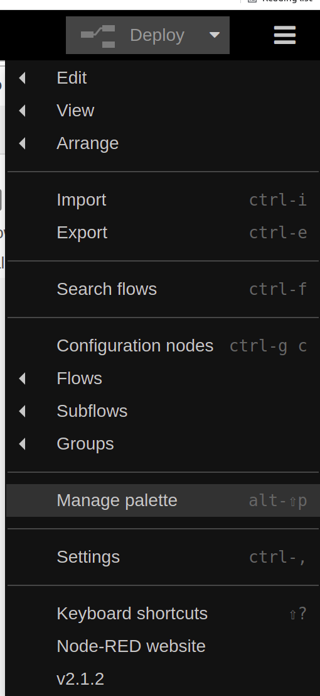
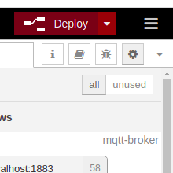

.. doc_sil

How To: Simulate EVerest in software
####################################

A successful `build <https://github.com/EVerest/everest-core#ubuntu-2004>`_ of everest is required.
First we need to run the docker container for **mqtt**, **ocpp**, **nodered** and **steve**.

(this can take a while on first run)::
	
	cd ~/checkout/everest-workspace/everest-utils/docker
	sudo docker-compose up -d

To create the nodered dashboard, open a webbrowser of your choice and open the url::

	http://localhost:1880/

This will open the nodered flowchart editor. 

First we install the neccesary nodes.
Click on *Manage Palette* in the upper right corner menu:

Make sure you have installed the following nodes by typing their names in the *Search modules* bar in the *Install section*:

- node-red
- node-red-contrib-ui-actions
- node-red-contrib-ui-level
- node-red-dashboard
- node-red-node-ui-table

Now we import the flow:
In the upper right corner menu select *IMPORT*:

Copy the following flow into the empty field::

	[{"id":"9aafbf849d4d6e12","type":"tab","label":"Debug","disabled":false,"info":""},{"id":"ed603c51db9dcbb9","type":"tab","label":"Connector 1","disabled":false,"info":""},{"id":"af1e1eeac9c4b704","type":"group","z":"ed603c51db9dcbb9","style":{"stroke":"#999999","stroke-opacity":"1","fill":"none","fill-opacity":"1","label":true,"label-position":"nw","color":"#a4a4a4"},"nodes":["1295e032d7ddbc20"],"x":1114,"y":439,"w":152,"h":82},{"id":"7140803fb3989089","type":"ui_base","theme":{"name":"theme-custom","lightTheme":{"default":"#0094CE","baseColor":"#0094CE","baseFont":"-apple-system,BlinkMacSystemFont,Segoe UI,Roboto,Oxygen-Sans,Ubuntu,Cantarell,Helvetica Neue,sans-serif","edited":true,"reset":false},"darkTheme":{"default":"#097479","baseColor":"#097479","baseFont":"-apple-system,BlinkMacSystemFont,Segoe UI,Roboto,Oxygen-Sans,Ubuntu,Cantarell,Helvetica Neue,sans-serif","edited":true,"reset":false},"customTheme":{"name":"EVerest","default":"#4B7930","baseColor":"#2a62ac","baseFont":"-apple-system,BlinkMacSystemFont,Segoe UI,Roboto,Oxygen-Sans,Ubuntu,Cantarell,Helvetica Neue,sans-serif","reset":false},"themeState":{"base-color":{"default":"#2a62ac","value":"#2a62ac","edited":true},"page-titlebar-backgroundColor":{"value":"#2a62ac","edited":false},"page-backgroundColor":{"value":"#111111","edited":false},"page-sidebar-backgroundColor":{"value":"#333333","edited":false},"group-textColor":{"value":"#4f88d4","edited":false},"group-borderColor":{"value":"#555555","edited":false},"group-backgroundColor":{"value":"#333333","edited":false},"widget-textColor":{"value":"#eeeeee","edited":false},"widget-backgroundColor":{"value":"#2a62ac","edited":false},"widget-borderColor":{"value":"#333333","edited":false},"base-font":{"value":"-apple-system,BlinkMacSystemFont,Segoe UI,Roboto,Oxygen-Sans,Ubuntu,Cantarell,Helvetica Neue,sans-serif"}},"angularTheme":{"primary":"indigo","accents":"blue","warn":"red","background":"grey","palette":"light"}},"site":{"name":"EVerest","hideToolbar":"false","allowSwipe":"false","lockMenu":"false","allowTempTheme":"true","dateFormat":"DD.MM.YYYY","sizes":{"sx":48,"sy":48,"gx":6,"gy":6,"cx":6,"cy":6,"px":6,"py":6}}},{"id":"fc8686af.48d178","type":"mqtt-broker","name":"","broker":"localhost","port":"1883","clientid":"","usetls":false,"protocolVersion":"4","keepalive":"60","cleansession":true,"birthTopic":"","birthQos":"0","birthPayload":"","birthMsg":{},"closeTopic":"","closeQos":"0","closePayload":"","closeMsg":{},"willTopic":"","willQos":"0","willPayload":"","willMsg":{},"sessionExpiry":""},{"id":"5e36140d.127f1c","type":"ui_group","name":"PowerMeter","tab":"50c487c1.27e508","order":2,"disp":true,"width":"6","collapse":false},{"id":"ebbb0e3f.53fbf","type":"ui_group","name":"Actions","tab":"50c487c1.27e508","order":2,"disp":true,"width":"6","collapse":false},{"id":"1709edaf.162962","type":"ui_group","name":"Debug","tab":"50c487c1.27e508","order":3,"disp":true,"width":"6","collapse":false},{"id":"8d6f402b.8f007","type":"ui_group","name":"KeepAlive","tab":"50c487c1.27e508","order":5,"disp":true,"width":"6","collapse":false},{"id":"1ebee360.265b5d","type":"ui_group","name":"PowerMeter","tab":"50c487c1.27e508","order":6,"disp":true,"width":"6","collapse":false},{"id":"d3f19d5c.593e5","type":"ui_group","name":"State","tab":"50c487c1.27e508","order":4,"disp":true,"width":"6","collapse":false},{"id":"b364f7eb4621082b","type":"ui_group","name":"Connector 1","tab":"d3ada9fa4cf6ac53","order":2,"disp":true,"width":"6","collapse":false},{"id":"7cd2ccabb1265f7a","type":"ui_group","name":"RFID","tab":"d3ada9fa4cf6ac53","order":1,"disp":true,"width":"6","collapse":false},{"id":"21e40a4a97a50168","type":"ui_group","name":"Connector 2","tab":"d3ada9fa4cf6ac53","order":3,"disp":true,"width":"6","collapse":false},{"id":"84ddb762.5129f8","type":"ui_tab","name":"Home","icon":"dashboard","disabled":false,"hidden":false},{"id":"427a83e7f6d33afc","type":"ui_tab","name":"Home","icon":"dashboard","order":1,"disabled":false,"hidden":false},{"id":"27225dc1005441da","type":"ui_spacer","z":"9aafbf849d4d6e12","name":"spacer","group":"27651fee38a05406","order":4,"width":1,"height":1},{"id":"7120e41583a9165f","type":"ui_spacer","z":"9aafbf849d4d6e12","name":"spacer","group":"27651fee38a05406","order":4,"width":1,"height":1},{"id":"efce370cfc8e4f9b","type":"ui_spacer","z":"9aafbf849d4d6e12","name":"spacer","group":"","order":2,"width":6,"height":1},{"id":"794d727ae2866f12","type":"ui_spacer","z":"9aafbf849d4d6e12","name":"spacer","group":"","order":5,"width":"6","height":"1"},{"id":"50c487c1.27e508","type":"ui_tab","name":"Debug","icon":"fa-fire","disabled":false,"hidden":false},{"id":"d3ada9fa4cf6ac53","type":"ui_tab","name":"Home","icon":"dashboard","order":1,"disabled":false,"hidden":false},{"id":"3c7214a9dd24b0ad","type":"ui_tab","name":"EVSE Configuration","icon":"dashboard","order":1,"disabled":false,"hidden":false},{"id":"c8955752ad17f297","type":"mqtt in","z":"9aafbf849d4d6e12","name":"","topic":"/external/powermeter/vrmsL1","qos":"2","datatype":"auto","broker":"fc8686af.48d178","nl":false,"rap":true,"rh":0,"x":180,"y":100,"wires":[["b1d3d31a92c2c68d"]]},{"id":"b1d3d31a92c2c68d","type":"ui_chart","z":"9aafbf849d4d6e12","name":"","group":"5e36140d.127f1c","order":11,"width":0,"height":0,"label":"vrmsL1","chartType":"line","legend":"false","xformat":"HH:mm:ss","interpolate":"linear","nodata":"","dot":false,"ymin":"","ymax":"","removeOlder":"60","removeOlderPoints":"","removeOlderUnit":"1","cutout":0,"useOneColor":false,"useUTC":false,"colors":["#1f77b4","#aec7e8","#ff7f0e","#2ca02c","#98df8a","#d62728","#ff9896","#9467bd","#c5b0d5"],"outputs":1,"useDifferentColor":false,"x":400,"y":100,"wires":[[]]},{"id":"a4bef87a56ade625","type":"mqtt out","z":"9aafbf849d4d6e12","name":"","topic":"/external/cmd/enable","qos":"1","retain":"false","respTopic":"","contentType":"","userProps":"","correl":"","expiry":"","broker":"fc8686af.48d178","x":500,"y":440,"wires":[]},{"id":"6c1a9684ee9cff1b","type":"mqtt out","z":"9aafbf849d4d6e12","name":"","topic":"/external/cmd/disable","qos":"1","retain":"false","respTopic":"","contentType":"","userProps":"","correl":"","expiry":"","broker":"fc8686af.48d178","x":500,"y":480,"wires":[]},{"id":"7b7910abcebe9ea8","type":"ui_switch","z":"9aafbf849d4d6e12","name":"","label":"Enabled","tooltip":"","group":"ebbb0e3f.53fbf","order":5,"width":0,"height":0,"passthru":true,"decouple":"false","topic":"topic","topicType":"msg","style":"","onvalue":"true","onvalueType":"bool","onicon":"","oncolor":"","offvalue":"false","offvalueType":"bool","officon":"","offcolor":"","animate":false,"x":120,"y":460,"wires":[["f68fa199eb0c13b0"]]},{"id":"f68fa199eb0c13b0","type":"switch","z":"9aafbf849d4d6e12","name":"","property":"payload","propertyType":"msg","rules":[{"t":"true"},{"t":"false"}],"checkall":"true","repair":false,"outputs":2,"x":280,"y":460,"wires":[["a4bef87a56ade625"],["6c1a9684ee9cff1b"]]},{"id":"be7373d5f1fc78e3","type":"ui_switch","z":"9aafbf849d4d6e12","name":"","label":"setThreePhases","tooltip":"","group":"ebbb0e3f.53fbf","order":5,"width":0,"height":0,"passthru":true,"decouple":"false","topic":"topic","topicType":"msg","style":"","onvalue":"true","onvalueType":"bool","onicon":"","oncolor":"","offvalue":"false","offvalueType":"bool","officon":"","offcolor":"","animate":false,"x":140,"y":540,"wires":[["ee61573475970e13"]]},{"id":"ee61573475970e13","type":"mqtt out","z":"9aafbf849d4d6e12","name":"","topic":"/external/cmd/set_three_phases","qos":"1","retain":"false","respTopic":"","contentType":"","userProps":"","correl":"","expiry":"","broker":"fc8686af.48d178","x":370,"y":540,"wires":[]},{"id":"1e33ee217d09343a","type":"ui_switch","z":"9aafbf849d4d6e12","name":"","label":"enableRCD","tooltip":"","group":"ebbb0e3f.53fbf","order":5,"width":0,"height":0,"passthru":true,"decouple":"false","topic":"topic","topicType":"msg","style":"","onvalue":"true","onvalueType":"bool","onicon":"","oncolor":"","offvalue":"false","offvalueType":"bool","officon":"","offcolor":"","animate":false,"x":130,"y":600,"wires":[["7f1db77313661cf3"]]},{"id":"7f1db77313661cf3","type":"mqtt out","z":"9aafbf849d4d6e12","name":"","topic":"/external/cmd/enable_rcd","qos":"1","retain":"false","respTopic":"","contentType":"","userProps":"","correl":"","expiry":"","broker":"fc8686af.48d178","x":350,"y":600,"wires":[]},{"id":"23610d2f3c1a674b","type":"ui_switch","z":"9aafbf849d4d6e12","name":"","label":"setHasVentilation","tooltip":"","group":"ebbb0e3f.53fbf","order":5,"width":0,"height":0,"passthru":true,"decouple":"false","topic":"topic","topicType":"msg","style":"","onvalue":"true","onvalueType":"bool","onicon":"","oncolor":"","offvalue":"false","offvalueType":"bool","officon":"","offcolor":"","animate":false,"x":150,"y":660,"wires":[["d40cd5658151e3ca"]]},{"id":"d40cd5658151e3ca","type":"mqtt out","z":"9aafbf849d4d6e12","name":"","topic":"/external/cmd/set_has_ventilation","qos":"1","retain":"false","respTopic":"","contentType":"","userProps":"","correl":"","expiry":"","broker":"fc8686af.48d178","x":420,"y":660,"wires":[]},{"id":"d62a89349e2d9147","type":"mqtt out","z":"9aafbf849d4d6e12","name":"","topic":"/external/cmd/set_auth","qos":"1","retain":"false","respTopic":"","contentType":"","userProps":"","correl":"","expiry":"","broker":"fc8686af.48d178","x":380,"y":220,"wires":[]},{"id":"49a61fca4e975f0d","type":"ui_button","z":"9aafbf849d4d6e12","name":"","group":"ebbb0e3f.53fbf","order":1,"width":0,"height":0,"passthru":false,"label":"setAuth(USERID)","tooltip":"","color":"","bgcolor":"","icon":"","payload":"USERID","payloadType":"str","topic":"topic","topicType":"msg","x":150,"y":220,"wires":[["d62a89349e2d9147"]]},{"id":"4a20ae416f941363","type":"ui_switch","z":"9aafbf849d4d6e12","name":"","label":"switch3phWhileCharging","tooltip":"","group":"ebbb0e3f.53fbf","order":5,"width":0,"height":0,"passthru":true,"decouple":"false","topic":"topic","topicType":"msg","style":"","onvalue":"true","onvalueType":"bool","onicon":"","oncolor":"","offvalue":"false","offvalueType":"bool","officon":"","offcolor":"","animate":false,"x":170,"y":720,"wires":[["9f997a83d8c5e502"]]},{"id":"9f997a83d8c5e502","type":"mqtt out","z":"9aafbf849d4d6e12","name":"","topic":"/external/cmd/switch_three_phases_while_charging","qos":"1","retain":"false","respTopic":"","contentType":"","userProps":"","correl":"","expiry":"","broker":"fc8686af.48d178","x":530,"y":720,"wires":[]},{"id":"b0dbe5826f92035e","type":"mqtt in","z":"9aafbf849d4d6e12","name":"","topic":"/external/debug_json","qos":"2","datatype":"auto","broker":"fc8686af.48d178","nl":false,"rap":true,"rh":0,"x":160,"y":960,"wires":[["a62346afa82d2aa1"]]},{"id":"a62346afa82d2aa1","type":"json","z":"9aafbf849d4d6e12","name":"","property":"payload","action":"","pretty":false,"x":350,"y":960,"wires":[["971b16b8195f14bb"]]},{"id":"971b16b8195f14bb","type":"function","z":"9aafbf849d4d6e12","name":"","func":"var json = msg.payload;\n\n\n//tab[top] = {'Variable' : top, 'Value' : pay};\n\n\nnewpayload = [];\nfor(var index in json) {\n    newpayload.push({'Variable' : index, 'Value' : json[index]});\n}\n\nmsg.payload = newpayload;\nreturn msg;","outputs":1,"noerr":0,"initialize":"","finalize":"","libs":[],"x":510,"y":960,"wires":[["b79f8c3549cdb63e"]]},{"id":"b79f8c3549cdb63e","type":"ui_table","z":"9aafbf849d4d6e12","group":"1709edaf.162962","name":"Debug","order":12,"width":"6","height":"11","columns":[],"outputs":0,"cts":false,"x":680,"y":960,"wires":[]},{"id":"105b9eab50b4db7f","type":"mqtt in","z":"9aafbf849d4d6e12","name":"","topic":"/external/keepalive_json","qos":"2","datatype":"auto","broker":"fc8686af.48d178","nl":false,"rap":true,"rh":0,"x":170,"y":1140,"wires":[["f9bce2148fd0d745"]]},{"id":"f9bce2148fd0d745","type":"json","z":"9aafbf849d4d6e12","name":"","property":"payload","action":"","pretty":false,"x":350,"y":1140,"wires":[["81c08d60fe305390"]]},{"id":"81c08d60fe305390","type":"function","z":"9aafbf849d4d6e12","name":"","func":"var json = msg.payload;\n\n\n//tab[top] = {'Variable' : top, 'Value' : pay};\n\n\nnewpayload = [];\nfor(var index in json) {\n    newpayload.push({'Variable' : index, 'Value' : json[index]});\n}\n\nmsg.payload = newpayload;\nreturn msg;","outputs":1,"noerr":0,"initialize":"","finalize":"","libs":[],"x":510,"y":1140,"wires":[["24770a798c2cc78c"]]},{"id":"24770a798c2cc78c","type":"ui_table","z":"9aafbf849d4d6e12","group":"8d6f402b.8f007","name":"KeepAlive","order":12,"width":"6","height":"4","columns":[],"outputs":0,"cts":false,"x":690,"y":1140,"wires":[]},{"id":"b2e6e05e396ff846","type":"mqtt in","z":"9aafbf849d4d6e12","name":"","topic":"/external/powermeter_json","qos":"2","datatype":"auto","broker":"fc8686af.48d178","nl":false,"rap":true,"rh":0,"x":170,"y":1200,"wires":[["bff81951aab38e7c"]]},{"id":"bff81951aab38e7c","type":"json","z":"9aafbf849d4d6e12","name":"","property":"payload","action":"","pretty":false,"x":360,"y":1200,"wires":[["685dcdcf457910a6"]]},{"id":"685dcdcf457910a6","type":"function","z":"9aafbf849d4d6e12","name":"","func":"var json = msg.payload;\n\n\n//tab[top] = {'Variable' : top, 'Value' : pay};\n\n\nnewpayload = [];\nfor(var index in json) {\n    newpayload.push({'Variable' : index, 'Value' : json[index]});\n}\n\nmsg.payload = newpayload;\nreturn msg;","outputs":1,"noerr":0,"initialize":"","finalize":"","libs":[],"x":520,"y":1200,"wires":[["854cee03b9be0de5"]]},{"id":"854cee03b9be0de5","type":"ui_table","z":"9aafbf849d4d6e12","group":"1ebee360.265b5d","name":"PowerMeter","order":12,"width":"6","height":"11","columns":[],"outputs":0,"cts":false,"x":710,"y":1200,"wires":[]},{"id":"dd9a01731c23f076","type":"mqtt in","z":"9aafbf849d4d6e12","name":"","topic":"/external/state/#","qos":"2","datatype":"auto","broker":"fc8686af.48d178","nl":false,"rap":true,"rh":0,"x":140,"y":1020,"wires":[["181994551d5096a8"]]},{"id":"181994551d5096a8","type":"function","z":"9aafbf849d4d6e12","name":"","func":"let cur_topic_index = -1;\nlet topics_list_length = 0;\n\nvar topics_list = global.get(\"state_topics_list\");\nvar payload_list = global.get(\"state_payload_list\");\nvar new_payload = [];\n\nfor (var topics_list_index in topics_list) {\n    if ( (topics_list[topics_list_index].indexOf(msg.topic) >= 0) && (topics_list[topics_list_index].length == msg.topic.length) ) {\n        cur_topic_index = topics_list_index;\n        break;\n    }\n    topics_list_length++;\n}\n\nif (cur_topic_index > -1) {\n    payload_list[cur_topic_index] = msg.payload;\n} else {\n    topics_list.push(msg.topic);\n    payload_list.push(msg.payload);\n}\n\nglobal.set(\"state_topics_list\", topics_list);\nglobal.set(\"state_payload_list\", payload_list);\n\n\nfor (var index in payload_list) {\n    new_payload.push({'Variable': topics_list[index].substr(16, topics_list[index].length), 'Value': payload_list[index]});\n}\n\nmsg.payload = new_payload;\nreturn msg;\n","outputs":1,"noerr":0,"initialize":"// Code added here will be run once\n// whenever the node is started.\nglobal.set(\"state_topics_list\", []);\nglobal.set(\"state_payload_list\", []);","finalize":"","libs":[],"x":520,"y":1020,"wires":[["f05a2bcbad4e5e4f"]]},{"id":"f05a2bcbad4e5e4f","type":"ui_table","z":"9aafbf849d4d6e12","group":"d3f19d5c.593e5","name":"State","order":12,"width":"6","height":"4","columns":[],"outputs":0,"cts":false,"x":690,"y":1020,"wires":[]},{"id":"626ae76afca27c10","type":"ui_switch","z":"9aafbf849d4d6e12","name":"","label":"enableHLC","tooltip":"","group":"ebbb0e3f.53fbf","order":5,"width":0,"height":0,"passthru":true,"decouple":"false","topic":"topic","topicType":"msg","style":"","onvalue":"true","onvalueType":"bool","onicon":"","oncolor":"","offvalue":"false","offvalueType":"bool","officon":"","offcolor":"","animate":false,"x":130,"y":780,"wires":[["cb19212395df1ec4"]]},{"id":"cb19212395df1ec4","type":"mqtt out","z":"9aafbf849d4d6e12","name":"","topic":"/external/cmd/enable_hlc","qos":"1","retain":"false","respTopic":"","contentType":"","userProps":"","correl":"","expiry":"","broker":"fc8686af.48d178","x":350,"y":780,"wires":[]},{"id":"8761f22ed645e3d5","type":"ui_switch","z":"9aafbf849d4d6e12","name":"","label":"Simulation RCD","tooltip":"","group":"ebbb0e3f.53fbf","order":5,"width":0,"height":0,"passthru":true,"decouple":"false","topic":"topic","topicType":"msg","style":"","onvalue":"true","onvalueType":"bool","onicon":"","oncolor":"","offvalue":"false","offvalueType":"bool","officon":"","offcolor":"","animate":false,"x":140,"y":840,"wires":[["c423c5096c47f04a"]]},{"id":"c423c5096c47f04a","type":"mqtt out","z":"9aafbf849d4d6e12","name":"","topic":"/external/cmd/enable_rcd","qos":"1","retain":"false","respTopic":"","contentType":"","userProps":"","correl":"","expiry":"","broker":"fc8686af.48d178","x":350,"y":840,"wires":[]},{"id":"edcc986828bdfcc4","type":"comment","z":"9aafbf849d4d6e12","name":"Debug","info":"","x":110,"y":40,"wires":[]},{"id":"e8e1511b6239bfa2","type":"comment","z":"ed603c51db9dcbb9","name":"Initialize the Connector number","info":"","x":230,"y":80,"wires":[]},{"id":"23d875eef4c57fa8","type":"change","z":"ed603c51db9dcbb9","name":"","rules":[{"t":"set","p":"connector_number","pt":"flow","to":"1","tot":"str"}],"action":"","property":"","from":"","to":"","reg":false,"x":440,"y":140,"wires":[[]]},{"id":"e99161497760c072","type":"inject","z":"ed603c51db9dcbb9","name":"","props":[{"p":"payload"},{"p":"topic","vt":"str"}],"repeat":"","crontab":"","once":true,"onceDelay":0.1,"topic":"","payloadType":"date","x":190,"y":140,"wires":[["23d875eef4c57fa8"]]},{"id":"b70c30908c955b81","type":"comment","z":"ed603c51db9dcbb9","name":"Data to show","info":"","x":170,"y":200,"wires":[]},{"id":"f96ccb60614f9f18","type":"mqtt out","z":"ed603c51db9dcbb9","name":"","topic":"","qos":"1","retain":"false","respTopic":"","contentType":"","userProps":"","correl":"","expiry":"","broker":"fc8686af.48d178","x":890,"y":840,"wires":[]},{"id":"3a5423dc1feed224","type":"ui_button","z":"ed603c51db9dcbb9","name":"","group":"b364f7eb4621082b","order":1,"width":"3","height":"1","passthru":false,"label":"Pause","tooltip":"","color":"","bgcolor":"","icon":"","payload":"","payloadType":"str","topic":"everest_external/nodered/#/cmd/pause_charging","topicType":"str","x":150,"y":700,"wires":[["361b3d846c4e6673"]]},{"id":"f042bc45e3742ef7","type":"ui_button","z":"ed603c51db9dcbb9","name":"","group":"b364f7eb4621082b","order":2,"width":"3","height":"1","passthru":false,"label":"Resume","tooltip":"","color":"","bgcolor":"","icon":"","payload":"","payloadType":"str","topic":"everest_external/nodered/#/cmd/resume_charging","topicType":"str","x":160,"y":760,"wires":[["361b3d846c4e6673"]]},{"id":"361b3d846c4e6673","type":"change","z":"ed603c51db9dcbb9","name":"Insert Connector number","rules":[{"t":"change","p":"topic","pt":"msg","from":"#","fromt":"str","to":"connector_number","tot":"flow"}],"action":"","property":"","from":"","to":"","reg":false,"x":670,"y":840,"wires":[["f96ccb60614f9f18","fb1511183c9a660f"]]},{"id":"9c6d1a5e2ba43d36","type":"comment","z":"ed603c51db9dcbb9","name":"Commands","info":"","x":170,"y":640,"wires":[]},{"id":"51656271f4688a67","type":"mqtt in","z":"ed603c51db9dcbb9","name":"","topic":"everest_external/nodered/+/state/max_current","qos":"2","datatype":"auto","broker":"fc8686af.48d178","nl":false,"rap":true,"rh":0,"x":270,"y":280,"wires":[["f5ca89d3e6d1d1ba"]]},{"id":"f5ca89d3e6d1d1ba","type":"function","z":"ed603c51db9dcbb9","name":"Filter connector number","func":"if (msg.topic.indexOf(String(flow.get('connector_number'))) > -1) return msg;","outputs":1,"noerr":0,"initialize":"","finalize":"","libs":[],"x":590,"y":280,"wires":[["1a019e35e580cbf4"]]},{"id":"1a019e35e580cbf4","type":"ui_text","z":"ed603c51db9dcbb9","group":"b364f7eb4621082b","order":3,"width":0,"height":0,"name":"","label":"Max Current","format":"{{msg.payload | number: 1}}","layout":"row-spread","x":890,"y":280,"wires":[]},{"id":"799130c039278e9b","type":"ui_text","z":"ed603c51db9dcbb9","group":"b364f7eb4621082b","order":5,"width":0,"height":0,"name":"","label":"Energy Charged","format":"{{msg.payload | number:2}} kWh","layout":"row-spread","x":880,"y":340,"wires":[]},{"id":"a24c1a5f8bb6a5b5","type":"function","z":"ed603c51db9dcbb9","name":"Filter connector number","func":"if (msg.topic.indexOf(String(flow.get('connector_number'))) > -1) return msg;","outputs":1,"noerr":0,"initialize":"","finalize":"","libs":[],"x":650,"y":340,"wires":[["799130c039278e9b"]]},{"id":"7164db07c0a78327","type":"mqtt in","z":"ed603c51db9dcbb9","name":"","topic":"everest_external/nodered/+/powermeter/totalKWattHr","qos":"2","datatype":"auto","broker":"fc8686af.48d178","nl":false,"rap":true,"rh":0,"x":300,"y":340,"wires":[["a24c1a5f8bb6a5b5"]]},{"id":"9715c97a5a212e0f","type":"mqtt in","z":"ed603c51db9dcbb9","name":"","topic":"everest_external/nodered/+/state/state_string","qos":"2","datatype":"auto","broker":"fc8686af.48d178","nl":false,"rap":true,"rh":0,"x":270,"y":440,"wires":[["0139c0ace0e5f706"]]},{"id":"8059bceefd9dcdf7","type":"mqtt in","z":"ed603c51db9dcbb9","name":"","topic":"everest_external/nodered/+/powermeter/totalKw","qos":"2","datatype":"auto","broker":"fc8686af.48d178","nl":false,"rap":true,"rh":0,"x":280,"y":500,"wires":[["6941efd3ef8e1ac4"]]},{"id":"72a90b471d6ebb44","type":"ui_level","z":"ed603c51db9dcbb9","group":"b364f7eb4621082b","order":7,"width":0,"height":0,"name":"","label":"Temperature:","colorHi":"#e60000","colorWarn":"#ff9900","colorNormal":"#00b33c","colorOff":"#595959","min":"-20","max":"85","segWarn":"65","segHigh":"75","unit":"","layout":"sh","channelA":"","channelB":"","decimals":0,"animations":"soft","shape":"3","colorschema":"valuedriven","textoptions":"default","colorText":"#eeeeee","fontLabel":"","fontValue":"","fontSmall":"","colorFromTheme":true,"textAnimations":false,"hideValue":false,"tickmode":"segments","peakmode":false,"property":"payload","peaktime":3000,"x":1010,"y":560,"wires":[]},{"id":"4b864ea8df7d27cf","type":"mqtt in","z":"ed603c51db9dcbb9","name":"","topic":"everest_external/nodered/+/state/temperature","qos":"0","datatype":"auto","broker":"fc8686af.48d178","nl":false,"rap":true,"rh":0,"x":280,"y":560,"wires":[["bc1b6adb5db9d7e4"]]},{"id":"1ef49a48bf883748","type":"function","z":"ed603c51db9dcbb9","name":"","func":"if (msg.topic.indexOf('totalKw')>=0) {\n    context.data.totalKw = msg.payload;\n}\nelse if (msg.topic.indexOf('state_string')>=0) {\n    context.data.state_string = msg.payload;\n}\n\n//node.warn(msg.topic);\nmsg.payload = context.data.totalKw;\nmsg.label = context.data.state_string;\nreturn msg;","outputs":1,"noerr":0,"initialize":"// Code added here will be run once\n// whenever the node is started.\ncontext.data = {}","finalize":"","libs":[],"x":980,"y":480,"wires":[["5bd8abc274e70360","1295e032d7ddbc20"]]},{"id":"5bd8abc274e70360","type":"debug","z":"ed603c51db9dcbb9","name":"","active":false,"tosidebar":true,"console":false,"tostatus":false,"complete":"payload","targetType":"msg","statusVal":"","statusType":"auto","x":1190,"y":380,"wires":[]},{"id":"1295e032d7ddbc20","type":"ui_gauge","z":"ed603c51db9dcbb9","g":"af1e1eeac9c4b704","name":"","group":"b364f7eb4621082b","order":6,"width":0,"height":0,"gtype":"gage","title":"{{msg.label}}","label":"Kilowatt","format":"{{value}} kW","min":"0","max":"11","colors":["#00b500","#e6e600","#ca3838"],"seg1":"","seg2":"","x":1190,"y":480,"wires":[]},{"id":"6941efd3ef8e1ac4","type":"function","z":"ed603c51db9dcbb9","name":"Filter connector number","func":"if (msg.topic.indexOf(String(flow.get('connector_number'))) > -1) return msg;","outputs":1,"noerr":0,"initialize":"","finalize":"","libs":[],"x":730,"y":500,"wires":[["1ef49a48bf883748"]]},{"id":"0139c0ace0e5f706","type":"function","z":"ed603c51db9dcbb9","name":"Filter connector number","func":"if (msg.topic.indexOf(String(flow.get('connector_number'))) > -1) return msg;","outputs":1,"noerr":0,"initialize":"","finalize":"","libs":[],"x":730,"y":460,"wires":[["1ef49a48bf883748"]]},{"id":"bc1b6adb5db9d7e4","type":"function","z":"ed603c51db9dcbb9","name":"Filter connector number","func":"if (msg.topic.indexOf(String(flow.get('connector_number'))) > -1) return msg;","outputs":1,"noerr":0,"initialize":"","finalize":"","libs":[],"x":710,"y":560,"wires":[["72a90b471d6ebb44"]]},{"id":"348dfdc4b48ec881","type":"comment","z":"ed603c51db9dcbb9","name":"Simulation control","info":"","x":190,"y":820,"wires":[]},{"id":"352d9f34ae594f58","type":"ui_switch","z":"ed603c51db9dcbb9","name":"","label":"Simulation enable (HIL)","tooltip":"","group":"b364f7eb4621082b","order":10,"width":0,"height":0,"passthru":true,"decouple":"false","topic":"everest_external/nodered/carsim/#/cmd/enable","topicType":"str","style":"","onvalue":"true","onvalueType":"bool","onicon":"","oncolor":"","offvalue":"false","offvalueType":"bool","officon":"","offcolor":"","animate":false,"x":210,"y":880,"wires":[["361b3d846c4e6673"]]},{"id":"76be7e55a947f675","type":"ui_button","z":"ed603c51db9dcbb9","name":"","group":"b364f7eb4621082b","order":8,"width":"3","height":"1","passthru":false,"label":"Car Plugin","tooltip":"","color":"","bgcolor":"","icon":"","payload":"start","payloadType":"str","topic":"everest_external/nodered/#/carsim/cmd/execute_charging_session","topicType":"str","x":170,"y":980,"wires":[["620b0d248a89ece0"]]},{"id":"42f4c4f916474559","type":"ui_button","z":"ed603c51db9dcbb9","name":"","group":"b364f7eb4621082b","order":9,"width":"3","height":"1","passthru":false,"label":"Stop & Unplug","tooltip":"","color":"","bgcolor":"","icon":"","payload":"stop","payloadType":"str","topic":"everest_external/nodered/#/carsim/cmd/modify_charging_session","topicType":"str","x":170,"y":940,"wires":[["620b0d248a89ece0"]]},{"id":"cc45f1b73782292a","type":"ui_slider","z":"ed603c51db9dcbb9","name":"MaxCurrent Slider","label":"","tooltip":"","group":"b364f7eb4621082b","order":4,"width":0,"height":0,"passthru":false,"outs":"all","topic":"everest_external/nodered/#/cmd/set_max_current","topicType":"str","min":"6","max":"16","step":"0.1","x":450,"y":700,"wires":[["361b3d846c4e6673"]]},{"id":"f2ae0c306f3052f9","type":"ui_dropdown","z":"ed603c51db9dcbb9","name":"","label":"Car Simulation","tooltip":"","place":"Select option","group":"b364f7eb4621082b","order":10,"width":0,"height":0,"passthru":true,"multiple":false,"options":[{"label":"AC 3ph 16A","value":"sleep 1;iec_wait_pwr_ready;sleep 1;draw_power_regulated 16,3;sleep 36000;unplug","type":"str"},{"label":"AC 1ph 32A","value":"sleep 1;iec_wait_pwr_ready;sleep 1;draw_power_regulated 32,1;sleep 36000;unplug","type":"str"},{"label":"AC Diode Fail","value":"sleep 1;iec_wait_pwr_ready;sleep 1;draw_power_regulated 32,3;sleep 5;diode_fail;sleep 36000;unplug","type":"str"},{"label":"AC Error E","value":"sleep 1;iec_wait_pwr_ready;sleep 1;draw_power_regulated 16,3;sleep 3;error_e;sleep 36000;unplug","type":"str"},{"label":"AC RCD Error","value":"sleep 1;rcd_current 10.3;sleep 10;rcd_current 0.1;unplug","type":"str"},{"label":"AC ISO15118-2","value":"sleep 1;iso_wait_slac_matched;iso_start_v2g_session ExternalPayment,AC_three_phase_core;iso_wait_pwr_ready;iso_draw_power_regulated 16,3;sleep 36000#iso_stop_charging;iso_wait_v2g_session_stopped;unplug","type":"str"},{"label":"DC ISO15118-2","value":"sleep 1;iso_wait_slac_matched;iso_start_v2g_session ExternalPayment,DC_extended;sleep 36000#iso_stop_charging;iso_wait_v2g_session_stopped;unplug","type":"str"}],"payload":"","topic":"sim_commands","topicType":"str","x":170,"y":1040,"wires":[["620b0d248a89ece0"]]},{"id":"620b0d248a89ece0","type":"function","z":"ed603c51db9dcbb9","name":"Buffer sim commands","func":"if (msg.topic.indexOf('sim_commands') > -1) {\n    const s = msg.payload.split('#');\n    flow.set('sim_commands_start', s[0]);\n    flow.set('sim_commands_stop', s[1]);\n} else if (msg.payload == 'start') {\n    msg.payload = flow.get('sim_commands_start');\n    return msg;\n} else if (msg.payload == 'stop') {\n    msg.payload = flow.get('sim_commands_stop');\n    return msg;\n} else {\n    msg.payload = 'NONE';\n    return msg;\n}\n","outputs":1,"noerr":0,"initialize":"","finalize":"","libs":[],"x":440,"y":960,"wires":[["361b3d846c4e6673"]]},{"id":"fb1511183c9a660f","type":"debug","z":"ed603c51db9dcbb9","name":"","active":true,"tosidebar":true,"console":false,"tostatus":false,"complete":"false","statusVal":"","statusType":"auto","x":910,"y":920,"wires":[]},{"id":"fef2be4575e66bda","type":"inject","z":"ed603c51db9dcbb9","name":"","props":[{"p":"payload"},{"p":"topic","vt":"str"}],"repeat":"","crontab":"","once":true,"onceDelay":"1","topic":"sim_commands","payload":"sleep 1;iec_wait_pwr_ready;sleep 1;draw_power_regulated 16,3;sleep 36000;unplug","payloadType":"str","x":150,"y":1100,"wires":[["f2ae0c306f3052f9"]]}]

Now deploy the flow:

Run the Everest simulation with the following commands::

	cd ~/checkout/everest-workspace/everest-core/build/
	.././run_sil.sh

To view the running dashboard, open a webbrowser of your choice and open::

	http://localhost:1880/ui

There you can enable different simulations and watch the dashboard simulating charging funktions and failures.

