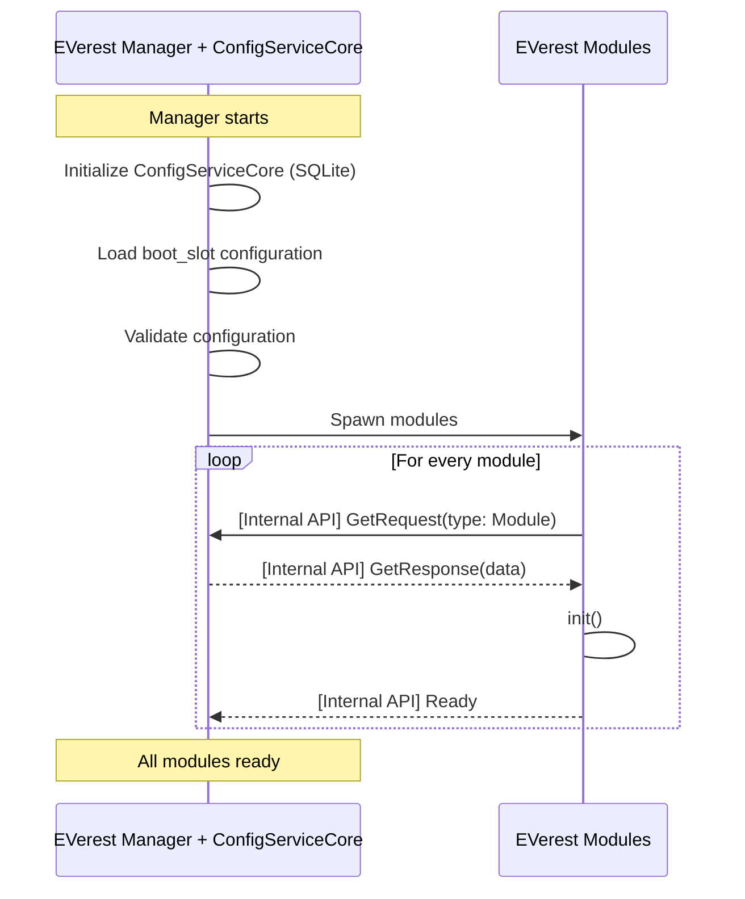
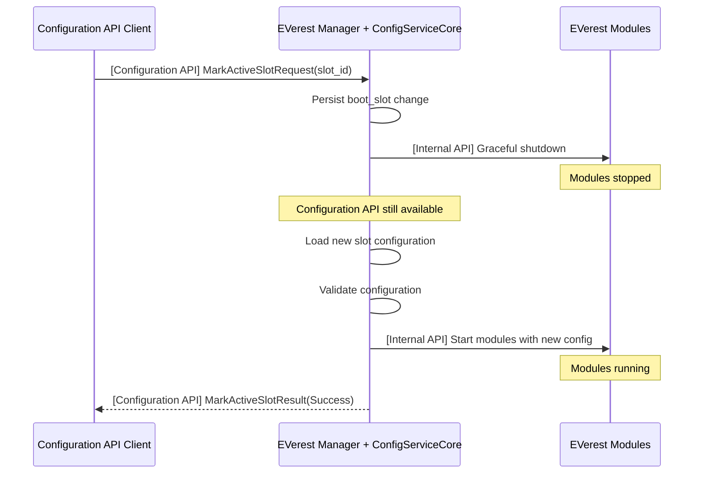
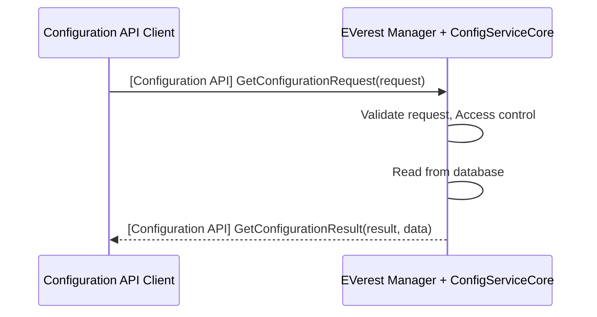
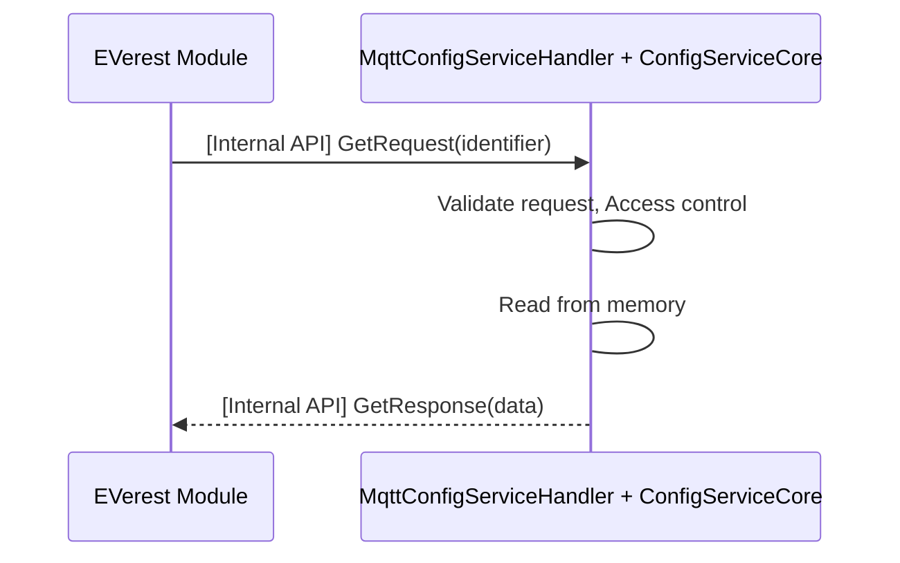
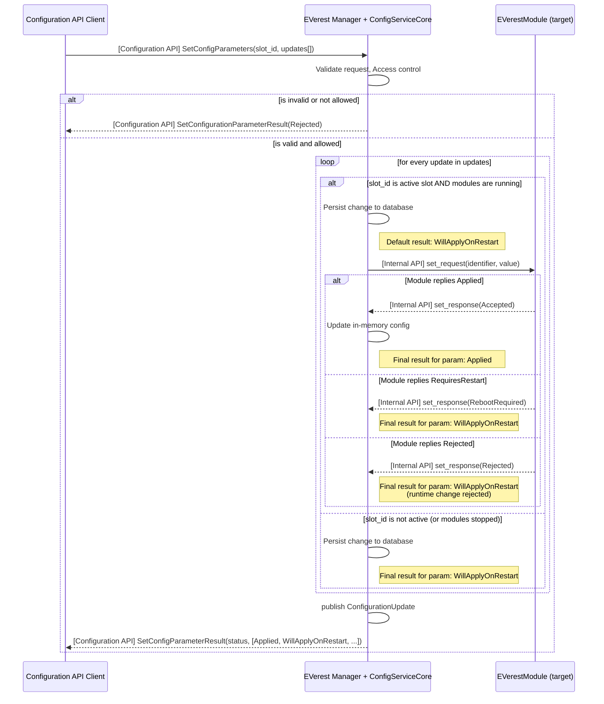
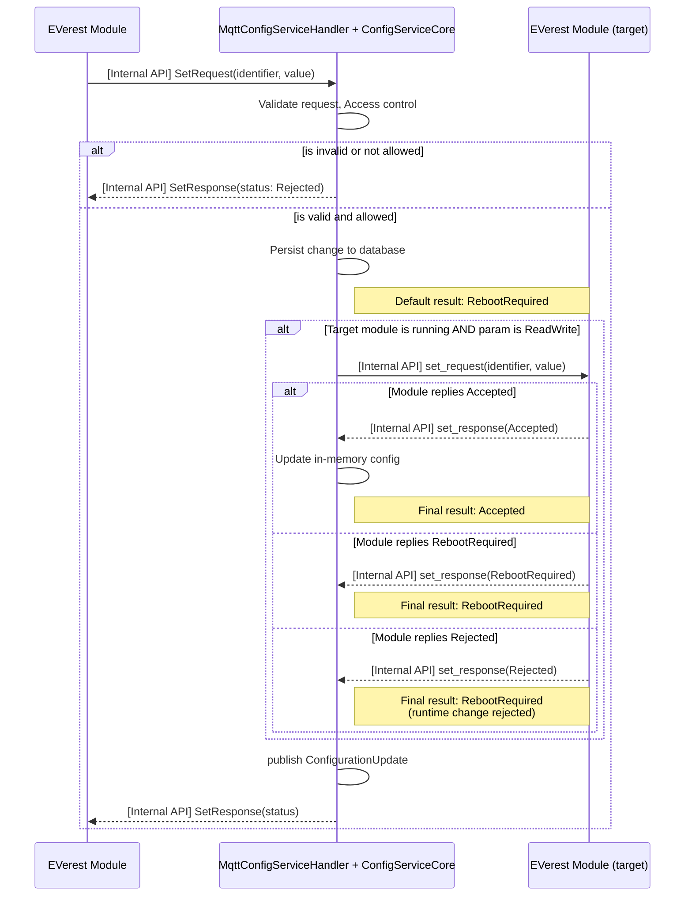

# EVerest Configuration Service

The EVerest ConfigServiceCore runs as part of the existing EVerest manager process. The manager exposes stable Async
APIs over MQTT and manages the full lifecycle of EVerest modules — starting, stopping, and restarting them as needed.
The manager process stays alive independently of the module lifecycle, serving the Configuration API and Lifecycle API
at all times.

## Terminology

- **ConfigServiceCore**: The core C++ component within the EVerest manager responsible for managing EVerest
  configurations in-memory and persisting them to storage.
- **Configuration API**: Stable Async API exposed by the manager over MQTT to access configuration data and
  functionality. Used only by external applications, not directly by EVerest modules. Part of the set of public
  EVerest APIs.
- **Lifecycle API**: Stable Async API exposed by the manager over MQTT to handle module lifecycles (e.g., start, stop,
  restart).
- **Configuration API Client**: Any application or component that uses the Configuration API. This includes external
  applications (e.g. Cloud, UI, Backend).
- **EVerest Manager**: Long-lived process that hosts the ConfigServiceCore, manages the module lifecycle, and exposes
  the Configuration API and Lifecycle API. The manager is always running — it starts before modules and can remain
  available after modules are stopped or terminated.
- **EVerest Internal API**: Existing MQTT-based communication mechanism between the manager and EVerest modules,
  defined in `lib/everest/framework/include/utils/mqtt_config_service.hpp` and implemented in
  `lib/everest/framework/lib/mqtt_config_service.cpp`. Used for configuration handling and distribution at startup as
  well as runtime queries and updates of parameters. Read and write requests to the `MqttConfigServiceHandler` are
  essentially forwarded to `ConfigServiceCore`. Modules use the `ConfigServiceClient` class to interface with the
  `MqttConfigServiceHandler`. Internal EVerest modules always use this Internal API to remain decoupled from the public
  Configuration API.
- **Configuration slot**: A mechanism for managing and switching between different EVerest module configurations 
  (i.e., specific sets of connected modules and their parameters). While configurations are traditionally loaded 
  from a YAML file, a `Configuration Slot` translates this concept to the internal database, allowing it to store 
  and swap multiple alternative configurations seamlessly.

## Configuration API
The Configuration API offers a stable Async API over MQTT to access configuration data and functionality. It is used
by external applications.

On a high-level it offers the following operations:

- Read module configuration
- Write module configuration
- Write configuration slots
- Notify on configuration changes
- Delete configuration slots
- Select configuration slot to boot from

*(Note: Starting, stopping, and restarting EVerest modules is handled by the Lifecycle API)*

What the Configuration API is NOT covering:

- Adding a module
- Deleting a module
- Renaming a module
- Connecting a module to another module

All the above can be achieve however by “uploading” a new YAML configuration with those changes.

## Communication of ConfigServiceCore with modules and external applications
There are two communication paths in this architecture, both over MQTT:

- **Configuration API**: The public Async API exposed by the manager. External applications (Cloud, UI, Backend) use
  this interface for all configuration operations: reading and writing configuration, managing slots, and subscribing
  to change notifications.
- **EVerest Internal API**: The existing MQTT-based interface between the manager and EVerest modules. The manager
  already uses this for distributing module configuration at startup. For runtime configuration parameter changes
  targeting the active slot, the ConfigServiceCore uses this same interface to deliver changes to the target module via
  a `set_request` and receive the module's verdict via a `set_response`. Modules use `ConfigServiceClient` to request
  configuration operations (read, write) through the EVerest Internal API via `GetRequest` and `SetRequest`.

### Manager startup

1. Populate the ``ManagerSettings``: If a YAML file is provided (``--config`` option) it uses the file, otherwise
   falls-back to the defaults.
2. Initialize the database (``init_database_bootstrap``): If no database exists, it is created and populated with an
   initial configuration from the YAML file (or a configuration with no modules if no YAML file was given). If the
   ``--reset-from-yaml`` was given, the currently active slot of an existing database is set to what the YAML file
   provides.
3. Initialize the ``ConfigServiceCore`` (relies on existence of a valid database, guaranteed by steps 1 and 2).
   Opens the database and loads the configuration slot marked for the next reboot.
4. Expose the Configuration API and Lifecycle API over MQTT (if activated).
5. Start the modules (except when ``--into-idle`` option is set)
6. The EVerest modules use the internal API to request their own configuration.

### Module stop / restart
The manager can stop and restart modules without itself restarting. This enables runtime configuration changes that
require a module restart and switching to a different configuration slot — all without losing the Configuration API.

### Manager Unavailability
Since the ConfigServiceCore is part of the manager process, if the manager crashes, the Configuration API is
unavailable and modules are also down. On restart, the manager reinitializes the ConfigServiceCore, loads the
boot_slot and starts the modules.

### Deployment
The manager is the single long-lived process. It is started by the system init (e.g. via systemd), but does not
depend on systemd for module lifecycle management. Systemd only ensures the manager itself starts on boot.

No special tooling for production and development deployments is required. Running `./manager --config my_config.yaml`
starts the manager, imports the YAML as the active slot, and starts modules. There is no distinction between
development and production process architecture — the developer experience and the production deployment use the same
single-process model as known from previous versions.

## Read Operation by Configuration API Client
A Configuration API Client sends a Get request to the manager via the Configuration API. The ConfigServiceCore
validates the request and returns the requested configuration data. This works regardless of whether modules are
running.

## Read Operation by EVerest module
An EVerest module sends a Get request to the manager via the internal API (`GetRequest`). The ConfigServiceCore
validates the request and returns the requested configuration data (`GetResponse`).

## Write Operation by Configuration API Client
A Configuration API Client sends a Write request to the manager via the Configuration API.
If the target is an inactive slot, the ConfigServiceCore validates the request and persists the change directly to the
database. The change will be applied when EVerest boots from that slot.
If the target is the active slot, the ConfigServiceCore first persists the change to the database, marking it to be
applied on the next restart. Then, if the module is running and the parameter is mutable at runtime (`ReadWrite`),
the MqttConfigServiceHandler delivers the change to the target module via the EVerest Internal API (`set_request`)
and waits for the module's verdict (`set_response`).
- If the module applies the change immediately (`Applied`), the in-memory configuration is updated.
- If the module requires a restart (`RequiresRestart`), the change is already persisted and will be loaded on the
  next boot.
- If the module rejects the runtime change (`Rejected`), it will still be applied on the next boot because it has
  already been persisted.
- If no runtime-change forwarding is set up in the manager, the change is not delivered to the module; it has
  already been persisted and simply applies on the next restart (`RebootRequired`).
Finally, the ConfigServiceCore sends a notification about the configuration change and returns a detailed result to
the client for each parameter.

## Write Operation by EVerest Module
An EVerest module (e.g. OCPP) sends a Write request to the manager via the EVerest internal API (`SetRequest`).
Unlike the Configuration API, modules update a single parameter at a time and always target the active slot. The
`MqttConfigServiceHandler` routes the request to `ConfigServiceCore`. The core first persists the change to the
database, guaranteeing it will be active after a restart. If the parameter is mutable at runtime, it is then
forwarded to the target module to be applied immediately. The final status (`Accepted`, `RebootRequired`, or
`Rejected`) is returned to the calling module via a `SetResponse`.

