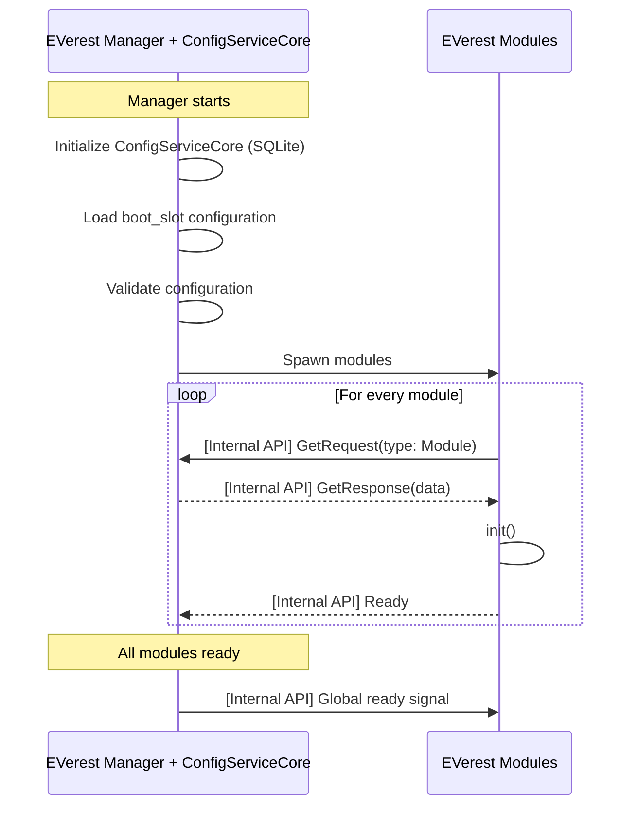
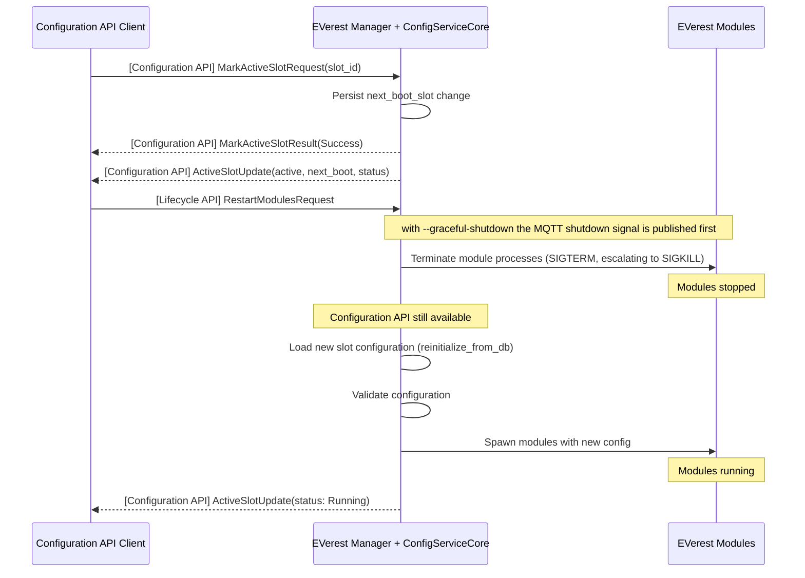
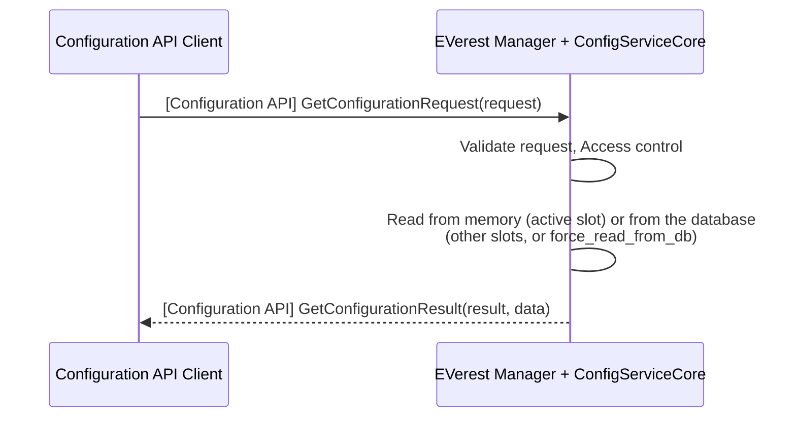
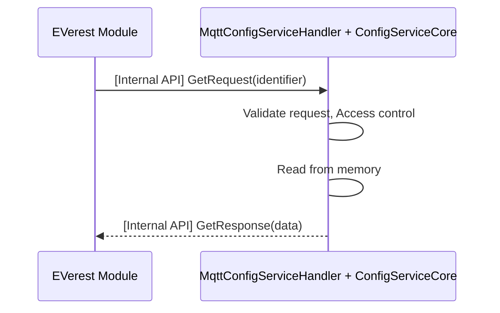
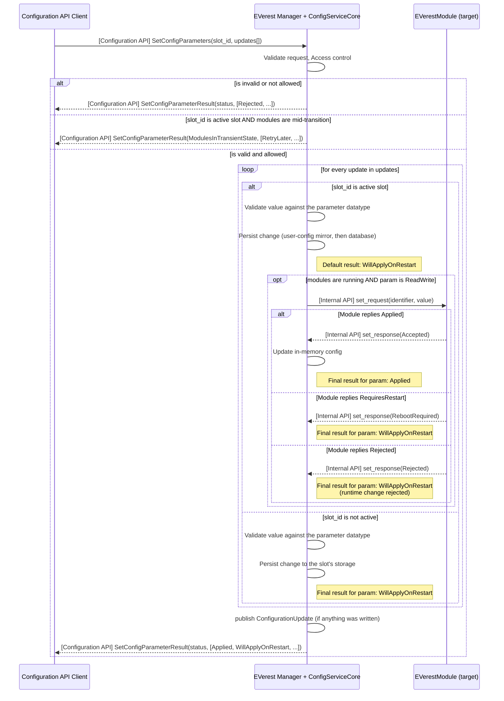
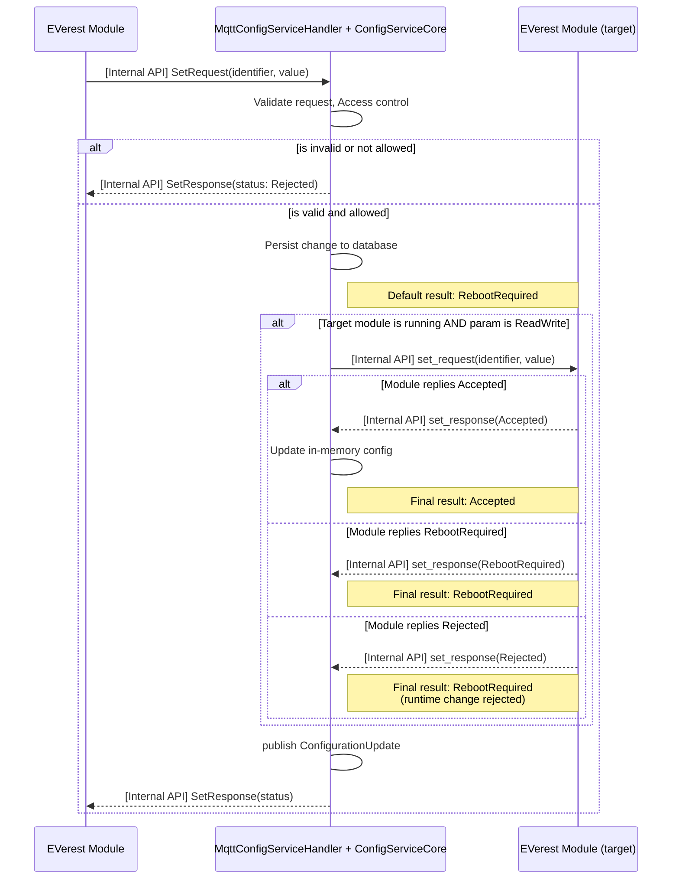

# EVerest Configuration Service

The EVerest ConfigServiceCore runs as part of the existing EVerest manager process. The manager exposes stable Async
APIs over MQTT and manages the full lifecycle of EVerest modules — starting, stopping, and restarting them as needed.
The manager process stays alive independently of the module lifecycle, serving the Configuration API and Lifecycle API
at all times.

## Terminology

- **ConfigServiceCore**: The core C++ component within the EVerest manager responsible for managing EVerest
  configurations in-memory and persisting them to storage. It implements the `ConfigServiceInterface`
  (`lib/everest/framework/include/utils/config_service_interface.hpp`) and is defined in
  `lib/everest/framework/include/utils/config/config_service_core.hpp` / implemented in
  `lib/everest/framework/lib/config/config_service_core.cpp`. It is a single-writer actor: every operation is
  serialized on one internal worker thread, while readers get the active configuration as an immutable snapshot
  (`get_active_module_configurations()`) without blocking that thread.
- **Configuration API**: Stable Async API exposed by the manager over MQTT to access configuration data and
  functionality. Used only by external applications, not directly by EVerest modules. Part of the set of public
  EVerest APIs.
- **Lifecycle API**: Stable Async API exposed by the manager over MQTT to handle module lifecycles (e.g., start, stop,
  restart).
- **Configuration API Client**: Any application or component that uses the Configuration API. This includes external
  applications (e.g. Cloud, UI, Backend).
- **EVerest Manager**: Long-lived process that hosts the ConfigServiceCore, manages the module lifecycle, and exposes
  the Configuration API and Lifecycle API. The manager is always running — it starts before modules and can remain
  available after modules are stopped or terminated.
- **EVerest Internal API**: Existing MQTT-based communication mechanism between the manager and EVerest modules,
  defined in `lib/everest/framework/include/utils/mqtt_config_service.hpp` and implemented in
  `lib/everest/framework/lib/mqtt_config_service.cpp`. Used for configuration handling and distribution at startup as
  well as runtime queries and updates of parameters. Read requests to the `MqttConfigServiceHandler` are answered from
  the immutable active-configuration snapshot it obtains from `ConfigServiceCore`
  (`get_active_module_configurations()`); write requests are forwarded to `ConfigServiceCore`
  (`set_config_parameters()`), always targeting the active slot. Access control is enforced by the handler using the
  `Access` rules embedded in each module's configuration. Modules use the `ConfigServiceClient` class to interface with
  the `MqttConfigServiceHandler`. Internal EVerest modules always use this Internal API.
- **Configuration slot**: A mechanism for managing and switching between different EVerest module configurations 
  (i.e., specific sets of connected modules and their parameters). While configurations are traditionally loaded 
  from a YAML file, a `Configuration Slot` translates this concept to the internal database, allowing it to store 
  and swap multiple alternative configurations seamlessly.

## Configuration API
The Configuration API offers a stable Async API over MQTT to access configuration data and functionality. It is used
by external applications.

On a high-level it offers the following operations:

- Read module configuration
- Write module configuration
- Write configuration slots (from a YAML config)
- List configuration slots and duplicate them / set their description
- Notify on configuration changes
- Notify on active-slot and module-status changes
- Delete configuration slots
- Select configuration slot to boot from

*(Note: Starting, stopping, and restarting EVerest modules is handled by the Lifecycle API)*

What the Configuration API is NOT covering:

- Adding a module
- Deleting a module
- Renaming a module
- Connecting a module to another module

All the above can be achieve however by “uploading” a new YAML configuration with those changes.

## Communication of ConfigServiceCore with modules and external applications
There are two communication paths in this architecture, both over MQTT:

- **Configuration API**: The public Async API exposed by the manager. External applications (Cloud, UI, Backend) use
  this interface for all configuration operations: reading and writing configuration, managing slots, and subscribing
  to change notifications.
- **EVerest Internal API**: The existing MQTT-based interface between the manager and EVerest modules. The manager
  already uses this for distributing module configuration at startup. For runtime configuration parameter changes
  targeting the active slot, the ConfigServiceCore uses this same interface to deliver changes to the target module via
  a `set_request` and receive the module's verdict via a `set_response`. Modules use `ConfigServiceClient` to request
  configuration operations (read, write) through the EVerest Internal API via `GetRequest` and `SetRequest`. The
  concrete MQTT topics and message payloads of this interface are documented in
  [MQTT Communication](MQTTCommunication.md).

### Manager startup

The configuration boot source is resolved from the command line options (``resolve_boot_source``):

- **No ``--db`` (with ``--config`` or the default config lookup)**: The YAML config is authoritative. It is parsed
  (including the ``user-config/<config-name>.yaml`` merge) and seeded into a process-private **in-memory** database on
  every start; nothing is persisted to disk except runtime configuration writes, which go to the user-config YAML.
- **``--db`` only**: The database file is the only configuration source; manager settings come from built-in defaults.
- **``--config`` and ``--db``**: The database wins when it holds a valid boot slot (the YAML is ignored); otherwise
  the database is seeded from the YAML config. ``--reset-from-yaml`` forces re-seeding from YAML. The deprecated
  ``--db-init`` flag is accepted (warning only) and has no effect, since this seeding behavior is now the default.

Startup then proceeds:

1. Populate the ``ManagerSettings``: from the YAML file (``--config``/default lookup) or built-in defaults
   (``--db`` only).
2. Initialize the database (``init_database_bootstrap``) according to the resolved boot source above.
3. Initialize the ``ConfigServiceCore`` (relies on existence of a valid database, guaranteed by steps 1 and 2).
   Opens the database and loads the configuration slot marked for the next reboot. Without ``--db``, a persistence
   mirror routes active-slot parameter writes to the user-config YAML in addition to the in-memory slot storage.
4. Connect to the MQTT broker, set up the EVerest Internal API (`MqttConfigServiceHandler`) and register it with the
   `ConfigServiceCore` as the runtime-parameter forwarder. Expose APIs giving access to configuration and module lifecycle handling.
5. Start the modules. Exceptions: with ``--into-idle`` the manager enters Idle without starting modules; a
   configuration that fails to load/validate or contains **no modules** makes the manager **exit with an error**
   unless ``--into-idle`` is given. With ``--idle-on-failure`` the **no-modules** case enters Idle instead
   (reported as ``FailedToStart``); invalid configurations still exit.
6. The EVerest modules use the internal API to request their own configuration.

Note on slots without ``--db``: the in-memory database is a complete multi-slot database, so all slot operations of
the Configuration API work at runtime (list, duplicate, load-from-yaml, mark-active, delete). They are ephemeral:
on the next start a fresh in-memory database is seeded from YAML + user-config, so slots and the next-boot-slot
selection do not survive a restart, and only active-slot parameter writes are persisted (via the user-config
mirror). The ``everest-config-tool`` cannot inspect an in-memory database.

### Module stop / restart
The manager can stop and restart modules without itself restarting. This enables runtime configuration changes that
require a module restart and switching to a different configuration slot — all without losing the Configuration API.

Marking a slot (`mark_active_slot`) only records it as the **next boot slot** and answers immediately; it does not
stop any module. The switch takes effect on the next module restart, which must be requested separately.
The manager reloads the marked slot (`reinitialize_from_db`) only while the modules are at rest — a reload is
skipped while modules are running or mid-transition, so the running processes can never desynchronize from the
in-memory configuration.

If the reloaded configuration is invalid or contains no modules, the restart fails: the manager exits with an
error, or — with ``--idle-on-failure`` — stays in Idle and reports ``FailedToStart``.

### Manager Unavailability
Since the ConfigServiceCore is part of the manager process, if the manager crashes, the Configuration API is
unavailable and modules are also down. On restart, the manager reinitializes the ConfigServiceCore, loads the
boot_slot and starts the modules.

### Deployment
The manager is the single long-lived process. It is started by the system init (e.g. via systemd), but does not
depend on systemd for module lifecycle management. Systemd only ensures the manager itself starts on boot.

No special tooling for production and development deployments is required. Running
`./manager --config my_config.yaml` starts the manager with the YAML as the authoritative configuration (in-memory
database, re-seeded on every start). For database-backed deployments, `./manager --config my_config.yaml --db
everest.db` uses the database once it holds a valid configuration and seeds it from the YAML otherwise; add
`--reset-from-yaml` to force re-importing the YAML. There is no distinction between development and production
process architecture — the developer experience and the production deployment use the same single-process model as
known from previous versions.

## Read Operation by Configuration API Client
A Configuration API Client sends a Get request to the manager via the Configuration API. The ConfigServiceCore
validates the request and returns the requested configuration data. This works regardless of whether modules are
running.

## Read Operation by EVerest module
An EVerest module sends a Get request to the manager via the internal API (`GetRequest`). The ConfigServiceCore
validates the request and returns the requested configuration data (`GetResponse`).

## Write Operation by Configuration API Client
A Configuration API Client sends a Write request to the manager via the Configuration API. Every value is first
validated against the parameter's datatype; a value that would fail to parse on the next boot is rejected
(`Rejected`) before anything is persisted. Writes to the **active** slot are refused while the modules are
mid-transition (starting, stopping, restart triggered): the whole request then reports
`ModulesInTransientState` / `RetryLater` and nothing is persisted.
If the target is an inactive slot, the ConfigServiceCore validates the request and persists the change directly to the
database. The change will be applied when EVerest boots from that slot.
If the target is the active slot, the ConfigServiceCore first persists the change to the database, marking it to be
applied on the next restart. Then, if the module is running and the parameter is mutable at runtime (`ReadWrite`),
the MqttConfigServiceHandler delivers the change to the target module via the EVerest Internal API (`set_request`)
and waits for the module's verdict (`set_response`).
- If the module applies the change immediately (`Applied`), the in-memory configuration is updated.
- If the module requires a restart (`RequiresRestart`), the change is already persisted and will be loaded on the
  next boot.
- If the module rejects the runtime change (`Rejected`), it will still be applied on the next boot because it has
  already been persisted.
- If no runtime-change forwarding is set up in the manager, the change is not delivered to the module; it has
  already been persisted and simply applies on the next restart (`WillApplyOnRestart`).
When the manager runs without ``--db``, the user-config YAML mirror is written *before* the in-memory database: a
failed mirror write rejects the update (`Rejected`), because the mirror is then the only persistence that survives a
restart.
Finally, the ConfigServiceCore sends a notification about the configuration change (only if at least one parameter
was written) and returns a detailed result to the client for each parameter. The request-level status is `Ok` unless
the write hits the transient-state case above (`ModulesInTransientState`); the outcome of every individual parameter
(`Applied`, `WillApplyOnRestart`, `DoesNotExist`, `Rejected`, `RetryLater`) is reported per parameter together with a
`status_info` explanation.

## Write Operation by EVerest Module
An EVerest module (e.g. OCPP) sends a Write request to the manager via the EVerest internal API (`SetRequest`).
Unlike the Configuration API, modules update a single parameter at a time and always target the active slot. The
`MqttConfigServiceHandler` routes the request to `ConfigServiceCore`. The core first persists the change to the
database, guaranteeing it will be active after a restart. If the parameter is mutable at runtime, it is then
forwarded to the target module to be applied immediately. The final status (`Accepted`, `RebootRequired`, or
`Rejected`) is returned to the calling module via a `SetResponse`. A value that does not match the parameter's
datatype, and any write attempted while the modules are mid-transition, is answered with `Rejected`; the
`status_info` field carries the reason (e.g. the module's runtime veto).

