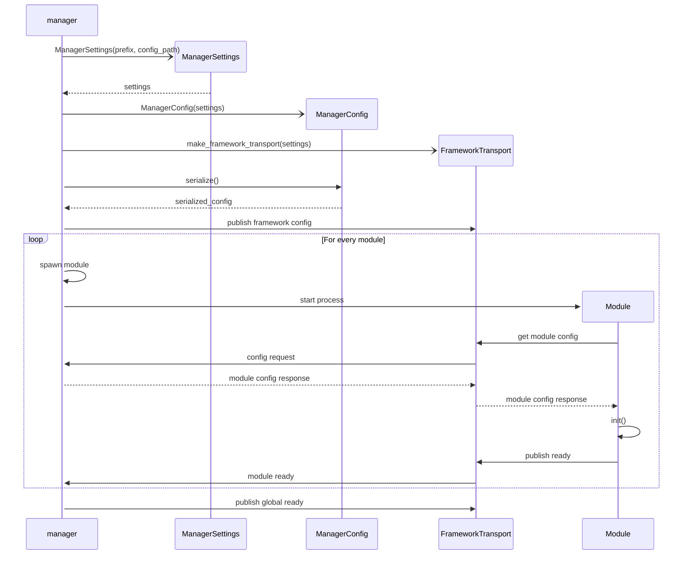

# Inter-Process Communication

EVerest modules communicate through a framework-local transport managed by the
EVerest Manager. The framework transport is used for module variables,
commands, command responses, errors, ready signals, and configuration
distribution.

The currently supported framework-local transports are:

- `mqtt`: the default transport, backed by an MQTT broker.
- `shm`: a shared-memory transport for local module-to-module traffic.

`external_mqtt` is a separate module capability. Selecting `framework_transport:
shm` changes the internal framework transport, but external MQTT topics continue
to use the configured MQTT broker and `mqtt_external_prefix`.

## Transport Selection

The transport is selected in the manager configuration:

```yaml
settings:
  framework_transport: mqtt
```

For shared memory:

```yaml
settings:
  framework_transport: shm
  shm_control_socket_path: /tmp/everest-shm-control.sock
  shm_topic_slots: 8
  shm_topic_slot_size: 65536
  shm_topic_registry_capacity: 1024
  shm_topic_registry_mode: static
```

`framework_transport` defaults to `mqtt`. The only supported
`shm_topic_registry_mode` is `static`.

## MQTT Transport

With `framework_transport: mqtt`, all framework-local messages are published to
the configured MQTT broker. The framework prefix defaults to `everest` and is
used to build the module topics described below.

The broker may be reached through a host and port or through a Unix domain
socket, depending on the MQTT settings passed by the Manager to the module
processes.

MQTT remains the transport used for external MQTT module capabilities even when
the framework-local transport is SHM.

## SHM Transport

The SHM transport is intended for framework-local communication between
processes running on the same host. Instead of sending every framework message
through a broker, payloads are exchanged through shared-memory topic buffers.
Small control messages and descriptor handshakes are handled through a local
control socket.

At startup, the Manager resolves the module graph and precomputes the exact
framework topics that are needed for the configured modules. These topics are
registered in a Manager-owned SHM server. Module processes receive the SHM
control endpoint and the topic list when they are spawned, then create
publishers and subscribers against the registered topics.

Each SHM topic is backed by a ring buffer. Publishers write payload bytes into
the topic buffer and signal subscribers. Subscribers read the payload from shared
memory and acknowledge release so slots can be reused. Topic names and payload
formats intentionally match the framework MQTT topics, which keeps module code
on the common `FrameworkTransport` interface.

The SHM transport does not emulate MQTT broker persistence or broker QoS
handshakes. The framework accepts the existing QoS enum values, but SHM uses
them only as local delivery intent.

Large configurations may require a higher file descriptor limit because SHM
topics and subscriber handshakes use local descriptors. If startup fails with an
`eventfd` or file descriptor exhaustion error, raise the limit before starting
the Manager:

```bash
ulimit -n 4096
./manager --config <config.yaml>
```

## Configuration Distribution

The Manager parses and validates the configuration once. It then distributes the
module-specific configuration through the selected framework transport. Modules
request their configuration during startup, initialize after receiving it, and
publish their ready state back to the Manager.



## Topic Structure

The framework topic names are the same for MQTT and SHM. The selected transport
only changes how the payload reaches the receiving process.

### Variables

```text
{everest_prefix}modules/{module_id}/impl/{impl_id}/var/{var_name}
```

Payload:

```json
{
  "data": "<variable_value>"
}
```

### Commands

```text
{everest_prefix}modules/{module_id}/impl/{impl_id}/cmd/{cmd_name}
```

Payload:

```json
{
  "id": "<unique_call_id>",
  "args": {
    "arg1": "value1"
  },
  "origin": "<calling_module_id>"
}
```

### Command Responses

```text
{everest_prefix}modules/{module_id}/impl/{impl_id}/cmd/{cmd_name}/response/{calling_module_id}
```

Successful response:

```json
{
  "name": "<cmd_name>",
  "type": "result",
  "data": {
    "id": "<matching_call_id>",
    "retval": "<return_value>",
    "origin": "<responding_module_id>"
  }
}
```

Error response:

```json
{
  "name": "<cmd_name>",
  "type": "result",
  "data": {
    "id": "<matching_call_id>",
    "error": {
      "event": "<error_type>",
      "msg": "<error_message>"
    },
    "origin": "<responding_module_id>"
  }
}
```

### Errors

```text
{everest_prefix}modules/{module_id}/impl/{impl_id}/error/{error_type}
```

Payload:

```json
{
  "type": "<error_namespace>/<error_name>",
  "message": "<error_description>",
  "severity": "<error_severity>",
  "origin": {
    "module_id": "<originating_module>",
    "implementation_id": "<originating_impl>",
    "evse": 1,
    "connector": 1
  },
  "state": "<error_state>",
  "timestamp": "<iso_timestamp>",
  "uuid": "<unique_error_id>"
}
```
