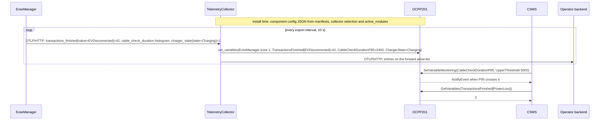
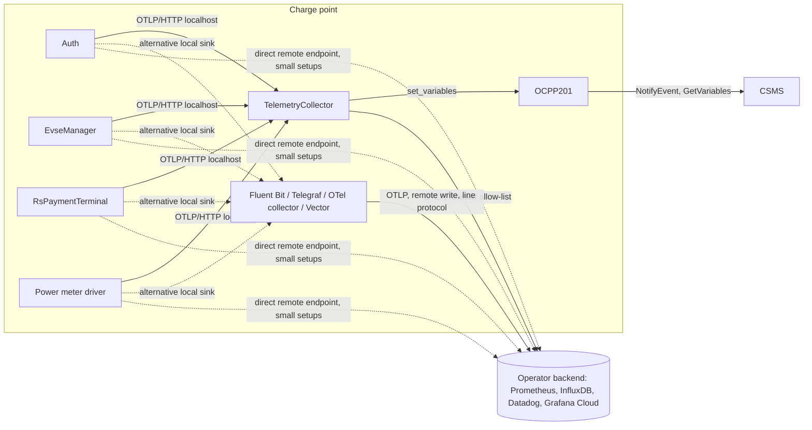

# Metrics and telemetry

Design note for one mechanism that carries both operational metrics (how often, how long, how many) and
hardware telemetry (temperature, voltage, firmware state): declared in the manifest, exported by the
framework as OTLP, consumed by a local collector that feeds the OCPP device model and forwards a selected
subset to whatever backend the operator runs.

Status: design, not implemented. It supersedes the MQTT-based `Telemetry.md` draft on the `doc/telemetry`
branch. Its declaration ideas (typed entries, units, enums, device model mapping) carry over; its
transport, its per-set interest handling and the split between telemetry and everything else do not.

## Goals

- An open wire format, so operators bring their own collector: Fluent Bit, Telegraf, the OpenTelemetry
  collector, Vector or Prometheus work without EVerest-specific code.
- OCPP support: a small in-tree collector maps entries into device model variables the CSMS can read and
  monitor.
- Cheap for modules: no dependency in module code, in C++, Rust or Python alike, a typed API generated from
  the manifest, and no cost when no endpoint is configured.
- Discoverable: the complete set of a module is known from its manifest, so documentation, device model rows
  and collector configuration are generated, not maintained.
- Nothing leaves the device that the operator did not select. Third-party modules emit into the local
  collector like everything else; what reaches a CSMS or a cloud backend is configuration.

## Where the exporter lives

In the framework, once per module process, whatever the format. everestrs and everestpy already call into
libeverest, so Rust and Python modules reach the exporter through a handful of binding functions (create
instrument, add, set, record) and never see protobuf or sockets. The framework initialises the exporter
with the identity it already has (module type, module id, mapping), owns endpoints and intervals as runtime
settings, and is where the cross-modules communication (command calls, errors, etc.) are emitted anyway.

otel-cpp, the generated opentelemetry-proto code, protobuf and abseil are linked statically into
libeverest.so with hidden visibility, `--exclude-libs,ALL` and a version script that exports only the Everest
API. Protobuf's descriptor pool and abseil's versioned namespaces then stay private to libeverest, so a Python
module may import wheels that bundle their own protobuf without interposition or duplicate registration, and
Rust modules are unaffected in any case since everestrs reaches the exporter through cxx. The check is
`nm -D` on the built library: no `google::protobuf` or `absl` symbol may appear. What remains to measure is
the footprint: private memory per module process and disk size on the smallest supported target.

## Options considered

| | Hand-rolled over MQTT | statsd with tags | OpenTelemetry (OTLP) |
|---|---|---|---|
| Open-source collectors | none speak it; every operator writes a bridge | most have a statsd input, but tag support differs | all major ones, one spec |
| Module dependency | framework only | framework only | framework only, otel-cpp, protobuf and curl linked once |
| Histograms | client aggregates | raw samples, the collector aggregates per window | exponential histograms, mergeable across devices |
| Descriptors on the wire | free-form | none | name, unit, description, resource attributes |
| Counter semantics | free-form | collector accumulates, resets with the collector | cumulative in the module, resets with the module |
| Sink for OCPP | to be written | small, but owns windowing and percentile math | copies values; the OtlpCollector prototype exists |
| Traces | no | no | possible later through the same framework hooks |

MQTT is EVerest's control plane and nothing outside EVerest consumes it, so every operator would write a
bridge.

statsd is attractive for its simplicity: one line per sample, a socket and string formatting. Its problems
are in the details. Tagged statsd is not one format: Dogstatsd appends `|#key:value`, the InfluxDB dialect
puts `,key=value` into the name, Telegraf reads Dogstatsd tags only with `datadog_extensions` enabled, the
Prometheus statsd_exporter accepts several dialects behind a mapping file, and Fluent Bit's statsd input
parses no tags at all, so every tagged sample collapses onto its bare name. Units have no place on the wire;
a `#unit:A` tag would let the in-tree collector read them, but it already has them from the manifest, while
third-party collectors would store the tag as a constant label at best and drop it at worst, so the unit
reaches some backends as a label and none as a unit. The collector also has to own windowing, percentile
math and the reset semantics of counters.

OpenTelemetry brings far more than the OCPP bridge can express, which is why the design pins a small profile
of it below. Within that profile it has one spec every collector reads the same way, carries descriptors and
units, aggregates in the module so the sink copies values instead of computing them, and the in-tree sink
already exists as a prototype. Its cost is the framework dependency, paid once, to be measured.

With a local collector always present, the ability to export straight to a remote endpoint does not
separate the two formats (namely statsd and OTLP); both reach the cloud through the collector. 
The decision therefore rests on the spec, the descriptors, the histogram semantics and the sink, and the margin is narrower than the feature list suggests.

Decision: OTLP, restricted to the profile in "Wire format", exported by the framework to a local collector by
default.

## Declaration

One `telemetry` block per manifest. There is no separate `metrics` block: the distinction between a
measurement and a counter is the entry's `kind`, not its mechanism. The name replaces the legacy
`enable_telemetry` key.

Five kinds, no free labels:

| kind | meaning | OTLP data type | device model |
|---|---|---|---|
| `counter` | monotonic count of events | Sum, monotonic, cumulative | integer variable, cumulative since module start |
| `gauge` | current numeric value, measurements included | Gauge | decimal or integer variable with unit |
| `histogram` | distribution of observed values | ExponentialHistogram | Count, Mean, Max, P95 variables |
| `enum_counter` | count of events per value of one declared enum | Sum with the attribute `value` | one integer variable per value plus a total |
| `enum_state` | current value of one declared enum | Gauge 0/1 per value with the attribute `state` (state set) | OptionList variable |

Entry fields: `kind`, `description`, `unit` (required for gauge and histogram), `scope`, `values` for the
enum kinds. There are no bounds: an out-of-range measurement is the one worth seeing, and libocpp rejects
writes outside a variable's limits, so declared bounds would freeze the device model row at the last
in-range value. Plausibility checks that need domain knowledge, a decreasing energy counter for instance,
are explicit entries of the module that can judge them.

The key names the event or quantity, and the values speak for themselves: `TransactionsFinished[EVDisconnected]`
needs no further label. When one event is counted along more than one breakdown, each entry carries its
breakdown in the key as `_by_<name>`, for example `stop_transaction_requested_by_reason` and
`stop_transaction_requested_by_match`; the two totals are then equal by construction.

`scope` is structural, never a label the module formats: `module` (default), `evse` or `connector`. For a
module whose config mapping carries an EVSE, `scope: evse` takes the id from the mapping and the generated
call has no id parameter. For a module without such a mapping, Auth for example, the id is a parameter of
the call. The framework emits it as a resource attribute.

Enum values are inline or a `$ref` to an enum in `types/*.yaml`. Limits follow the device model: values at
most 50 characters, an enum_state's joined values list at most 1000 characters, units at most 16.

```yaml
# manifest.yaml of EvseManager; the module mapping supplies the EVSE id
telemetry:
  charger_state:
    kind: enum_state
    description: State of the charging state machine
    scope: evse
    values: [Idle, WaitingForAuthentication, PrepareCharging, Charging, ChargingPausedEV,
             ChargingPausedEVSE, StoppingCharging, Finished, Replug, T_step_EF, T_step_X1,
             SwitchingPhases, WaitingForEnergy]
  transactions_finished:
    kind: enum_counter
    description: Finished transactions by stop reason
    scope: evse
    values:
      $ref: /evse_manager#/StopTransactionReason
  limit_current:
    kind: gauge
    description: Current limit applied to the EV
    scope: evse
    unit: A
  cable_check_duration:
    kind: histogram
    description: DC cable check from start to result
    scope: evse
    unit: ms
  plugin_timeouts:
    kind: counter
    description: Sessions ended because no EV was plugged in after authorization
    scope: evse
```

```yaml
# manifest.yaml of Auth, a multi-EVSE module without a mapping of its own
telemetry:
  stop_transaction_requested_by_reason:
    kind: enum_counter
    description: Stop requests issued by Auth, by reason
    scope: evse
    values: [Local, MasterPass, DeAuthorized]
  stop_transaction_requested_by_match:
    kind: enum_counter
    description: Stop requests issued by Auth, by how the token matched the transaction
    scope: evse
    values: [same_token, parent_id, masterpass, withdraw]
  validation_duration:
    kind: histogram
    description: Round trip of one validate_token call
    unit: ms
```

```yaml
# manifest.yaml of a power meter driver; hardware telemetry uses the same kinds
telemetry:
  temperature:
    kind: gauge
    description: Board temperature
    scope: evse
    unit: Celsius
  voltage:
    kind: gauge
    description: DC voltage at the meter
    scope: evse
    unit: V
  firmware_state:
    kind: enum_state
    description: Firmware state reported by the meter
    scope: evse
    values: [Idle, Measuring, Error]
  read_failures:
    kind: enum_counter
    description: Failed reads by cause
    scope: evse
    values: [timeout, crc, malformed, modbus_exception, http_status, transport, parse]
```

### Units

`unit` is a value from a fixed list in the schema, spelled the OCPP `UnitOfMeasure` way where OCPP has a
spelling (`Wh`, `kWh`, `W`, `A`, `V`, `Celsius`, `Percent`, `s`) and short SI otherwise (`ms`, `Ohm`, `Hz`,
`B`). It travels in the OTLP descriptor, so third-party backends receive it as a unit, and it is copied
unchanged into the device model's unit field and the generated docs. Following the OpenTelemetry
convention the unit is not part of the name; a Prometheus exporter appends its own suffix from the
descriptor. Histogram values are always in the declared unit.

## Wire format

The framework uses this profile of OTLP and nothing else, so a sink that understands three data types
understands all of EVerest:

- Transport: OTLP/HTTP with protobuf, exported by a periodic reader (default every 10 s) to each endpoint in
  `telemetry_endpoints`; default a single endpoint, the local collector. Unset means no SDK is installed
  and every call is a no-op.
- Data types: monotonic cumulative Sum, Gauge, ExponentialHistogram (default scale, SDK managed). No
  Summary, no explicit-bucket histograms, no exemplars, no logs, no traces in the first version.
- Resource attributes: `service.name` = module type, `service.instance.id` = module id, `everest.evse` and
  `everest.connector` from the scope.
- Data point attributes: `value` on an enum_counter, `state` on an enum_state, none otherwise.
- Names: `everest.<module_type>.<key>` in lower case, unit in the descriptor.
- Zero-initialisation: every counter and every enum value is recorded once with zero at startup so the
  cumulative series exist from the first export; an enum_state exports its full set on every change.
- Values are exported as recorded. The only ones the framework refuses are non-finite (NaN, infinity),
  which break most backends and cannot be written to the device model; they are dropped, counted in the
  framework's own `telemetry_invalid_values` counter and logged once per entry.

The same export, shown in the JSON encoding of OTLP for readability:

```json
{
  "resource": {"attributes": {"service.name": "EvseManager", "service.instance.id": "evse_manager_1", "everest.evse": 1}},
  "metrics": [
    {"name": "everest.evse_manager.transactions_finished", "unit": "1", "description": "Finished transactions by stop reason",
     "sum": {"isMonotonic": true, "aggregationTemporality": "CUMULATIVE",
             "dataPoints": [{"attributes": {"value": "EVDisconnected"}, "asInt": 42},
                            {"attributes": {"value": "Remote"}, "asInt": 7}]}},
    {"name": "everest.evse_manager.limit_current", "unit": "A", "gauge": {"dataPoints": [{"asDouble": 16.0}]}},
    {"name": "everest.evse_manager.cable_check_duration", "unit": "ms",
     "exponentialHistogram": {"dataPoints": [{"count": 12, "sum": 27100, "min": 1800, "max": 3900,
                                              "scale": 3, "positive": {"offset": 86, "bucketCounts": [1, 3, 5, 2, 1]}}]}},
    {"name": "everest.evse_manager.charger_state", "unit": "1",
     "gauge": {"dataPoints": [{"attributes": {"state": "Charging"}, "asInt": 1},
                              {"attributes": {"state": "Idle"}, "asInt": 0}]}}
  ]
}
```

Gauges are last-value at export, so a value sampled at 4 Hz reaches consumers at the export interval. That
is intended: this path carries state and statistics, not a live stream.

## Generated code

ev-cli and everestrs-build generate a `telemetry` member per module from the declaration. Inline enums
become generated enums; a `$ref` reuses the existing type, so a value missing from the manifest is a compile
error. Entries with `scope: evse` take an id only when the module has no mapping.

```cpp
// generated, EvseManager
namespace telemetry {
enum class ChargerState { Idle, WaitingForAuthentication, PrepareCharging, Charging, /* ... */ };

struct Telemetry {
    Everest::telemetry::EnumState<ChargerState> charger_state;
    Everest::telemetry::EnumCounter<types::evse_manager::StopTransactionReason> transactions_finished;
    Everest::telemetry::Gauge limit_current;
    Everest::telemetry::Histogram cable_check_duration;
    Everest::telemetry::Counter plugin_timeouts;
};
} // namespace telemetry

// module code
telemetry.charger_state.set(telemetry::ChargerState::Charging);
telemetry.transactions_finished.increment(types::evse_manager::StopTransactionReason::EVDisconnected);
telemetry.limit_current.set(16.0);
telemetry.plugin_timeouts.increment();
{
    auto timer = telemetry.cable_check_duration.start(); // records on scope exit
    run_cable_check();
}

// Auth, scope evse without a mapping: the id is a parameter
telemetry.stop_transaction_requested_by_reason.increment(telemetry::StopTransactionRequestedByReason::MasterPass, evse_id);
```

```rust
// generated, RsPaymentTerminal; each call is one binding function into the framework's SDK
pub enum ZvtRequestsCommand { Registration, StatusEnquiry, ReadCard, Reservation, PartialReversal, /* ... */ }

pub struct Telemetry {
    pub zvt_requests: EnumCounter<ZvtRequestsCommand>,
    pub zvt_request_duration: Histogram,
    pub terminal_status: EnumState<TerminalStatus>,
    pub transactions_open: Gauge,
}

// module code
self.telemetry.zvt_requests.increment(ZvtRequestsCommand::Reservation);
let _timer = self.telemetry.zvt_request_duration.start();
self.telemetry.transactions_open.set(self.bank_transactions.len() as f64);
self.telemetry.terminal_status.set(TerminalStatus::PtReady);
```

The framework side is one MeterProvider per process with the resource above, one instrument per declared
entry, an exponential histogram view for the histogram kind, and one OTLP/HTTP exporter per endpoint.

## Local collector

`TelemetryCollector` is an ordinary module and the default single endpoint. It receives every export on the
device and does three things:

- **Device model.** Writes selected entries into the OCPP device model through the `ocpp` interface's
  `set_variables` command: sums straight into counter rows, gauges and states as current values, histograms
  as Count, Mean and Max from the exact fields and P95 estimated from the exponential buckets.
- **Forwarding.** Re-exports selected entries as OTLP to remote endpoints, with TLS and headers. An operator
  who prefers Fluent Bit, Telegraf, the OpenTelemetry collector or Vector on the device runs that instead and
  the framework does not care which.
- **Filtering.** Both of the above take an allow-list by module type and key. What a charge point exposes to
  its CSMS and what leaves the device towards a backend are deployment decisions, made here, in the same way
  `connections` decides wiring. A third-party module's entries stay on the device unless listed.

A second, coarser filter sits in the framework: the runtime settings can exclude entries or whole modules
from export before anything is serialised.

```yaml
# config.yaml
telemetry_collector:
  module: TelemetryCollector
  config_module:
    device_model:
      - EvseManager.charger_state
      - EvseManager.transactions_finished
      - EvseManager.cable_check_duration
      - LemDCBM400600.temperature
      - LemDCBM400600.firmware_state
    forward:
      - endpoint: https://otel.example.com/v1/metrics
        headers: { Authorization: "Bearer ..." }
        entries:
          - EvseManager.*
          - Auth.*
          - LemDCBM400600.read_failures
```

An install-time step reads the manifests, the `device_model` selection and `active_modules` with their
mappings and writes component config JSON: one component per module instance, named after the module type,
with its EVSE mapping. An enum_counter becomes one integer variable per value plus a total, an enum_state an
OptionList variable with the values list, a gauge a decimal variable with unit, a histogram Count, Mean,
Max and P95 variables.



The receiver and the device model mapping are the OtlpCollector prototype; the forwarder and the allow-lists
are new.

## Deployment shapes



The default is the top path: framework to the in-tree collector, collector to OCPP and to the backend. The
operator's own collector replaces the in-tree one for the forwarding role or sits behind it. Exporting from
the framework straight to a remote endpoint is possible through `telemetry_endpoints` and useful for
development and small installations, but it bypasses the on-device filter and is not the recommended fleet
shape.

Generated alongside the code: a documentation page per module listing its entries with units and values, the
component config JSON for the device model, and a default collector configuration listing every entry so an
operator edits a list instead of writing one.

## Relation to the legacy telemetry API

`enable_telemetry`, `telemetry_config`, `Everest::TelemetryProvider` and EvseManager's 10 s power meter
dump publish free-form maps over MQTT. This design replaces them: the power meter values become gauges
declared by the driver, the session events become counters and histograms in EvseManager, and the legacy
keys enter the deprecation index once the `telemetry` block exists.

## Open points

- Footprint. Measure private memory per module process and total disk with otel-cpp, protobuf and curl in
  libeverest on the smallest supported target before the dependency lands. If it is unacceptable there, the
  facade allows a statsd exporter for that target with the same declarations, at the cost of the dialect
  and descriptor problems above.
- Traces. The same SDK can open a span per command call and handler in the framework and carry the context
  in the command envelope, giving cross-module traces without touching module code. Out of scope for the
  first version; the hook points are `call_cmd` and the handler dispatch.
- Per-slot scope for multi-connection requirements, for example Auth's validators, mapping the slot to the
  component instance. Start with totals.
- Shared entry sets for drivers of one interface, so eight power meter modules do not repeat the same
  entries. Either a `$ref` to a block next to the interface definition, or a lint.
- Config-derived value lists (manager module ids, generic Modbus registers): a code-declared definition with
  device model rows generated from the runtime config.
- Derived entries on enum_state: a `changes` counter is free; time in state only for values named explicitly
  in the declaration, so it stays one-dimensional.
- The name of the block. `telemetry` matches EVerest's vocabulary and replaces the legacy key; `metrics`
  matches the collectors' vocabulary. Easy to change before anything depends on it.
