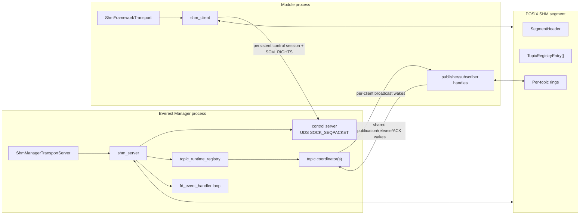
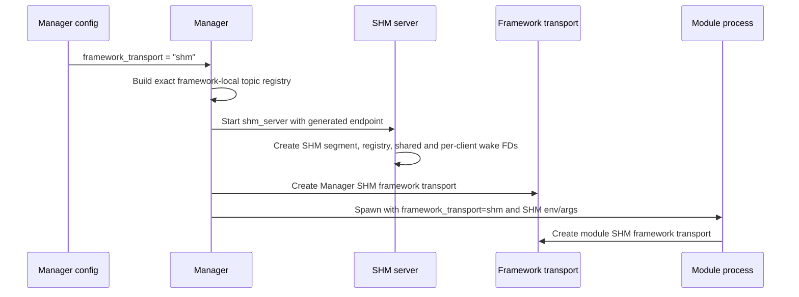
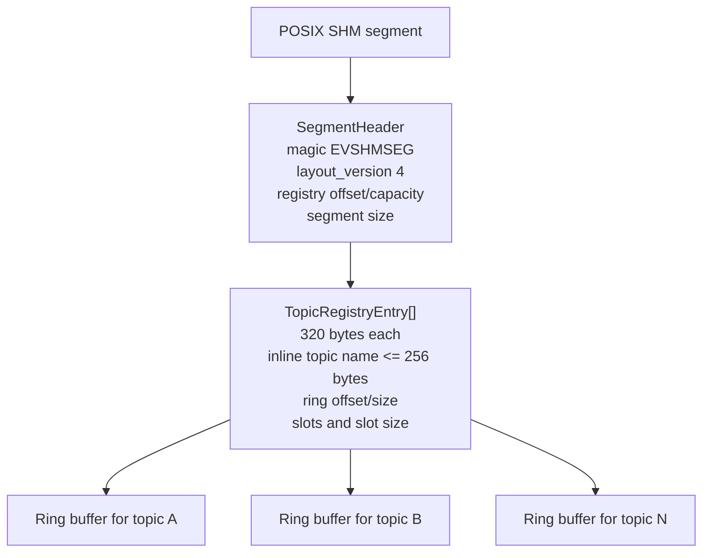
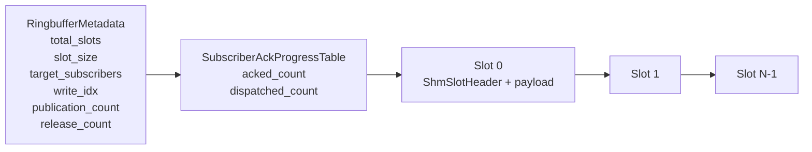
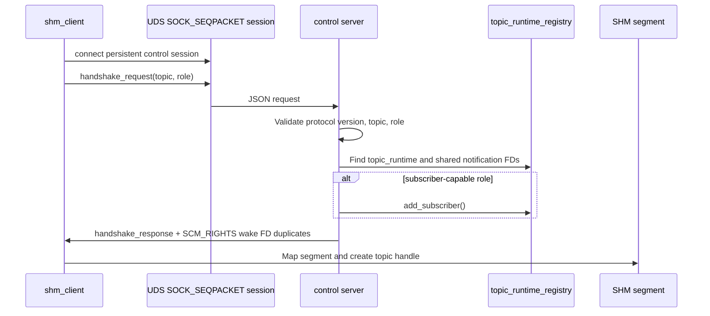
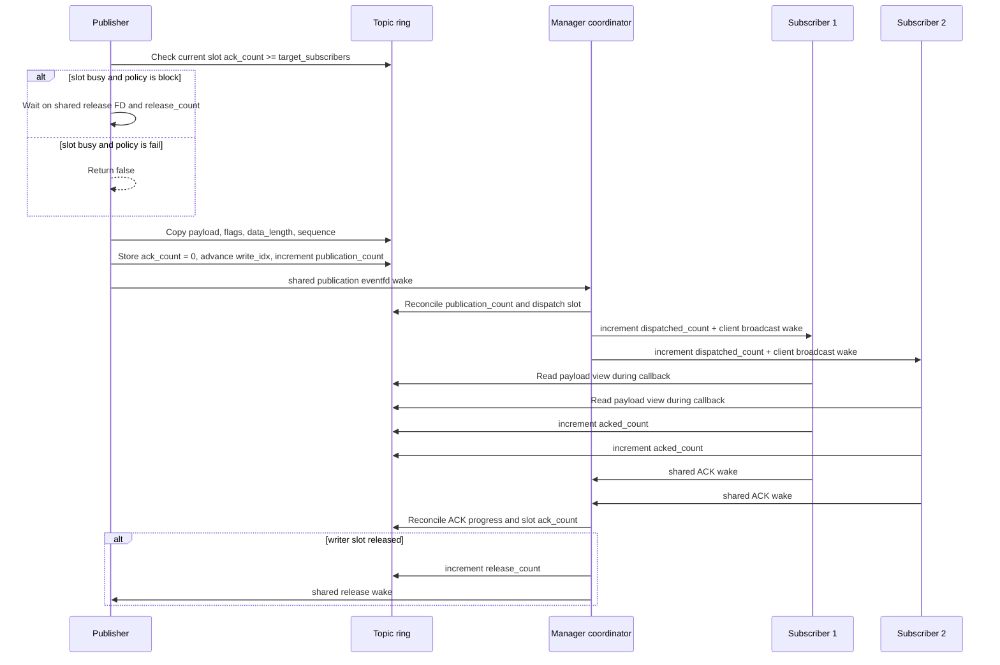
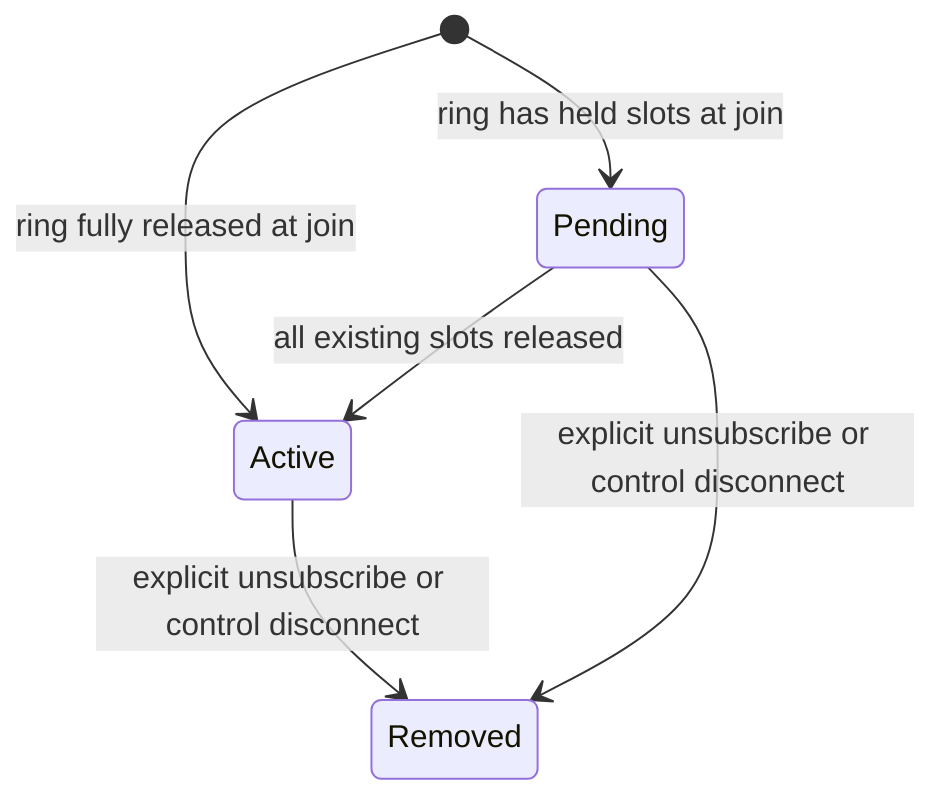
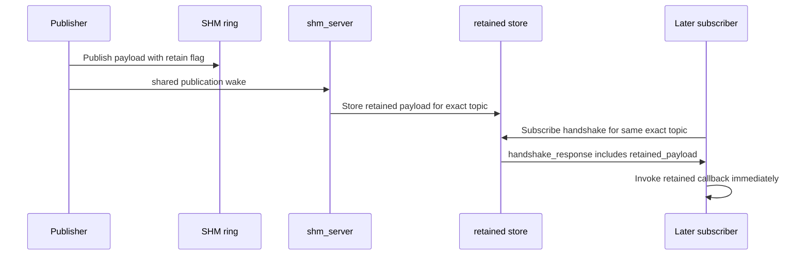
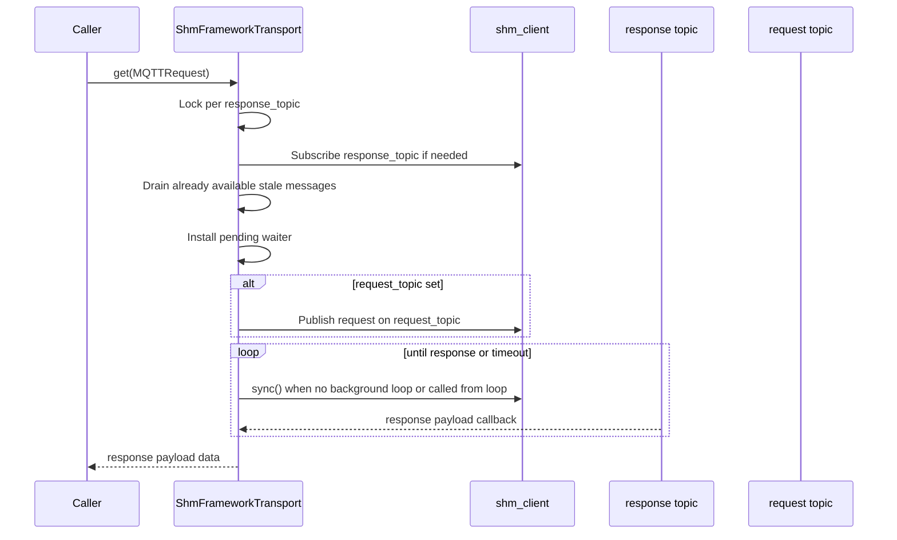

# Shared Memory Transport

This document describes the shared-memory transport used by the EVerest
framework for local Manager-to-module and module-to-module communication.

The transport uses:

- POSIX shared memory for framework-local payload storage.
- Per-topic ring buffers inside one Manager-created shared-memory segment.
- Shared `eventfd` wake descriptors for publication, release, and ACK
  notifications.
- Per-client broadcast wake descriptors for subscriber notifications.
- A persistent Unix domain `SOCK_SEQPACKET` control session plus `SCM_RIGHTS`
  for descriptor transfer.
- The EVerest Manager as the shared-memory server, topic registry owner, and
  ring-buffer coordinator.

The transport is not a full MQTT broker. It preserves the framework transport
API for Manager-registered framework topics, but MQTT broker sessions, MQTT QoS
handshakes, and broker persistence are not implemented by SHM.

## Boundaries

SHM is framework-local only. External MQTT and telemetry stay on the MQTT side
channel even when `framework_transport: shm` is selected. The Manager excludes
external MQTT capability topics and telemetry topics from the SHM registry, and
`external_mqtt_publish()`, external MQTT handlers, and telemetry publish paths
use an MQTT-backed transport.

The low-level SHM control protocol is exact-topic only. Framework wildcard
subscriptions are supported above the low-level protocol by expanding MQTT-style
filters over the Manager-provided exact registered-topic list.

Ring sizing and registry capacity are configured through Manager settings:
`shm_topic_slots`, `shm_topic_slot_size`, `shm_topic_registry_capacity`, and
`shm_topic_registry_mode`.

## Components



The low-level implementation lives under `lib/everest/io/shm`. The framework
integration lives under `lib/everest/framework` in the
framework transport abstraction, `ShmFrameworkTransport`, and
`ShmManagerTransportServer`.

## Runtime Selection and Configuration

SHM is selected with an explicit framework transport setting:

```yaml
framework_transport: shm
```

The compatibility sentinel form is also recognized when no explicit
`framework_transport` was provided:

```yaml
mqtt_broker_socket_path: shared_mem
```

New configurations should use `framework_transport: shm`. The MQTT broker
settings remain meaningful because external MQTT and telemetry use the MQTT side
channel in SHM mode.

When SHM is enabled, the Manager creates the SHM server before constructing the
framework transport. The generated transport name is:

```text
everest-shm-<sanitized-everest-prefix>-<manager-pid>
```

The POSIX shared-memory object name is the generated name with a leading `/`.
The control socket name is either `shm_control_socket_path` or the generated
name. Names not starting with `/` use the Linux abstract UDS namespace.

Manager defaults are:

| Setting | Default |
| --- | ---: |
| `shm_topic_slots` | `8` |
| `shm_topic_slot_size` | `64 * 1024` bytes |
| `shm_topic_registry_capacity` | `1024` |
| `shm_topic_registry_mode` | `static` |
| Topic registry capacity actually used | `max(topic_count, shm_topic_registry_capacity)` |
| Control socket namespace | abstract unless path starts with `/` |
| SHM unlink on close | enabled |
| Control socket unlink on close | enabled |

The only supported registry mode is `static`. The aliases `precomputed` and
`static_precomputed` map to the same mode. `dynamic` is rejected during Manager
configuration.

The Manager passes child modules:

| Module setting or environment | Value in SHM mode |
| --- | --- |
| `framework_transport` / `EV_FRAMEWORK_TRANSPORT` | `shm` |
| `shm_control_socket_path` / `EV_SHM_CONTROL_SOCKET_PATH` | Manager control endpoint |
| `shm_registered_topics` / `EV_SHM_REGISTERED_TOPICS` | Comma-separated exact SHM registry |
| `mqtt_broker_*` | Original MQTT side-channel settings |



## Topic Registration

The Manager pre-registers a finite set of exact framework-local topics before
opening the SHM server. A low-level publish or subscribe handshake for any other
topic fails with `unknown_topic`.

Registered SHM topics include:

- Framework request/response topics.
- Interface metadata, type metadata, module names, readiness, and schema topics.
- Module variables, commands, command responses, metadata, readiness,
  heartbeat, and error topics derived from the active module graph.

External MQTT capability topics and telemetry topics are intentionally excluded
from the SHM registry.

The framework adapter supports wildcard subscriptions by resolving a filter
against `shm_registered_topics` before issuing low-level exact-topic
subscriptions. The low-level control protocol still receives only exact topics.

## Shared-Memory Segment Layout

The SHM ABI uses segment layout version `4`.



Each topic ring contains metadata, a cache-line-aligned per-subscriber progress
table, and fixed-size slots:



Important SHM-resident counters:

| Counter | Owner | Meaning |
| --- | --- | --- |
| `RingbufferMetadata::publication_count` | publisher | Total publications committed for this topic. |
| `RingbufferMetadata::release_count` | coordinator | Total writer-blocking slot releases for this topic. |
| `SubscriberAckProgress::dispatched_count` | coordinator | Total slots dispatched to this subscriber. |
| `SubscriberAckProgress::acked_count` | subscriber | Total slots acknowledged by this subscriber. |
| `ShmSlotHeader::ack_count` | coordinator | ACKs observed for that concrete slot. |

Slot headers are one cache line and contain:

| Field | Meaning |
| --- | --- |
| `sequence` | Monotonic sequence for stale/gap detection |
| `data_length` | Number of valid payload bytes |
| `flags` | Retain and clear-retained flags |
| `target_subscribers` | Subscriber target stamped for this slot |
| `ack_count` | Number of subscriber ACKs observed for this slot |

Payloads larger than the topic slot size are rejected by the low-level topic
publisher.

## Control Protocol

The low-level control protocol version is `6`.

`shm_client::connect()` opens a persistent `SOCK_SEQPACKET` control connection
to the Manager. Per-topic resources are created lazily when the client first
publishes or subscribes to a topic.

Supported control request kinds are:

| Request | Purpose |
| --- | --- |
| `handshake` | Attach as publisher, subscriber, or publisher/subscriber for one exact topic. |
| `list_topics` | Return the Manager's exact registered SHM topic list. |
| `unsubscribe` | Remove a subscriber registration for one exact topic. |

Handshake requests carry:

- protocol version,
- client id,
- exact topic,
- role: `publisher`, `subscriber`, or `publisher_subscriber`.

Handshake requests do not carry liveness FDs. The persistent control session
itself is the liveness channel for every registration owned by that client. EOF,
`POLLHUP`, or control-session close causes the server to remove all
registrations owned by that session.



Successful responses include:

- SHM object name,
- ring offset,
- slot count,
- slot size,
- role-specific eventfd duplicates,
- subscriber id, join cursor, and join state for subscriber-capable roles,
- optional retained payload for subscribers.

Publisher responses include publication and release descriptors. Subscriber
responses include a client-owned broadcast descriptor and a shared ACK
descriptor. Publication, release, and ACK descriptors are duplicates of shared
wake descriptors, not unique per topic/subscriber identity channels. Broadcast
wake ownership is per persistent client session so multiple clients do not race
for one shared semaphore credit stream.

## Wake Descriptor Model

The transport uses a mixed shared/per-client wake descriptor model.

Each active runtime topic receives shared pointers to common notification
objects for:

- publication wake descriptor,
- release wake descriptor,
- ACK wake descriptor.

Those shared descriptors mean "some compatible runtime has work". They no
longer carry topic identity or complete progress. Topic identity and progress
live in SHM counters and coordinator state.

Subscriber broadcast wakes are different: they are owned by the persistent
client session. A client's broadcast descriptor means "one or more subscriptions
owned by this client may have pending dispatched slots". The client still uses
SHM `dispatched_count` progress to decide which exact subscriptions have work.

The server and client deduplicate registrations by the underlying Linux
`eventfd-id` from `/proc/self/fdinfo`, not by integer FD value alone. This
matters because different duplicated descriptors can refer to the same kernel
eventfd object.

### Publication

1. The publisher copies the payload into the topic ring slot.
2. The publisher advances the ring write index.
3. The publisher increments the topic's `publication_count`.
4. The publisher writes the shared publication eventfd.
5. The Manager wakes and scans runtimes sharing that wake descriptor.
6. Each coordinator compares the SHM `publication_count` with its local mirror
   and dispatches only topics with new committed publications.

### Subscriber Broadcast

1. The coordinator stamps slot `target_subscribers`.
2. For each target subscriber, it appends the slot to that subscriber's pending
   queue and increments that subscriber's `dispatched_count` in SHM.
3. It writes one semaphore credit to the subscriber's owning client-session
   broadcast eventfd for each subscriber dispatch.
4. Clients group subscriptions by their client-owned broadcast `eventfd-id`.
5. When a broadcast FD is ready, the client walks matching subscriptions in a
   deterministic subscription order.
6. Each subscription calls `handle_pending_count()` and computes pending work
   from SHM `dispatched_count - local_acked_count`.
7. Only after handling pending work does the client consume one semaphore
   credit from its client broadcast eventfd.

The client keeps the subscriber topic handle and SHM mapping alive while running
callbacks, so re-entrant unsubscribe from inside a callback does not invalidate
the active dispatch.

### ACK

1. A subscriber advances its local read/ack state.
2. It increments its SHM `acked_count`.
3. It writes the shared ACK eventfd, potentially batching multiple ACKs.
4. The Manager wakes and scans runtimes sharing that ACK descriptor.
5. Each coordinator compares per-subscriber SHM progress with local mirrors,
   advances slot `ack_count`, and releases slots whose stamped subscriber target
   has been met.

### Publisher Release

1. When a writer-blocking slot becomes reusable, the coordinator increments the
   topic's `release_count`.
2. It writes the shared release eventfd.
3. A blocked publisher wakes and compares SHM `release_count` with its local
   mirror.
4. The publisher only consumes the release as relevant if its own topic made
   progress. Unrelated shared release credits are not stolen.

## Publish, Dispatch, ACK, and Release



Important behavior:

- Low-level subscriber callbacks receive a view into the slot while the callback
  runs.
- If there are no active subscribers and the message is neither retained nor a
  clear-retained message, low-level publish returns success without waking the
  Manager and increments the dropped-publish counter.
- Back pressure is per topic. A publisher only waits when its current write slot
  is still held by subscribers.
- `ShmFrameworkTransport` publishes with `full_buffer_behavior = fail`, so
  framework publish calls do not block on a full SHM ring.
- Subscriber ACKs are batched through SHM progress counters plus the shared ACK
  wake descriptor.
- The coordinator only wakes publishers when a released slot can unblock a
  writer on that topic.

## Subscriber Join, Removal, and Crash Recovery

Subscribers do not immediately become active in every case. The coordinator
computes a join cursor from the current `write_idx` and next expected sequence.
The client uses this cursor to detect stale reads or gaps.



When a dynamic subscriber joins:

- If every slot is released, the coordinator increments the active subscriber
  target and retargets released slots.
- If any slot is still held, the subscriber is pending and is activated only
  after all existing slots are released.

When a subscriber unsubscribes:

- `shm_client::unsubscribe(topic)` sends an explicit `unsubscribe` control
  request.
- The server removes the subscriber registration immediately.
- The client removes local event registrations and subscription state.
- The coordinator adjusts active or pending targets, clears pending queues, and
  releases any slots that were waiting for that subscriber's ACK.

When a client process exits or loses its control connection:

- The Manager detects EOF, `POLLHUP`, or control-session close on the accepted
  `SOCK_SEQPACKET` connection.
- The server removes all registrations owned by that control session.
- Slot targets and pending queues are cleaned up so a dead subscriber cannot
  hold ring slots forever.

## Retained Payloads

Retained data is stored by the control server per exact topic string. Retained
publish handling happens when the Manager coordinator processes a publication.



If a retained publication also has the clear-retained flag, the server clears
the retained payload for that exact topic. In the framework adapter, an empty
retained publish with QoS 0 is treated as a retained-clear operation.

`ShmFrameworkTransport::clear_retained_topics()` only clears retained topics
that this adapter instance has tracked as published retained topics.

## Framework Transport Adapter

The SHM framework adapter maps framework API calls to `shm_client` operations.

| Framework operation | SHM behavior |
| --- | --- |
| `connect()` | Opens the persistent SHM control session; per-topic handshakes remain lazy. |
| `publish()` | Ensures a publisher for an exact topic, then publishes to SHM. |
| `subscribe()` | Expands wildcard filters over registered topics, then subscribes to exact topics. |
| `unsubscribe()` | Sends explicit SHM unsubscribe for exact topics whose handlers are gone. |
| `clear_retained_topics()` | Publishes retained-clear messages for tracked retained topics. |
| `register_handler()` | Registers SHM client event handling with the framework event loop. |
| `spawn_main_loop_thread()` | Runs a local `fd_event_handler` for SHM and disconnect events. |

QoS values are accepted by the framework API for compatibility. SHM does not
implement MQTT QoS handshakes, broker sessions, broker persistence, or
exactly-once delivery. The adapter uses QoS only for framework policy decisions
such as retained-clear detection.

The client caches SHM mappings per segment. Topic handles hold strong references
to their mapping, and the cache keeps weak references so multiple topics in the
same segment do not each own a separate mapping.

During controlled Manager shutdown, modules treat SHM control-owner disconnects
as expected once the Manager has entered its fatal or signal-driven shutdown
window. The Manager waits briefly for modules to exit before disconnecting the
SHM control owner, and the framework transport suppresses late `not_open`
publish/subscribe/unsubscribe noise only during that controlled window.

## Request/Response `get()`

The framework `get()` implementation is built on ordinary SHM
publish/subscribe.



Concurrent `get()` calls are serialized per response topic. For explicit
request/response calls, the adapter drains already available messages before
installing the waiter, then installs the waiter before publishing the request.
That SHM-specific drain strategy prevents older responses from satisfying a new
request without depending on generic transport queue internals. For
`GetConfigResponse` JSON objects, the adapter returns the nested `data` field;
otherwise it returns the received payload.

## Event Handling Model

The Manager SHM server event loop watches:

- the listening control socket,
- accepted persistent client control-session FDs,
- shared publication wake descriptors, deduplicated by `eventfd-id`,
- shared ACK wake descriptors, deduplicated by `eventfd-id`.

Client liveness is represented by the accepted control session.

The client event loop watches:

- the persistent control session for server liveness,
- per-client subscriber broadcast descriptors, deduplicated by `eventfd-id`.
- the threadless transport callback queue wake descriptor.

Framework operations from another thread are queued into the adapter event loop.
Operations made on the event-loop thread, or before a loop exists, run directly.
Transport callbacks enqueue raw payloads into a threadless FIFO callback queue;
that queue is drained by the transport event loop, or directly by synchronous
paths such as `get()` when no loop is running. Draining only parses and routes
messages into `MessageHandler`; framework handler execution remains delegated to
`MessageHandler` and its worker queues.

## File Descriptor Model

`ulimit -n` is per process. Summing open FD counts across Manager and module
processes can exceed the soft limit without violating it. What matters is the
maximum open FD count in any single process.

The FD cost is per process. Modules hold their control session,
event-loop descriptors, log and runtime descriptors, SHM mappings, and duplicates
of the shared or per-client wake descriptors needed by the topics they publish
or subscribe to. The Manager holds the listener, accepted control sessions, the
SHM segment, event-loop descriptors, shared notification descriptors, and
per-client broadcast wake state.

Large configurations may require a higher `nofile` limit than the shell or
service default. If startup fails with `eventfd` creation errors or other file
descriptor exhaustion symptoms, raise the soft limit before starting the
Manager:

```bash
ulimit -n 4096
./manager --config <config.yaml>
```

If a larger module graph or debug tooling still needs more descriptors, inspect:

```bash
ulimit -Sn
ulimit -Hn
```

The soft limit can only be raised up to the hard limit for the current session.

## Observability

The low-level transport tracks counters including:

- messages published,
- messages dispatched,
- subscriber ACKs observed,
- slots released and reused,
- blocked, dropped, and failed publish attempts,
- failed dispatch attempts,
- subscriber joins and removals,
- liveness/control disconnects.

Profiling hooks cover publish call, server dispatch, subscriber callback path,
ACK release, batch depths, and event-loop ready FD count. Batch-depth metrics are
especially important with shared wake descriptors because one ready FD can
represent work for multiple topics or subscribers.
