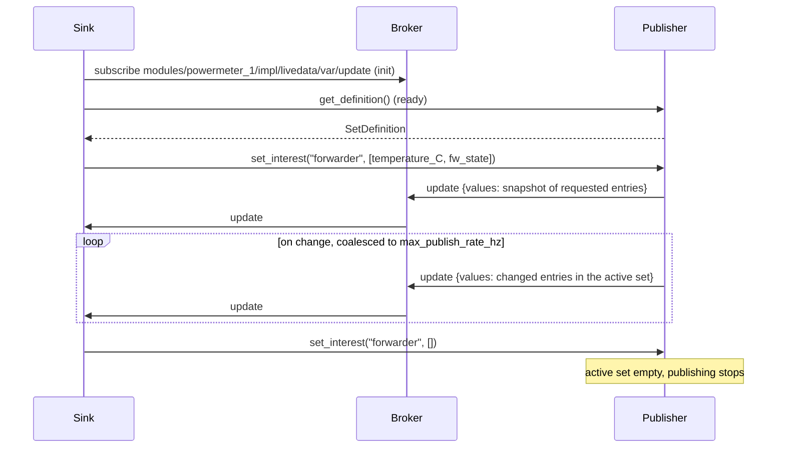

# Telemetry

Design note for module telemetry: lazy, de-duplicated, rate-capped, self-describing
measurement streams that are decoupled from the interface definitions.

Status: design, not implemented. This document records the decisions and the reasoning
behind them so that the implementation and later changes can be judged against it.

## Prior work

https://github.com/EVerest/EVerest/issues/2639


## Summary

- Telemetry is carried by one generic interface, `telemetry`, and one generic type file,
  `types/telemetry.yaml`. No new transport, topic tree or manager protocol is introduced.
- A module provides one implementation of `telemetry` per telemetry *set*. The implementation
  id is the set name, so every set has its own topic and its own connection.
- Consumers are generic sinks: a time-series forwarder, a disk logger, the OCPP device model.
  They are wired to the sets they may consume through the ordinary `connections` block of
  `config.yaml` and decide at runtime which entries they actually want.
- Nothing flows until a sink asks. A sink expresses interest per entry with the
  `set_interest` command. The publisher emits only the union of what its subscribers want,
  de-duplicates per entry, caps the publish rate, and sends a snapshot whenever interest changes.
- Values are flat scalars only. Grouping is done by publishing several entries in one call.
- The declaration of a set can be built in code today and declared in the manifest later. The
  manifest form is optional and buys boot-time validation, a typed publisher and offline
  discoverability.

## Goals and non-goals

Goals

- A module can expose measurements and diagnostics that are specific to its hardware without
  touching a shared interface.
- No cost when nobody listens: no MQTT traffic, and a cheap way for the module to skip sampling.
- Unchanged values are not re-published. A producer-side rate cap protects the bus.
- Every stream is self-describing: type, unit, bounds and allowed values are available to a
  consumer before the first value arrives.
- One mechanism for C++, Rust and Python modules, reusing the existing code generators.

Non-goals

- Typed access to a specific module's telemetry from another module. A consumer that needs a
  particular value for control logic needs an interface var, not telemetry.
- Events and transactional records. Telemetry is state. A group that must always arrive
  complete is not telemetry.
- Retention, persistence or replay. Sinks own that.

## Decisions

1. **Telemetry is not part of the interfaces.** Powermeters share the `powermeter` interface
   but expose wildly different diagnostics, and payment terminals more so. Putting those into
   the interface yields either a union of every driver's internals or a pile of optional vars
   nobody can rely on. The set schema therefore belongs to the module type.

2. **A subscriber must not depend on a publisher's manifest at build time.** Standard EVerest.

3. **One implementation per set.** The set is the unit of subscription, of activation and of
   rate limiting. Think of the topic as something like 
   `{everest_prefix}/module_id/{set}/var/update`.
   We need this to ensure that there is zero cost for sinks if they aren't interested in a specific
   set from a publisher.

4. **Flat scalars only.** Entries are `boolean`, `integer`, `number` or `string`, optionally with
   an `enum`. No objects, no arrays. Both consumer families want scalars: time-series stores hold
   fields, OCPP variables are scalars. An object entry would make de-duplication coarse and could
   not be deserialized into a generated type by a consumer anyway. Grouping is expressed by
   publishing several entries in one call; the resulting message is the atomic unit.

5. **Interest is expressed per set, from the consumer, to the publisher.** `set_interest`
   works on the sets name. The framework of the consumer subscribes to the right topic if
   interest is present and drops the topic if not. The framework of the publisher maintains
   the list of all modules interested in a telemetry set and stops publishing once the list
   becomes empty.

6. **De-duplication means "no message" equals "unchanged".** The producer framework therefore keeps a
   last-value cache. The snapshot sent on every interest (to true) change - this ensures that cache
   complete for late subscribers.


7. **Composition through `connections`.** A sink lists the `(module, set)` pairs it may consume
   in `config.yaml`. The possible set is static, the active subset is dynamic through
   `set_interest`. A dedicated `telemetry:` block in `config.yaml` was considered and rejected
   as a second place to configure what the sink already configures itself.

8. **The declaration source is pluggable.** Step one builds the `SetDefinition` in application
    code. Step two adds an optional `telemetry` block to the manifest, validated by the manager
    and used to generate a typed publisher. The block must stay optional because a module whose
    telemetry depends on its configuration, a generic Modbus meter for instance, cannot declare
    its entries statically.

## Interface and types

We use the interface to outline the idea - it is somewhat a strange fit since
it requires quite some "custom" handling.

```yaml
# interfaces/telemetry.yaml
description: >-
  A generic telemetry set. A module provides one implementation per set. The entries
  of a set are declared in code or in the manifest and served via get_definition.
cmds:
  get_definition:
    description: >-
      Declared entries of this set, for descriptors and device models. 

      This callback should not go to the client code of the publisher. Instead it 
      should be handled in the subscriber or publisher framework.
    result:
      description: The set definition
      type: object
      $ref: /telemetry#/SetDefinition
  set_interest:
    description: >-
      Entries the calling module wants to receive. An empty list withdraws interest. The
      publisher emits only entries wanted by at least one subscriber and sends a snapshot
      of the requested entries whenever this is called with a non-empty list.

      This callback may go to the client code but must also envoke some logic
      inside the publisher framework (blocking client code from publishing if no
      one is listening, republishing the cache if we have a new subscriber, etc.)
    arguments:
      module_id:
        description: The subscribing module instance
        type: string
      entries:
        description: Wanted entry names, empty to withdraw
        type: array
        items:
          type: string
vars:
  update:
    description: Entries that changed since the previous update, partial by design
    type: object
    qos: 0
    $ref: /telemetry#/Update
```

```yaml
# types/telemetry.yaml
description: Telemetry types
types:
  EntryType:
    description: Scalar value type of an entry
    type: string
    enum: [boolean, integer, number, string]
  EntryDefinition:
    description: Declaration of one entry
    type: object
    additionalProperties: false
    required: [name, description, type]
    properties:
      name:
        description: Entry name, ^[a-zA-Z_][a-zA-Z0-9_]*$
        type: string
      description:
        description: Human readable description
        type: string
      type:
        description: Value type
        type: string
        $ref: /telemetry#/EntryType
      unit:
        description: Unit of measurement
        type: string
      minimum:
        description: Lower bound for integer and number entries
        type: number
      maximum:
        description: Upper bound for integer and number entries
        type: number
      enum:
        description: Allowed values for string entries
        type: array
        items:
          type: string
  SetDefinition:
    description: Declaration of one set
    type: object
    additionalProperties: false
    required: [module_type, set, description, entries]
    properties:
      module_type:
        description: Publishing module type
        type: string
      set:
        description: Implementation id of the set
        type: string
      description:
        description: Set description
        type: string
      max_publish_rate_hz:
        description: Producer side cap, updates are coalesced to this rate
        type: number
      entries:
        description: Declared entries
        type: array
        items:
          type: object
          $ref: /telemetry#/EntryDefinition
  Mapping:
    description: Three tier mapping of the publishing implementation
    type: object
    additionalProperties: false
    required: [evse]
    properties:
      evse:
        description: EVSE id
        type: integer
      connector:
        description: Connector id
        type: integer
  Update:
    description: One partial update
    type: object
    additionalProperties: false
    required: [module_id, module_type, set, timestamp, values]
    properties:
      module_id:
        description: Publishing module instance
        type: string
      module_type:
        description: Publishing module type
        type: string
      set:
        description: Implementation id of the set
        type: string
      timestamp:
        description: Publish time
        type: string
        format: date-time
      mapping:
        description: Mapping of the publishing implementation, absent if not configured
        type: object
        $ref: /telemetry#/Mapping
      values:
        description: Changed entries, entry name to scalar value
        type: object
```

`values` is deliberately a free object. It arrives as `Object` in C++ and as
`serde_json::Value` in Rust, which is all a generic consumer can do with it. No
`additionalProperties` schema is attached because the Rust type parser expects a boolean there.

`Update` repeats `module_id`, `module_type`, `set` and `mapping` although the topic already
identifies the publisher. This keeps the payload self-describing for external consumers and
gives Rust modules attribution, since the Rust bindings expose slot indices but not the module
behind a slot.

## Publisher side

### Manifest

```yaml
# manifest.yaml of a powermeter driver
provides:
  main:
    interface: powermeter
    description: The metering interface
  livedata:
    interface: telemetry
    description: Live electrical measurements
  diagnostics:
    interface: telemetry
    description: Slow changing device diagnostics
```

Step two adds the declaration next to the implementation. It is only allowed on
implementations of `telemetry` and is validated by the manager when the config is loaded:

```yaml
# manifest.yaml of a powermeter driver
  livedata:
    interface: telemetry
    description: Live electrical measurements
    telemetry:
      max_publish_rate_hz: 4
      entries:
        temperature_C:
          description: Board temperature
          type: number
          unit: Celsius
          minimum: -40
          maximum: 120
        fw_state:
          description: Firmware state
          type: string
          enum: [Idle, Measuring, Error]
```

### Wire format

Topic, payload and QoS are those of any interface var. The only prerequisite is that the
framework honours the `qos` field of the interface definition, which `publish_var` and
`subscribe_var` currently ignore in favour of a hard-coded QoS 2.

```text
everest/modules/powermeter_1/impl/livedata/var/update        QoS 0, not retained
```

```json
{
  "msg_type": "Var",
  "data": {
    "module_id": "powermeter_1",
    "module_type": "LemDCBM400600",
    "set": "livedata",
    "timestamp": "2026-08-12T10:41:07Z",
    "mapping": { "evse": 1 },
    "values": { "temperature_C": 41.2, "frequency_Hz": 49.98 }
  }
}
```

## Subscriber side

### Manifest and config

```yaml
# manifest.yaml of a sink
requires:
  telemetry:
    interface: telemetry
    min_connections: 0
    max_connections: 128
```

```yaml
# config.yaml
active_modules:
  powermeter_1:
    module: LemDCBM400600
    mapping:
      module: { evse: 1 }
  forwarder:
    module: TelemetryForwarder
    connections:
      telemetry:
        - { module_id: powermeter_1, implementation_id: livedata }
        - { module_id: powermeter_1, implementation_id: diagnostics }
```

The manager validates the connections as it does for every requirement: the implementation
must exist and must provide `telemetry`.

### Sequence

Two separate things happen, and only one of them is telemetry-specific:

- The MQTT subscription is created by `subscribe_update` on a slot. `subscribe_var` resolves
  the slot to its fulfilment and registers a handler on that implementation's topic. This is
  the ordinary var path.
- `set_interest` is a plain command that opens the valve at the publisher. It does not create
  or change subscriptions on either side.

Order matters because updates are QoS 0 and not retained: the snapshot sent on an interest
change is lost if the handler is not registered yet. The usual EVerest split gives the right
order automatically, subscriptions in `init`, commands in `ready`.

```cpp
void Sink::init() {
    for (auto& slot : r_telemetry) {                               // all wired sets, nothing flows yet
        slot->subscribe_update([this](const types::telemetry::Update& u) { on_update(u); });
    }
}

void Sink::ready() {                                                // publishers accept commands now
    for (auto& slot : r_telemetry) {
        const auto def = slot->call_get_definition();               // optional, for descriptors and filtering
        if (wanted(def)) {
            slot->call_set_interest(info.id, entries_for(def));
        }
    }
}
```



Two consequences of the fan-out:

- **A sink may receive more than it asked for, never less.** The publisher emits the union over
  all subscribers on one topic. A sink that wants exactly its list filters locally. A sink that
  has no use for a slot should not call `subscribe_update` on it, so traffic caused by another
  sink is not delivered to its process.
- **Rust subscribes to every var of every slot before `on_ready`.** The ordering is automatic
  there, but the previous point does not apply: an uninterested slot is still dispatched to
  `on_update` and has to be dropped by index. `ignore` is per interface, not per slot. The cost
  is one JSON parse per message.

A consumer-side helper, `Everest::telemetry::Sink`, can own the slot list, subscribe to all of
them, expose `definitions()` and translate a filter on `module_type`, `mapping` or entry names
into the matching per-slot `set_interest` calls. It is convenience over the slots, not a
framework feature.

## Consumers

### OCPP device model

| Telemetry | OCPP |
| --- | --- |
| `module_type` | `Component.name` |
| `module_id` | `Component.instance` |
| `mapping.evse`, `mapping.connector` | `Component.evse.id`, `Component.evse.connectorId` |
| entry name | `Variable.name` |
| `set` | `Variable.instance` |
| `type` | `VariableCharacteristics.dataType`, `string` with `enum` becomes `OptionList` |
| `unit`, `minimum`, `maximum` | `unit`, `minLimit`, `maxLimit` |
| `enum` | `valuesList` |

- Building the device model needs `get_definition` only. No subscription is required.
- `SetVariableMonitoring` on a telemetry-backed variable resolves to one slot and one entry.
  OCPP re-sends `set_interest` for that slot with the updated union of monitored entries. The
  snapshot fills the actual value within one command round trip.
- `ClearVariableMonitoring` removes the entry from the union. The empty list withdraws the slot.
- Periodic monitors report from the stored value. Absence of a message means "unchanged".
- `GetVariables` on an unmonitored variable is a policy choice of the OCPP module: hold a
  permanent interest for every set mapped into the device model, which costs nothing while
  values do not change, or subscribe transiently and answer from the snapshot.

### Time-series sinks

The mapping onto Influx line protocol, OpenTelemetry or a Prometheus exposition endpoint is
mechanical: `module_id`, `module_type`, `evse` and `connector` are labels or tags, `set` is the
measurement, every entry is a field or metric, and `SetDefinition` is the metric descriptor. A
Prometheus-style sink holds the last value per entry and exposes it; a logger writes deltas and
reconstructs rows from its cache if it needs them. External collectors can subscribe to the
MQTT topic directly and unwrap `data`.

## Changes required

| Change | Location | Step |
| --- | --- | --- |
| Honour the `qos` field in `publish_var` and `subscribe_var` | `lib/everest.cpp` | 1 |
| `interfaces/telemetry.yaml`, `types/telemetry.yaml` | everest-core | 1 |
| `Everest::telemetry::SetPublisher` helper and tests | everest-core, new small library | 1 |
| `everest-telemetry` crate with the same behaviour | everest-core | 1 |
| `Everest::telemetry::Sink` consumer helper | everest-core | 1, optional |
| Manifest schema: `telemetry` block under `provides`, only with `interface: telemetry` | `schemas/manifest.yaml`, `everestrs-build/src/schema/manifest.rs` | 2 |
| Manager validation of the block against `EntryType`, names, bounds, enum | `lib/config.cpp` | 2 |
| Typed publisher generated from the block | ev-cli `module.hpp.j2`, everestrs-build `module.jinja2` | 2 |
| Helper reads the definition from the manifest when present | helpers | 2 |
| Deprecate the legacy telemetry API | deprecation index | 2 |

The Rust `Manifest` and `RequiresEntry` structs use `deny_unknown_fields`, so step two must add
the new field to the Rust schema or every manifest using it breaks the Rust build.

## Alternatives considered

- **A dedicated framework facility.** Own topic tree `everest-telemetry/v1/{module_id}/{set}`,
  a flat envelope, a manager-maintained interest table pushed to publishers, and new codegen in
  ev-cli and everestrs-build. Cleaner for external consumers and free of `config.yaml` wiring,
  but a large addition to the framework, the manager and three generators for the same
  behaviour. Rejected on size.
- **Telemetry entries in the interfaces.** Rejected, see decision 1.
- **Typed subscriptions declared in the subscriber manifest** such as
  `requires.<id>.telemetry: [livedata]`. Impossible, the subscriber does not know the
  publisher's sets at build time, see decision 2.
- **A `telemetry:` block in `config.yaml`** naming `(module_id, sets)` per sink. Duplicates what
  the sink configures itself and validates nothing a filter needs. Replaced by ordinary
  `connections`.
- **Object and array entries with `$ref` into `types/`.** Rejected, see decision 5. If reuse of
  type files is wanted later, the manager can expand a `$ref` into flat leaf entries in the
  manifest it distributes. Type files carry no units, so leaves would need per-leaf overrides.
- **Pull or scrape model.** Chatty over MQTT and loses transient states between scrapes. The
  snapshot on interest change covers the one thing pull is good at.

## Relation to the existing telemetry API

`enable_telemetry` in the manifest, the `telemetry: { id }` block in `config.yaml`, the
`telemetry_prefix` and `telemetry_enabled` settings, `Everest::telemetry_publish` and
`TelemetryProvider` publish free-form maps on `everest-telemetry/{category}/{id}/{subcategory}`.
EvseManager is the only in-tree user. None of it is validated, de-duplicated, lazy or
discoverable. This design supersedes it. The legacy API should be entered into the deprecation
index once the `telemetry` interface exists, and EvseManager's powermeter telemetry can move to a
`telemetry` implementation.

## Open items

- A `snapshot(filter, timeout)` helper for one-shot readers, built on subscribe, first update,
  withdraw.
- De-duplication with a per-entry dead band for noisy floats. Exact equality first.
- Manager-side `$ref` expansion into flat entries, only if real manifests ask for it.
- Python helper mirroring `SetPublisher`.
- Whether the manager should reject `telemetry` implementations whose `description` is missing
  units for `number` entries. Probably a linter, not a hard error.
