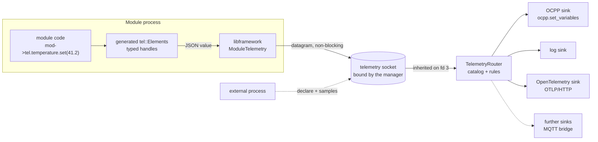

# Telemetry

Telemetry is data about a charging station that is valuable for operation and diagnosis but irrelevant for
the control flow: hardware temperatures, firmware states, counters of events, communication statistics.
Modules declare it in their manifest, publish it through generated typed handles, and a telemetry receiver
module forwards it to backends such as the OCPP device model.

The user-facing explanation is in the manual under *Explanation -> Telemetry*
([`docs/source/explanation/telemetry.rst`](../../../../docs/source/explanation/telemetry.rst)); the rules file
and sinks of the reference receiver are documented with the module
([`modules/Misc/TelemetryRouter/docs/index.rst`](../../../../modules/Misc/TelemetryRouter/docs/index.rst)).
This document records the design: the decisions, the wire protocol, the contracts between manager, framework
and receiver, and the plan for the legacy telemetry API. It follows the discussion in
[EVerest/EVerest#2639](https://github.com/EVerest/EVerest/issues/2639).


```mermaid
flowchart LR
    subgraph producer[Module process]
        M["module code<br/>mod->tel.temperature.set(41.2)"] --> H[generated tel::Elements<br/>typed handles]
        H -->|JSON value| F[libframework<br/>ModuleTelemetry]
    end
    F -->|datagram, non-blocking| S[(telemetry socket<br/>bound by the manager)]
    S -->|inherited on fd 3| R[TelemetryRouter<br/>catalog + rules]
    R --> O[OCPP sink<br/>ocpp.set_variables]
    R --> L[log sink]
    R --> T[OpenTelemetry sink<br/>OTLP/HTTP]
    R -.-> X[further sinks<br/>MQTT bridge]
    E[external process] -.->|declare + samples| S
```

## Goals

- Declared: every element has a kind, a type, a description and, where it applies, a unit or enum values. The
  complete set of a module is known from its manifest before the module runs.
- Cheap for modules: typed handles, no dependency in module code, no cost when telemetry is disabled, no
  blocking and no MQTT traffic when it is enabled.
- Configurable: one component decides what leaves a module and where it goes. Dropping telemetry, mapping it
  to OCPP device model variables and forwarding it to other backends are deployment decisions, made in a rules
  file, like a firewall.
- Extensible: new sinks, codecs and handle features do not break modules.

Telemetry never carries data that other modules act on; interfaces remain the mechanism for that.

## Declaring telemetry

The top-level `telemetry` section of a manifest maps element names (`^[a-z][a-z0-9_]{0,62}$`) to element
declarations:

```yaml
telemetry:
  temperature:
    kind: gauge
    type: number
    unit: Celsius
    description: Board temperature
  plug_ins:
    kind: counter
    type: integer
    description: Plug-in events
  firmware_state:
    kind: state
    type: string
    enum: [Idle, Measuring, Error]
    description: Firmware state reported by the meter
  charge_mode:
    kind: state
    type: string
    $ref: /evse_manager#/ChargeMode
    description: Power topology
  session:
    kind: event
    type: object
    $ref: /evse_manager#/SessionFinished
    description: Finished sessions
```

| kind | type | meaning | handle | OCPP device model | OpenTelemetry |
| --- | --- | --- | --- | --- | --- |
| `gauge` | `number`, `integer` | current value | `Gauge<T>::set` | decimal or integer variable | Gauge |
| `counter` | `number`, `integer` | monotonic count | `Counter<T>::increase` | variable holding the total | monotonic cumulative Sum |
| `state` | `boolean`, `string` (plain, inline `enum` or `$ref` to a string enum) | current discrete value | `State<T>::set` | boolean, string or OptionList variable | log record, state-set gauge |
| `event` | `object` with `$ref` | structured occurrence | `Event<T>::publish` | not representable | log record |

- `unit` is only allowed on gauges and counters; its values follow the OCPP UnitOfMeasure spelling where OCPP
  defines one (`Wh`, `W`, `A`, `V`, `Celsius`, `Percent`, ...) and short SI otherwise (`ms`, `Hz`).
- Inline enums and `$ref` enums are both JSON Schema enums. Inline enums suit module-specific values; shared
  values belong in `types/`.
- States are scalar. A structured status is published as several scalar elements, so that each field maps to
  a variable or metric of its own; structured states can be added later without breaking manifests.
- Keys starting with `x-` are ignored by the tooling.
- There is no addressing in the declaration: the EVSE and connector of a module come from its `mapping` in the
  configuration. Per-instance addressing of modules that serve several EVSEs is a later topic and is expected
  to be configuration-driven as well.

The schema (`schemas/manifest.yaml`, `$defs/telemetry_element`) enforces the valid kind and type combinations;
ev-cli additionally checks references into `types/` and C++ identifiers.

## Module API

ev-cli generates one handle per element in `module::tel::Elements` (in `ld-ev.hpp`), and the module class gets
a `tel::Elements& tel` member. Inline enums are generated in `module::tel::types`.

```cpp
mod->tel.temperature.set(41.2);
mod->tel.plug_ins.increase();
mod->tel.firmware_state.set(tel::types::FirmwareState::Measuring);
mod->tel.charge_mode.set(types::evse_manager::ChargeMode::AC);
mod->tel.session.publish(session_finished);
mod->tel.temperature.set(41.0, {measurement_time}); // PublishOptions
```

- The handles (`everest::telemetry::Gauge`, `Counter`, `State`, `Event` in `include/framework/telemetry.hpp`)
  hold a reference to the module's `ModuleTelemetry` and a pointer to their element, and delegate everything to
  the framework. New behavior is added as methods or as fields of `PublishOptions` without regenerating modules.
- `tel::Elements` owns the module's `ModuleTelemetry`, which the framework creates once through
  `ModuleAdapter::make_telemetry`; module code only reaches it through the handles. Disabled telemetry is a
  default constructed `ModuleTelemetry`, not a null pointer.
- A handle is inactive when telemetry is disabled, when the manifest declares no telemetry, or when the element
  of the running binary does not match the installed manifest (logged once). An inactive handle returns before
  serializing its value.
- Counters keep their running total in the framework and publish the total, so that a lost datagram is healed
  by the next one and the value maps directly to a cumulative sum.
- Telemetry may be published from `init()`: the telemetry socket exists before any module starts.
- Namespaces: generated code lives in `module::tel`; inside it, an unqualified `types::` means `tel::types`,
  which is why generated code refers to global types as `::types::...`. The member `tel` and the namespace `tel`
  do not collide, because lookup in front of `::` only considers namespaces and types.
- Adding the first element to a manifest changes the module class, so `<Module>.hpp` must be regenerated with
  `ev-cli mod update`.

Rust, Python and JavaScript modules cannot declare telemetry yet; everestrs-build rejects the `telemetry` key.

## Transport

Telemetry does not use MQTT: the broker processes messages sequentially, and high-rate telemetry would delay
control messages. Instead every module process sends datagrams to one Unix domain socket.

- `settings.telemetry_socket_enabled` (default `false`) enables telemetry; `settings.telemetry_socket_path`
  (default `/tmp/everest_telemetry.sock`) names the socket. Both reach every module through the retained
  runtime settings. Module code never sees the path.
- With telemetry enabled, exactly one active module must have `telemetry_receiver: true` in its manifest. It
  must be a C++ module and must not be standalone, because it inherits the socket. A receiver while telemetry
  is disabled is an error too. `ManagerConfig::validate_telemetry_receiver()` enforces this.
- The manager binds the socket before it spawns any module (`Manager::open_telemetry_socket()`, mode 0660,
  owned by `run_as_user` if set) and keeps it for its lifetime, across module restarts. The socket is created
  close-on-exec; only in the forked child of the receiver the manager places it on file descriptor 3
  (`everest::telemetry::RECEIVER_FD`, via `hand_over_to_receiver_fd()`). `SubProcess::create()` keeps its own
  pipe above descriptor 3 so that it is free.
- The receiver checks descriptor 3 itself in `init()` (`bound_receiver_socket_path()`) and fails if it is not a
  bound datagram socket. Nothing in the framework or the generated code of other modules is
  involved. Framework code must never close descriptors it did not open before `init()`.
- Producers send with `MSG_DONTWAIT` from the calling thread and never block, retry or cache. A failed send is
  dropped and counted; a warning with the number of drops is logged at most once a minute.
- The kernel queues at most `net.unix.max_dgram_qlen` datagrams per socket (10 by default, 512 with systemd's
  defaults), including those sent before the receiver reads. The manager warns if the limit is below 512.

## Wire protocol

Every datagram starts with four bytes: `'E'`, `'T'`, the protocol version (1) and the codec (1 = JSON; 2 is
reserved for MessagePack). The payload is a JSON object whose `t` member names the message type. Receivers
ignore unknown keys and drop unknown versions, codecs and message types. A datagram is at most 64 KiB
(`include/utils/telemetry/wire.hpp`).

Sample (`t: "s"`), sent on every handle call, with short keys because samples are frequent:

```json
{"t":"s","m":"evse_manager_1","e":"temperature","ts":1758800000123,"v":41.2}
```

| key | meaning |
| --- | --- |
| `m` | module id |
| `e` | element name |
| `ts` | milliseconds since the Unix epoch, taken at the call unless `PublishOptions::timestamp` is set |
| `v` | the value: number, total of a counter, boolean or string, object of an event |

Samples carry neither the kind nor any addressing: the receiver looks both up in its catalog.

Declare (`t: "d"`) adds the elements of a producer that has no manifest in the configuration. It is sent once
per producer start, so it uses readable keys, and its element descriptors use the manifest keys with enum
values listed inline:

```json
{"t":"d","module":"ext:meter","module_type":"ExternalMeter",
 "elements":{"voltage":{"kind":"gauge","type":"number","unit":"V","description":"Voltage"}}}
```

A declaration must fit into one datagram. EVerest modules do not send declarations; their elements are known
from the manifests.

## Catalog

The receiver needs the declarations of all modules and their mappings to validate its rules at startup and to
interpret samples. The manager builds this catalog (`ManagerConfig::get_telemetry_catalog()`, resolving `$ref`
enums from the installed type files) and publishes it with the other startup metadata on the retained topic
`<everest prefix>telemetry_catalog`, only when telemetry is enabled. The receiver reads it once in `init()`
through `get_telemetry_catalog()`, a loader function that ev-cli generates only for modules with
`telemetry_receiver: true`.

In C++ the catalog is the typed `everest::telemetry::TelemetryCatalog` (module id to `ProducerDeclaration` with
module type, mapping and `ElementDeclaration`s); JSON appears only on the MQTT topic and on the wire. Manifest
sections, the published catalog and declarations are all parsed by `parse_element_declarations`, so the three
accept exactly the same element descriptors.

Declarations extend the catalog at runtime. They may not use the id of an active EVerest module, replace the
elements of their producer when repeated, and are limited in number. The socket permissions are the only
access control for now.

## TelemetryRouter

TelemetryRouter (`modules/Misc/TelemetryRouter`) is the reference receiver.

- A receiver thread drains the socket with `recvmmsg` on libio's `fd_event_handler`; routing happens on that
  thread, sinks do their own buffering.
- An ordered rules file matches elements by module id, module type, element name (globs) and kind. The first
  matching rule drops an element or forwards it to one or more sinks; `continue: true` lets later rules add
  targets. Routes are bound per element when the catalog is loaded or a declaration arrives, so that
  configuration errors (an event forwarded to OCPP, a missing variable name) are found at startup.
- Sinks implement `Sink`: `bind()` validates a target and precomputes the mapping of one element,
  `submit()` takes a sample without blocking, `enable()` starts delivery when all modules are ready. A sink type
  is registered in `default_sink_factories()`.
- The OCPP sink writes through the `ocpp` interface's `set_variables`, i.e. through `DeviceModel::set_value`,
  so variable monitors fire. It coalesces values per variable, writes each at most once per minimum interval,
  batches writes, formats numbers in fixed notation (libocpp rejects exponents), backs off while OCPP rejects
  everything during its startup, and retries unknown variables rarely. The variables must exist in the device
  model; they are provided as component config files.
- The OpenTelemetry sink exports gauges and counters as observable metrics with their latest value, and states
  and events as log records, over OTLP/HTTP. It is built when opentelemetry-cpp is found
  (`EVEREST_TELEMETRY_ROUTER_OTEL`); only TelemetryRouter links it, no other module.

## Relation to earlier proposals

- The original proposal on #2639 (telemetry sets, an MQTT topic tree, a ConfigService catalog) and the
  `doc/telemetry` draft contributed the declaration in the manifest, types and units, curated OCPP mappings
  and the catalog known before producers run. This design keeps them but carries values over a datagram socket
  instead of MQTT, and addresses elements instead of sets.
- The OTLP design (closed PR #2858) contributed the kinds, the cumulative counters and the local collector
  with allow-lists. This design keeps OpenTelemetry as a sink of the receiver instead of exporting OTLP from
  every module process, so that no module links an OpenTelemetry SDK and all telemetry passes one set of
  rules.

## Retiring the legacy telemetry API

The legacy telemetry API is to be removed:

- the manifest key `enable_telemetry`;
- `Everest::TelemetryProvider`, `ModuleAdapter::telemetry_publish`, `Everest::telemetry_publish` and
  `TelemetryMap`/`TelemetryEntry`;
- the MQTT topics `everest-telemetry/<category>/<id>/<subcategory>`;
- the settings `telemetry_enabled`, `telemetry_prefix` and the per-module `telemetry: {id}`.

New code does not build on it. The retirement has three steps:

1. Deprecate: mark it deprecated in the documentation, let ev-cli warn about `enable_telemetry` and the manager
   about `settings.telemetry_enabled`, add `[[deprecated]]` to `TelemetryProvider::publish`.
2. Migrate the in-tree users, one change per module:

   | module | legacy publishing | new elements |
   | --- | --- | --- |
   | EvseManager | `Evse/control` (`ControlStatus`), power meter energy thread | states, gauges, counters, an event for the full status if still needed |
   | EvseV2G | typed blocks of `telemetry_publisher.hpp` | events per block, key gauges and states |
   | EvseSecurity | `Cert/status` (`CertTelemetry`) | states and gauges |
   | YetiDriver, YetiSimulator, YetiEvDriver, PhyVersoBSP, AdAcEvse22KwzKitBSP | `livedata` maps | gauges and states |

   Consumers of the old topics (`docs/source/reference/EVerest_API/telemetry.yaml`,
   `everest_api_types/telemetry`) move to receiver sinks; if a transition window is needed, an MQTT bridge sink
   republishes selected elements.
3. Remove it one release after the deprecation: the schema keys, the framework code (`everest.cpp`,
   `ModuleAdapter.hpp`, `module_adapter.cpp`, `runtime.cpp`, `TelemetryConfig`, `ModuleInfo::telemetry_enabled`,
   `MqttMessageType::Telemetry`), the ev-cli template parts, the bindings (everestjs `telemetry.publish`,
   everestpy `telemetry_enabled`, everestrs `enable_telemetry`), test stubs and documentation.

## Future work

- An MQTT bridge sink; building opentelemetry-cpp through edm and Bazel.
- Telemetry in Rust, Python and JavaScript modules; MessagePack payloads.
- External producers on top of declarations: a client library or an AsyncAPI relay, publishing the socket path.
- A runtime query API for the catalog; EVerest modules sending declarations themselves.
- Generating device model components from the catalog; per-instance addressing.
- Credential checks of senders (`SO_PEERCRED`); self-telemetry of the receiver.

## Where the code lives

| Concern | Files |
| --- | --- |
| Manifest schema | `lib/everest/framework/schemas/manifest.yaml` |
| Handles and `ModuleTelemetry` | `include/framework/telemetry.hpp` |
| Datagram implementation, drops | `include/utils/telemetry/module_telemetry.hpp`, `lib/telemetry/module_telemetry.cpp` |
| Wire format | `include/utils/telemetry/wire.hpp`, `lib/telemetry/wire.cpp` |
| Unix socket: sender, binding, `RECEIVER_FD`, hand-over | `include/utils/telemetry/transport.hpp`, `lib/telemetry/uds_sender.cpp` |
| Catalog | `include/utils/telemetry/catalog.hpp`, `lib/telemetry/catalog.cpp`, `ManagerConfig::get_telemetry_catalog()` |
| Settings, receiver validation | `lib/config/types.cpp`, `lib/config/settings.cpp`, `lib/runtime.cpp`, `lib/config.cpp` |
| Socket ownership | `src/manager.cpp`, `src/system_unix.cpp` |
| Module wiring | `include/framework/ModuleAdapter.hpp`, `lib/runtime.cpp` |
| Code generation | `applications/utils/ev-dev-tools/src/ev_cli/telemetry.py`, `templates/ld-ev.*.j2`, `templates/module.hpp.j2` |
| Receiver | `modules/Misc/TelemetryRouter` |
| Example producer | `modules/Examples/CppExamples/TelemetryExample` |
| Tests | `tests/test_telemetry.cpp`, `applications/utils/ev-dev-tools/tests`, `modules/Misc/TelemetryRouter/tests` |
