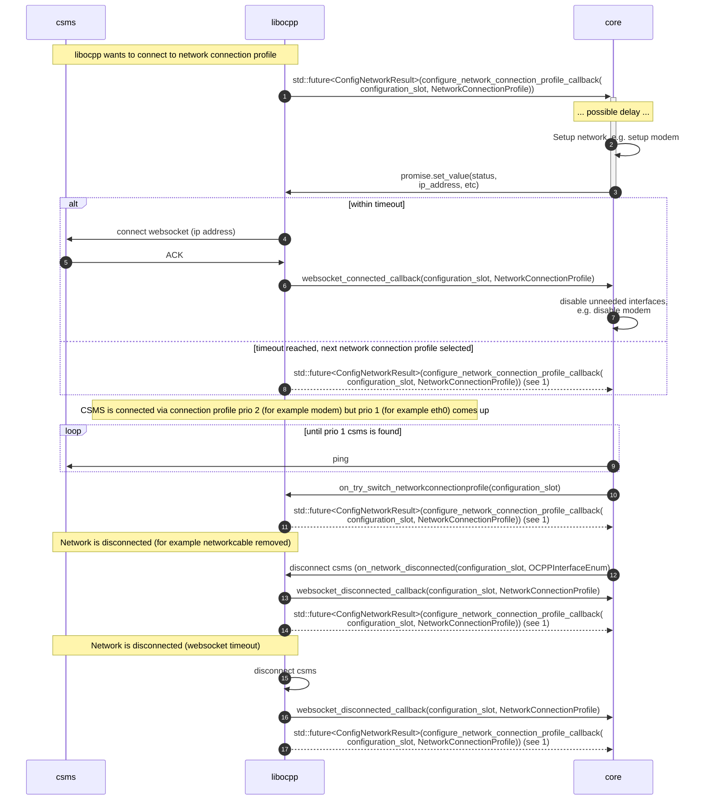
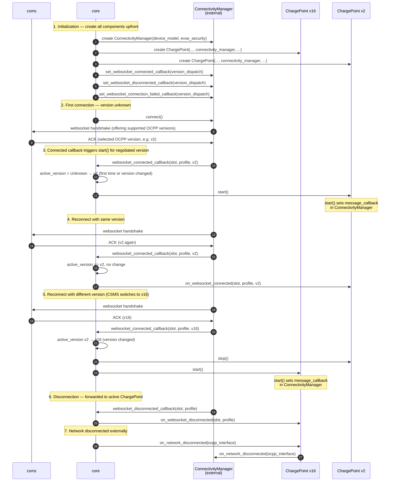

# Network connection profile interface

libocpp automatically tries to connect using the given network connection profiles.
However, if you want more control, you can use the callbacks provided for the network connection.

libocpp will automatically connect to the network profile with the highest priority.
If this fails, it will network profile with the second highest priority, and so on.

## Set up interface (optional)

A callback can be implemented to set up the interface. For example, if the interface is a modem, it must first be
be activated before it is possible to connect to this interface. To do this, you can implement the callback
`std::future<ConfigNetworkResult>(configure_network_connection_profile_callback(configuration_slot, NetworkConnectionProfile))`

In the implementation of this callback, you have to create a promise and return the future to the promise:
```cpp
std::promise<ocpp::ConfigNetworkResult> promise();
std::future<ocpp::ConfigNetworkResult> future = promise.get_future();
return future;
```

If the network was setup successfully, you can set the values in the promise with
```cpp
promise.set_value(configNetworkResult);
```
This way, libocpp knows that it can connect to the given interface and will try to do so.
A timeout can be configured using `NetworkConfigTimeout' to wait longer or shorter than the default 60 seconds.

### Bind to a specific interface

In some cases there are multiple network interfaces available and you may want to connect to a specific one.
In `ConfigNetworkResult` you can specify which interface you want the websocket to bind to.
Sometimes an interface has more than one IP address (in the case of a local/auto link for example).
In this case you want the websocket to bind to a specific IP address. The `interface_address` in ConfigNetworkResult supports both.
It will bind to the given network interface (a string containing the name of the interface) or the given ip address (a string containing the ip address in human readable format).

## Connect to higher network connection profile priority (optional)

Normally, when libocpp is connected with a network connection profile, it will not disconnect.
However, there may be a situation where libocpp is connected to a profile with priority 2 or lower, and you find out at system level that an interface (with a higher priority) has changed and is now up.
A call is added so that you can suggest that libocpp switch to this profile: `bool on_try_switch_network_connection_profile(const std::int32_t configuration_slot)`.
libocpp will inform the caller by the return value if it tries to switch to this profile.

## Disconnected / connected callbacks

libocpp provides two callbacks for when the websocket is connected and disconnected. It will provide the network slot
in these callbacks, so you can keep the network connection in use (e.g. not disable the modem), or disable the network connection (example again: disable the modem).

## External ConnectivityManager (optional)

The `ConnectivityManager` lives in the `ocpp::common` namespace and is not tied to a specific OCPP version. This
design allows the websocket connection to be established **before** a protocol version is determined. During the
websocket handshake the CSMS selects the OCPP protocol version (e.g. OCPP 1.6, OCPP2.0.1 or OCPP2.1). An integrating
application can use this information to instantiate the appropriate version-specific `ChargePoint` and inject the
already-connected `ConnectivityManager` into it.

By default, when no external `ConnectivityManager` is provided, libocpp creates and manages one internally.
However, you can provide your own instance of `ConnectivityManagerInterface` (or the concrete
`ConnectivityManager`) to take full control over websocket connectivity.

### Typical flow with an external ConnectivityManager

1. Create a `ConnectivityManager`.
2. Create **all** version-specific `ChargePoint` instances (e.g. both `ocpp::v16::ChargePoint` and
   `ocpp::v2::ChargePoint`), passing the shared `ConnectivityManager` to each.
3. Register a `websocket_connected_callback` on the `ConnectivityManager` that inspects the negotiated
   `OcppProtocolVersion` and calls `start()` on the matching `ChargePoint`. `start()` automatically sets
   the message callback in the `ConnectivityManager`, so messages are routed to the correct version.
4. On subsequent reconnects (where `start()` was already called for that version), forward the event via
   `on_websocket_connected()` instead.
5. Because the CSMS may select a **different** protocol version on every websocket handshake, the integrating
   application must be prepared to switch between `ChargePoint` instances at any reconnect. When a version
   switch occurs, `stop()` should be called on the previously active `ChargePoint` and `start()` on the
   newly selected one.

### Creating and injecting a ConnectivityManager

```cpp
// 1. Create a version-independent ConnectivityManager
auto connectivity_manager = std::make_shared<ocpp::ConnectivityManager>(device_model, evse_security);

// 2. Create all ChargePoint instances, each receiving the shared ConnectivityManager
auto charge_point_v16 = std::make_unique<ocpp::v16::ChargePoint>(
    /* ... */, connectivity_manager, /* ... */);

auto charge_point_v2 = std::make_unique<ocpp::v2::ChargePoint>(
    evse_connector_structure, device_model, database_handler, evse_security,
    connectivity_manager, message_log_path, callbacks);
```

### Wiring up websocket event callbacks

The websocket connected callback must handle both the initial `start()` call and subsequent reconnects.
It also needs to handle potential version switches:

```cpp
// Track which ChargePoint is currently active and started
ocpp::OcppProtocolVersion active_version = ocpp::OcppProtocolVersion::Unknown;

connectivity_manager->set_websocket_connected_callback(
    [&](int configuration_slot,
        const ocpp::v2::NetworkConnectionProfile& profile,
        const ocpp::OcppProtocolVersion version) {

        if (version != active_version) {
            // Version changed — stop the previously active ChargePoint (if any)
            if (active_version == ocpp::OcppProtocolVersion::v16) {
                charge_point_v16->stop();
            } else if (active_version != ocpp::OcppProtocolVersion::Unknown) {
                charge_point_v2->stop();
            }

            // Start the ChargePoint for the newly negotiated version.
            // start() sets the message callback in the ConnectivityManager
            // so that incoming messages are routed to the correct ChargePoint.
            if (version == ocpp::OcppProtocolVersion::v16) {
                charge_point_v16->start();
            } else {
                charge_point_v2->start();
            }
            active_version = version;
        } else {
            // Same version as before — just notify the active ChargePoint
            if (version == ocpp::OcppProtocolVersion::v16) {
                charge_point_v16->on_websocket_connected(configuration_slot, profile, version);
            } else {
                charge_point_v2->on_websocket_connected(configuration_slot, profile, version);
            }
        }
    });

connectivity_manager->set_websocket_disconnected_callback(
    [&](int configuration_slot,
        const ocpp::v2::NetworkConnectionProfile& profile,
        auto /*version*/) {
        if (active_version == ocpp::OcppProtocolVersion::v16) {
            charge_point_v16->on_websocket_disconnected(configuration_slot, profile);
        } else {
            charge_point_v2->on_websocket_disconnected(configuration_slot, profile);
        }
    });

connectivity_manager->set_websocket_connection_failed_callback(
    [&](ocpp::ConnectionFailedReason reason) {
        if (active_version == ocpp::OcppProtocolVersion::v16) {
            charge_point_v16->on_websocket_connection_failed(reason);
        } else {
            charge_point_v2->on_websocket_connection_failed(reason);
        }
    });
```

Optionally, if your system requires interface setup (e.g. modem activation), set the network configuration
callback:

```cpp
connectivity_manager->set_configure_network_connection_profile_callback(
    [](const int32_t configuration_slot,
       const ocpp::v2::NetworkConnectionProfile& profile) {
        std::promise<ocpp::ConfigNetworkResult> promise;
        // ... set up the network interface ...
        ocpp::ConfigNetworkResult result;
        result.success = true;
        result.interface_address = "eth0"; // optional: bind to specific interface or IP
        promise.set_value(result);
        return promise.get_future();
    });
```

**Note:** `start()` automatically calls `set_message_callback` on the `ConnectivityManager`, ensuring that
incoming OCPP messages are routed to the correct `ChargePoint` instance. The `set_logging` method is called
automatically by `ChargePoint::initialize()`. You do not need to call either of these yourself.

### When to use an external ConnectivityManager

- When a single application needs to support multiple OCPP versions and switch between them at runtime
  based on the CSMS's protocol selection
- When the OCPP protocol version is not known ahead of time and should be determined by the websocket
  handshake before starting a version-specific `ChargePoint`
- When you want to implement a custom connectivity strategy (e.g. custom reconnection logic by implementing
  `ConnectivityManagerInterface`)

### Version switching responsibility

When using an external `ConnectivityManager` with multiple `ChargePoint` instances, the **application** is
responsible for implementing the version-switching logic (i.e. deciding which `ChargePoint` to `start()`/`stop()`
based on the negotiated protocol version). libocpp does not currently provide a built-in orchestrator for this,
because the v16 and v2 `ChargePoint` implementations do not share a common interface and applications may need to
manage additional version-specific state during a switch (e.g. active transactions, UI state). Such an orchestrator
may be provided in the future.

### Default (internal) behavior

If you do **not** provide a `ConnectivityManager`, libocpp creates one internally and automatically registers the
websocket event callbacks. In this case, the `on_websocket_connected`, `on_websocket_disconnected`, and
`on_websocket_connection_failed` methods on `ChargePoint` are called automatically and you do not need to call them.
This is sufficient when the OCPP protocol version is known at compile time or configuration time.

## Sequence diagram

'core' can be read as any application that implements libocpp

For step 9, ping is one way to check if a CSMS is up, but you of course can implement a way to check this yourself.

### Internal ConnectivityManager (default)



### External ConnectivityManager


