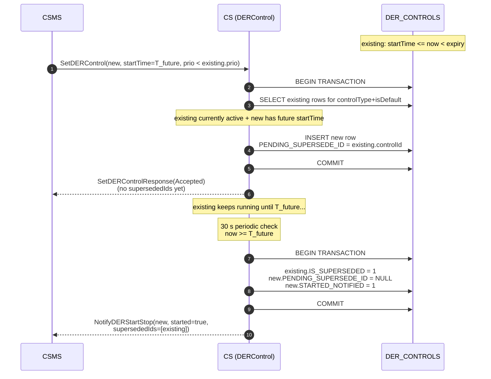
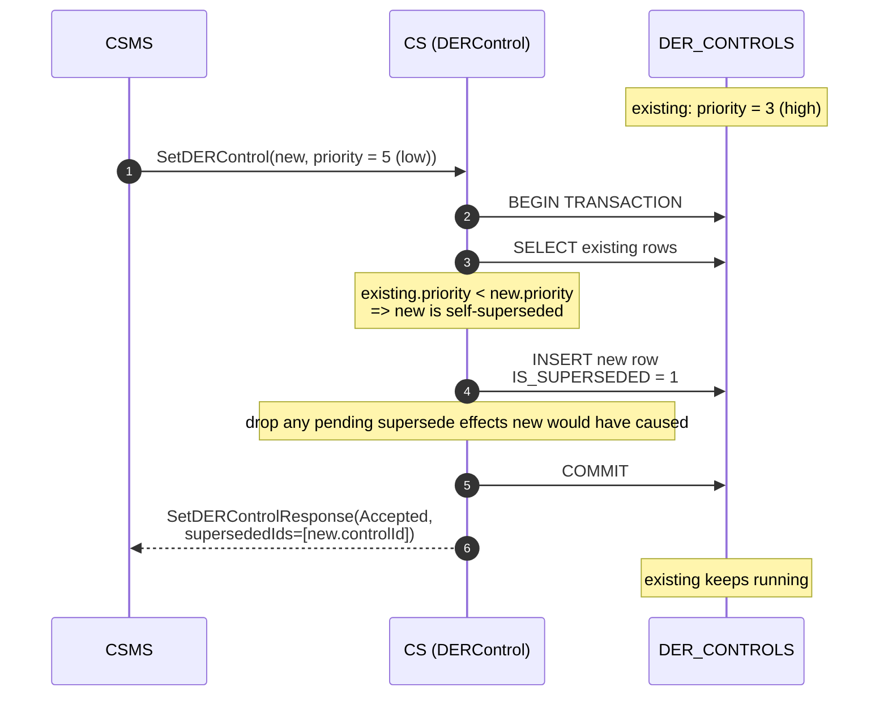

# R04 DER Control — Supersede Mechanism

This document explains how `SetDERControl` (OCPP 2.1, use case R04) decides
whether a newly received control supersedes existing controls of the same
`controlType` + `isDefault`, and when that supersede takes effect.

## Priority comparison

OCPP 2.1 R04 uses a **lower priority value wins** convention:

| `new.priority` vs `existing.priority` | Outcome |
|----|----|
| `new < existing` | new overrules existing (FR.03 / FR.06 / FR.07) |
| `new == existing` | tie does **not** supersede; existing keeps running |
| `new > existing` | existing overrules new; new is stored already-superseded (FR.08) |

The comparison only runs against rows that share the same `controlType` and
`isDefault`. Different control types coexist independently.

## FR.03 — default vs default

Defaults have no `startTime` / `duration`. They are conceptually always
"active" but only one default per `controlType` is in force at any time.

- New default with **strictly lower** `priority` value than the existing
  default → existing is flagged `IS_SUPERSEDED = 1` immediately.
- New default with equal priority value → both rows persist, neither is
  flagged. Existing keeps running.
- New default with strictly higher priority value → new row is stored with
  `IS_SUPERSEDED = 1`; the existing default keeps running.

## FR.06 — existing not yet active

A scheduled control whose `startTime > now` is "not yet active". When a new
control overrules it (lower priority value), the supersede is **immediate**:
the existing row is flagged `IS_SUPERSEDED = 1` inside the same transaction
that persists the new row.

The response's `supersededIds` lists the existing `controlId`(s).

## FR.07 — existing currently active

When the existing control is currently active (`startTime <= now < startTime + duration`)
and the new control has a future `startTime`, the supersede is **deferred**:

- The new row is stored with `PENDING_SUPERSEDE_ID = <existing controlId>`.
- The existing row keeps running until `now >= new.startTime`.
- The 30 s periodic check fires the deferred flip the moment `new.startTime`
  is reached: existing flips to `IS_SUPERSEDED = 1`, the new row's
  `PENDING_SUPERSEDE_ID` is cleared, and `NotifyDERStartStop(started=true,
  supersededIds=[existing])` is dispatched for the new control.

The `SetDERControl` response **omits** `supersededIds` for the deferred case.
The CSMS learns about the supersede via the later `NotifyDERStartStop`, not
synchronously.

## FR.08 — new is itself superseded

If any existing row of the same `controlType` + `isDefault` has **strictly
lower** priority value than the new control, the new control loses. It is
stored with `IS_SUPERSEDED = 1`, and the response's `supersededIds` echoes
the **new** `controlId` to tell the CSMS its just-set control will not run.

When this happens, any pending immediate or deferred supersede side effects
the new control would have caused against other rows are dropped — a row
that will never actually take effect must not flag other rows as superseded
by it.

## `displacedIds` persistence and FR.22 expiry-notify

Every row records the controlIds it has displaced in
`CONTROL_JSON.displacedIds`. The list is populated:

- at `SetDERControl` insert from the immediate-supersede path
  (`pending_immediate_supersedes`), and
- at deferred-supersede activation via
  `DatabaseHandler::append_der_control_displaced_id(new_id, existing_id)`.

When the row expires (`startTime + duration <= now`), the periodic check
emits `NotifyDERStartStopRequest(started=false, supersededIds=<displacedIds>)`
so the CSMS receives the same supersede relationship on expiry that it saw on
the matching start notify. The field is optional per the OCPP 2.1 Part 2
§1.48.1 schema (`0..24`), so emitting it on `started=false` is permitted.

## Side-effect resolution order

`handle_set_der_control` collects supersede side effects in two slots before
applying them:

- `pending_immediate_supersedes` — list of existing `controlId`s the new row
  would flip to `IS_SUPERSEDED = 1` synchronously (FR.03 / FR.06 path).
- `deferred_supersede_target` — the single existing `controlId` the new row
  defers superseding via `PENDING_SUPERSEDE_ID` (FR.07 path).

If during the scan a higher-priority existing row is found (`new_is_superseded =
true`, FR.08), both slots are cleared before any DB write. Otherwise, the
immediate flips are applied and `superseded_ids` is populated for the
response. The single transaction wrapping the whole handler ensures no
concurrent CSMS call or scheduled-check pass can observe a half-applied
state.
