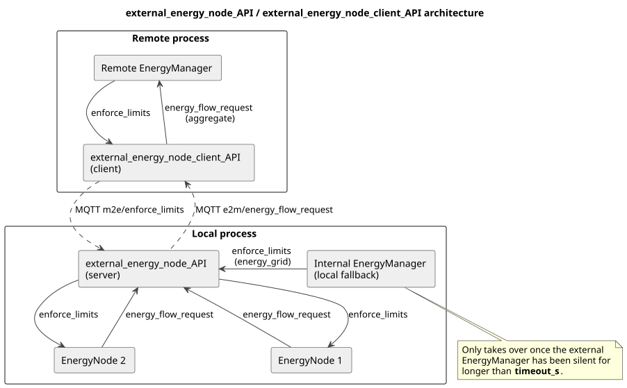

.. _everest_modules_handwritten_external_energy_node_API:

.. *******************************************
.. external_energy_node_API
.. *******************************************

Version Information
====================
Version history of the module:

.. list-table::
   :widths: 15 85
   :header-rows: 1

   * - Version
     - Description
   * - 1.0.0
     - Initial version of the external_energy_node_API / external_energy_node_client_API module pair

Introduction
============
``external_energy_node_API`` and its companion module ``external_energy_node_client_API`` together bridge
EVerest's internal energy management tree across two separate EVerest processes over MQTT. They let one
EVerest process (for example the controller of a group of EVSEs) be managed by an ``EnergyManager`` running
in a *different*, remote EVerest process, without either process needing direct knowledge of the other beyond
a shared MQTT broker.

Typical use cases include:

* Several independently deployed EVerest processes, each managing its own group of EVSEs, that should all be
  load-balanced together by one remote ``EnergyManager``.
* Any deployment where the energy tree needs to cross a process (or network) boundary, while still allowing
  each side to keep working safely if the other becomes unreachable.

``external_energy_node_API`` is the **server**: it runs alongside the local EVerest process, aggregates the
``energy_flow_request`` of its locally connected ``EnergyNode`` children, and publishes that aggregate out over
external MQTT. It also accepts ``enforce_limits`` back from the remote side and routes them to its children.
``external_energy_node_client_API`` is the **client**: it runs in the remote process, subscribes to the server's
aggregate, and presents it locally as if it were an ordinary ``energy_consumer`` — so the remote ``EnergyManager``
sees the whole local process as a single child in its own energy tree, with no special-casing.

Architecture
============

Message flow, in short:

* ``EnergyNode`` children publish ``energy_flow_request`` up to the server, which merges them into one aggregate
  and forwards it both to the internal ``EnergyManager`` (if connected) and, over external MQTT, to the client.
* The client republishes that aggregate locally as its own ``energy_flow_request``, so the remote
  ``EnergyManager`` can fold it into its normal allocation — the local process is just another child, not a
  special case.
* The remote ``EnergyManager`` computes ``enforce_limits`` for that child as usual; the client forwards it back
  over external MQTT to the server, which routes it down to its ``EnergyNode`` children.
* The server treats external limits as authoritative over internal ones while the external side is active.

Fallback to the internal EnergyManager
=======================================
The server can also connect to a local ``EnergyManager`` (via its ``energy_grid`` provided interface), which
takes over automatically if the external side goes quiet. Every ``enforce_limits`` received from the external
side (re)arms a watchdog timer set to ``timeout_s``; if no further message arrives before it fires, the server
falls back to forwarding whatever the internal ``EnergyManager`` sends instead. This fallback is driven purely by
that timer — it does not depend on any other event, such as local ``EnergyNode`` activity — so it also engages
correctly on a completely idle process.

Module Configuration
=====================

.. list-table::
   :widths: 25 75
   :header-rows: 1

   * - Parameter
     - Description
   * - ``timeout_s``
     - Seconds without an ``enforce_limits`` message from the external ``EnergyManager`` before falling back to
       the internal one. Set to ``0`` to disable the timeout entirely (always prefer external limits, and never
       fall back).
   * - ``fuse_limit_A``
     - Local fuse limit in ampere (per phase) at this bridge point. Advertised in the aggregate's schedules so
       both the internal and the external ``EnergyManager`` allocate within it, and used as a backstop to lower
       any external ``enforce_limits`` that exceed it. ``0`` = no fuse here (unlimited pass-through). Note that a
       fuse *above* this node can never be enforced by the external ``EnergyManager`` — it only ever sees this
       node and its descendants — so if such a fuse exists, configure it here.
   * - ``phase_count``
     - Phase count of the local fuse; only advertised/enforced when ``fuse_limit_A`` is set.
   * - ``cfg_heartbeat_interval_ms``
     - Interval at which the module sends a heartbeat to the external side, so it can detect a connection loss
       even when there is nothing else to publish. Set to ``0`` to disable.
   * - ``cfg_communication_check_to_s``
     - Timeout for the underlying communication-check handshake with the external side; raises a
       ``CommunicationFault`` error if no check is received in time. This is independent of ``timeout_s`` — it
       only signals a connection-health fault, it does not by itself trigger the internal fallback.

Deployment notes
=================
Each ``external_energy_node_API`` instance is designed to serve exactly one ``external_energy_node_client_API``
instance. There is no per-client bookkeeping on the server side (a single ``enforce_limits`` topic, a single
"external active" state), so pointing more than one client at the same server produces undefined, racy behavior
rather than a clean error. To manage several local processes from one remote ``EnergyManager``, run one
client/server pair per process and let the remote ``EnergyManager`` see each client as its own separate child —
the usual multi-child allocation in ``EnergyManager`` already handles load-balancing across them.

Securing the external MQTT broker
----------------------------------
Anything that can publish to the server's ``m2e/enforce_limits`` topic controls the power allocation of every
``EnergyNode`` child below it — the module deliberately applies external limits with priority over the internal
``EnergyManager``. The external MQTT broker is therefore a trust boundary, and in any production deployment it
must be locked down accordingly:

* Do **not** allow anonymous access; require per-client credentials or mutual TLS.
* Restrict publish/subscribe rights with broker ACLs so only the paired client may publish to
  ``everest_api/1/external_energy_node/{server_id}/m2e/#`` and only the server may publish to the matching
  ``e2m/#`` topics.
* Use TLS on any link that leaves the host, including the bridge between the local and external brokers.

The bundled devcontainer broker config (``mosquitto-external.conf``) uses ``allow_anonymous true`` and is
suitable for local development and SIL testing only.

Stale children
---------------
The server keeps the last ``energy_flow_request`` of every child that has ever published one; there is no
staleness timeout. If a child ``EnergyNode`` disappears (crashes, is removed from the config, or changes its
UUID), its last request stays in the aggregate indefinitely and the remote ``EnergyManager`` keeps allocating
energy to it. This matches the behavior of ``EnergyNode`` itself, but the effect is more visible here because
the aggregate crosses a process boundary. After removing or renaming children, restart the server process so
the aggregate is rebuilt from scratch.

References / Links
====================
* AsyncAPI specification (server): ``docs/source/reference/EVerest_API/external_energy_node_API.yaml``
* AsyncAPI specification (client): ``docs/source/reference/EVerest_API/external_energy_node_client_API.yaml``
