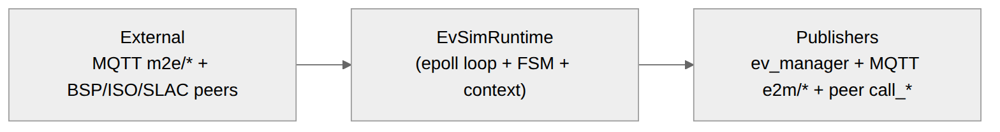
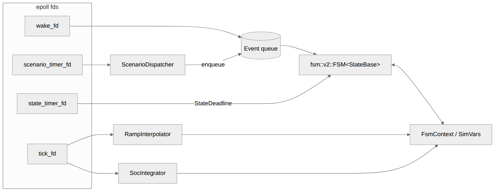
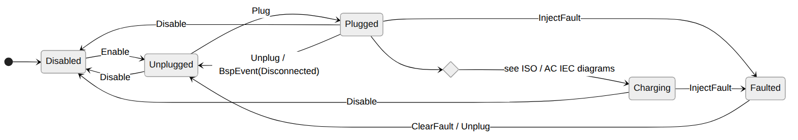
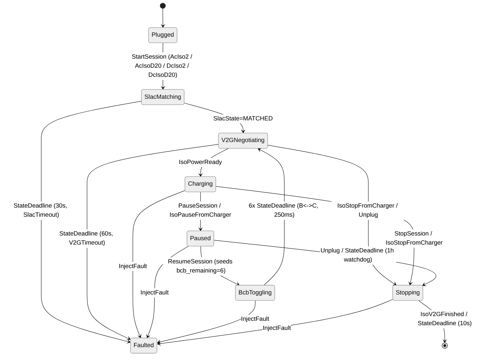
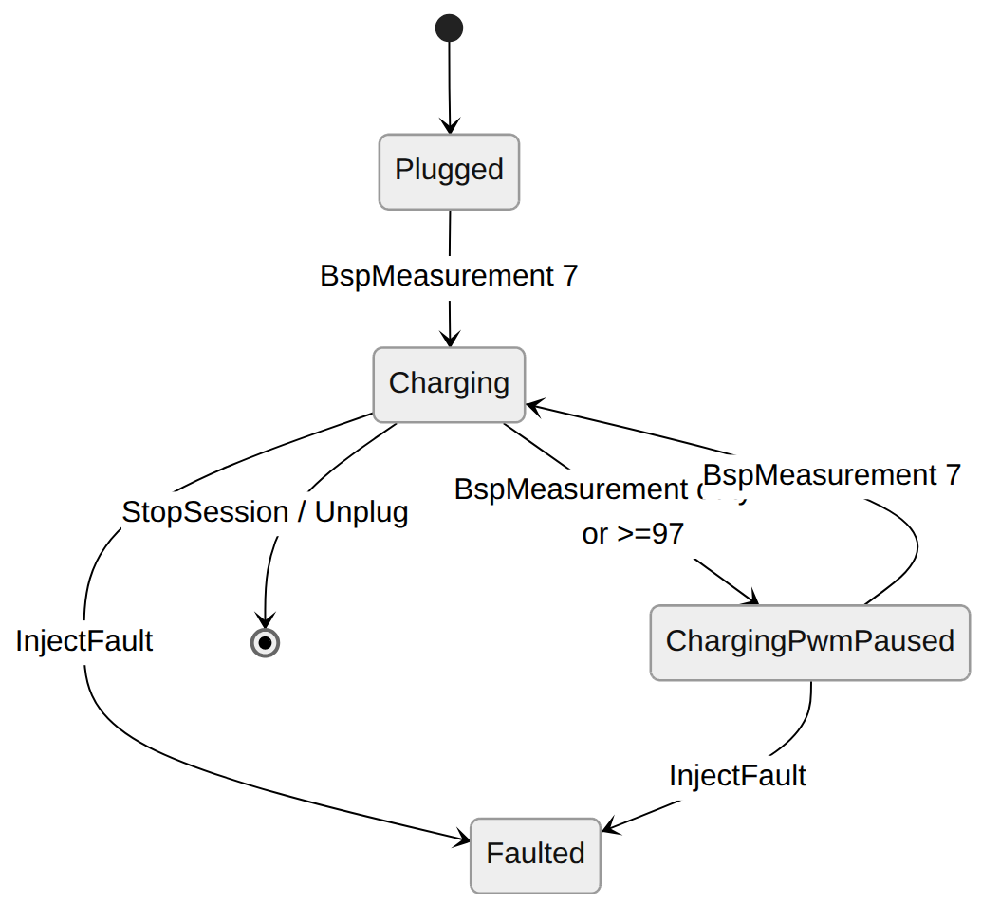
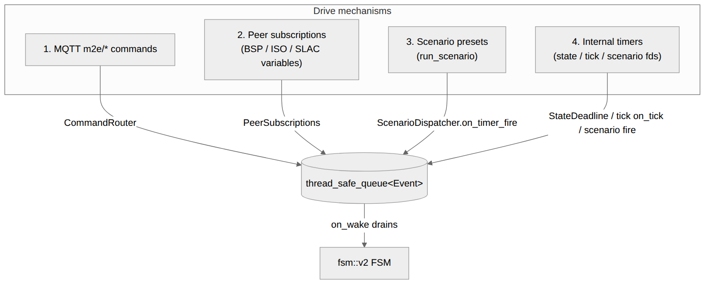
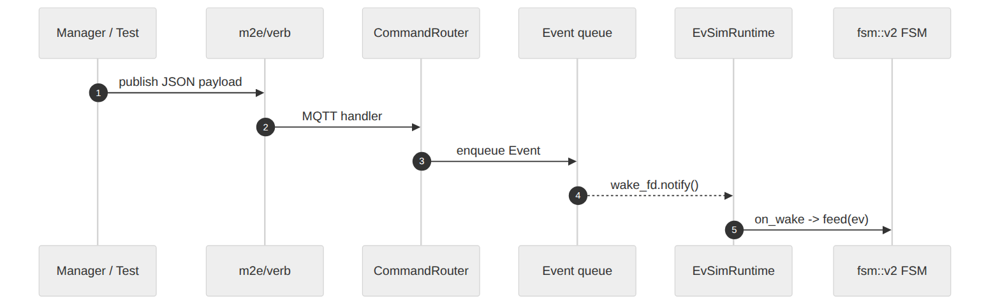
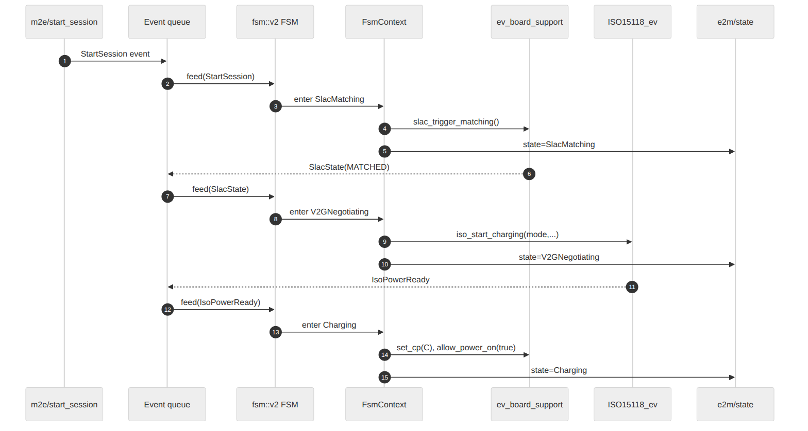
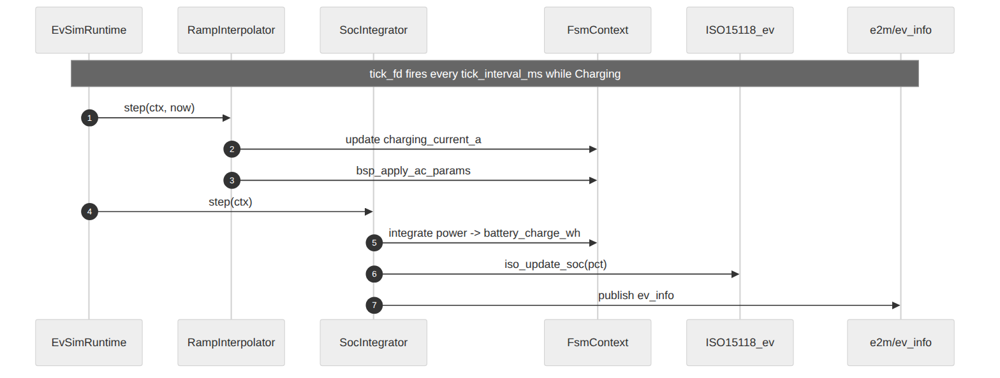

.. _everest_modules_handwritten_EvSimulator:

===========
EvSimulator
===========

Simplified EV simulator with a versioned, typed MQTT API and an ``fsm::v2``
state machine. Coexists with ``EvManager`` and is targeted as its replacement.
Implements all 12 declared scenarios. Acts as the EV-side counterpart of
``EvseManager`` for software-in-the-loop (SIL) testing: it drives the simulated
board support (``YetiSimulator``) and speaks to the ISO 15118 stack
(``EvseV2G`` / ``Evse15118D20``) through the standard ``ISO15118_ev`` and
``ev_slac`` interfaces.

Architecture overview
=====================

The module is a single epoll-loop process. One thread (``loop_thread``) owns
the FSM and the only mutable state. Four ``fd``\ s drive that loop:

- ``wake_fd`` — external producers (MQTT commands, peer subscriptions, scenario
  steps) push ``Event``\ s onto a ``thread_safe_queue`` and poke this fd.
- ``state_timer_fd`` — per-state deadline (SLAC 30 s, V2G 60 s, BCB 250 ms
  step, Paused 1 h watchdog, Stopping 10 s fallback, BcbToggling 250 ms).
- ``tick_fd`` — periodic ``tick_interval_ms`` while ``Charging``; drives
  ``RampInterpolator`` and ``SocIntegrator``.
- ``scenario_timer_fd`` — one-shot used by ``ScenarioDispatcher`` to advance
  through scripted step lists.

High level
----------

Source: `images/architecture_overview.mmd <images/architecture_overview.mmd>`_.

Runtime internals
-----------------

Source: `images/architecture_runtime.mmd <images/architecture_runtime.mmd>`_.

The FSM never touches peer interfaces or MQTT publishers directly. Both are
injected into ``FsmContext`` as callbacks (``PeerActions`` for ``call_*``,
``Publisher`` for MQTT). This keeps the FSM decoupled from the ev-cli
generated ``*Intf`` types and makes every state unit-testable with the mocks
under ``tests/PeerMocks.{cpp,hpp}``.

Module layout
-------------

::

    modules/EV/EvSimulator/
    ├── manifest.yaml              # provides ev_manager; requires ev_board_support, ISO15118_ev, ev_slac, kvs
    ├── EvSimulator.{cpp,hpp}      # ev-cli generated module shell (init/ready)
    ├── ev_manager/                # provided-interface impl (currently a thin stub)
    ├── main/
    │   ├── EvSimRuntime.{cpp,hpp} # epoll loop owner, fd handlers
    │   ├── FsmContext.{cpp,hpp}   # shared state + publisher helpers + free helpers
    │   ├── StateBase.{cpp,hpp}    # FSM base; Result {unhandled, new_state}
    │   ├── Events.hpp             # EventKind + Event variant
    │   ├── CommandRouter.{cpp,hpp}     # m2e/* MQTT -> Event queue
    │   ├── PeerSubscriptions.{cpp,hpp} # BSP/ISO/SLAC subscribe_* -> Event queue
    │   ├── ScenarioDispatcher.{cpp,hpp}# scripted step lists + scenario timer
    │   ├── RampInterpolator.{cpp,hpp}  # linear interp of charging_current_a
    │   ├── SocIntegrator.{cpp,hpp}     # per-tick SoC accumulation
    │   └── states/
    │       Disabled / Unplugged / Plugged / SlacMatching / V2GNegotiating /
    │       BcbToggling / Charging / ChargingPwmPaused / Paused / Stopping /
    │       Faulted
    └── tests/                     # Catch2 unit tests; helpers + mocks

Configuration
=============

``connector_id``
    Connector id of the EVSE manager to which this simulator is connected to.

``ac_nominal_voltage``
    Nominal AC voltage between phase and neutral in Volt. Default: ``230``.

``max_current_a``
    AC max current in Ampere. Default: ``16``.

``three_phases``
    Support three phase. Default: ``true``.

``dc_max_current_limit``
    Maximum current allowed by the EV. Default: ``300``.

``dc_max_power_limit``
    Maximum power allowed by the EV. Default: ``150000``.

``dc_max_voltage_limit``
    Maximum voltage allowed by the EV. Default: ``900``.

``dc_energy_capacity``
    Energy capacity of the EV. Default: ``60000``.

``dc_target_current``
    Target current requested by the EV. Default: ``5``.

``dc_target_voltage``
    Target voltage requested by the EV. Default: ``200``.

``soc_initial_pct``
    SoC at start of a simulated charging process. Default: ``30``.

``departure_time_s``
    Departure time in seconds after the session starts. Default: ``86400``.

``e_amount_wh``
    Energy amount in Wh that should be charged during the session. Default: ``0``.

``force_payment_option``
    Force the use of the selected payment option. Default: ``false``.

``keep_cross_boot_plugin_state``
    Keep plugin state across boot (use for simulation only). Default: ``false``.

``publish_bsp_measurements``
    Whether to publish synthetic BSP measurements. Default: ``false``.

``tick_interval_ms``
    FSM tick interval in milliseconds (drives ``RampInterpolator`` and
    ``SocIntegrator`` while ``Charging``). Default: ``100``.

``on_battery_full``
    Policy applied by ``SocIntegrator`` when SoC crosses
    ``battery_full_threshold_pct``. Default: ``clamp``. Values:

    - ``clamp`` — silently cap energy at ``battery_capacity_wh``; SoC plateaus
      at the threshold, no FSM event fires (legacy behavior).
    - ``idle_at_full`` — zero positive charge power while at/above threshold;
      session stays in ``Charging``, discharge (BPT / V2X reverse current)
      continues to subtract energy normally.
    - ``stop_session`` — rising-edge enqueues ``StopSession``, the
      ``Charging`` state transitions to ``Stopping`` and the session
      terminates.
    - ``pause_if_iso`` — rising-edge enqueues ``PauseSession`` when
      ``charge_mode`` is one of ``AcIso2`` / ``AcIsoD20`` / ``DcIso2`` /
      ``DcIsoD20`` (``Charging`` → ``Paused``); falls back to
      ``idle_at_full`` semantics in ``AcIec`` (no FSM event, charge power
      zeroed).

    The edge is one-shot per crossing: ``vars.was_full`` latches when SoC
    reaches the threshold and clears when SoC drops back below, so a
    discharge-then-recharge cycle re-arms the policy.

``battery_full_threshold_pct``
    SoC percentage at which ``on_battery_full`` fires (edge-triggered).
    Default: ``100`` (physical full). Set lower to simulate strategies like
    "charge to 80%".

``cfg_communication_check_to_s``
    Communication check timeout in seconds. Default: ``5``.

``cfg_heartbeat_interval_ms``
    Heartbeat publish interval in milliseconds. Default: ``1000``.

Interfaces
==========

Provides
--------

``ev_manager`` (``interface: ev_manager``)
    Republishes ``bsp_event`` and ``ev_info`` from the simulated EV so peer
    in-process modules (typically ``EvAPI``) see a drop-in replacement for the
    ``ev_manager`` interface offered by the legacy ``EvManager`` module.

Requires
--------

``ev_board_support`` (``interface: ev_board_support``, **required**, 1)
    Drives the board-support peer (``YetiSimulator``). Subscribes to
    ``bsp_event``, ``bsp_measurement``, ``ev_info``. Invokes
    ``set_cp_state``, ``allow_power_on``, ``set_ac_max_current``,
    ``set_three_phases``, ``diode_fail``, ``set_rcd_error``.

``ev`` (``interface: ISO15118_ev``, optional, 0..1)
    EV-side ISO 15118 peer (``EvseV2G`` / ``Evse15118D20``). Subscribes to
    ``ev_power_ready``, ``stop_from_charger``, ``v2g_session_finished``,
    ``dc_power_on``, ``pause_from_charger``, ``ac_evse_max_current``,
    ``ac_evse_target_power``. Invokes ``start_charging``, ``stop_charging``,
    ``pause_charging``, ``update_soc``, ``enable_sae_j2847_v2g_v2h``,
    ``set_bpt_dc_params``.

``slac`` (``interface: ev_slac``, optional, 0..1)
    PLC SLAC peer. Subscribes to ``state`` (translated to a string). Invokes
    ``trigger_matching``.

``kvs`` (``interface: kvs``, optional, 0..1)
    Persistent key/value store. Used when ``keep_cross_boot_plugin_state``
    is ``true`` to persist ``PersistedState`` (last plug status, last mode,
    last scenario).

External MQTT API
=================

The module exposes a versioned, typed MQTT API. All topics share the prefix:

::

    <mqtt_external_prefix>everest_api/1/ev_simulator/<module_id>/<m2e|e2m>/<suffix>

``m2e/*`` carries inbound commands (manager-to-EV); ``e2m/*`` carries outbound
state and events (EV-to-manager). Payload shapes for every suffix are defined
in the typed schema at
``lib/everest/everest_api_types/include/everest_api_types/ev_simulator/API.hpp``.

Inbound suffixes (``m2e/*``):

.. list-table::
   :header-rows: 1
   :widths: 20 18 62

   * - Suffix
     - Resulting EventKind
     - Payload
   * - ``enable``
     - ``Enable`` (true) / ``Disable`` (false)
     - ``bool``
   * - ``plug``
     - ``Plug``
     - —
   * - ``unplug``
     - ``Unplug``
     - —
   * - ``start_session``
     - ``StartSession``
     - ``StartSessionParams`` (mode, current, phases, BPT, MCS, curve)
   * - ``stop_session``
     - ``StopSession``
     - —
   * - ``pause_session``
     - ``PauseSession``
     - —
   * - ``resume_session``
     - ``ResumeSession``
     - —
   * - ``set_charging_current``
     - ``SetChargingCurrent``
     - ``SetChargingCurrentParams`` (current_a, three_phases, ramp_ms?)
   * - ``set_soc``
     - ``SetSoc``
     - ``SetSocParams`` (soc_pct)
   * - ``inject_fault``
     - ``InjectFault``
     - ``InjectFaultParams`` (type, optional fields)
   * - ``clear_fault``
     - ``ClearFault``
     - —
   * - ``bcb_toggle``
     - ``BcbToggle``
     - ``BcbToggleParams``
   * - ``run_scenario``
     - ``RunScenario``
     - ``RunScenarioParams`` (name)
   * - ``query_state``
     - ``QueryState``
     - — (re-publishes ``e2m/state``)
   * - ``communication_check``
     - — (direct: ``comm_check.set_value``)
     - ``bool``
   * - ``raise_error``
     - — (direct: ``p_ev_manager->raise_error``)
     - ``Error``
   * - ``clear_error``
     - — (direct: ``p_ev_manager->clear_error``)
     - ``Error``

Outbound suffixes (``e2m/*``):

- ``state`` — current ``FsmState``
- ``ev_info`` — synthesized ``EVInfo`` (SoC, etc.)
- ``bsp_event`` — peer BSP events mirrored verbatim
- ``slac_state`` — string form of SLAC peer state
- ``iso_session_event`` — ISO session lifecycle events
- ``fault`` — ``FaultReport`` (type + reason) on entry to ``Faulted``
- ``command_ack`` — ``{command, status, reason}``. Out-of-state commands are
  always acknowledged with ``status: "Rejected"`` and a human-readable
  ``reason``; never silently dropped. Accepted commands also publish
  ``status: "Accepted"`` where applicable.
- ``heartbeat`` — monotonic counter published every
  ``cfg_heartbeat_interval_ms``
- ``bsp_measurement`` — only when ``publish_bsp_measurements: true``

State machine
=============

The FSM is an ``fsm::v2::FSM<StateBase>``. Each state is a class deriving from
``StateBase`` that overrides ``enter()``, ``leave()`` (default cancels the
state timer), and ``feed(Event)``. ``feed`` returns a ``StateBase::Result``:

- ``{unhandled=false, new_state=nullptr}`` — handled, stay in current state.
- ``{unhandled=false, new_state=<S>}`` — handled, transition to ``S``.
- ``{unhandled=true,  new_state=nullptr}`` — event ignored by this state.

Top-level lifecycle
-------------------

Boot, plug-in, disable, and fault entry/exit. Charging detail in the two
diagrams below.

Source: `images/state_machine_top.mmd <images/state_machine_top.mmd>`_.

ISO 15118 charging flow
-----------------------

SLAC matching → V2G negotiation → Charging, with pause/resume (BCB
toggling) and stop paths. Covers AcIso2, AcIsoD20, DcIso2, DcIsoD20.

Source: `images/state_machine_iso.mmd <images/state_machine_iso.mmd>`_.

AC IEC charging flow
--------------------

PWM duty-cycle driven; no SLAC or V2G negotiation. Direct
Plugged → Charging on duty in (7%, 97%); PWM-pause when duty exits that
band.

Source: `images/state_machine_ac_iec.mmd <images/state_machine_ac_iec.mmd>`_.

Per-state reference
-------------------

.. list-table::
   :header-rows: 1
   :widths: 20 12 12 56

   * - State
     - State timer
     - Tick
     - Entry actions
   * - ``Disabled``
     - —
     - —
     - publish state
   * - ``Unplugged``
     - —
     - —
     - CP=A, ``allow_power_on(false)``, ``iso_stop_charging``, reset
       ``charge_mode``/``bpt``/``mcs``/``last_fault``,
       ``persisted.plugged_in=false``, reset scenario, ``kvs_save``
   * - ``Plugged``
     - —
     - —
     - CP=B, ``allow_power_on(false)``, ``persisted.plugged_in=true``,
       ``kvs_save``
   * - ``SlacMatching``
     - 30 s
     - —
     - ``slac_trigger_matching``, ``vars.slac_state="MATCHING"``
   * - ``V2GNegotiating``
     - 60 s
     - —
     - ``iso_start_charging(mode, …)`` (if ``charge_mode`` set)
   * - ``BcbToggling``
     - 250 ms (re-armed)
     - —
     - default ``bcb_remaining=6``, CP=B; each deadline toggles B↔C and
       decrements
   * - ``Charging``
     - —
     - ``tick_interval_ms``
     - CP=C, ``allow_power_on(true)``, arm SoC tick
   * - ``ChargingPwmPaused``
     - —
     - —
     - CP=B, ``allow_power_on(false)`` (tick disarmed by ``Charging::leave``)
   * - ``Paused``
     - 1 h watchdog
     - —
     - CP=B, ``allow_power_on(false)``, ``iso_pause_charging``
   * - ``Stopping``
     - 10 s fallback
     - —
     - ``iso_stop_charging``, ``allow_power_on(false)``, CP=B
   * - ``Faulted``
     - —
     - —
     - Apply fault per type: ``DiodeFail`` → ``bsp_diode_fail(true)``;
       ``RcdError`` → ``bsp_set_rcd_error(mA)``; ``CpErrorE`` → CP=E.
       ``leave()`` reverses BSP side-effects.

The free helpers in ``FsmContext.cpp`` are reused across states:

- ``transition_to_fault(ctx, p)`` — store ``last_fault``, go to ``Faulted``.
- ``transition_to_disabled(ctx)`` — clear faults, CP=A, power off, reset
  mode/last_fault, ``persisted.plugged_in=false``, ``kvs_save``, go to
  ``Disabled``.
- ``handle_query_state(ctx, s)`` — re-publish ``e2m/state`` for late
  subscribers; do not transition.

Drive mechanisms
================

The simulator can be driven by four independent producers, all of which land
on the same FSM event queue:

Source: `images/drive_mechanisms.mmd <images/drive_mechanisms.mmd>`_.

1. **External MQTT commands** — ``CommandRouter`` (``main/CommandRouter.cpp``)
   subscribes to each ``m2e/<verb>`` topic. Each handler deserializes the
   payload via ``everest_api_types`` codecs, constructs an ``Event``, and
   calls ``EvSimRuntime::enqueue``. Three verbs bypass the queue
   (``communication_check``, ``raise_error``, ``clear_error``) and are routed
   directly to ``comm_check`` or to the provided ``ev_manager`` impl.

2. **Peer-module variables** — ``PeerSubscriptions``
   (``main/PeerSubscriptions.cpp``) registers ``subscribe_*`` callbacks on
   the BSP, ISO 15118-ev, and SLAC requirements. ISO and SLAC are guarded by
   ``min_connections: 0``; if unconnected they are silently skipped.

3. **Scenario presets** — ``ScenarioDispatcher``
   (``main/ScenarioDispatcher.cpp``) holds a ``std::vector<ScenarioStep>``
   built by one of 12 ``build_*()`` free functions. ``start()`` fires every
   step with ``at <= 0`` synchronously, then arms ``scenario_timer_fd`` for
   the next pending step. On each timer fire, ``on_timer_fire(ctx)`` enqueues
   the step's ``Event`` into the FSM queue and re-arms.

4. **Internal timers**:

   - ``state_timer_fd`` (per-state deadline) → enqueues a ``StateDeadline``
     event from ``EvSimRuntime::on_state_timer``.
   - ``tick_fd`` (only while ``Charging``) → calls
     ``RampInterpolator::step`` then ``SocIntegrator::step`` directly on the
     loop thread; no FSM event produced.
   - ``scenario_timer_fd`` → ``ScenarioDispatcher::on_timer_fire``.

Event ingress / egress
----------------------

Command path
~~~~~~~~~~~~

Generic m2e command lifecycle: external publisher → MQTT topic →
``CommandRouter`` → ``Event`` queue → ``EvSimRuntime`` drain → FSM
``feed``.

Source: `images/event_ingress_command.mmd <images/event_ingress_command.mmd>`_.

Session sequence
~~~~~~~~~~~~~~~~

Peer-driven progression from ``StartSession`` through ``SlacMatching``,
``V2GNegotiating``, and into ``Charging``. Per-tick activity in ``Charging``
covered separately below.

Source: `images/event_ingress_session.mmd <images/event_ingress_session.mmd>`_.

Per-tick activity
~~~~~~~~~~~~~~~~~

``tick_fd`` fires every ``tick_interval_ms`` while ``Charging``. The loop
thread runs ``RampInterpolator::step`` then ``SocIntegrator::step`` directly
— no FSM event is produced.

Source: `images/event_ingress_tick.mmd <images/event_ingress_tick.mmd>`_.

Scenarios
=========

The ``run_scenario`` command selects a preset by ``ScenarioName``. All 12
scenarios below are implemented; each preset is a static
``std::vector<ScenarioStep>`` of time-offsetted events that
``ScenarioDispatcher`` drips into the FSM queue.

.. list-table::
   :header-rows: 1
   :widths: 24 76

   * - Scenario
     - Step sequence
   * - ``AcIecBasic``
     - t=0: Plug + StartSession(AcIec, 16A, 3ph). t=30s: StopSession.
   * - ``AcIecPauseResume``
     - t=0: Plug + StartSession(AcIec, 16A, 3ph). t=30s: Pause. t=60s:
       Resume. t=120s: Stop. t=125s: Unplug.
   * - ``AcIsoBasic``
     - t=0: Plug + StartSession(AcIso2, 16A, 3ph). t=60s: StopSession.
   * - ``AcIsoD20Basic``
     - t=0: Plug + StartSession(AcIsoD20, 16A, 3ph). t=120s: Stop. t=125s:
       Unplug.
   * - ``DcIsoBasic``
     - t=0: Plug + StartSession(DcIso2). No scripted stop.
   * - ``DcIsoD20Basic``
     - t=0: Plug + StartSession(DcIsoD20). t=180s: Stop. t=185s: Unplug.
   * - ``DcIsoPauseResume``
     - t=0: Plug + StartSession(DcIso2). t=45s: Pause. t=75s: Resume.
       t=180s: Stop. t=185s: Unplug.
   * - ``DcIsoBpt``
     - t=0: Plug + StartSession(DcIsoD20, BptParams 50A/11kW discharge,
       30A target, 20% min SoC). t=180s: Stop. t=185s: Unplug.
   * - ``DcIsoMcs``
     - t=0: Plug + StartSession(DcIsoD20, McsProfile{}). t=180s: Stop.
       t=185s: Unplug.
   * - ``DiodeFailSmoke``
     - t=0: Plug + StartSession(AcIec, 32A, 3ph). t=15s: InjectFault
       (DiodeFail). t=20s: ClearFault.
   * - ``AcIecRampUp``
     - t=0: Plug + StartSession(AcIec, 0A, 3ph, ChargingCurve
       [2s→8A/2s-ramp, 8s→16A/2s-ramp, 20s→32A/4s-ramp]). t=60s: Stop.
       t=65s: Unplug.
   * - ``DcIsoTaper``
     - t=0: Plug + StartSession(DcIso2, ChargingCurve
       [0→100A, 30s→50A/10s-ramp, 60s→20A/10s-ramp, 90s→5A/5s-ramp]).
       t=120s: Stop. t=125s: Unplug.

Subsystems
==========

RampInterpolator
----------------

``RampInterpolator::step(ctx, now)`` interpolates ``vars.charging_current_a``
linearly between ``ActiveRamp::start_a`` and ``ActiveRamp::target_a`` between
``start_at`` and ``end_at``. Triggered when ``SetChargingCurrent`` carries a
non-zero ``ramp_ms``. Each tick calls
``ctx.bsp_apply_ac_params(current, three_phases)``; on ``now >= end_at`` it
snaps to target and clears ``vars.active_ramp``. Called before
``SocIntegrator::step`` so SoC integration sees the freshly interpolated
current on the same tick.

SocIntegrator
-------------

``SocIntegrator::step(ctx)`` integrates power into
``vars.battery_charge_wh`` once per tick while ``Charging``:

- AC modes: ``power_w = charging_current_a * ac_nominal_voltage * (three_phases ? 3 : 1)``
- DC modes: ``power_w = vars.dc_present_current_a * vars.dc_present_voltage_v``
  (seeded from ``cfg.dc_target_current`` / ``cfg.dc_target_voltage`` at
  construction; overwritten by peer ``EvInfo`` passthrough so the integrator
  tracks the delivered DC power, not the static cfg target)
- ``delta_wh = power_w * (tick_ms / 3.6e6)``

Power may be negative when BPT / V2X discharge is active (negative
``charging_current_a`` for AC or negative ``dc_present_current_a`` for DC);
the integrator subtracts energy and the post-clamp floor at ``0`` handles
underflow symmetrically to the overshoot clamp at ``battery_capacity_wh``.

After integrating and clamping, SoC is derived from
``battery_charge_wh / battery_capacity_wh * 100``. ``e2m/ev_info`` and
internal ``ev_info`` are published, and ``iso_update_soc(soc_pct)`` is called
if the ISO peer is connected.

``on_battery_full`` policy
~~~~~~~~~~~~~~~~~~~~~~~~~~

When SoC reaches ``cfg.battery_full_threshold_pct``, the integrator applies
the policy named by ``cfg.on_battery_full`` (see the Configuration section
for value semantics). ``vars.was_full`` is an edge latch: it is set the
first tick the threshold is crossed and cleared when SoC drops below, so
the ``stop_session`` / ``pause_if_iso`` FSM events fire exactly once per
rising edge.

ScenarioDispatcher
------------------

Each ``ScenarioStep`` is ``{at: milliseconds, ev: Event}``. ``start(name, ctx)``
resets the dispatcher, builds the step list, immediately fires any zero-offset
steps, then arms ``scenario_timer_fd`` for the next pending step.
``on_timer_fire`` enqueues the current step and re-arms. Looping curves
rewind ``next_idx_`` to ``loop_start_idx_`` and rebase ``start_at_`` so the
relative timing of looped segments stays consistent.

Command rejection
=================

Out-of-state commands are not silently dropped. They are acknowledged on
``e2m/command_ack`` with ``status: "Rejected"`` and a ``reason`` string
identifying why the command was refused. Accepted commands likewise publish
``status: "Accepted"`` on the same channel where applicable.

Reason strings include ``"module disabled"``, ``"no session active"``,
``"slac matching in progress"``, ``"negotiation in progress"``,
``"BCB toggling in progress"``, ``"session paused"``, ``"session stopping"``,
and ``"AC IEC: ISO verbs not applicable"``.

Persistence
===========

When ``keep_cross_boot_plugin_state`` is ``true`` and a ``kvs`` requirement is
connected, ``FsmContext::kvs_save()`` writes ``PersistedState`` (last plug
status, last mode, last scenario) as JSON. ``kvs_load()`` runs at module
``ready()``. The save sites are ``Unplugged::enter`` and ``Plugged::enter``
plus ``transition_to_disabled``.

Tests
=====

C++ unit tests
--------------

Built into the ``EvSimulator_tests`` Catch2 binary when
``EVEREST_CORE_BUILD_TESTING`` is set. Production state-machine sources are
compiled directly into the test binary; no MQTT broker is required.

.. list-table::
   :header-rows: 1
   :widths: 26 14 60

   * - File
     - Tags
     - Coverage
   * - ``BcbTogglingTest.cpp``
     - ``[evsim][group2]``
     - ``BcbToggling`` entry/exit, 6× ``StateDeadline`` produces 3 B↔C
       round-trips and transitions to ``V2GNegotiating``;
       ``Paused::feed(ResumeSession)`` seeds ``bcb_remaining=6``.
   * - ``RampInterpolatorTest.cpp``
     - ``[evsim][ramp]``
     - Linear interp against an injected clock; clamp on overshoot;
       three-phases flag propagation; no-op without ``active_ramp``.
   * - ``ScenarioDispatcherTest.cpp``
     - ``[evsim][scenario]``,
       ``[evsim][scenario][curve]``
     - Event sequence and timing for every preset; ``ChargingCurve``
       validation (empty / non-monotonic rejection, looping).
   * - ``SocIntegratorTest.cpp``
     - ``[evsim][soc]``
     - Parity with legacy ``EvManager`` formula for AC 1-/3-phase and DC
       ISO-2; capacity clamp; ``iso_update_soc`` routing; ``ev_info``
       publish on both topics.
   * - ``StateTransitionsTest.cpp``
     - ``[evsim][helpers]``,
       ``[evsim][group1]``
     - ``FsmContext`` helpers + per-state transitions for ``Disabled``,
       ``Unplugged``, ``Plugged`` across all charge modes; BSP duty-cycle
       thresholding; SLAC-absent rejection.

Test helpers under ``tests/`` (``TestFixture.hpp``, ``PeerMocks.{cpp,hpp}``,
``PublisherSink.{cpp,hpp}``, ``TimerSink.{cpp,hpp}``) wire mock
``PeerActions``, an MQTT-publisher sink that records ``(topic, payload)``
pairs, and a timer sink that records every arm/cancel call into a fresh
``FsmContext`` per ``SECTION``.

Python test controller
----------------------

Integration tests drive the simulator through
``EvSimulatorTestController`` (in
``applications/utils/everest-testing/src/everest/testing/core_utils/controller/evsim_test_controller.py``).
It resolves the EvSimulator module id from the active config, publishes to
``m2e/*`` and subscribes to ``e2m/+`` through a paho client, and exposes a
``StateCollector`` with a ``threading.Condition`` for ``wait_for_state`` /
``wait_for_state_not``.

Minimal usage:

.. code-block:: python

    from everest.testing.core_utils.controller.evsim_test_controller import EvSimulatorTestController

    def test_my_scenario(everest_core, evsim_test_controller):
        evsim_test_controller.start()
        evsim_test_controller.plug_in_dc_iso(payment_type="eim")
        assert evsim_test_controller.state_collector.wait_for_state("Charging", timeout=30)
        evsim_test_controller.plug_out_iso()

For a declarative charging profile, run a preset by name:

.. code-block:: python

    evsim_test_controller.run_scenario("DcIsoTaper")

For an ad-hoc current change with linear ramp:

.. code-block:: python

    evsim_test_controller.ramp_to_current(target_a=16, three_phases=True, duration_s=5)

Selected controller methods:

- ``start`` / ``stop``
- ``plug_in`` / ``plug_in_ac_iso`` / ``plug_in_dc_iso`` / ``plug_in_dc_d20`` /
  ``plug_in_dc_bpt`` / ``plug_in_dc_mcs``
- ``plug_out`` / ``plug_out_iso``
- ``pause_session`` / ``resume_session``
- ``inject_fault(type)`` / ``diode_fail`` / ``clear_fault``
- ``run_scenario(name)`` / ``play_charging_curve(points, loop, mode)``
- ``set_soc(soc_pct)`` / ``set_charging_current(current_a, three_phases, ramp_ms=None)``
- ``ramp_to_current(target_a, three_phases, duration_s)``
- ``query_state`` (returns cached ``state_collector.last_state``)

Python smoke tests (``tests/core_tests/``):

- ``evsim_dc_iso2_test.py`` — DC ISO 15118-2 round trips, EVSE-side stop,
  EV-side pause/resume.
- ``evsim_curve_test.py`` — ``DcIsoTaper`` curve via ``run_scenario`` plus
  runtime ``ramp_to_current``.
- ``evsim_d20_test.py`` — ``DcIsoD20Basic`` end-to-end.
- ``evsim_bpt_mcs_test.py`` — ``DcIsoBpt`` and ``DcIsoMcs`` smokes against
  ``config-sil-evsim-dc-bpt.yaml``.

SIL configurations
==================

The following SIL configs wire the simulator to representative EVSE stacks:

.. list-table::
   :header-rows: 1
   :widths: 36 8 12 10 8 8

   * - Config
     - AC
     - DC ISO-2
     - ISO-20
     - BPT
     - MCS
   * - ``config-sil-evsim.yaml``
     - ✓
     -
     -
     -
     -
   * - ``config-sil-evsim-dc.yaml``
     -
     - ✓
     -
     -
     -
   * - ``config-sil-evsim-dc-isomux.yaml``
     -
     - ✓
     - ✓
     -
     -
   * - ``config-sil-evsim-dc-d20.yaml``
     -
     -
     - ✓
     -
     -
   * - ``config-sil-evsim-dc-bpt.yaml``
     -
     -
     - ✓
     - ✓
     - ✓
