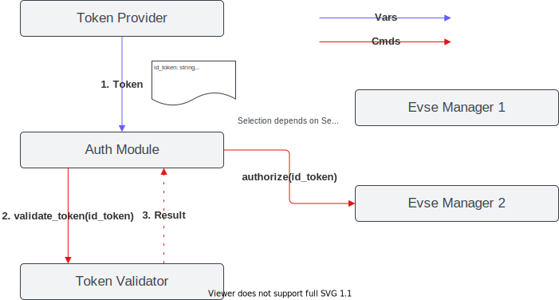

.. _everest_modules_handwritten_Auth:

.. ===========
.. Auth Module
.. ===========

This module handles incoming authorization and reservation requests.

The task of the module is to receive tokens from token providers, validate them and assign them to EvseManagers.
It is responsible for providing authorization to EvseManagers and for stopping transactions at the EvseManagers if a token
or parent id token is presented to stop a transaction. In addition, the module is responsible for managing all
reservations and matching them with incoming tokens.

The module contains the logic to select a connector for incoming tokens (e.g. by waiting for a car plug in, user
interface, random selection, etc.). The algorithm is configurable via the ``selection_algorithm`` config key, which
accepts four values; three of them (``FindFirst``, ``PlugEvents`` and ``PlugEventsLIFO``) are implemented. The
available algorithms are described in `Selection Algorithm`_.

The following flow diagram gives a simplified overview of how an incoming token is handled by the module.

.. mermaid::

    flowchart TD
        A[Token received] --> B[Validate the token]
        B --> C{Token valid?}
        C -- no --> RJ[["Rejected"]]
        C -- yes --> D{"Should the token stop an ongoing transaction?"}
        D -- yes --> E[Stop the transaction]
        E --> RS[["Transaction stopped"]]
        D -- no --> F["Select an available connector using the configured algorithm"]
        F -- "none available or timeout" --> RJ
        F -- selected --> G[Authorize the connector]
        G --> RA[["Authorized"]]

.. note::

    The diagram above is simplified to show the essential flow. It omits some details, such as whether the token was
    already validated by the provider, reservation matching, the distinction between master-pass-group and
    parent-id-token stops, and authorization being withdrawn while waiting for a plug in.

.. note::
    
    The processing of each authorization request and the respective validation runs in an individual thread. This 
    allows the parallel processing of authorization requests.

Integration in EVerest
======================

This module provides implementations for the `reservation` and the `auth` interfaces.

It requires connections to module(s) implementing the `token_provider`, `token_validator` and `evse_manager` interfaces.

The following diagram shows how it integrates with other EVerest modules. A token provider supplies a token, a
token validator checks it, and the Auth module then authorizes the selected connector at the corresponding EVSE
manager.

The module connections of the evse_manager requirement must be connected in the correct order in the EVerest config
file, i.e. the module representing the EVSE with evse id 1 must listed first, EVSE with evse id 2 second and so on.

Selection Algorithm
===================

The selection algorithm contains the logic to select one connector for an incoming token. The algorithm can be
specified within the module config using the key ``selection_algorithm``. When only a single EVSE/connector is
referenced by the request, that connector is selected immediately regardless of the configured algorithm
(single-EVSE fast path). The selection algorithm only becomes relevant when the Auth module manages authorization
requests for multiple connectors.

Four values are accepted for ``selection_algorithm``:

* FindFirst (default)
* PlugEvents
* PlugEventsLIFO
* UserInput (not yet implemented)

FindFirst
---------

``FindFirst`` is the **default** selection algorithm. It is non-blocking. If a referenced EVSE already has a pending
plug-in (the earliest one, if several referenced EVSEs are plugged in) and that EVSE has no active transaction, it is
selected. Otherwise the first referenced EVSE that is available, in the order the connectors are referenced, is
selected. If no referenced EVSE qualifies, the request is not satisfied; the algorithm returns without waiting or
blocking.

PlugEvents
----------

The following flow chart describes how a connector is selected using the ``PlugEvents`` algorithm.

.. mermaid::

    flowchart TD
        A[Token referencing one or more connectors] --> B{Only one referenced connector?}
        B -- yes --> C["Select it immediately single-EVSE fast path"]
        B -- no --> D{"A referenced connector already has an EV plugged in?"}
        D -- yes --> E["Select the connector waiting longest among referenced connectors (first-in, first-out)"]
        D -- no --> F["Wait up to connection_timeout for an EV to be plugged in"]
        F -- "plug-in occurred" --> G{Authorization withdrawn during the wait?}
        G -- no --> E
        G -- yes --> I[["Interrupted"]]
        F -- "timeout elapsed" --> H[["Reject (TimeOut)"]]

If a referenced EVSE already has an EV plugged in, it is selected. Otherwise ``PlugEvents`` blocks for up to
``connection_timeout`` seconds waiting for an EV to be plugged in, and then selects a referenced EVSE where that
happened. If the wait times out, the request is rejected. If authorization is withdrawn during the wait, the wait is
interrupted.

When more than one referenced EVSE has plugged in, selection is **first-in, first-out** (FIFO): the EVSE whose
plug-in has been pending longest is chosen, *not* the one that plugged in most recently. For example, if connector 1
plugs in, then connector 2 plugs in, and an authorization request referencing both connectors arrives afterwards,
connector 1 is selected because its plug-in occurred first. A plug-in stops being a candidate once it is consumed by
an authorization, times out, or its session ends. If you want the opposite (most recent) behavior, use
``PlugEventsLIFO`` instead.

.. note::

    If a user authorizes first while no EV is plugged in, the module waits for an EV to be plugged in before it
    selects the connector. A plug-in timeout may occur, which will require the user to start authorization again to
    begin a charging session.

PlugEventsLIFO
--------------

``PlugEventsLIFO`` behaves exactly like ``PlugEvents`` — it waits for an EV to be plugged in and is subject to the
same ``connection_timeout``, timeout and withdrawal behavior — but when more than one referenced EVSE has plugged in
it makes the opposite choice: it selects the EVSE that plugged in **most recently** (last-in, first-out) instead of
the earliest. Reusing the earlier example, if connector 1 plugs in, then connector 2 plugs in, and an authorization
request referencing both connectors arrives afterwards, ``PlugEventsLIFO`` selects connector 2 (the most recent
plug-in), whereas ``PlugEvents`` would select connector 1.

UserInput
---------

The ``UserInput`` algorithm is not yet implemented. Configuring it will cause the module to report an error when it
needs to select a connector, so it should not be used.

Connector State Machine
=======================

The Auth module tracks the lifecycle of each connector with a small state machine. It models how a
connector transitions between being available, occupied by a transaction, unavailable (disabled) and
faulted, so that the module knows which connectors can be authorized at any time. The diagram below
shows the six states and the events that drive the transitions.

.. image:: state_chart.drawio.svg
   :alt: Connector state machine

Plug&Charge Authorization
=========================

Please see the :doc:`Plug&Charge configuration guide </how-to-guides/configure-pnc>`
for further information about the Plug&Charge integration in EVerest.
